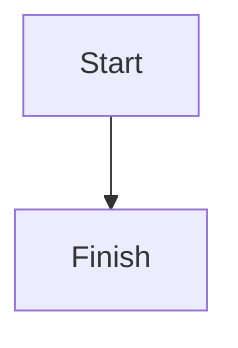

# Full Smoke H1

Intro paragraph with **bold**, *italic*, `inline code`, and a standard link to [Example](https://example.com).

## Full Smoke H2

### Full Smoke H3

| Feature | State |
|---------|-------|
| table   | ok    |

- [ ] Standard incomplete task
- [x] Standard complete task
- [/] Nonstandard in-progress task
- [-] Nonstandard cancelled task

Basic wikilink: [[ExistingNote]]

Alias wikilink: [[ExistingNote|Display Alias]]

Heading wikilink: [[ExistingNote#Section Header]]

Block wikilink: [[ExistingNote#^abc123]]

Local heading wikilink: [[#Full Smoke H2]]

Local block wikilink: [[^local-smoke-block]]

Missing wikilink: [[MISSING_FULL_SMOKE_NOTE]]

Image embed: ![[test-image.png]]

Image width hint: ![[test-image.png|100]]

Image width and height hint: ![[test-image.png|100x145]]

> [!note]
> Basic callout body.

> [!warning] Custom Title
> Custom title callout body.

> [!tip]-
> Foldable callout body.

> [!info]
> Outer callout body.
>
> > [!note]
> > Nested callout body.



```python
def fixture_value():
    return "full-smoke"
```

%% hidden %%

Unsafe HTML must be sanitized: <script>alert('xss')</script>

```dataview
TABLE status
FROM "Example"
```

Block target text. ^local-smoke-block
