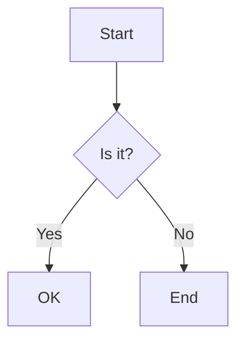

Valid diagram:


```mermaid
graph TD
    A[Start] --> B{Is it?}
    B -- Yes --> C[OK]
    B -- No --> D[End]
```

Invalid diagram:

```mermaid
this is not valid mermaid syntax @@@
```

Mermaid inside callout:

> [!note]
> ```mermaid
> flowchart LR
>     A --> B
> ```
