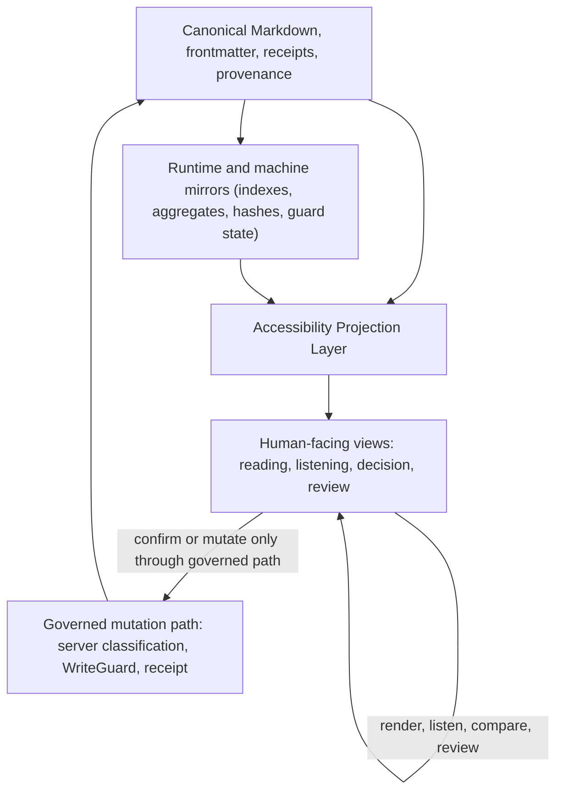

State: Capability boundary contract for cognitive-load and accessibility projections; docs-only, no runtime implementation claim.
Doc role: Accessibility projection contract
Authority: Binding source-of-truth boundary for Accessibility Projection Layer docs and downstream issue contracts. It defines how accessibility and cognitive-load aids may project, render, summarize, or structure human-facing views without mutating canonical artifacts or changing authority. Current runtime truth remains owned by shipped implementation docs and tests.
Owner: Product / Companion UI / interaction authority
Temporal class: strategic
Review cadence: event-driven
Source of truth: mixed
Last reviewed: 2026-06-06
Last verified against: docs/HUMAN-FLOWS.md, docs/COGNITIVE_PROSTHESIS_CHARTER.md, companion-ui/docs/SEMANTIC_PROJECTION_ALIGNMENT.md, companion-ui/docs/VAULT_MARKDOWN_RENDERER_CONTRACT.md, companion-ui/docs/WORKSPACE_STATE_CONTRACT.md, companion-ui/docs/PANEL_CONFIRMATION_API_CONTRACT.md, docs/research/COGNITIVE_LOAD_REDUCTION_RESEARCH.md

# Accessibility Projection Layer

## Purpose

The Accessibility Projection Layer is the governed boundary between canonical artifacts and
human-facing accessibility or cognitive-load views.

Its purpose is to reduce avoidable reading, review, orientation, and decision burden while
preserving the system's authority spine: canonical Markdown, source authority, WriteGuard,
receipts, provenance, runtime authority, and human confirmation.

Cognitive-load reduction is a workflow capability, not a UI theme. The layer supports the Human
Flow loops `Source -> interpret -> stabilize` and `Intent -> propose -> decide -> execute -> receipt`
by making source material, proposals, risk, uncertainty, choices, and receipts easier to inspect.
It does not make projections authoritative.

## Core Rules

Accessibility projections are non-authoritative. They are not authority, not a replacement for
source artifacts, and not a hidden route around governed mutation paths.

Every projection in this layer must satisfy these rules:

- It must not mutate canonical Markdown.
- It must not alter receipts, provenance, memory extraction, runtime authority, or agent
  interpretation.
- It must preserve source visibility or explicitly state when source anchors are unavailable.
- It must distinguish source text, agent interpretation, recommendation, uncertainty, and requested
  human action when those concepts are present.
- It must keep local display preferences separate from semantic transformations.
- It must route any authority transfer through the existing governed confirmation or mutation path.

The layer may improve readability, listening, comparison, orientation, and decision review. It may
not decide for the human, silently approve an agent recommendation, or make a summary behave as
canonical truth.

## Projection Stack

The diagram is directional. A view can render or re-present material, but a durable change must go
through the governed mutation path before canonical artifacts change.

## Architecture Placement

This layer sits in the Companion UI projection zone, aligned with Layer 7 in
`companion-ui/docs/SEMANTIC_PROJECTION_ALIGNMENT.md`. It inherits the shared Companion UI rule that
the UI may project, render, summarize, overlay, stage, queue, and propose, but durable mutation
requires server-side classification, WriteGuard, provenance, and receipt production.

Existing contracts already define important neighbors:

- `companion-ui/docs/VAULT_MARKDOWN_RENDERER_CONTRACT.md` defines the renderer as a read-only
  projection of vault Markdown.
- `companion-ui/docs/WORKSPACE_STATE_CONTRACT.md` defines workspace state as a read-side aggregate,
  not semantic authority.
- `companion-ui/docs/PANEL_CONFIRMATION_API_CONTRACT.md` defines
  `POST /api/panel/checkbox-projection` as the source-backed, runtime-mediated checkbox projection
  path for Panel read-mode confirmation.
- `docs/research/COGNITIVE_LOAD_REDUCTION_RESEARCH.md` supplies evidence grounding and the
  simplification-vs-authority decision test for downstream accessibility work.

The Accessibility Projection Layer does not replace those contracts. It names the cross-cutting
accessibility and cognitive-load boundary that downstream reading, listening, display, and decision
surfaces must satisfy.

## Display Preferences Vs Semantic Transformations

Display preferences are local rendering choices. Examples include font size, line height, paragraph
spacing, column width, reduced clutter, focus layout, optional dyslexia-oriented font preference,
and experimental Bionic-style rendering.

Display preferences remain render-only when they present the same source or proposal without
changing meaning, selection, recommendation, approval, receipt posture, or agent interpretation.

Semantic transformations are different. Summaries, simplifications, extracted decisions,
recommendations, risk labels, source comparisons, and reordered proposal fields can help the human,
but they change how material is interpreted. They therefore need explicit review posture:

- source or source-reference visibility;
- separation between source claims and agent interpretation;
- uncertainty and omission warnings where relevant;
- no durable write unless routed through governance;
- no authority transfer by presentation alone.

If a transformation changes what the human is considered to have approved, it is an authority
transfer and must use a governed confirmation path.

## Mode Scope

This contract scopes reading mode, listening mode, decision mode, review mode, and experimental
projections as projection behaviors, not implementation claims.

### Reading mode

Reading mode presents canonical material in a lower-load layout. It may apply display preferences,
structure, spacing, focus layout, source-adjacent labels, and local navigation aids. It must not
mutate source Markdown or encode preference choices into canonical artifacts.

### Listening mode

Listening mode re-presents source or projection content through text-to-speech or read-aloud
ordering. It should preserve source comparison and stable field order. For proposal review, it
must not read only the recommendation while skipping risk, uncertainty, source reference, or
available choices.

### Decision mode

Decision mode structures a proposal or choice so the human can understand what is being decided.
It should separate what this is, what the human needs to decide, recommendation or option, why,
risk or uncertainty, source or source reference, available choices, and expected receipt or status.
It must not default governance-bearing choices to approved.

### Review mode

Review mode helps the human compare a projection to its source, inspect uncertainty, recover after
interruption, and audit what happened. It should keep status and receipt feedback visible after a
governed action.

### Experimental projections

Experimental projections include weakly supported or highly user-specific aids such as Bionic-style
rendering or dyslexia-oriented font presets. They must be opt-in, reversible, render-only where
possible, clearly marked as experimental, and disabled by default unless a later owner-doc update
changes that posture.

## Decision Test

Use this test before implementing or documenting an accessibility projection:

| Question | Projection class | Required route |
| --- | --- | --- |
| Does it only change visual or auditory presentation of the same content? | Display preference | Keep local and render-only. |
| Does it summarize, simplify, rank, filter, recommend, or explain? | Semantic transformation | Preserve source and review posture. |
| Does it change what the human is considered to have approved? | Authority transfer | Route through governed confirmation. |
| Does it write canonical Markdown, receipts, provenance, memory extraction inputs, runtime authority, or agent interpretation? | Durable or authority-bearing mutation | Use an owner-doc contract, WriteGuard, and receipt path. |

The safe default is to downgrade a projection to non-authoritative review aid unless the governing
contract explicitly grants stronger behavior.

## Downstream Issue Guidance

Downstream issues should use this layer as a boundary, not as implementation evidence.

- #1641 should specify reading/listening requirements against this non-authoritative projection
  posture.
- #1642 should normalize proposal format as a decision surface without weakening confirmation
  authority.
- #1643 should specify display preferences as render-only projections.
- #1645 should implement confirmation only through the existing checkbox projection endpoint and
  should not treat this contract as permission to bypass `PANEL_CONFIRMATION_API_CONTRACT`.

## Non-Goals

- This document does not implement runtime behavior.
- This document does not implement Companion UI controls.
- This document does not implement text-to-speech.
- This document does not implement display preferences.
- This document does not change Panel confirmation semantics.
- This document does not create durable reject, defer, or clarify semantics.
- This document does not make summaries, simplifications, or listening output authoritative.
