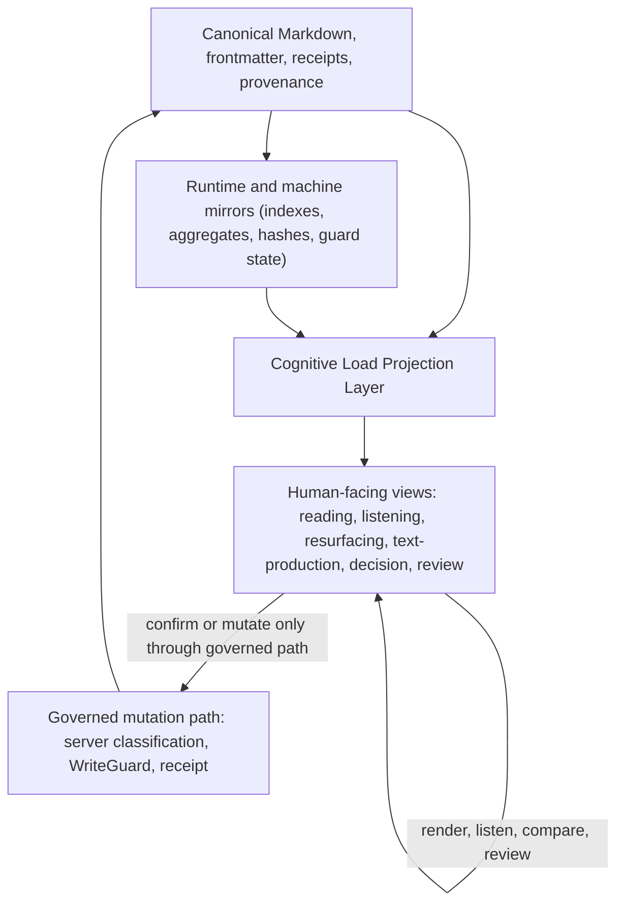

State: Capability boundary contract for human-facing cognitive-load projections; docs-only, no runtime implementation claim.
Doc role: Cognitive load projection contract
Authority: Binding source-of-truth boundary for Cognitive Load Projection Layer docs and downstream issue contracts. It defines how cognitive-load aids, display preferences, listening surfaces, text-production aids, resurfacing aids, and accessibility techniques may project, render, summarize, structure, or propose changes on human-facing views without mutating canonical artifacts or changing authority. Current runtime truth remains owned by shipped implementation docs and tests.
Owner: Product / Companion UI / interaction authority
Temporal class: strategic
Review cadence: event-driven
Source of truth: mixed
Last reviewed: 2026-06-07
Last verified against: docs/HUMAN-FLOWS.md, docs/COGNITIVE_PROSTHESIS_CHARTER.md, companion-ui/docs/SEMANTIC_PROJECTION_ALIGNMENT.md, companion-ui/docs/VAULT_MARKDOWN_RENDERER_CONTRACT.md, companion-ui/docs/WORKSPACE_STATE_CONTRACT.md, companion-ui/docs/PANEL_CONFIRMATION_API_CONTRACT.md, docs/research/COGNITIVE_LOAD_REDUCTION_RESEARCH.md

# Cognitive Load Projection Layer

## Purpose

The Cognitive Load Projection Layer is the governed boundary between canonical artifacts and
human-facing cognitive-load projections.

This is not an accessibility sidecar for a subset of users. In Yggdrasil, cognitive-load
reduction is one of the central functions of the cognitive prosthesis: the system helps the human
hold less in working memory, recover context after interruption, compare source and proposal, and
decide without losing authorship or authority. Accessibility techniques are valid tools inside
that function, but they are not the owning category.

Its purpose is to reduce avoidable reading, review, orientation, resurfacing, text-production, and
decision burden while preserving the system's authority spine: canonical Markdown, source
authority, WriteGuard, receipts, provenance, runtime authority, and human confirmation.

Cognitive-load reduction is a workflow capability, not a UI theme. The layer supports the Human
Flow loops `Source -> interpret -> stabilize` and `Intent -> propose -> decide -> execute -> receipt`
by making source material, proposals, risk, uncertainty, choices, and receipts easier to inspect.
It does not make projections authoritative.

The governing design principle is:

> Reduce friction, not intelligence.

The system should remove mechanical friction around decoding, parsing, remembering, spelling,
reviewing, and resuming work. It must not simplify away the human's reasoning task, flatten nuance,
hide consequences, or replace the source with a more persuasive agent projection.

## Capability Taxonomy

This work is filed under cognitive load as a central Human-First capability. Diagnosis-specific
language is useful evidence and calibration, but not the top-level product category.

The active sub-areas are:

- Working-memory load: proposal density, option count, self-contained labels, and holding-in-mind
  cost.
- Reading throughput: TTS/listening, shorter readable columns, spacing, pacing, and
  comprehension-per-effort.
- Text-production / encoding load: spelling, dictation drafts, correction suggestions,
  real-word-error flags, and read-back verification.
- Decision / confirmation load: proposal review, risk-tiering, explicit confirmation, and receipt
  visibility.
- Orientation / resumption load: `leave_point`, open loops, notable changes, and stable re-entry
  after interruption.
- Resurfacing / memory-context load: scarce, justified, non-authoritative return of relevant
  context, with pointer-first provenance and no notification-style monitoring burden.

## Core Rules

Cognitive-load projections are non-authoritative. They are not authority, not a replacement for
source artifacts, and not a hidden route around governed mutation paths.

Every projection in this layer must satisfy these rules:

- It must not mutate canonical Markdown.
- It must not alter receipts, provenance, memory extraction, runtime authority, or agent
  interpretation.
- It must preserve source visibility or explicitly state when source anchors are unavailable.
- It must distinguish source text, agent interpretation, recommendation, uncertainty, and requested
  human action when those concepts are present.
- It must keep local display preferences separate from semantic transformations.
- It must keep resurfacing scarce, source-linked, and explicitly non-authoritative; resurfacing
  presence must not become priority, urgency, or approval.
- It must treat dictation output, spelling correction, and rewriting assistance as draft or
  proposal-class until the human confirms the intended text.
- It must route any authority transfer through the existing governed confirmation or mutation path.

The layer may improve readability, listening, comparison, orientation, resurfacing, text
production, and decision review. It may not decide for the human, silently approve an agent
recommendation, silently rewrite the human's intended meaning, silently re-prioritize the human's
work, or make a summary behave as canonical truth.

## Projection Stack

The diagram is directional. A view can render or re-present material, but a durable change must go
through the governed mutation path before canonical artifacts change.

## Architecture Placement

This layer sits in the human-facing projection zone, aligned with Companion UI Layer 7 in
`companion-ui/docs/SEMANTIC_PROJECTION_ALIGNMENT.md`. It inherits the shared Companion UI rule that
the UI may project, render, summarize, overlay, stage, queue, and propose, but durable mutation
requires server-side classification, WriteGuard, provenance, and receipt production.

Existing contracts already define important neighbors:

- `companion-ui/docs/VAULT_MARKDOWN_RENDERER_CONTRACT.md` defines the renderer as a read-only
  projection of vault Markdown.
- `companion-ui/docs/WORKSPACE_STATE_CONTRACT.md` defines workspace state as a read-side aggregate,
  not semantic authority.
- `companion-ui/docs/PANEL_CONFIRMATION_API_CONTRACT.md` defines
  `POST /api/panel/checkbox-projection` as the source-backed, runtime-mediated checkbox projection
  path for Panel read-mode confirmation.
- `docs/research/COGNITIVE_LOAD_REDUCTION_RESEARCH.md` supplies evidence grounding and the
  simplification-vs-authority decision test for downstream cognitive-load work.

The Cognitive Load Projection Layer does not replace those contracts. It names the cross-cutting
human-first boundary that downstream reading, listening, display, review, and decision surfaces
must satisfy.

## Display Preferences Vs Semantic Transformations

Display preferences are local rendering choices. Examples include font size, line height, paragraph
spacing, column width, reduced clutter, focus layout, optional reading-support font preference,
and experimental Bionic-style rendering.

Display preferences remain render-only when they present the same source or proposal without
changing meaning, selection, recommendation, approval, receipt posture, or agent interpretation.

Semantic transformations are different. Summaries, simplifications, extracted decisions,
recommendations, risk labels, source comparisons, and reordered proposal fields can help the human,
but they change how material is interpreted. They therefore need explicit review posture:

- source or source-reference visibility;
- separation between source claims and agent interpretation;
- uncertainty and omission warnings where relevant;
- no durable write unless routed through governance;
- no authority transfer by presentation alone.

If a transformation changes what the human is considered to have approved, it is an authority
transfer and must use a governed confirmation path.

## Mode Scope

This contract scopes reading mode, listening mode, resurfacing mode, text-production mode,
decision mode, review mode, and experimental projections as projection behaviors, not
implementation claims.

### Reading mode

Reading mode presents canonical material in a lower-load layout. It may apply display preferences,
structure, spacing, focus layout, source-adjacent labels, and local navigation aids. It must not
mutate source Markdown or encode preference choices into canonical artifacts.

Reading throughput is measured as comprehension per unit effort, not raw words per minute. Shorter
columns, spacing, and similar render-only aids are valid only while they re-present the same source
content and preserve anchors, option identity, and review posture.

### Listening mode

Listening mode re-presents source or projection content through text-to-speech or read-aloud
ordering. It should preserve source comparison and stable field order. For proposal review, it
must not read only the recommendation while skipping risk, uncertainty, source reference, or
available choices.

Listening should be user-controlled. A forced simultaneous identical audio/text stream can add
load for some review tasks; the safe contract is to support reading, listening, sequential review,
or narration with source-adjacent highlights without making one modality authoritative.

### Resurfacing mode

Resurfacing mode returns existing context to attention when the runtime has a source-linked reason
to believe it is relevant again. It is a projection/orientation aid, not a notification system, not
priority authority, and not memory promotion.

Task-support resurfacing and learning resurfacing are different modes. Task-support resurfacing
helps the human resume or orient now; it should attach to `leave_point`, open loops, notable
changes, and bounded why-now signals. Learning resurfacing is spaced retrieval practice and should
not reuse task-orientation timing or present answers as passive re-reading.

Resurfacing must be scarce, justified, non-authoritative, and cheap to consume. The safe posture is
pull-by-default with bounded foreground ambient refresh only where an owner contract admits it; no
alerts, badges, notification inboxes, urgency feeds, or focus stealing. Each surfaced item should
carry a short pointer-first "why now" with source/provenance and should remain TTS-ready.

### Text-production mode

Text-production mode supports the human while writing into the system. The current shipped surfaces
already include direct note editing and Canvas/body-edit paths; this mode defines the boundary for
future spelling, dictation, correction, and read-back support on those surfaces.

Dictation/STT output is draft text. Spelling, grammar, real-word-error, or rewriting assistance is
a suggestion over the draft, not a silent canonical rewrite. Any assistive layer must make changed
text inspectable, preserve the human's intended meaning and voice, and leave the human as the
authority over what is saved. TTS/read-back is the preferred verification companion for
dictation/correction because visual proofreading is not the only review path.

The correction-as-proposal contract is stricter than ordinary display assistance:

- Suggestion, never silent rewrite. No assistive layer edits user-authored text automatically.
  Autocorrect-on-type is prohibited because it acts before the human decides and can silently
  replace the intended word with a wrong real word.
- Transparency of every change. Each proposed change must show the original token and proposed
  token. Anything beyond a pure spelling fix must also show why it is being suggested.
- Canonical content remains untouched until confirmation. Confirmed corrections route through the
  authorized save/apply path for the current surface: direct note save, Canvas user-present
  body-edit with undo/session-log provenance, staged Canvas body suggestion, or Panel/governed
  execution when the operation is governance-bearing. Do not invent a stronger receipt claim than
  the owning surface provides.
- Meaning-affecting changes require more friction than spelling fixes. Orthographic fixes,
  real-word/context flags, and grammar/phrasing rewrites must be visually and procedurally
  distinct.
- Voice and meaning belong to the human. Stylistic smoothing is out of scope unless explicitly
  requested for the current instance and shown as a reviewable proposal.

Correction tiers:

| Tier | Class | Example | Required posture |
| --- | --- | --- | --- |
| 0 | Orthographic | `recieve` -> `receive` | Light confirmation; still not automatic. |
| 1 | Real-word / context flag | `form` possibly `from` | Flag only; never auto-apply because intent is inferred. |
| 2 | Grammar / phrasing / voice | rewriting a sentence | Most explicit confirmation; default is keep the user's text. |

The selection problem is part of the contract. A suggestion list should stay small, offer
read-aloud on focus, include a short meaning cue such as a definition or the word in the user's own
sentence, and always expose a clear "keep mine" path.

Dictation closes through listening: dictate, draft, TTS read-back, then human confirm. Read-back is
required for dictation support because it routes verification through listening rather than forcing
proofreading only by eye.

### Decision mode

Decision mode structures a proposal or choice so the human can understand what is being decided.
It should separate what this is, what the human needs to decide, recommendation or option, why,
risk or uncertainty, source or source reference, available choices, and expected receipt or status.
It must not default governance-bearing choices to approved.

### Review mode

Review mode helps the human compare a projection to its source, inspect uncertainty, recover after
interruption, and audit what happened. It should keep status and receipt feedback visible after a
governed action.

### Experimental projections

Experimental projections include weakly supported or highly user-specific aids such as Bionic-style
rendering or reading-support font presets. They must be opt-in, reversible, render-only where
possible, clearly marked as experimental, and disabled by default unless a later owner-doc update
changes that posture.

## Decision Test

Use this test before implementing or documenting a cognitive-load projection:

| Question | Projection class | Required route |
| --- | --- | --- |
| Does it only change visual or auditory presentation of the same content? | Display preference | Keep local and render-only. |
| Does it summarize, simplify, rank, filter, recommend, or explain? | Semantic transformation | Preserve source and review posture. |
| Does it resurface, rank, filter, or reorder context for attention? | Resurfacing projection | Show source-linked why-now, respect budget/caps, and do not make resurfacing priority or authority. |
| Does it correct, rewrite, or transcribe human-authored input? | Draft/proposal over text input | Show the change and require human confirmation before canonical save. |
| Does it silently autocorrect, smooth, or normalize style? | Authority/voice transfer | Reject unless the human explicitly requested that specific proposal and can review it. |
| Does it change what the human is considered to have approved? | Authority transfer | Route through governed confirmation. |
| Does it write canonical Markdown, receipts, provenance, memory extraction inputs, runtime authority, or agent interpretation? | Durable or authority-bearing mutation | Use an owner-doc contract, WriteGuard, and receipt path. |

The safe default is to downgrade a projection to non-authoritative review aid unless the governing
contract explicitly grants stronger behavior.

## Downstream Issue Guidance

Downstream issues should use this layer as a boundary, not as implementation evidence.

- #1641 should specify reading/listening requirements against this non-authoritative projection
  posture.
- #1642 should normalize proposal format as a decision surface without weakening confirmation
  authority.
- #1643 should specify display preferences as render-only projections.
- #1645 should implement confirmation only through the existing checkbox projection endpoint and
  should not treat this contract as permission to bypass `PANEL_CONFIRMATION_API_CONTRACT`.
- A follow-up text-production issue should specify dictation, correction-as-proposal,
  real-word-error flagging, and read-back verification against the existing direct note editor and
  Canvas/body-edit surfaces.
- A follow-up resurfacing issue should reconcile FA-5 against the shipped Workspace Orientation and
  resurfacing seams: hard caps/budgets, pull-default, bounded ambient refresh, pointer-first
  why-now provenance, and the task-support-versus-learning split.

## Non-Goals

- This document does not implement runtime behavior.
- This document does not implement Companion UI controls.
- This document does not implement text-to-speech.
- This document does not implement resurfacing budgets, ambient refresh, notifications, or learning
  schedules.
- This document does not implement dictation, spellchecking, or correction assistance.
- This document does not implement display preferences.
- This document does not change Panel confirmation semantics.
- This document does not create durable reject, defer, or clarify semantics.
- This document does not make summaries, simplifications, or listening output authoritative.
