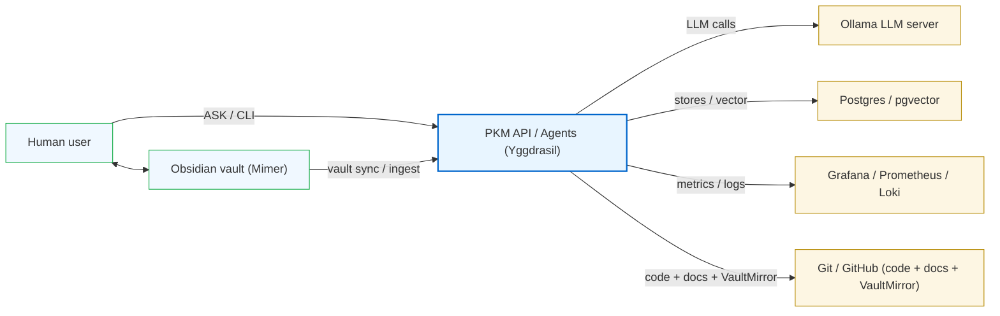
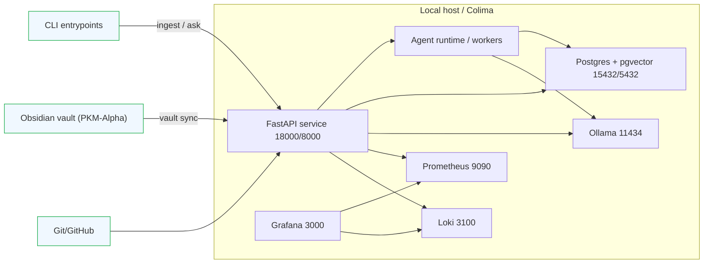
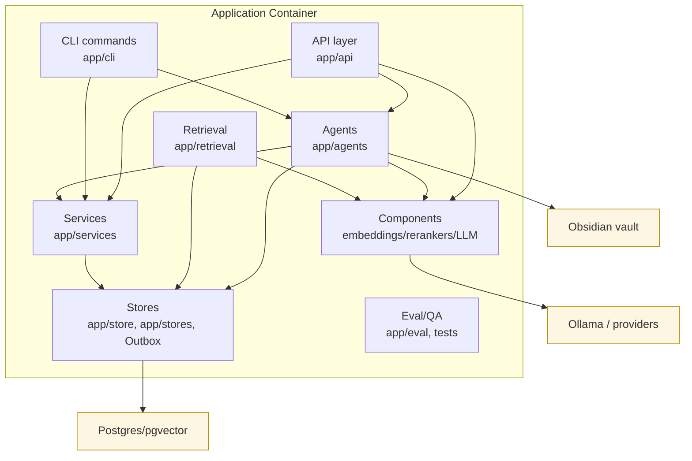
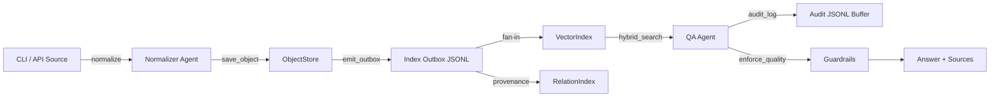
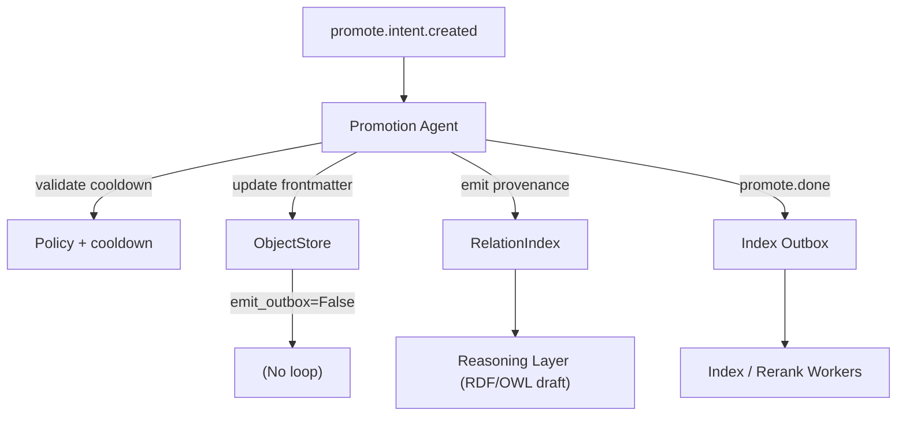

State: SoT v4.10 Reality-MVP (current).
# Diagrams

These diagrams reflect the active Reality-MVP architecture (SoT v4.10). They are derived from `docs/SYSTEM_DESIGN_v4.10.md`, `docs/ARCHITECTURE.md`, `docs/COMPONENTS.md`, and `docs/HUMAN-FLOWS.md`. Rendered with Mermaid; export via `mmdc` if needed.

<!-- SECTION:DIAGRAMS:BEGIN -->
## System Context (C4 Level 1)

The Agentic PKM system sits between the human/vault surfaces and local dependencies: Postgres/pgvector for stores, Ollama for LLM/embeddings, and Grafana/Prometheus/Loki for observability. Git/GitHub hold code/docs and VaultMirror snapshots.

## Container / Runtime Topology (C4 Level 2)

Ports align with `docs/SYSTEM_DESIGN_v4.10.md`: API 18000→8000, Postgres 15432→5432, Ollama 11434, Grafana 3000, Prometheus 9090, Loki 3100.

## Core Components (C4 Level 3)

API/CLI call into agents/services; agents and retrieval depend on components and store abstractions (not raw DB or provider SDKs). Components encapsulate provider calls (Ollama). Stores wrap Postgres/pgvector and Outbox. See `docs/COMPONENTS.md` for detailed catalog and dependency rules, `docs/SYSTEM_DESIGN_v4.10.md` for topology, and `docs/HUMAN-FLOWS.md` for how humans experience these flows.

### Historical diagrams (superseded)
Older v4.5 ingestion/promotion diagrams are retained below for reference but are superseded by the Reality-MVP views above.

#### Ingestion → Stores → QA (v4.5)

#### Promotion → Reasoning Prep (v4.5)

### Export to PNG/SVG
1. Install Mermaid CLI locally: `npm install -g @mermaid-js/mermaid-cli`.
2. Copy a block into an `.mmd` file or run `mmdc -i docs/DIAGRAMS.md -o artifacts/docs-diagrams.svg --page --scale 1`.
3. Store exported images under `docs/diagrams/` if they should be versioned; CI only requires the source Markdown.
<!-- SECTION:DIAGRAMS:END -->
