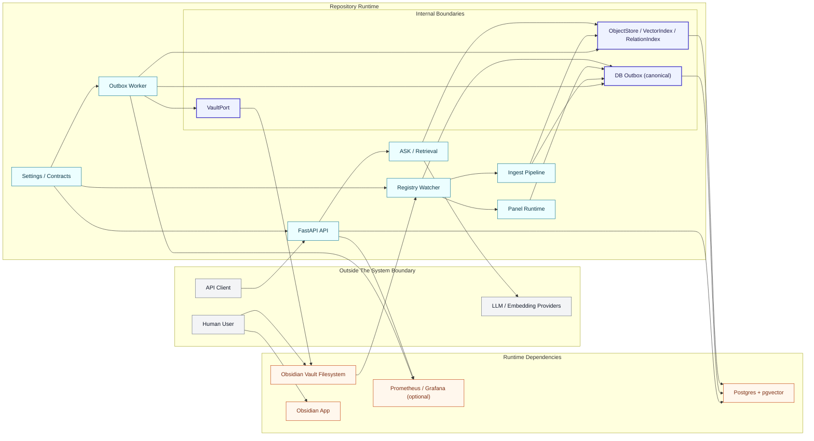
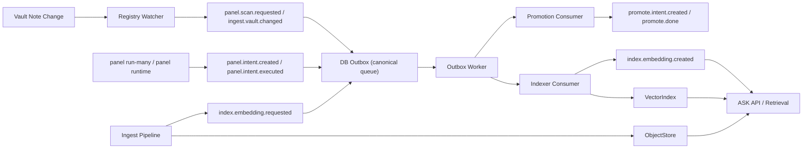
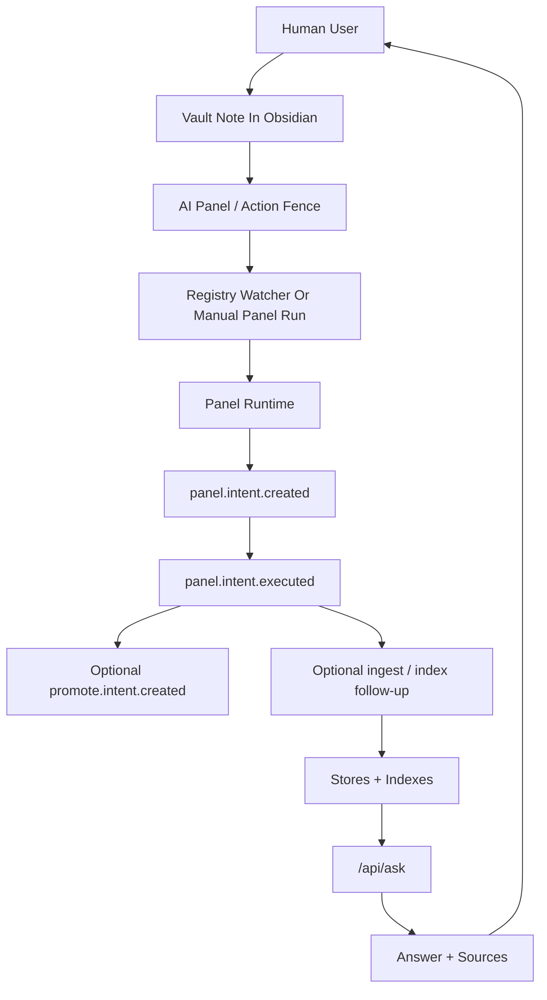

State: SoT v5.5 Reality-MVP baseline locked with v5.6 forward line notes. Diagrams here reflect the current runtime shape and should be updated when boundary maps or major flows change.
Doc role: Reference
Authority: Current visual companion to `docs/ARCHITECTURE.md`, `docs/COMPONENTS.md`, and `docs/EVENTS.md`; diagrams are explanatory and must not override the text contracts.
# Diagrams

This document contains current diagrams for the active runtime.

Use it as a visual companion to:
- `docs/ARCHITECTURE.md` for boundary and runtime shape
- `docs/COMPONENTS.md` for component ownership
- `docs/EVENTS.md` for event contracts
- `docs/DESIGN_PRINCIPLES.md` for the higher-level design rules that these diagrams do not own

Historical diagrams live in `docs/archive/architecture/DIAGRAMS.md`.

Reading note:
- these diagrams show current runtime wiring and operator-visible flow,
- not the full target-state architectural decomposition,
- and not the complete design-layer distinction between interaction, cognition, execution, memory, and governance.

## System Boundary

This diagram shows the current v5.5 runtime boundary: vault-first surfaces, repository-owned runtime code, and external runtime dependencies.

## Runtime Event Flow

This diagram shows the current canonical runtime loop: watcher and runtime components emit DB-outbox events, and the worker consumes them for indexing and follow-up side effects.

## Human-Facing Flow

This diagram emphasizes the user-visible path through vault notes, panel execution, and ASK.

## Directional Reading Notes

- In the current runtime view, Panel appears as the mutation-capable interaction surface.
- ASK appears as the current question-answering surface, but should not be read as the long-term architectural center of retrieval or reasoning.
- These visuals emphasize current event and worker wiring; they do not replace the capability-oriented and system-of-systems framing in `docs/ARCHITECTURE.md` and `docs/DESIGN_PRINCIPLES.md`.

## Notes

- Canonical queue: DB outbox. JSONL remains audit/diagnostic only.
- Current watcher default: registry watcher, not the legacy snapshot watcher.
- Diagrams should be revised when runtime boundaries, major event paths, or operator entrypoints change.
