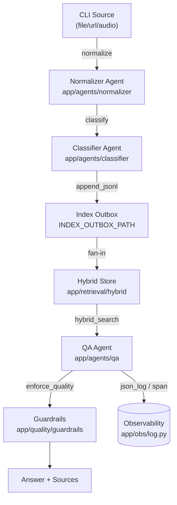
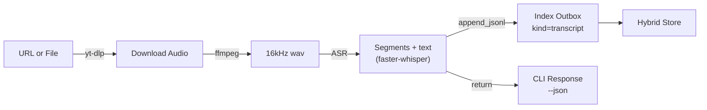

# Diagrams

Visual references for the ingestion and transcription flows. Rendered via Mermaid and exportable with `mmdc`.

<!-- SECTION:DIAGRAMS:BEGIN -->
## Ingestion → Index → QA

## Transcribe pipeline

### Export to PNG/SVG
1. Install Mermaid CLI locally: `npm install -g @mermaid-js/mermaid-cli`.
2. Copy the block into an `.mmd` file or run `mmdc -i docs/diagrams/pipeline.mmd -o artifacts/pipeline.svg`.
3. `mmdc` can also read Markdown directly: `mmdc -i docs/DIAGRAMS.md -o artifacts/docs-diagrams.svg --page --scale 1`.
4. Store exported images under `docs/diagrams/` if they should be versioned; CI only requires the source Markdown.
<!-- SECTION:DIAGRAMS:END -->
