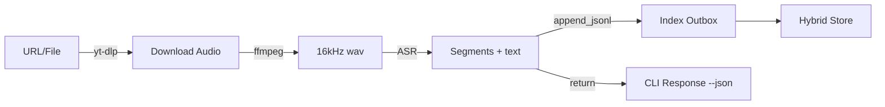

# Diagrams

Visual references for the ingestion and transcription flows. Rendered via Mermaid and exportable with `mmdc`.

<!-- SECTION:DIAGRAMS:BEGIN -->
## Ingestion → Index → QA
```mermaid
flowchart TD
    A[CLI Source\n(file/url/audio)] -->|normalize| B[Normalizer Agent]
    B -->|classify| C[Classifier Agent]
    C -->|append_jsonl| D[Index Outbox]
    D -->|fan-in| E[Hybrid Store]
    E -->|hybrid_search| F[QA Agent]
    F -->|enforce_quality| G[Guardrails]
    G --> H[Answer + Sources]
    F -->|span log| I[(Observability)]
```

## Transcribe pipeline


### Export to PNG/SVG
1. Install Mermaid CLI locally: `npm install -g @mermaid-js/mermaid-cli`.
2. Copy the block into an `.mmd` file or run `mmdc -i docs/diagrams/pipeline.mmd -o artifacts/pipeline.svg`.
3. `mmdc` can also read Markdown directly: `mmdc -i docs/DIAGRAMS.md -o artifacts/docs-diagrams.svg --page --scale 1`.
4. Store exported images under `docs/diagrams/` if they should be versioned; CI only requires the source Markdown.
<!-- SECTION:DIAGRAMS:END -->
