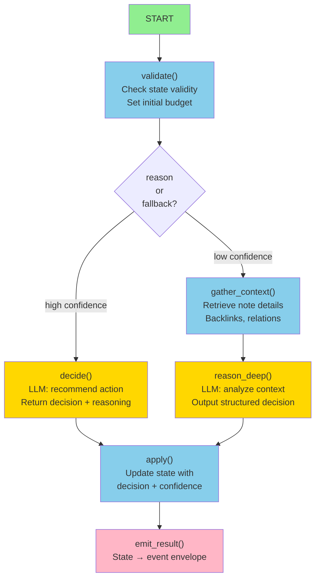
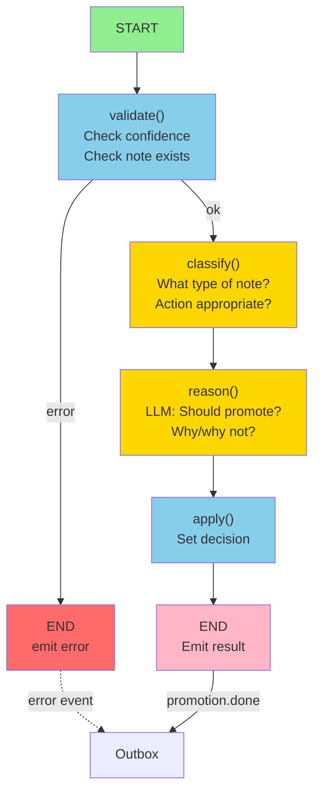
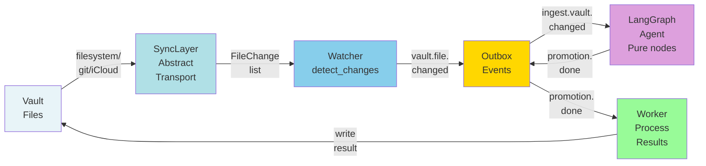

State: Reference — Agent architecture patterns for LangGraph agents
# LangGraph Agent Architecture

This document defines the transparent, reusable pattern for LangGraph agents in the Agentic PKM runtime. Every agent follows the same outer shape; internal reasoning logic varies.

---

## Outer Architecture (Universal Template)

All LangGraph agents follow this **5-layer structure**:

```
┌─────────────────────────────────────────────────────────────────┐
│  ORCHESTRATOR / EVENT LOOP                                      │
│  (Route events from Outbox → agent → emit result events)        │
└──────────────────────────────┬──────────────────────────────────┘
                               │
                    ┌──────────▼──────────┐
                    │  INPUT NORMALIZATION│
                    │  (Outbox event →    │
                    │   AgentState)       │
                    └──────────┬──────────┘
                               │
         ┌─────────────────────▼─────────────────────┐
         │  LANGGRAPH CONTROL PLANE                  │
         │  (StateGraph: nodes, edges, conditions)   │
         │                                            │
         │  Entry → [Node1, Node2, Node3...] → Exit │
         │                                            │
         │  Each node:                                │
         │    - Pure function: state_in → state_out │
         │    - May call ReasoningFacade (LLM)      │
         │    - No side effects (events only)        │
         └──────────────────────┬────────────────────┘
                                │
                  ┌─────────────▼─────────────┐
                  │ OUTPUT NORMALIZATION       │
                  │ (AgentState → result      │
                  │  event envelope)          │
                  └──────────────┬────────────┘
                                 │
                  ┌──────────────▼────────────┐
                  │ OUTBOX EMISSION           │
                  │ (Emit result events)      │
                  └───────────────────────────┘
```

---

## Layer 1: Input Normalization

**Purpose**: Convert Outbox event → AgentState

```python
# Input: Outbox event
{
  "event": "promotion.intent.created",
  "event_id": "evt-uuid",
  "trace_id": "trace-abc",
  "source": "panel_agent",
  "timestamp": "2026-03-28T08:10:00Z",
  "payload": {
    "note_uuid": "note-123",
    "action": "promote",
    "confidence": 0.85
  }
}

# Output: AgentState
@dataclass
class PromotionAgentState:
  # Required by framework
  trace_id: str                     # for telemetry chain
  budget: int = 10                  # max LLM calls
  step_count: int = 0               # tracking
  messages: list[dict] = field(...)  # for LLM

  # Domain-specific (Promotion)
  note_uuid: str
  action: str  # promote, evergreen, archive, etc.
  confidence: float
  reason: str = ""
  decision: str = ""  # output field
  error: str | None = None
```

---

## Layer 2: LangGraph Control Plane

**Purpose**: Route state through nodes, enforce topology, emit telemetry



**Key properties**:
- **Entry node**: `START` → initializes state
- **Terminal node**: `END` → prepares output
- **Pure nodes**: Each node is a stateless function
- **No side effects**: Only state mutations (no direct writes, no API calls except via ReasoningFacade)
- **Telemetry wrapper**: Every node logs entry/exit with trace_id + latency

---

## Layer 3: Nodes (Pure State Transformations)

**Pattern**: Every node follows this shape

```python
def node_name(state: AgentState) -> AgentState:
    """Pure state transformation.

    In: previous state (possibly with errors from prior node)
    Out: new state with node's contribution

    Contract:
      - No external side effects (no writes, no API calls except Facade)
      - All LLM calls go through ReasoningFacade
      - If external call fails, log error + degrade gracefully
      - Return modified state (immutable — return new dataclass instance)
    """

    try:
        # Node logic here
        ...
        return state.copy(update={
            "step_count": state.step_count + 1,
            "decision": "...",
            ...
        })
    except Exception as e:
        # Graceful degradation
        logger.error(f"Node failed: {e}", extra={
            "trace_id": state.trace_id,
            "step": state.step_count
        })
        return state.copy(update={"error": str(e)})
```

**Example: Reasoning node**

```python
def reason(state: PromotionAgentState) -> PromotionAgentState:
    """LLM-based reasoning about promotion decision."""

    facade = get_reasoning_facade()  # Injected or via app context

    # Build prompt from state
    prompt = f"""
    Note: {state.note_uuid}
    Action proposed: {state.action}
    Confidence: {state.confidence}

    Recommend: promote | evergreen | archive | skip?
    Reasoning:
    """

    response = facade.chat(
        messages=[{"role": "user", "content": prompt}],
        trace_id=state.trace_id,
        model="claude-3-sonnet"
    )

    return state.copy(update={
        "reason": response,
        "step_count": state.step_count + 1,
    })
```

---

## Layer 4: Output Normalization

**Purpose**: AgentState → Canonical event envelope

```python
def state_to_event(state: PromotionAgentState, event_id: str) -> OutboxEvent:
    """Convert agent state to emittable event.

    Canonical envelope:
      event, event_id, trace_id, source, timestamp, payload, meta
    """

    return OutboxEvent(
        event=f"promotion.{state.decision}",  # e.g., promotion.approved
        event_id=event_id,
        trace_id=state.trace_id,
        source="promotion_agent",
        timestamp=datetime.utcnow().isoformat(),
        payload={
            "note_uuid": state.note_uuid,
            "decision": state.decision,
            "reasoning": state.reason,
            "confidence": state.confidence,
        },
        meta={
            "telemetry": {
                "steps": state.step_count,
                "budget_remaining": state.budget - state.step_count,
                "error": state.error,
            }
        }
    )
```

---

## Layer 5: Orchestrator Integration

**Purpose**: Event loop orchestrates agent → stores result

```python
async def promotion_agent_runner(event: OutboxEvent) -> None:
    """Orchestrator entry point.

    Steps:
      1. Parse event → initial state
      2. Run graph
      3. Normalize output → event
      4. Emit to outbox
    """

    # Layer 1: Input normalization
    state = PromotionAgentState.from_event(event)

    # Layer 2: Run graph
    graph = build_promotion_graph()
    final_state = graph.invoke(state)

    # Layer 4: Output normalization
    result_event = state_to_event(final_state, event_id=new_uuid())

    # Layer 5: Emit
    outbox.emit(result_event)

    # Telemetry
    logger.info(
        "promotion_agent completed",
        extra={
            "trace_id": final_state.trace_id,
            "decision": final_state.decision,
            "steps": final_state.step_count,
        }
    )
```

---

## Reusability: Agent Template

Every new LangGraph agent reuses this scaffold:

```python
# app/agents/{agent_name}/

__init__.py                 # (empty)
state.py                    # AgentState dataclass + helpers
graph.py                    # build_graph() function
events.py                   # Outbox event schema for this agent
runtime.py                  # Agent runner (orchestrator entry point)
nodes/                      # Subdirectory for complex agents
  __init__.py
  node1.py
  node2.py
```

**Minimal agent example:**

```python
# state.py
@dataclass
class MyAgentState:
    trace_id: str
    budget: int = 10
    step_count: int = 0
    messages: list[dict] = field(default_factory=list)

    input_field: str
    output_field: str = ""
    error: str | None = None

# graph.py
from langgraph.graph import StateGraph, START, END
from app.components.reasoning import build_agent_graph, AgentStateBase

def build_my_agent_graph():
    """Return compiled LangGraph graph."""

    def node_process(state: MyAgentState) -> MyAgentState:
        # Do work
        return state.copy(update={"output_field": "..."})

    nodes = {
        "process": node_process,
    }

    edges = [
        (START, "process"),
        ("process", END),
    ]

    # Use builder for telemetry + validation
    return build_agent_graph(
        agent_name="my_agent",
        nodes=nodes,
        edges=edges,
        state_cls=MyAgentState
    )

# runtime.py
async def my_agent_runner(event: OutboxEvent) -> None:
    state = MyAgentState.from_event(event)
    graph = build_my_agent_graph()
    final_state = graph.invoke(state)
    result_event = state_to_event(final_state)
    outbox.emit(result_event)
```

---

## Feature Flag: Runtime Control

**Pattern**: Feature flags control which agent is active

```python
# In orchestrator.py
if os.getenv("LANGGRAPH_PILOT_AGENT") == "promotion":
    await promotion_agent_runner(event)
elif os.getenv("LANGGRAPH_PILOT_AGENT") == "reviewer":
    await reviewer_agent_runner(event)
else:
    # Fall back to deterministic pipeline (no LLM)
    await deterministic_promotion_pipeline(event)
```

---

## Transparency & Observability

**Every agent exposes**:
- `trace_id` — chain causality through Outbox events
- `step_count` — track iterations (guards against infinite loops)
- `error` — graceful degradation signal
- Telemetry events — optional `agent.step.started`, `agent.step.completed` for deep debugging

**Audit trail**:
- Input event + output event form a pair
- Both have same `trace_id`
- Payload shows decision + reasoning + confidence

---

## Example Diagrams

### Promotion Agent Specific



### Watcher + Agent Chain (With SyncLayer)



---

## Contracts (Non-Negotiable)

1. **Input**: Outbox event with `{event, event_id, trace_id, ...}`
2. **State**: Dataclass with `trace_id`, `budget`, `step_count`, domain fields
3. **Nodes**: Pure functions (state → state)
4. **Reasoning**: All LLM via ReasoningFacade
5. **Output**: Canonical Outbox event (same trace_id as input)
6. **Side effects**: Zero (only Outbox emission, no vault writes)
7. **Fallback**: Graceful degradation on error (return state with `error` field)

---

## Testing Agents

**Unit tests** (per agent):
- State serialization
- Graph topology (entry/exit, reachability)
- Node behavior (state in → state out)
- Feature flag control
- Integration (event → agent → event)

**Integration tests** (across agents):
- Event chain: ingest.vault.changed → agent → promotion.done → worker
- Telemetry propagation (trace_id through chain)
- Deterministic fallback (when LLM unavailable)

---

## Future Extensibility

This architecture scales to:
- **Deep Agents** (multi-step planning, tool use)
- **Multi-agent coordination** (one agent's output → another agent's input)
- **Custom reasoning** (swap ReasoningFacade for domain-specific logic)
- **New agents** (copy template, implement nodes, update graph)

All via pure state transformations + event emission.
