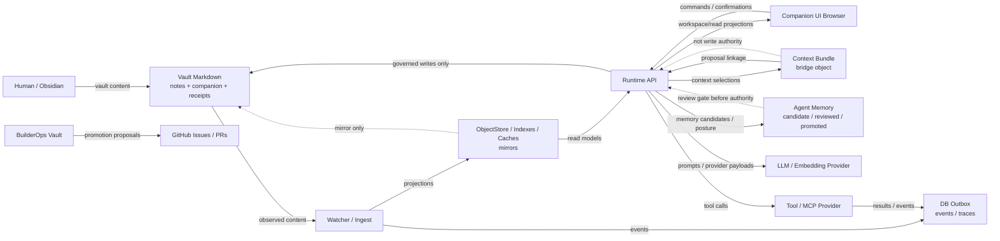

State: Initial security data-flow inventory. Docs-only; does not change runtime behavior.
Doc role: Core SoT companion
Authority: Security-relevant data-flow inventory for future STRIDE, ATT&CK-inspired, and attack-path reviews. Consumes existing owner docs; does not redefine semantic authority.
Owner: Security architecture / governance
Temporal class: strategic
Review cadence: event-driven
Source of truth: mixed
Last reviewed: 2026-06-04
Last verified against: docs/SECURITY_ARCHITECTURE.md, docs/SECURITY_TRUST_BOUNDARIES.md, docs/security/API_SECURITY_MATRIX.md, docs/ARCHITECTURE.md, docs/PRIVACY.md, docs/CONCEPTS/AGENT_MEMORY_AND_KNOWLEDGE_CONTRACT.md, docs/CONCEPTS/CONTEXT_BUNDLE_CONTRACT.md, docs/CONCEPTS/RECEIPT_TRACE_ACCOUNTABILITY_CONTRACT.md, companion-ui/docs/LOCAL_ACCESS_MODEL.md, docs/contracts/TOOL_POLICY_AND_MCP_ADAPTER_CONTRACT.md, docs/builderops/BUILDEROPS_VAULT_BOUNDARY.md

# Security Data Flows

## Purpose

This document lists the security-relevant data classes and flows that future formal reviews should
analyze. It is an input to STRIDE, ATT&CK-inspired mapping, attack-path analysis, and API security
matrix work.

The route-by-route API security inventory lives in `docs/security/API_SECURITY_MATRIX.md`. Use that
matrix when a data flow crosses the runtime API boundary, changes route exposure, or adds a
mutation-capable API surface.

Data-flow authority is not the same as semantic authority. Data moving into a component does not
grant that component authority over meaning, writes, receipts, or product truth. Authority remains
owned by the semantic and governance contracts.

## Security-relevant data classes

| Data class | Description | Authority posture | Primary owner docs |
| --- | --- | --- | --- |
| Vault content | Human-authored note body and frontmatter | Primary durable meaning when human-authored or governed | `docs/ARCHITECTURE.md`, `docs/HUMAN-FLOWS.md` |
| Companion artifacts | System-owned continuity/repair artifacts | Durable support/governance surface, subordinate to human artifacts where applicable | `docs/CONCEPTS/COMPANION_NOTE_CONTRACT.md` |
| Memory candidates | Observed or inferred memory under review | Non-authoritative until reviewed/promoted | `docs/CONCEPTS/AGENT_MEMORY_AND_KNOWLEDGE_CONTRACT.md` |
| Context bundles | Included/excluded context, rationale, authority flags | Bridge object; not truth or write authorization by itself | `docs/CONCEPTS/CONTEXT_BUNDLE_CONTRACT.md` |
| Receipts, traces, audit records | Human-legible accountability, runtime traces, durable audit supports | Receipts are authoritative within recorded scope; traces alone are not receipts | `docs/CONCEPTS/RECEIPT_TRACE_ACCOUNTABILITY_CONTRACT.md` |
| Prompts and model outputs | Model inputs/outputs, reasoning supports, summaries, suggestions | Suggest/proposal support; never execution authority alone | `docs/LLM.md`, `docs/INTERACTION_SURFACES_AND_AUTHORITY/README.md` |
| Provider payloads | Data sent to local/remote LLM or embedding providers | External inference payloads; not authority | `docs/PRIVACY.md`, `docs/SECURITY.md` |
| Secrets, tokens, API keys | API keys, provider keys, local auth tokens | Operational secrets; must not enter docs/logs/prompts | `docs/SECURITY.md`, `companion-ui/docs/LOCAL_ACCESS_MODEL.md` |
| GitHub/BuilderOps operational records | Issues, PRs, worklogs, learning signals, PromotionIntents, receipts | Build-plane/delivery authority only; not product semantic truth | `AGENTS.md`, `docs/adr/ADR-0010-builderops-vault-authority-boundary.md` |

## Flow table

| Source | Destination | Data class | Authority implication | Persistence | Outbound/external exposure | Governing document |
| --- | --- | --- | --- | --- | --- | --- |
| Human / Obsidian | Vault filesystem | Vault content | Human primary durable meaning | Durable Markdown | Local file/sync surface | `docs/HUMAN-FLOWS.md`, `docs/ARCHITECTURE.md` |
| Vault filesystem | Watcher / ingest | Vault content, metadata | Observation only; not admission | Runtime event + mirror writes | Local | `docs/ARCHITECTURE.md`, `docs/ENVIRONMENTS.md` |
| Watcher / Panel / API | DB outbox | Intents, events, traces | Operational coordination; event is not automatically receipt | DB outbox | Local DB | `docs/EVENTS.md`, `docs/CONCEPTS/RECEIPT_TRACE_ACCOUNTABILITY_CONTRACT.md` |
| Ingest / worker | ObjectStore / indexes | Vault content projections | Mirror only; source authority preserved | DB/index/cache | Local DB | `docs/CONCEPTS/MACHINE_MIRROR_AND_DB_AUTHORITY_CONTRACT.md` |
| Runtime API | Companion UI browser | Vault projections, workspace state, receipts, guard state | UI projection only | Browser runtime; no semantic authority | Localhost/LAN/Tailscale depending bind | `companion-ui/docs/SEMANTIC_PROJECTION_ALIGNMENT.md` |
| Companion UI browser | Runtime API | User commands, confirmation transport, body edits | Transport signal; server classifies authority | Runtime request, events/receipts if applied | Localhost/LAN/Tailscale depending bind | `companion-ui/docs/LOCAL_ACCESS_MODEL.md`, `companion-ui/docs/PANEL_CONFIRMATION_API_CONTRACT.md` |
| Canvas session | Session log | Prompts, change summaries, provenance | Session log is subordinate provenance, not canonical artifact | Durable `.chats` artifact when enabled | Vault/sync surface | `companion-ui/docs/CANVAS_AGENT_MVP_CONTRACT.md` |
| Retrieval/orientation/resurfacing | Context bundle | Context selections, exclusions, authority flags | Bridge object; no write authority by itself | Runtime/read model + receipt projection | API response | `docs/CONCEPTS/CONTEXT_BUNDLE_CONTRACT.md` |
| Context bundle | Write proposal | Evidence linkage | Supports proposal; gate still required | Staged proposal/runtime record | Local | `docs/CONTEXT_BUNDLES_RUNTIME/README.md` |
| Memory candidate review | Promoted/rejected/revised memory | Memory candidate, review decision, provenance | Review can change memory posture; no hidden authority | Agent memory records/receipts | Local | `docs/AGENT_MEMORY/README.md` |
| Runtime / prompt builder | LLM/embedding provider | Prompts, excerpts, embedding payloads | Provider output is inference only | Provider-dependent external processing | Optional outbound | `docs/PRIVACY.md`, `docs/LLM.md` |
| Planner/orchestrator | Tool/MCP provider | Tool args, descriptor ids, trace ids | Tool execution constrained by descriptor/policy/settings | Events/results | Local or remote if enabled | `docs/contracts/TOOL_POLICY_AND_MCP_ADAPTER_CONTRACT.md` |
| Builder agent / API / CLI | BuilderOps Vault | Worklogs, learning signals, PromotionIntents | Build-plane operational records | BuilderOps SQLite | Local | `docs/builderops/BUILDEROPS_VAULT_BOUNDARY.md` |
| BuilderOps promotion gateway | GitHub/repo proposal path | Draft issues, proposal material, receipts | Proposal only until target gate applies | GitHub/repo if explicitly created | GitHub when used | `docs/builderops/BUILDEROPS_PROMOTION_GATEWAY.md` |
| Runtime | Logs/status/observability | Metadata, trace ids, status, errors | Diagnostic/support data; not authority unless receipt contract says so | Logs, metrics, status | Local/optional observability | `docs/OBSERVABILITY.md`, `docs/PRIVACY.md` |

## Data-flow diagram

## Review notes

- External exposure exists only when an operator enables outbound providers or non-loopback UI/API
  access. Treat localhost personal use differently from LAN, Tailscale, or public internet.
- Logs and traces should carry metadata, not raw note text or secrets.
- Any flow that persists a runtime-derived value into vault content, companion artifacts, memory,
  receipts, or repo truth requires governance review.
