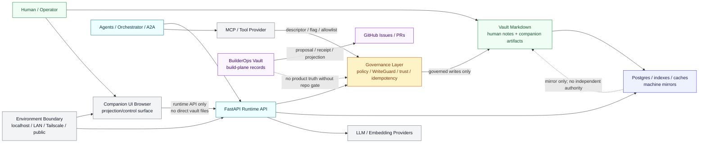

State: Initial security trust-boundary inventory. Docs-only; does not change runtime behavior.
Doc role: Core SoT companion
Authority: Security trust-boundary inventory for Yggdrasil. Consumes existing architecture and authority docs; does not replace their detailed ownership.
Owner: Security architecture / governance
Temporal class: strategic
Review cadence: event-driven
Source of truth: mixed
Last reviewed: 2026-06-04
Last verified against: docs/SECURITY_ARCHITECTURE.md, docs/DIAGRAMS.md, docs/diagrams/architecture.mmd, docs/ARCHITECTURE.md, docs/SYSTEM_OF_SYSTEMS_ARCHITECTURE.md, docs/SEMANTIC_SYSTEM_ARCHITECTURE.md, companion-ui/docs/LOCAL_ACCESS_MODEL.md, companion-ui/docs/SEMANTIC_PROJECTION_ALIGNMENT.md, docs/contracts/TOOL_POLICY_AND_MCP_ADAPTER_CONTRACT.md, docs/builderops/BUILDEROPS_VAULT_BOUNDARY.md

# Security Trust Boundaries

## Purpose

This document inventories the security trust boundaries that future STRIDE, ATT&CK-inspired,
attack-path, and architecture reviews should use.

It builds on the current runtime diagrams in `docs/DIAGRAMS.md` and
`docs/diagrams/architecture.mmd`. Those diagrams remain the current runtime visual companions; this
document adds security interpretation and boundary-review notes.

## Current boundary inventory

| Boundary | Trusted side | Untrusted or less-trusted side | Authority implication | Existing source doc | Security review notes |
| --- | --- | --- | --- | --- | --- |
| Human / vault boundary | Human-authored vault notes and explicit human decisions | Runtime observations, derived projections, suggestions | Human Markdown remains primary durable meaning | `docs/HUMAN-FLOWS.md`, `docs/ARCHITECTURE.md` | Review any path that writes note body, frontmatter, lifecycle, relations, or future behavior. |
| Browser / UI boundary | Runtime API and server-side governance classification | Browser state, DOM order, UI-local stores, rendered projections | UI may project/control but does not own file or semantic authority | `companion-ui/docs/SEMANTIC_PROJECTION_ALIGNMENT.md` | Review direct file access, UI-only approvals, CORS/CSRF, token handling, and stale-source confirmation. |
| Runtime API boundary | FastAPI runtime and route handlers | API clients, browser callers, scripts, LAN/Tailscale clients | API mediates read/write access; auth may be disabled for loopback local use | `docs/SECURITY.md`, `companion-ui/docs/LOCAL_ACCESS_MODEL.md` | Route matrix should classify read/write, auth, rate limit, receipt, and exposure assumptions. |
| Governance / write boundary | Policy, WriteGuard, trust semantics, idempotency, deterministic writer | Proposals, LLM output, retrieved context, UI clicks, watcher observations | Durable writes require admission and accountability | `docs/INTERACTION_SURFACES_AND_AUTHORITY/README.md`, `docs/CONCEPTS/TRUST_SEMANTICS_CONTRACT.md` | LLM reasoning, `may_write`, or UI confirmation transport must not bypass admission. |
| Mirror / database / index / cache boundary | Durable vault + companion + receipt set | DB rows, indexes, caches, retrieval results, workspace aggregates | Mirrors borrow source authority and cannot originate truth | `docs/CONCEPTS/MACHINE_MIRROR_AND_DB_AUTHORITY_CONTRACT.md` | Review any DB-only value that would lose meaning on rebuild or feed back into durable writes. |
| LLM / provider boundary | Local runtime contracts and provider adapters | Remote LLM/embedding services, optional local Ollama endpoint | Providers supply inference, not authority | `docs/LLM.md`, `docs/PRIVACY.md`, `docs/SECURITY.md` | Review prompt/data exposure, secrets, outbound payloads, SSRF-like provider features, and output laundering. |
| Tool / MCP boundary | Descriptor registry, executor validation, flags, allowlists, timeouts | Tool inputs, remote MCP providers, tool outputs | Tools execute only within descriptor/policy/settings boundaries | `docs/contracts/TOOL_POLICY_AND_MCP_ADAPTER_CONTRACT.md` | Remote descriptor discovery and real-tool enablement need admission review before wider exposure. |
| Agent / A2A boundary | In-process schemas, trace/correlation, orchestrator controls | Agent payloads, caller-owned routing, future transport | A2A is not a production transport or authority layer today | `docs/contracts/A2A_CONTRACT_AND_TRACE.md` | Review before adding queue, retry, timeout, remote, or cross-agent mutation semantics. |
| BuilderOps / repo boundary | Repo PR/owner-doc authority gates | BuilderOps records, generated projections, PromotionIntents | BuilderOps proposes/records; repo governs product/runtime truth | `docs/adr/ADR-0010-builderops-vault-authority-boundary.md` | Review laundering from worklog/projection into owner docs, issues, PRs, or runtime truth. |
| GitHub / issues / PR boundary | GitHub Issues as task contract, PR review, CI | Local BuilderOps records, agent worklogs, generated issue bodies | GitHub is delivery authority, not product semantic truth | `AGENTS.md`, `docs/development/GITHUB_GOVERNANCE_SETUP.md` | Review token/secrets usage, automation permissions, and issue/PR template bypass. |
| Environment / exposure boundary | `prod`, `dev`, `test` scoped vaults/stores; localhost default | LAN, Tailscale, public internet, wrong env/channel | Environment changes data touched, not product semantics | `docs/ENVIRONMENTS.md`, `companion-ui/docs/LOCAL_ACCESS_MODEL.md` | Public exposure is unsupported; LAN/Tailscale must be explicit and proportionately reviewed. |
| Sync / replica boundary | Artifact identity and instance provenance | Lagging replicas, partial views, transport state | Replica state does not redefine artifact identity | `docs/CONCEPTS/INSTANCE_DEVICE_AND_REPLICA_CONTRACT.md` | Review conflict handling and stale/partial data before multi-device execution authority expands. |

## Security trust-boundary diagram

## Review guidance

Use this boundary inventory as the first input for `docs/SECURITY_REVIEW_METHOD.md`. A change that
crosses or weakens any boundary above should normally receive at least Level 1 review, and Level 2
or higher when it adds write authority, external exposure, a new tool/provider, or a new durable
state transition.
