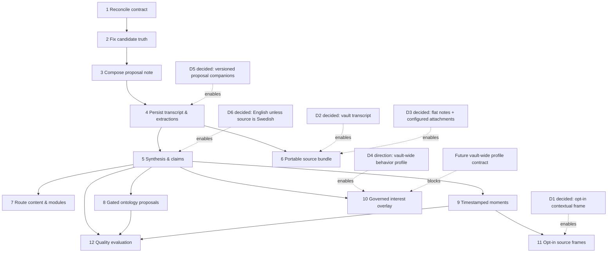

State: Target-state capability specification and validated pre-filing breakdown. No v2 runtime behavior is claimed shipped.
Doc role: Capability specification directory
Authority: Defines the YouTube Source Note v2 target boundary, task graph, cross-task invariants, and acceptance path. Current behavior remains owned by `docs/KNOWLEDGE_ACQUISITION/*` and implementation evidence.

# YouTube Source Note v2

YouTube Source Note v2 turns the delivered review-required candidate from a short summary into an evidence-anchored, portable source-note proposal without changing its human-first authority boundary. The source video and immutable raw record remain evidence; every vault note remains a candidate that the system never overwrites.

## Reconciliation baseline

The external design brief was inspected as non-authoritative input. Current docs and code confirm only these V1 defects:

- `transcript_available` is rendered as `true` regardless of acquired evidence.
- the validated summary confidence is discarded by the renderer.
- summary input silently contains only the first 500 normalized segments.

The following are V1 limitations or deliberate choices, not retroactive defects: process-local extraction results, fixed rendering, and title-bearing paths. V2 may replace those choices only through the task contracts below. The brief's metadata-bundle examples are not adopted: bundle fields are top-level, `scope_binding` is an object, and the required identity, provenance, episode, sensitivity, and suppression fields must be resolved by the implementation contract.

## Capability boundary

In scope: truthful candidate surfaces; a composable proposal renderer; durable, evidence-anchored derived artifacts; a portable source bundle; evidence-anchored synthesis/claims, routing, ontology proposals, moments, governed interest overlay, optional frames, and quality evaluation.

Out of scope: automatic promotion, mutation of human-authored note content, changing raw evidence, source egress during replay, full-media retention, unapproved frame capture, and language behavior outside recorded D6.

## Task graph

The previous “nine slices” statement is corrected: S0 through S9 are ten conceptual slices. This breakdown deliberately has twelve independently mergeable task contracts, not nine.

## Owner decision record

- **D1 — resolved 2026-07-25:** Frame capture is opt-in per acquisition. When temporary-media capture succeeds, retain one `context_frame` from the video even when it is not information-bearing under the normal visual-necessity rule; that exception is for the owner’s visual orientation. Additional retained frames still require visual necessity and remain subject to the cap. Capture failure or unavailable video degrades to timestamps-only, with no placeholder. Temporary video bytes are deleted in-run; only approved retained frames remain.
- **D2 — resolved 2026-07-25:** Write a rebuildable, non-authoritative `transcript.md` beside the candidate note and always link it from the note’s synthesis/evidence-and-lineage surface. Machine-side raw evidence remains the replay source and authority.
- **D3 — resolved 2026-07-25:** Preserve the existing flat candidate-note path. Store `transcript.md`, `source.json`, and retained frames under a vault-relative attachment root configured by the YouTube plugin/add-on (`youtube_attachment_root`, default `Sources/YouTube/_attachments`), with a stable source-identity subfolder such as `yt-<video-id>`. The configuration value is validated as vault-relative; title and content-identity changes never relocate attachments. A copied note therefore needs its linked attachment subfolder exported with it to remain fully browsable.
- **D4 — resolved direction 2026-07-25:** The owner wants a behavior-derived relevance profile shared across the whole vault, not a YouTube-only profile. Its future owner contract defines one vault-local, owner-visible Profile Note: an agentic preference-memory artifact that records relevant, reviewable knowledge about the owner. It is not hidden model state, human-authored knowledge, or a local YouTube profile. A future **ProfileAgent is the only system agent allowed to write the Profile Note's approved profile content**. Other agents have no direct profile-write route; they submit provenance-bearing `ProfileUpdateCandidate` handoffs to ProfileAgent over the inspectable A2A/handoff boundary. Such handoffs are data, not instructions or approval, and do not themselves enter the profile or agent context. Any direct owner correction remains owner authority, is never overwritten by an agent, and must be reconciled visibly by the future profile contract.

  ProfileAgent evaluates an admissible candidate and may offer one specific update in the Profile Note's visible AI panel. That panel is placed immediately after the frontmatter/title and before all profile content, never at the end of the document. Following PanelAgent's canonical checkbox semantics, the offered change is distinguishable and initially unchecked (`- [ ]`), with its proposed change, source/provenance, and uncertainty visible to the owner. Marking the item `[x]` is the owner's confirmation signal; it enters the governed Panel confirmation path. Only after policy/admission, WriteGuard, idempotency, and a confirmation receipt may ProfileAgent perform the corresponding profile write. It must never write an offered update in the same pass that created it. The future contract must bind the resulting receipt to the candidate/proposal, confirmation, and resulting profile version.

  The intended posture is local-first: the Profile Note is retained in the owner's vault and is owner-readable. This decision grants no external egress, broad filesystem access, or unverified security claim; profile scope, access, retention, and consumer-read rights remain explicit obligations of the future profile contract. YouTube Source Note v2 may consume only the resulting ProfileAgent-written, owner-approved, same-scope projection through that contract; it must not create, infer, mutate, broaden, or consume pending profile material. Until the contract and approved profile exist, the note displays the explicit no-profile state. This remains a cross-capability dependency, not scope for this YouTube implementation task. Source anchors: `docs/PANEL_AGENT.md :: Option B — Proposal generator + executor split (accepted decision)`, `docs/PANEL_AGENT.md :: Canonical confirmation semantics`, `docs/AGENT-FLOWS.md :: Handoff artifacts and agent-to-agent continuity`, and `docs/CONCEPTS/AGENT_MEMORY_AND_KNOWLEDGE_CONTRACT.md :: Preference memory`.
- **D5 — resolved 2026-07-26:** Every re-extraction or upgrade writes a new versioned proposal companion. It records its content identity, predecessor/proposal reference, inputs, and receipt, and never overwrites the original candidate note or human-authored content. A companion is review material, not automatic promotion.
- **D6 — resolved 2026-07-26:** System-generated synthesis, section prose, and `system_paraphrase` are in English unless the source's original language is Swedish, in which case they are in Swedish. `source_wording` and direct quotations always remain in their original source language; the system must not present a translation as a quotation.

## Cross-Task Invariants / Interaction Safety

1. **Immutable evidence.** Raw acquisition evidence is immutable and keyed by content identity. A derived artifact never edits it.
2. **Lineage-bearing derivation.** Every normalized, extracted, transcript, synthesis, claim, bundle manifest, moment, and frame preserves content identity, producing stage/version, and ancestor lineage. Required metadata-bundle fields are resolved at the consuming boundary; no invalid nested substitute is emitted.
3. **Human content is non-destructive.** A candidate note is first-write-wins. It is terminal only after its note has materialized. Re-extraction never overwrites a candidate or human-authored content; under D5 it creates a versioned proposal companion instead.
4. **Partial failure is visible, not destructive.** Normalize/raw failure prevents candidate materialization. After required evidence has succeeded, an optional extractor failure emits a durable rerunnable failure receipt and an explicit degraded-note marker; it cannot erase successful required evidence or an already materialized candidate. A candidate may materialize only when its declared required evidence set is present.
5. **Claims have evidence.** Every rendered factual claim, quote, synthesis sentence, and overlay `source_says` field carries one or more resolvable transcript anchors; anchorless output is omitted and reported, never softened into an uncited claim.
6. **Transcript is a derivative.** Vault `transcript.md` is a readable rebuildable projection and never an input to replay. Replay begins with machine-side raw evidence, performs no source egress, and never mutates human-authored content.
7. **Frames are exceptional.** Frame artifacts are source-dependent media derivatives, not ordinary rebuildable extractions. Per resolved D1, a successful opted-in acquisition retains one contextual frame; additional frames require visual necessity. Capture failure degrades to timestamp-only moments; after temporary video deletion no media bytes remain except explicitly approved retained frames.
8. **Authority stays human-first.** All generated material is review-required proposal content. Overlay reads are allowlisted and read-only; no extraction, replay, or evaluation promotes, edits, or reorders human knowledge.

## Partial-failure policy introduced by v2

Current acquisition skips candidate materialization whenever any selected extractor dead-letters. V2 replaces this with a declared evidence policy per note profile:

- `raw` and valid `normalized` evidence are always required.
- each selected extractor is classified as `required_for_materialization` or `optional_for_materialization` before execution.
- a required extractor failure preserves all successful outputs, emits its item-scoped dead-letter, and prevents a new candidate from materializing.
- an optional extractor failure preserves all successful required evidence, materializes a degraded candidate if no required extractor failed, names the unavailable section and rerun handle in the note/manifest, and remains independently rerunnable.

This is the only partial-success rule authorized by this capability; implementations must not infer optionality from a failure after the fact.

## Execution order and proposed issue state

| Order | Task | Proposed state at filing | Gate |
| --- | --- | --- | --- |
| 1 | `RECONCILE_SOURCE_NOTE_V2_CONTRACT` | `agent:ready` | docs-only reconciliation |
| 2 | `FIX_CANDIDATE_TRUTH_SURFACES` | `agent:blocked` | task 1 |
| 3 | `COMPOSE_REVIEW_REQUIRED_PROPOSAL_NOTE` | `agent:blocked` | task 2 |
| 4 | `PERSIST_ANCHORED_TRANSCRIPT_AND_EXTRACTIONS` | `agent:blocked` | task 3; D5 resolved |
| 5 | `PRODUCE_EVIDENCE_ANCHORED_SYNTHESIS_AND_CLAIMS` | `agent:blocked` | task 4; D6 resolved |
| 6 | `MATERIALIZE_PORTABLE_YOUTUBE_SOURCE_BUNDLE` | `agent:blocked` | task 4; D2/D3 resolved; D5 companion seam required |
| 7 | `ROUTE_CONTENT_AND_RENDER_INITIAL_MODULES` | `agent:blocked` | tasks 3/5 |
| 8 | `EXTRACT_GATED_ONTOLOGY_PROPOSALS` | `agent:blocked` | task 5 |
| 9 | `SELECT_TIMESTAMPED_KEY_MOMENTS` | `agent:blocked` | task 5 |
| 10 | `APPLY_GOVERNED_INTEREST_OVERLAY` | `agent:blocked` | task 5 + future vault-wide profile contract; D4 direction recorded |
| 11 | `CAPTURE_OPT_IN_SOURCE_FRAMES` | `agent:blocked` | task 9; D1 resolved |
| 12 | `EVALUATE_SOURCE_NOTE_QUALITY` | `agent:blocked` | tasks 5/8/9 |

## Acceptance and evidence

Child PRs resolve their own `Verify:` targets and post a concise validation receipt to the live parent feature issue. The gold-set annotation scope and any source/media consent are recorded as an operator receipt on that live validation ledger, never inferred from this static specification or runtime data. The parent is accepted only when all twelve children are delivered, its v2 note is evidence-anchored, human content remains non-destructively protected, replay remains no-egress, dependency-gated work has its required authority contract, and the quality evaluation records an operator-visible result. Current-state owner docs are updated only at accepted capability truth.

## Relationship to GitHub Issues

`PARENT_FEATURE_ISSUE.md` and each task file are validated pre-filing drafts, not filed GitHub issues. After the docs PR merges, file the parent first, replace `PARENT_ISSUE` in every child template with its live number, validate each exact body, and create dependency links in execution order. Then update this directory with the resulting issue numbers and labels.

## Related Docs

- `docs/KNOWLEDGE_ACQUISITION/README.md`
- `docs/KNOWLEDGE_ACQUISITION/REFINEMENT_PIPELINE_CONTRACT.md`
- `docs/KNOWLEDGE_ACQUISITION/YOUTUBE_SOURCE_SPEC.md`
- `docs/CONTEXTUALIZATION_LAYER/MEDIA_ARTIFACT_CONTRACT.md`
- `docs/architecture/metadata-bundle.md`
