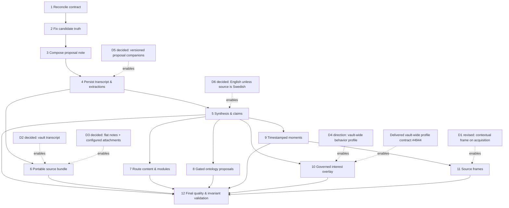

State: Delivered and repo-verified capability, accepted under parent #4107. All twelve child contracts (YSNV2-01 through YSNV2-12, #4108–#4119, including the YSNV2-06 portable source bundle) and integration slices #5746, #5747 and #5749 are delivered, and the end-to-end invariant matrix (`tests/knowledge_acquisition/test_source_note_quality.py::test_v2_end_to_end_invariant_matrix`) proves immutable versioned bundle evidence, anchored claims, non-destructive D5 materialization, governed overlay admission, bounded frame capture, and no-egress replay together on the real acquisition-time pipeline. The overlay's only profile source is the Governed Vault Profile accepted under #4944. Current note behavior is owned by `docs/KNOWLEDGE_ACQUISITION/YOUTUBE_SOURCE_SPEC.md :: Writeback`; this directory remains the v2 contract, task-graph, and invariant authority. Remaining gates, not shipped claims: real-world note quality is not yet measured, because the owner's 3-video gold-set annotations (receipt `ysnv2_gold_set_annotation_scope.v1`) and the first operator-visible quality run are pending in #5756; drained or synced acquisition requests render the no-profile overlay line because no source-registry binding policy writes the request policy snapshot's `active_scope_id` yet, so only an explicit `acquire-youtube`/`acquire-replay` `--scope` binds a profile scope today; and Known Defects KD-0A5C9F1AB7EE (router thresholds), KD-6BD17B74F8B3 (moment budget uses transcript span) and KD-14B32C6A1CB0 (no registry writer for the drained-request scope) stay deferred on #4172.
Doc role: Capability specification directory
Authority: Defines the YouTube Source Note v2 target boundary, task graph, cross-task invariants, and acceptance path. Current behavior remains owned by `docs/KNOWLEDGE_ACQUISITION/*` and implementation evidence.

# YouTube Source Note v2

YouTube Source Note v2 turns the delivered review-required candidate from a short summary into an evidence-anchored, portable source-note proposal without changing its human-first authority boundary. The source video and immutable raw record remain evidence; every vault note remains a candidate that the system never overwrites.

## Reconciliation baseline

The external design brief was inspected as non-authoritative input. Issue #4109 was delivered by
PR #4130, correcting the three confirmed V1 truth defects without shipping the later v2 modules:

- `transcript_available` is now derived from usable normalized evidence; valid empty ASR produces
  the explicit false candidate path without transcript extraction, while captionless and malformed
  evidence fail loudly.
- schema-validated finite summary confidence is retained in the non-authoritative rendering.
- summary input contains all actual normalized segments and reports complete deterministic
  segment coverage.

Issue #4110 was delivered by PR #4142. It adds the authority-banded, review-required proposal
renderer while preserving owner-authored bytes, omitting empty optional modules, and keeping
candidate terminality behind successful note materialization. This is the YSNV2-03 rendering seam,
not delivery of the later evidence, bundle, module, profile, frame, or evaluation slices.

YSNV2-06 materializes the portable source bundle through the delivered transcript/extraction seam:
the flat candidate note remains in place while a configured vault-relative attachment root holds a
stable `yt-<video-id>` folder and immutable content-identity/version members. Each member contains
a derived/rebuildable `transcript.md` and schema-valid `source.json`; replay continues from
machine-side raw evidence, and existing candidate upgrades use a D5 versioned proposal companion.

The following are V1 limitations or deliberate choices, not retroactive defects: process-local extraction results, fixed rendering, and title-bearing paths. V2 may replace those choices only through the task contracts below. The brief's metadata-bundle examples are not adopted. Every usable bundle resolves the schema-required fields at the top level: identity (`object_id`, `object_type`), scope (`scope_id`), semantic standing (`source_role`, `authority_state`, `evidence_role`, `sensitivity`, `suppression_state`), provenance (`created_by`, `created_at`, `provenance_event_ids`), and episode binding (`episode_ref`). `scope_binding`, when present, is the object defined by the shared schema rather than a string or nested substitute. Conditional schema requirements such as `derived_from` for derived types and `authority_receipt_ref` for canonical standing remain in force.

## Capability boundary

In scope: truthful candidate surfaces; a composable proposal renderer; durable, evidence-anchored derived artifacts; a portable source bundle; evidence-anchored synthesis/claims, routing, ontology proposals, moments, governed interest overlay, bounded source frames, and quality evaluation.

Out of scope: automatic promotion, mutation of human-authored note content, changing raw evidence, source egress during replay, full-media retention, frame capture beyond the bounded YSNV2-11 contract, and language behavior outside recorded D6.

## Task graph

```mermaid
flowchart TD
  T1["1 Reconcile contract"] --> T2["2 Fix candidate truth"]
  T2 --> T3["3 Compose proposal note"]
  T3 --> T4["4 Persist transcript & extractions"]
  T4 --> T5["5 Synthesis & claims"]
  T4 --> T6["6 Portable source bundle"]
  T5 --> T7["7 Route content & modules"]
  T5 --> T8["8 Gated ontology proposals"]
  T5 --> T9["9 Timestamped moments"]
  T5 --> T10["10 Governed interest overlay"]
  T9 --> T11["11 Source frames"]
  T5 --> T12["12 Final quality & invariant validation"]
  T6 --> T12
  T7 --> T12
  T8 --> T12
  T9 --> T12
  T10 --> T12
  T11 --> T12
  D1["D1 revised: contextual frame on acquisition"] -. enables .-> T11
  D2["D2 decided: vault transcript"] -. enables .-> T6
  D3["D3 decided: flat notes + configured attachments"] -. enables .-> T6
  D4["D4 direction: vault-wide behavior profile"] -. enables .-> T10
  V["Delivered vault-wide profile contract #4944"] -. enables .-> T10
  D5["D5 decided: versioned proposal companions"] -. enables .-> T4
  D6["D6 decided: English unless source is Swedish"] -. enables .-> T5
```

The previous “nine slices” statement is corrected: S0 through S9 are ten conceptual slices. This breakdown deliberately has twelve independently mergeable task contracts, not nine.

## Owner decision record

- **D1 — revised 2026-09-30 (supersedes the 2026-07-25 decision):** For each eligible acquisition with timestamped moments, attempt bounded temporary-media capture and retain one `context_frame` when capture succeeds, even when it is not information-bearing under the normal visual-necessity rule; that exception provides visual orientation. Additional retained frames require visual necessity and remain subject to the cap. Capture failure or unavailable video degrades to timestamps-only, with no placeholder. Temporary video bytes are deleted in-run; retained frames remain source-dependent media derivatives with rights, sensitivity, lineage, and retention metadata.
- **D2 — resolved 2026-07-25:** Write a rebuildable, non-authoritative `transcript.md` beside the candidate note and always link it from the note’s synthesis/evidence-and-lineage surface. Machine-side raw evidence remains the replay source and authority.
- **D3 — resolved 2026-07-25:** Preserve the existing flat candidate-note path. Store `transcript.md`, `source.json`, and retained frames under a vault-relative attachment root configured by the YouTube plugin/add-on (`youtube_attachment_root`, default `Sources/YouTube/_attachments`), with a stable source-identity subfolder such as `yt-<video-id>` and one immutable child directory per content identity/version. The configuration value is validated as vault-relative; title changes never relocate attachments, while a content-identity change creates a new immutable version directory and never retargets an older candidate's links or anchors. A copied note therefore needs its linked attachment subfolder exported with it to remain fully browsable.
- **D4 — resolved direction 2026-07-25:** The owner wants a behavior-derived relevance profile shared across the whole vault, not a YouTube-only profile. Its owner contract defines one vault-local, owner-visible Profile Note: an agentic preference-memory artifact that records relevant, reviewable knowledge about the owner. It is not hidden model state, human-authored knowledge, or a local YouTube profile. The delivered **ProfileAgent is the only system agent allowed to write the Profile Note's approved profile content**. Other agents have no direct profile-write route; they submit provenance-bearing `ProfileUpdateCandidate` handoffs to ProfileAgent over the inspectable A2A/handoff boundary. Such handoffs are data, not instructions or approval, and do not themselves enter the profile or agent context. Any direct owner correction remains owner authority, is never overwritten by an agent, and is reconciled visibly under the delivered profile contract.

  ProfileAgent evaluates an admissible candidate and may offer one specific update in the Profile Note's visible AI panel. That panel is placed immediately after the frontmatter/title and before all profile content, never at the end of the document. Following PanelAgent's canonical checkbox semantics, the offered change is distinguishable and initially unchecked (`- [ ]`), with its proposed change, source/provenance, and uncertainty visible to the owner. Marking the item `[x]` is the owner's confirmation signal; it enters the governed Panel confirmation path. Only after policy/admission, WriteGuard, idempotency, and a confirmation receipt may ProfileAgent perform the corresponding profile write. It never writes an offered update in the same pass that created it. The delivered contract binds the resulting receipt to the candidate/proposal, confirmation, and resulting profile version.

  The intended posture is local-first: the Profile Note is retained in the owner's vault and is owner-readable. This decision grants no external egress, broad filesystem access, or unverified security claim; profile scope, access, retention, and consumer-read rights are governed by the delivered [Governed Vault Profile contract](../GOVERNED_VAULT_PROFILE/README.md). YouTube Source Note v2 may consume only the resulting ProfileAgent-written, owner-approved, same-scope projection through that contract; it must not create, infer, mutate, broaden, or consume pending profile material. The governed projection returns explicit no-profile when an approved same-scope profile is unavailable. The separate YSNV2-10 renderer is delivered under Issue #4117 as a read-only consumer of that projection (`app/knowledge_acquisition/interest_overlay.py`); Issue #5747 wires it into acquisition-time candidate notes with a deterministic, local, no-egress connection producer and the vault context's explicit `active_scope_id`; an unset scope renders the explicit no-profile line, and no production entry point sets one yet (#5749). The profile contract is now a delivered cross-capability interface rather than an unowned dependency. Source anchors: `docs/PANEL_AGENT.md :: Option B — Proposal generator + executor split (accepted decision)`, `docs/PANEL_AGENT.md :: Canonical confirmation semantics`, `docs/AGENT-FLOWS.md :: Handoff artifacts and agent-to-agent continuity`, and `docs/CONCEPTS/AGENT_MEMORY_AND_KNOWLEDGE_CONTRACT.md :: Preference memory`.
- **D5 — resolved 2026-07-26:** Every re-extraction or upgrade writes a new versioned proposal companion. It records its content identity, predecessor/proposal reference, inputs, and receipt, and never overwrites the original candidate note or human-authored content. A companion is review material, not automatic promotion.
- **D6 — resolved 2026-07-26:** System-generated synthesis, section prose, and `system_paraphrase` are in English unless the source's original language is Swedish, in which case they are in Swedish. `source_wording` and direct quotations always remain in their original source language; the system must not present a translation as a quotation.

**YSNV2-01 preservation receipt (2026-07-26):** D1–D6 were recorded as then-current inputs to
their implementation children. The owner revised D1 on 2026-09-30; D2–D6 remain as recorded. That
contract reconciliation implemented none of them and made no v2 or ProfileAgent runtime claim; the
separate GOVPROF-01–03 capability was delivered and accepted under parent #4944 on 2026-09-29.

## Cross-Task Invariants / Interaction Safety

1. **Immutable evidence.** Raw acquisition evidence is immutable and keyed by content identity. A derived artifact never edits it.
2. **Lineage-bearing derivation.** Every normalized, extracted, transcript, synthesis, claim, bundle manifest, moment, and frame preserves content identity, producing stage/version, and ancestor lineage. Bundle members live under an immutable content-identity/version directory within the stable source-identity root, so newer content cannot retarget older note links or anchors. Required metadata-bundle fields are resolved at the consuming boundary; no invalid nested substitute is emitted.
3. **Human content is non-destructive.** A candidate note is first-write-wins. It is terminal only after its note has materialized. Re-extraction never overwrites a candidate or human-authored content; under D5 it creates a versioned proposal companion instead.
4. **Partial failure is visible, not destructive.** Normalize/raw failure prevents candidate materialization. After required evidence has succeeded, an optional extractor failure emits a durable rerunnable failure receipt and an explicit degraded-note marker; it cannot erase successful required evidence or an already materialized candidate. A candidate may materialize only when its declared required evidence set is present.
5. **Claims have evidence.** Every rendered factual claim, quote, synthesis sentence, and overlay `source_says` field carries one or more resolvable transcript anchors; anchorless output is omitted and reported, never softened into an uncited claim.
6. **Transcript is a derivative.** Vault `transcript.md` is a readable rebuildable projection and never an input to replay. Replay begins with machine-side raw evidence, performs no source egress, and never mutates human-authored content.
7. **Frames are exceptional.** Frame artifacts are source-dependent media derivatives, not ordinary rebuildable extractions. Per revised D1, a successful eligible acquisition retains one contextual frame; additional frames require visual necessity. Capture failure degrades to timestamp-only moments; after temporary video deletion no media bytes remain except retained frames.
8. **Authority stays human-first.** All generated material is review-required proposal content. Overlay reads are allowlisted and read-only; no extraction, replay, or evaluation promotes, edits, or reorders human knowledge.

## Partial-failure policy introduced by v2

Current acquisition skips candidate materialization whenever any selected extractor dead-letters. V2 replaces this with a declared evidence policy per note profile:

- `raw` and valid `normalized` evidence are always required.
- each selected extractor is classified as `required_for_materialization` or `optional_for_materialization` before execution.
- a required extractor failure preserves all successful outputs, emits its item-scoped dead-letter, and prevents a new candidate from materializing.
- an optional extractor failure preserves all successful required evidence, materializes a degraded candidate if no required extractor failed, names the unavailable section and rerun handle in the note/manifest, and remains independently rerunnable.

This is the only partial-success rule authorized by this capability; implementations must not infer optionality from a failure after the fact.

## Execution order and proposed issue state

This stable heading is retained because parent Issue #4107 uses it as an acceptance anchor; each merged child records its resulting delivery state here.

| Order | Task | Live Issue / state | Gate |
| --- | --- | --- | --- |
| 1 | `RECONCILE_SOURCE_NOTE_V2_CONTRACT` | [#4108](https://github.com/RasmusTho/agentic-pkm-mvp/issues/4108) — contract delivered; no runtime | docs-only reconciliation |
| 2 | `FIX_CANDIDATE_TRUTH_SURFACES` | [#4109](https://github.com/RasmusTho/agentic-pkm-mvp/issues/4109) — delivered by PR #4130; bounded V1 truth correction only | task 1 |
| 3 | `COMPOSE_REVIEW_REQUIRED_PROPOSAL_NOTE` | [#4110](https://github.com/RasmusTho/agentic-pkm-mvp/issues/4110) — delivered by PR #4142 | task 2 |
| 4 | `PERSIST_ANCHORED_TRANSCRIPT_AND_EXTRACTIONS` | [#4111](https://github.com/RasmusTho/agentic-pkm-mvp/issues/4111) — delivered by PR #4832 | durable transcript/extraction lineage, partial-failure policy, and D5 versioned companions; #4132 prerequisite delivered |
| 5 | `PRODUCE_EVIDENCE_ANCHORED_SYNTHESIS_AND_CLAIMS` | [#4112](https://github.com/RasmusTho/agentic-pkm-mvp/issues/4112) — delivered by PR #4990 | task 4; D6 resolved |
| 6 | `MATERIALIZE_PORTABLE_YOUTUBE_SOURCE_BUNDLE` | [#4113](https://github.com/RasmusTho/agentic-pkm-mvp/issues/4113) — delivered by PR #4991 | task 4; D2/D3 resolved; D5 companion seam required |
| 7 | `ROUTE_CONTENT_AND_RENDER_INITIAL_MODULES` | [#4114](https://github.com/RasmusTho/agentic-pkm-mvp/issues/4114) — delivered by PR #5744; deterministic content router (`app/knowledge_acquisition/content_router.py`, at most two ranked anchored profiles, generic fallback) and initial `decision_framework`/`documentary_science` modules (`app/knowledge_acquisition/note_modules.py`) composed by `candidate_writeback` under the shared proposals wrapper | tasks 3/5 delivered; modules never displace the universal spine; module or routing failure renders a visibly degraded generic note |
| 8 | `EXTRACT_GATED_ONTOLOGY_PROPOSALS` | [#4115](https://github.com/RasmusTho/agentic-pkm-mvp/issues/4115) — delivered by PR #5741; opt-in `ontology` extractor, not in the default extractor set | task 5 delivered; proposal-only, no canonical ontology write |
| 9 | `SELECT_TIMESTAMPED_KEY_MOMENTS` | [#4116](https://github.com/RasmusTho/agentic-pkm-mvp/issues/4116) — delivered by PR #5740; derived timestamp-only moment projection (`app/knowledge_acquisition/key_moments.py`); rendered into acquisition-time notes by integration Issue [#5746](https://github.com/RasmusTho/agentic-pkm-mvp/issues/5746) | task 5 delivered; timestamp-only, no media dependency |
| 10 | `APPLY_GOVERNED_INTEREST_OVERLAY` | [#4117](https://github.com/RasmusTho/agentic-pkm-mvp/issues/4117) — delivered by PR #5742; read-only four-part overlay renderer (`app/knowledge_acquisition/interest_overlay.py`) over the #4944 same-scope projection, with explicit no-profile stop; [#5747](https://github.com/RasmusTho/agentic-pkm-mvp/issues/5747) wires it into acquisition-time transcript notes under the shared proposals wrapper with a deterministic local connection producer (`propose_local_connections`: no model, network, or LLM-routing call; profile read only through `read_governed_profile_for_overlay`), scope from `VaultContext.active_scope_id`, connections bound to the profile version and receipt, Obsidian-active `%%`/`==`/`#` escaped, metadata-only notes without an overlay, and overlay failure recorded as degradation; [#5749](https://github.com/RasmusTho/agentic-pkm-mvp/issues/5749) binds the production scope (`interest_overlay.bind_active_scope`): the acquisition-request drain takes it from the request policy snapshot's `active_scope_id` and the `acquire-youtube`/`acquire-replay` CLI commands from an explicit operator `--scope` (#5749); an unset or invalid scope, or any other entry point, renders the explicit no-profile line and no scope is inferred from vault identity; no source-registry binding policy writes that snapshot key yet, so drained requests currently render no-profile | task 5 + delivered/accepted profile contract #4944 |
| 11 | `CAPTURE_SOURCE_FRAMES` | [#4118](https://github.com/RasmusTho/agentic-pkm-mvp/issues/4118) — delivered by PR #5745; bounded default capture stage (`app/knowledge_acquisition/source_frames.py :: capture_source_frames`) retaining one `context_frame` per successful capture, timestamps-only degradation, in-run temporary-media deletion receipt, and pHash-deduplicated `media_derivative` frames keyed by `moment_id`; invoked by default from acquisition by integration Issue [#5746](https://github.com/RasmusTho/agentic-pkm-mvp/issues/5746) | task 9 delivered by #4116; revised D1 |
| 12 | `EVALUATE_SOURCE_NOTE_QUALITY` | [#4119](https://github.com/RasmusTho/agentic-pkm-mvp/issues/4119) — delivered by PR #5755; read-only, no-egress evaluation harness (`app/knowledge_acquisition/source_note_quality.py`) that resolves every rendered synthesis sentence, claim, moment and overlay quote against the note's durable lineage and records `evidence_lineage`, `anchor_validity`, `claim_entailment` and `must_capture_recall` by name, with versioned `ysnv2_source_note_gold_set.v1` lineage; subjective dimensions stay operator-scored; the representative end-to-end invariant matrix (`tests/knowledge_acquisition/test_source_note_quality.py::test_v2_end_to_end_invariant_matrix`) runs the real acquisition-time pipeline. Owner annotations bind receipt `ysnv2_gold_set_annotation_scope.v1` and go in the data slot `data/golden/youtube_source_note_v2/owner_gold_set.v1.json`; they are pending owner input in #5756 and are never inferred or synthesized | final validation after tasks 1–11 and integration slices #5746, #5747, #5749 |

Integration Issue [#5746](https://github.com/RasmusTho/agentic-pkm-mvp/issues/5746) wires tasks 9 and 11 into acquisition-time candidate production (`app/knowledge_acquisition/candidate_moments.py`): every transcript-bearing acquisition persists key moments, attempts bounded default frame capture, and renders a `Timestamped moments` section under the shared proposals wrapper with the retained context frame embedded, or timestamps-only with a visible `Source frames` evidence status when capture degrades. Metadata-only acquisitions render no moments and attempt no capture; replay re-references already retained frames and never recaptures. The task 10 overlay is wired separately by #5747.

## Acceptance and evidence

Child PRs resolve their own `Verify:` targets and post a concise validation receipt to live parent feature Issue [#4107](https://github.com/RasmusTho/agentic-pkm-mvp/issues/4107). YSNV2-12 is the final child: after tasks 1–11 have merged, it owns the end-to-end invariant matrix and the parent-closure handoff. The gold-set annotation scope is recorded as an operator receipt on that live validation ledger, never inferred from runtime data. The parent is accepted only when all twelve children are delivered, its v2 note is evidence-anchored, human content remains non-destructively protected, replay remains no-egress, dependency-gated work has its required authority contract, and the quality evaluation records an operator-visible result. Current-state owner docs are updated only at accepted capability truth. At parent acceptance every repo-verifiable criterion above is satisfied; the operator-visible real-world quality run was moved out of the parent to #5756 under `docs/development/PARENT_ISSUE_CLOSURE.md :: Boundary Rules`, and the current-state owner docs record it as a pending gate rather than a shipped result.

## Relationship to GitHub Issues

Parent feature Issue [#4107](https://github.com/RasmusTho/agentic-pkm-mvp/issues/4107) is the validation hub. Child Issues [#4108](https://github.com/RasmusTho/agentic-pkm-mvp/issues/4108) through [#4119](https://github.com/RasmusTho/agentic-pkm-mvp/issues/4119) were filed from the validated task templates and linked through native dependencies; all twelve are delivered (PRs #4124, #4130, #4142, #4832, #4990, #4991, #5744, #5741, #5740, #5742, #5745, #5755), with the canonical atomic governed KnowledgePort create-if-absent prerequisite delivered by #4132 and the GOVPROF profile prerequisite accepted under #4944. Integration Issues #5746 (PR #5751), #5747 (PR #5750) and #5749 (PR #5753) wire moments, frames and the governed overlay into acquisition-time notes. Follow-up work outside the parent: #5756 holds the owner gold-set quality run, and Known Defects registry #4172 holds the deferred KD-0A5C9F1AB7EE, KD-6BD17B74F8B3 and KD-14B32C6A1CB0 entries.

## Related Docs

- `docs/KNOWLEDGE_ACQUISITION/README.md`
- `docs/KNOWLEDGE_ACQUISITION/REFINEMENT_PIPELINE_CONTRACT.md`
- `docs/KNOWLEDGE_ACQUISITION/YOUTUBE_SOURCE_SPEC.md`
- `docs/CONTEXTUALIZATION_LAYER/MEDIA_ARTIFACT_CONTRACT.md`
- `docs/architecture/metadata-bundle.md`
