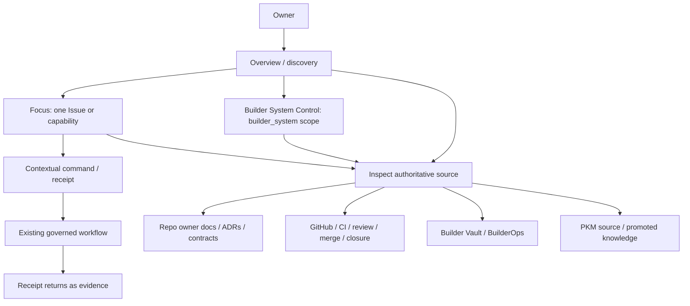

State: Proposed target-state discovery/control-plane architecture (2026-08-17). It is not a shipped UI, route, portal, or source-of-truth claim.
Doc role: Architecture design record
Authority: Owns the cross-plane DevUI discovery boundary: index/projection/navigation to authoritative sources, honest artifact standing, and promotion-route handoff. `docs/DEVUI.md` remains the owner of the complete owner-facing experience; BSC/FCP/Stage-A docs own their capability contracts.
Owner: Builder System / CES boundary
Temporal class: strategic target-state
Source of truth: This document owns discovery architecture; source documents and live GitHub/BuilderOps/runtime contracts retain authority for the claims they own.
Last reviewed: 2026-08-17

# DevUI Discovery Architecture

## Decision

**DevUI is a discovery and control plane, not a separate documentation portal.**

DevUI helps the owner find, understand, compare, and navigate to the right source. It may compose
read-only projections and provide governed navigation to an existing action or promotion workflow.
It does not become a second place where normative documentation, task truth, Builder Vault research,
or delivery authority is authored and maintained.

The distinction is operational:

```text
authoritative sources
  ├─ repo owner docs / ADRs / contracts / code / tests
  ├─ GitHub Issues, PRs, CI, review, merge, closure
  ├─ BuilderOps records and receipts
  └─ source artifacts and governed PKM knowledge
        │ read, classify, project, preserve provenance
        ▼
DevUI discovery/control plane
        │ typed navigation / existing governed route
        ▼
owner source or governed workflow
```

DevUI can show a summary, but the summary must always say what it is, which source owns the claim,
how fresh the read is, what it omits, and where the owner can inspect the source.

## Relationship to the accepted devUI contract

`docs/DEVUI.md` owns the single owner-facing umbrella and its see → decide → act → verify flow.
This document narrows one architectural question that must stay explicit inside that umbrella:

- Overview, Focus, Command/Receipt, and Builder System Control remain the existing devUI roots;
- discovery is a cross-cutting read/navigation responsibility, not a fifth root or a documentation
  product;
- Builder System Control remains the separate `builder_system` scope, not a Focus tab; and
- #4982 owns the broader unified Builder UI/UX handoff and must consume this boundary rather than
  create a competing docs surface.

The existing `devUI.composition.v1`, Overview, Focus, Conversation Port, SoI Evidence View, and BSC
contracts remain the implementation-specific owners. This document does not restate their DTOs.

## Source classes and discovery treatment

| Source class | Discovery treatment | DevUI authority |
| --- | --- | --- |
| Normative repo source | Show title/role/owner, exact path/version, current/target posture, and direct navigation. | Never replace the source; repository owner remains authority. |
| Builder Vault working artifact | Label `non-normative`, `ephemeral`/`rebuildable`, source refs, and lifecycle stage; link to the working artifact and any proposal. | No authority upgrade from indexing or display. |
| BuilderOps record or receipt | Show record type, lifecycle, source refs, watermark, and the bounded operational claim. | BuilderOps authority remains limited to its recorded Builder System scope. |
| GitHub Issue/PR/CI/review/merge | Show live lifecycle/evidence state only where the source owns it; preserve exact refs and head SHA. | GitHub/delivery workflow remains authority for task and delivery state. |
| PKM source or promoted knowledge | Show source role, derivation, review/promotion state, and citations. | Existing Mimer/HKA/MEM/GOV contracts remain authority. |
| Generated projection or mirror | Mark `projection`, show generation time/watermark and source refs, and expose limitations. | Projection is never an authority upgrade. |

An unavailable, unread, stale, refused, unlinked, or ambiguous source withdraws only the claim it
would support. DevUI must not render missing as empty, healthy, complete, normative, or ready.

## Information architecture



Navigation is typed and source-bound. A link from a Builder Vault draft to an accepted owner doc
means “inspect the related source” or “view the proposed target”; it does not join their identities
or inherit the target's authority. A link from a Focus subject to a BuilderOps observation requires
the existing explicit correlation contract; names, timestamps, branch names, or session similarity
are not enough.

## Minimum discovery envelope

Every material discovery item should expose or resolve these fields through its owning contract:

```yaml
discovery_item:
  source_ref: "exact repo/GitHub/BuilderOps/vault reference"
  source_role: "owner | evidence | working | projection | receipt"
  authority_class: "normative | non-normative | operational | projection | receipt | unknown"
  artifact_class: "source | derived | proposal | implementation | mirror | unknown"
  lifecycle:
    stage: "capture | explore | synthesize | propose | promote | implement | verify | supersede_retire | unknown"
    state: "draft | active | accepted | superseded | retired | unknown"
  provenance:
    source_refs: []
    derived_from: []
    review_or_promotion_ref: null
    receipt_refs: []
  freshness:
    observed_at: "RFC3339"
    watermark: null
    state: "fresh | stale | unknown | unavailable | unread | refused"
  limitations: []
  navigation:
    inspect_ref: null
    governed_route_ref: null
```

This is a conceptual discovery envelope, not a new shared schema. Existing `SourceState.v1`, BSC
views, Focus views, and source-specific contracts own their concrete shapes. A composer may normalize
readback but may not invent missing ownership, lifecycle, promotion, correlation, or freshness.

## Builder Vault presentation rules

Builder Vault is useful because it holds the material that should not pollute normative docs:

- research and source comparisons;
- agent drafts and intermediate syntheses;
- design explorations and handoff preparation;
- ephemeral reports, working notes, and discarded alternatives; and
- promotion proposals awaiting a governed target.

DevUI may index these artifacts for discovery, but it must visibly label them as non-normative and
show their lifecycle/provenance. A Builder Vault artifact may link to a GitHub Issue or proposal;
the link is not a promotion receipt. A document that is copied into Git remains non-normative until
its declared owner and review path say otherwise.

## Promotion and command boundary

DevUI supports the following read/navigation pattern:

1. show a working artifact and its sources;
2. show what target surface it proposes and what is still unknown;
3. navigate to the existing `PromotionIntent`, docs-authoring, Issue, ADR, or PR path; and
4. return the resulting receipt or live lifecycle state as derived evidence.

DevUI does not directly promote, create normative content, approve a proposal, mutate a task, or
choose a target owner. A command region may be implemented only behind the existing authenticated
workflow/action boundary and exact proposal/receipt contracts owned by the relevant system.

## Anti-portal rules

The following are architecture violations:

- storing the canonical copy of an ADR, contract, or accepted knowledge only inside DevUI;
- editing a DevUI summary and treating it as a source update;
- allowing a generated projection to acquire authority because it is easier to find;
- hiding Builder Vault uncertainty, source refs, or supersession history behind a polished card;
- inferring promotion from Git storage, merge state, display, or a model/provider result; or
- adding a DevUI-local task, queue, session, graph, policy, or source registry to make discovery
  convenient.

## Current versus target

Current repo truth already supports read-only/devUI projection seams, a separate BSC specification,
BuilderOps promotion proposal/receipt mechanics, and strong PKM artifact/provenance contracts. It
does not yet prove a complete discovery shell, Builder Vault discovery surface, or end-to-end
promotion navigation in one owner experience. This document therefore authorizes no UI, route, data
pipeline, or runtime implementation.

Further DevUI implementation depending on this boundary is gated on acceptance of the three-artifact
Information Authority & Artifact Lifecycle review. Existing Issues remain governed by their live
contracts; this gate does not rewrite or silently unblock them.

## Implementation gaps and issue reconciliation

- The unified owner-facing architecture and UX handoff remain in #4982; this document is a boundary
  input, not a duplicate child issue.
- Process-health semantics remain in #4980 and are not part of discovery authority.
- Source-lineage/evidence-independence remains in #4906 and is a Product/Runtime semantic track,
  not a DevUI source registry.
- The remaining discovery implementation gap is a bounded, read-only projection over existing
  authoritative sources with explicit artifact standing and navigation. It is recorded in blocked
  #4985 and must remain blocked until this review is accepted and reconciled with #4982.

## Related documents

- [`INFORMATION_AUTHORITY_MODEL.md`](./INFORMATION_AUTHORITY_MODEL.md)
- [`ARTIFACT_CLASSIFICATION_AND_LIFECYCLE.md`](./ARTIFACT_CLASSIFICATION_AND_LIFECYCLE.md)
- [`docs/DEVUI.md`](../DEVUI.md)
- [`docs/DEVUI_BUILDER_SYSTEM_CONTROL/README.md`](../DEVUI_BUILDER_SYSTEM_CONTROL/README.md)
- [`docs/adr/ADR-0010-builderops-vault-authority-boundary.md`](../adr/ADR-0010-builderops-vault-authority-boundary.md)
- [`docs/builderops/BUILDEROPS_PROMOTION_GATEWAY.md`](../builderops/BUILDEROPS_PROMOTION_GATEWAY.md)
- [`docs/CONCEPTS/ARTIFACT_PROJECTION_AND_SOURCE_CONTRACT.md`](../CONCEPTS/ARTIFACT_PROJECTION_AND_SOURCE_CONTRACT.md)
- [`docs/audits/INFORMATION_AUTHORITY_ARTIFACT_LIFECYCLE_REVIEW_2026-08-17.md`](../audits/INFORMATION_AUTHORITY_ARTIFACT_LIFECYCLE_REVIEW_2026-08-17.md)
