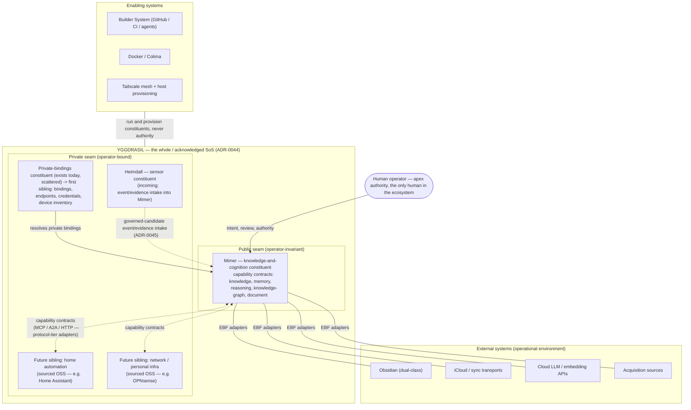

State: Advisory research artifact (RESEARCH-08, #2852; 2026-07-04), naming/model reconciled to ADR-0044 (2026-07-05, #2890). Subordinate to `docs/DOCS_INDEX.md` and owner contracts. This document **is** the companion thread that `docs/audits/YGGDRASIL_SYSTEM_BOUNDARY_INCOSE_2026-07-03.md:151`, `docs/architecture/system-context-overlay.md:86` and the `docs/SYSTEM_CONTEXT_OVERLAY/` specs name as `FABLE5_PROMPT_INFRA_DOMAIN_AND_MCP_TOPOLOGY.md` (named-but-unwritten until now; re-pointing those references is follow-up work). No reshape is enacted here; every reshape-class claim is a routed proposal (see SBS reconciliation).
Doc role: Reference (advisory research artifact)
Authority: Evidence-based design of the ecosystem/SoS seam, read through the ratified naming model. Anchors reflect `origin/main` at 67f5c27f (2026-07-04). Where this artifact and an owner doc disagree, the owner doc wins; divergences are listed, not silently resolved. Method: architecture-research pass — four parallel read-only evidence explorers, central synthesis, five independent adversarial skeptics on every reshape-class or load-bearing claim (verdicts folded in; no claim survived unmodified).

> **Naming/model reconciliation (2026-07-05, #2890).** This artifact originally used a superseded
> naming/model — a "Personal Agentic Ecosystem" parent with **Yggdrasil as a constituent**, and the
> word "federation" for the inter-constituent relationship. The prose below is now reconciled to the
> ratified model, **ADR-0044** (ecosystem structure + naming ratification, from the Fable-5 structure
> pass `docs/architecture/ECOSYSTEM_STRUCTURE_PROPOSAL.md`, PR #2914) and its siblings ADR-0045/46/47:
> the acknowledged SoS is named **Yggdrasil** (the whole / apex, not a constituent); its constituents
> are **Mimer** (knowledge-and-cognition, undivided — the current system, reverted to its original
> name), **Heimdall** (sensor), and a thin **private-bindings** constituent; **Hugin/Munin are
> reserved, not constituents** (the Munin/Hugin split of an earlier ADR-0043 draft was found
> structurally unsound and dropped). "Federation" is reserved for SFC and is **not** used for the SoS
> relationship — the relationship is acknowledged constituents interoperating via capability
> contracts. The seam and interaction *substance* (public/private invariant INV-EF1, tier
> classification, governed event/candidate intake) is unchanged by this reconciliation; only naming
> and whole-vs-constituent framing were rewritten. Owner decisions D1–D3 were ratified as designed
> (ADR-0044/45/46); D4 was deferred, not adopted (ADR-0047) — see § Owner decisions.

# Ecosystem Federation — Yggdrasil (the Whole) and the Public/Private Seam

*(Title retained for filename/artifact continuity; "federation" in the title names this document's
subject matter, not the SoS relationship — see the vocabulary guard immediately below.)*

The acknowledged System of Systems is **Yggdrasil**, the whole / apex (ADR-0044): the personal
agentic ecosystem, realized as acknowledged constituents interoperating via capability contracts,
split along a **confidentiality seam** because **Mimer** — the knowledge-and-cognition constituent —
is developed in a public repository. This artifact designs that model. It decided nothing an owner
contract owns until ratified: the SoI promotion, the seam invariant's adoption, and the SFC-seam
governance were explicit owner decisions (§ Owner decisions, now resolved — D1–D3 ratified, D4
deferred), routed per the binding SBS-reconciliation rule.

Two vocabulary guards up front, load-bearing for the whole document:

- **"System of Systems" applies only at ecosystem level.** ADR-0041 and ADR-0042 (both accepted
  2026-07-04, both enacted 2026-07-04 via #2855/#2856, closed) remove SoS vocabulary from Mimer's
  *internal* decomposition
  (`docs/adr/ADR-0041-system-of-systems-doc-rename.md:39-63`,
  `docs/adr/ADR-0042-design-principles-9-volatility-isolation.md:41-61`). The former
  `docs/SYSTEM_OF_SYSTEMS_ARCHITECTURE.md` is now `docs/MODULAR_ARCHITECTURE.md`, and
  `docs/DESIGN_PRINCIPLES.md` §9 is now "Volatility Isolation" — this artifact cites the current
  filenames and heading. Nothing in this document reads Mimer's
  8-spine or 14-boundary decomposition as an SoS; the audit settled that as a category error
  (`docs/audits/YGGDRASIL_SYSTEM_BOUNDARY_INCOSE_2026-07-03.md:154-196`). SoS language below always
  means the ecosystem: the operator's assembled environment, apex **Yggdrasil**
  (`docs/ARCHITECTURE.md:239` "small system-of-systems arrangement"; glossary entry
  `docs/GLOSSARY.md`).
- **"Federation" here is not SFC's federation, and is not the SoS relationship's name.** SFC
  (Synchronization, Federation & Consensus) owns *intra-Mimer* distribution — replicas, nodes,
  causal ordering (`docs/SYSTEM_BREAKDOWN_STRUCTURE.md:1077-1132`; ADR-0020;
  `docs/contracts/REPLICATION_ENVELOPE.md`). The **inter-constituent SoS relationship** — Yggdrasil's
  constituents interoperating — is a different thing, and per ADR-0044/45 it is deliberately **not**
  called "federation" either; it is **acknowledged constituents interoperating via capability
  contracts**. The seam between SFC's sense and the SoS relationship is real and governed — not a
  footnote; see § Dual-role + MCP (interaction tiers) and owner decision D2 (ratified, ADR-0045).

## Ecosystem model

### The SoS reading, taken at the only level where it is defensible

The INCOSE audit found exactly one defensible SoS reading, *outside* Mimer's own SoI: the
operator's assembled environment — "independently operated, independently useful constituents
jointly delivering an emergent capability," a collaborative/virtual SoS whose adoption "is an SoI
boundary *choice*, not an error"
(`docs/audits/YGGDRASIL_SYSTEM_BOUNDARY_INCOSE_2026-07-03.md:167-172`). It also named "future home
automation / EXE targets" as "the genuine future SoS candidate"
(`docs/audits/YGGDRASIL_SYSTEM_BOUNDARY_INCOSE_2026-07-03.md:195`). ADR-0044 ratifies that reading
as **Yggdrasil**, the acknowledged SoS apex, and gives the future candidate a designed home.

Taxonomically: today's environment reading is **collaborative** (vendor externals, no joint
management). The ecosystem, **Yggdrasil**, is an **acknowledged SoS with a single human apex
authority** — the operator designates purpose, contracts, and integration, while constituents keep
independent development lifecycles (OSS upstreams evolve on their own schedules). It is not a
directed SoS in the strict sense (the operator does not manage Obsidian's or an OSS sibling's
development) and it is emphatically not multi-user: one ecosystem, one human. Constituent count
grows; human count does not. Adoption/multi-tenant reasoning is out of scope by issue constraint.

### Bridge and target — how the framing was adopted without racing reality

Adversarial review of the SoI promotion (skeptic S1, downgraded) established three facts this
model had to respect, and which ADR-0044's ratification honors:

- the repo contains **zero** references to any concrete sibling system — Home Assistant and
  OPNsense appear nowhere in docs or code; the ecosystem has exactly one real operator-built
  constituent today (**Mimer**), with **Heimdall** (the sensor constituent) incoming;
- the owner paid 27-doc churn *the same day* to remove SoS vocabulary internally
  (ADR-0041/0042) — reintroducing it carelessly would recreate the ambiguity that churn bought
  down;
- no near-term engineering decision changes under an ecosystem-primary framing while only one
  knowledge-and-cognition constituent exists.

The repo already owns the pattern that resolved this: **bridge and target**. The 8-subsystem spine
is the bridge; the 14-boundary SBS is the 2030 target
(`docs/SYSTEM_BREAKDOWN_STRUCTURE.md:2105`), both internal to Mimer. The same dual structure
applies one level up, at ecosystem scope:

- **Current-state SoI: Mimer** — unchanged internally, exactly as
  `docs/architecture/system-context-overlay.md` defines the knowledge-and-cognition system (14
  control boundaries, CES, correctness kernel, KAP). Every current-state doc keeps saying so.
- **Ecosystem-level SoS: Yggdrasil** — the apex/whole this artifact designs the seam for, ratified
  by ADR-0044 rather than left as a target-only framing: Yggdrasil is already the name of the
  acknowledged SoS today, with **Mimer** as its present sole real constituent and **Heimdall** +
  **private-bindings** attaching next. The activation condition that mattered while the naming was
  still open — the first real sibling attaching through a capability contract — has been overtaken
  by the naming ratification; it remains relevant only for *when the multi-constituent ecosystem
  becomes operationally significant*, not for whether the apex is named Yggdrasil.

Owner decision **D1** (ratify the ecosystem SoS) is **resolved**: ADR-0044 ratified it, with the
refinement that Yggdrasil denotes the apex now, not a target-only frame (see § Owner decisions).

### Constituents, external systems, enabling systems (lifecycle-role classification)

This table extends the settled four-class rule
(`docs/architecture/system-context-overlay.md:68-75`; transcribed into
`docs/ARCHITECTURE.md:126-140`) upward by one level. The classification rule is unchanged: the
port/adapter is always a SoI element; the attached thing's classification follows its lifecycle
role, attached to the *deployment binding*, not the product name.

| Ecosystem role | Test | Members today | Members at target |
| --- | --- | --- | --- |
| **Constituent** | Independently operable + independently sourced/maintained + jointly purposed via contract, under the operator's apex authority | **Mimer** (the public knowledge-and-cognition system: `app/`, `mimer_runtime/`, contracts, schemas — the SoI of `docs/architecture/system-context-overlay.md`); **Heimdall** (sensor constituent, incoming) | Mimer + Heimdall + **private personal-environment siblings**: home automation, network, personal infra/data systems — sourced by the TCD heuristic (§ TCD heuristic), attached via capability contracts |
| **Proto-constituent (exists, unnamed)** | Operator-bound state the ecosystem cannot run without, currently scattered and unsystematized | The **private binding surface**: gitignored `.env*` files, host launchd jobs and `ops/host-setup` realities, the BuilderOps Vault, operator memory | Systematized as the **first private sibling** — the private-bindings constituent (ADR-0044) that resolves every personal binding the public tree may not carry (§ Public/private invariant) |
| **External system** (operational environment) | Vendor-operated; the ecosystem interoperates via contracts; no operator lifecycle control | Obsidian (dual-class by design), iCloud/sync transports, cloud LLM/embedding APIs (incl. Gemini fallback, ADR-0023), acquisition sources, telemetry consumers (`docs/architecture/system-context-overlay.md:72`) | Same set; membership churns with vendor choices |
| **Enabling system** | Supports constituent lifecycles; not part of operating capability | Builder System incl. GitHub/CI, Docker/Colima, Tailscale mesh + host provisioning, ops scripts (`docs/architecture/system-context-overlay.md:71`) | Same classes. Tailscale gains a second *relation* at target (transport between constituents) — it stays enabling/transport, never authority |
| **COTS element** (deployed configuration) | Provisioned and supervised by a constituent's own deployment | Postgres/pgvector; Ollama-as-compose-service (`docs/architecture/system-context-overlay.md:70`) | Per-constituent; each sibling supervises its own COTS elements |

What this table deliberately does **not** contain: Mimer's internal boundaries as constituents.
The issue directive's mention of "agent runtime/orchestration" and "integration fabric" is read as
**capability-domain labels for the contract boundary** (§ Capability boundary), not as constituent
candidates — the audit's constituent-independence test marks all internal boundaries "Subsystems,
not constituents" (`docs/audits/YGGDRASIL_SYSTEM_BOUNDARY_INCOSE_2026-07-03.md:190`); this is also
why an earlier draft's attempt to split Mimer into two constituents (Munin/Hugin, per a superseded
ADR-0043 proposal) failed the same independence test and was dropped by ADR-0044. The genuine
future constituents are the *external* systems EXE will coordinate, not EXE itself (`:195`).
Future physical separation of any SBS boundary stays owned by the existing machinery — ADR-0016's
evidence-driven-split criteria and `docs/architecture/SBS_ROADMAP.md` Phase 4 ("Execution and
federation seams") / Phase 5 ("Opportunistic physical separation") — cited here, not renamed
(skeptic S2 verdict honored: no new seam vocabulary).

### Context/constituent diagram

Dashed edges are target-state or not-yet-attached (Heimdall is incoming; the OSS siblings do not
exist today). Solid edges exist now. Every edge into Mimer crosses an EBF-tier adapter under the
Integration Fabric authority rule; no edge carries semantic authority without contract promotion
(§ Capability boundary).

## Capability boundary

### The boundary is the contract set, not any protocol

The stable boundary between Mimer and everything else — sibling constituents, external hosts,
external systems — is the **capability-contract surface**: capabilities as defined by
`docs/CAPABILITY_CONTRACT_MODEL.md:23-30` (reusable, surface-independent, explicitly typed,
authority-classified), attached through the Integration Fabric's class taxonomy
(`docs/INTEGRATION_FABRIC_CONTRACT.md:38-48`) and governed by its authority rule
(`docs/INTEGRATION_FABRIC_CONTRACT.md:90-96` — "the load-bearing line of this document").

Five properties make the boundary stable:

1. **Protocol-agnostic.** Contracts state capability semantics; protocols are adapters. MCP is one
   adapter among several and sits at the protocol tier "and only here"
   (`docs/audits/YGGDRASIL_SYSTEM_BOUNDARY_INCOSE_2026-07-03.md:339-342`; ADR-0036 Decision,
   `docs/adr/ADR-0036-standards-are-adapters-not-the-ontology.md:21-25`; doctrine commitment §2.7,
   `docs/foundation/00-yggdrasil-doctrine.md:65-67`). A2A is a sibling adapter with its own
   contract (`docs/contracts/A2A_CONTRACT_AND_TRACE.md`); the HTTP API is the third live adapter
   surface. REST/GraphQL/gRPC variants, if ever adopted, join at the same tier — the Integration
   Fabric Contract names no protocol as architecture (verified: no REST/GraphQL/gRPC hits in
   `docs/INTEGRATION_FABRIC_CONTRACT.md`).
2. **Authority-preserving.** No consumer — sibling constituent, host, or vendor — becomes semantic
   authority over the durable surface without explicit contract promotion; a code change, a new
   adapter, or a new vendor relationship is not a promotion (`docs/INTEGRATION_FABRIC_CONTRACT.md:92-94`).
   At ecosystem level this generalizes cleanly: **siblings hold domain authority in their own
   domains** (a home-automation sibling owns device state; Heimdall owns the fact stream); **Mimer
   holds knowledge/reasoning authority**; the human is apex authority everywhere in Yggdrasil.
   Cross-constituent influence travels as evidence/candidates through contracts, never as direct
   authority (ADR-0045).
3. **Legibly degrading.** "An integration that fails or is unavailable must degrade legibly"
   (`docs/INTEGRATION_FABRIC_CONTRACT.md:95`) — the constraint the current MCP multiplex seam
   strains (§ Dual-role + MCP).
4. **Operator-invariant on the public side.** The public contract carries roles and placeholders,
   never personal bindings; concrete endpoints/credentials resolve on the private side
   (§ Public/private invariant).
5. **Versioned by contract, not code.** The eleven-class taxonomy self-extends by its own revisit
   rule (demonstrated once: acquisition source, 2026-07-02,
   `docs/INTEGRATION_FABRIC_CONTRACT.md:48`). If a future sibling fits no existing class, the
   taxonomy revisit fires; today, sibling attachment lands in class 7 (Tool/MCP provider,
   `docs/INTEGRATION_FABRIC_CONTRACT.md:44`) or class 10 (Agent runtime, `:47`).

### The five capability surfaces (a grouping view, not a new taxonomy)

The issue names five surfaces. They exist in the repo not as a literal enumeration but as a
grouping over the canonical capability list (`docs/CAPABILITY_CONTRACT_MODEL.md:60-72`), the
capability classes (`:122-123`), and the SBS contract set
(`docs/SYSTEM_BREAKDOWN_STRUCTURE.md:1514`). This table is a **view**; the underlying enumerations
stay authoritative:

| Surface | Existing capabilities / contracts grouped under it | Maturity |
| --- | --- | --- |
| **Knowledge** | Retrieval, Orientation, Resurfacing, Archive exposure (`docs/CAPABILITY_CONTRACT_MODEL.md:60-72`); RCA context assembly | Live (retrieval) to partial |
| **Memory** | Memory candidate extraction (`:60-72`); `MemoryRecord` contract (`docs/SYSTEM_BREAKDOWN_STRUCTURE.md:1514`); MEM promotion path | Partial; #2314 owns the retrieval/memory substrate work |
| **Reasoning** | Context building, Citation checking, ASK synthesis (`docs/CAPABILITY_CONTRACT_MODEL.md:60-72`; `capability_class: synthesis_review`, `:122-123`) | Live (ASK) to partial |
| **Knowledge-graph** | SIP-owned identity/provenance and link structure (`docs/architecture/functional-ontology.md`; SIP charter) | Thinnest surface; target-state — named honestly as such |
| **Document** | Note patch proposal (`docs/CAPABILITY_CONTRACT_MODEL.md:60-72`), companion-note surface, governed vault writes (`mcp.vault.append_note` under tool policy) | Live |

Consumers see these surfaces only through EBF-tier adapters; which internal SBS boundary
implements a surface (RCA vs MEM vs CAO) is invisible at the boundary — that is what makes the
"agent runtime / integration fabric" items in the directive contract-boundary labels rather than
constituent claims.

## Public/private invariant

### Why the naive rule fails

Adversarial review (skeptic S4, refuted-and-redesigned) established the empirical ground truth:

- **Zero secrets** anywhere in the public tree — no API-key shapes, no IPs, no personal emails
  (verified sweep).
- **~307 personal-identifier hits across 11 spelling variants** (vault proper names
  Niflheim/Bifröst/Midgård and casing/diacritic forms; personal host "Demerzel"; "Mac mini";
  `/Users/rasmus*` paths — e.g. `scripts/builderops_cli.sh:67`,
  `app/release_channels/prod_ref_fitness.py:217`).
- Some of those tokens are **load-bearing by function**: the prod vault guard is a fail-loud
  safety gate keyed to the vault label (`scripts/lib/companion_ui_startup.sh:159-166`,
  `scripts/prod/prod_ui_doctor.sh:20-22`); tests pin personal strings
  (`tests/capture/test_capture_writer_layout.py:51`,
  `tests/builderops/test_builderops_cli_automation.py:333`); the dispatcher doc must name the
  shared coordination host so agent machines can find it across devices
  (`docs/AGENT_ISSUE_DISPATCHER.md:244-310`).
- **No rule exists today.** No doc states the repository is public; no trust-boundary row covers
  source-repo *content* exposure (the environment/exposure row,
  `docs/SECURITY_TRUST_BOUNDARIES.md:37`, governs network reachability only); `docs/PRIVACY.md`
  scopes to runtime data flows (`docs/PRIVACY.md:4,26`) and is silent on repo content; no
  enforcement mechanism scans for any of this (no gitleaks/detect-secrets anywhere;
  `scripts/docs_guard.py:8` diffs file *paths*, not content; `architecture-ci.yaml:4-5` is
  `workflow_dispatch`-only).

A blanket "no personal names in the public tree" law would therefore be either aspirational (never
enforced) or destructive (breaking fail-loud guards, tests, and cross-device builder
reproducibility). The issue demands a decidable rule with real enforcement — so the rule must be
scoped by lifecycle role.

### The invariant (adopted — owner decision D3, ratified by ADR-0046)

> **INV-EF1 (two-scope operator-invariance).** *(Adopted — owner decision D3, ratified 2026-07-04
> by ADR-0046. Quote this box only together with this marker.)*
> **(a) Product scope — strict.** Artifacts of the Mimer product surface (`app/`,
> `mimer_runtime/`, `schemas/`, product contracts and architecture docs) must be
> **operator-invariant**: substituting another operator's personal environment leaves them
> byte-identical. Concretely: no tokens from the personal-binding categories — (i) secrets and
> credentials, (ii) personal identity (usernames, personal paths, emails), (iii) personal
> infrastructure identity (machine names, mesh hostnames, IPs), (iv) personal data-space identity
> (vault proper names, personal iCloud paths), (v) personal-environment inventories (device
> registries, home/network topology). Personal bindings resolve at deploy time from the private
> side (env/config), with public code speaking in roles (`dev`/`test`/`prod` channel, `VAULT_ROOT`).
> **(b) Builder/ops scope — secret-free + registered.** Enabling-system surfaces (builder docs,
> runbooks, `ops/host-setup`, dispatcher docs, their pinning tests) may carry categories (ii)–(v)
> **only** with a per-item row in an owned register naming the artifact, the token category, why it
> is load-bearing, and its migration disposition (stay / migrate-to-private-sibling / parameterize).
> Category (i) — secrets — is absolute in both scopes. A new personal token without a register row
> is a violation in either scope.

The rule is decidable: any artifact classifies deterministically by scope membership (path-based)
plus token-category inspection; ambiguity lands in the register as an explicit row, not in silence.
The register follows the `docs/architecture/SBS_TRANSITION_DEBT.md` per-item discipline (owned
rows, dispositions, issue links) rather than a blanket ratchet baseline — with the honest caveat
that even that discipline shows rot risk (several debt rows have sat open across cycles), which is
why the register check below is mechanical, not manual.

### Enforcement hook (proposed; real, not aspirational)

- **New check, right shape:** `scripts/public_seam_lint.py` (new; `docs_guard.py`'s path-only diff
  model cannot see content). Two modes:
  - **GATE mode (PR diff):** (1) secret-shape scan — hard-fails on any hit; the tree is clean
    today, so this is enforceable and green from day one. (2) personal-identifier scan of changed
    files against a small maintained pattern file (regex with diacritic folding — the repo's own
    native idiom, cf. `midg(å|a)rd` in `scripts/prod/prod_ui_doctor.sh:21`; hashed lexicons fail
    on normalization variance and are not proposed) — a hit in a file without a covering register
    row fails; a hit covered by a row passes.
  - **DOCTOR mode (full tree, manual/scheduled):** reconciles the register — rows without hits
    (stale), hits without rows (drift), migration-disposition progress.
- **Wiring that actually gates:** the GATE mode joins an existing `pull_request`-triggered
  workflow (e.g. the ci-smoke workflow; `architecture-ci.yaml` is `workflow_dispatch`-only and
  cannot gate PRs as-is) and optionally `.pre-commit-config.yaml`. Consistent with the repo's
  settled merge-gate posture, the gate binds through the agent delivery chain, not through branch
  protection (`docs/architecture/SBS_OPERATING_MODEL.md:383` — an unprotected `main` does not
  waive the gate; that convention is cited here, not proposed by D3).
- **Invariant registry:** INV-EF1 extends `docs/testing/invariant-tests.md` semantics —
  GATE (secret scan; new-token-without-row) + DOCTOR (register reconciliation). No competing
  registry.
- **Burn-down = the first-sibling move.** Migration rows converge on the same target: vault-label
  guards read labels from private channel config; `/Users/rasmus*` parameterizes; host/dispatcher
  operational docs migrate to the private bindings sibling when it exists. The seam's burn-down and
  the ecosystem's first constituent are one motion, sequenced as follow-up implementation issues
  (they touch runtime guards — not docs-lane work).
- **Owner-doc companions (follow-up issues, not this PR):** a source-repo-content row in
  `docs/SECURITY_TRUST_BOUNDARIES.md`; a repo-visibility + seam paragraph in `docs/PRIVACY.md`
  (which currently defers exposure mechanics to a hypothetical cloud deploy, `docs/PRIVACY.md:26`,
  and predates this seam).

## TCD heuristic

`AGENTS.md :: Total Cost of Development` chooses capability per accepted delivery — model,
reasoning, workflow. This heuristic extends the same decision rule from *who builds* to **where a
capability lives**: build-in-Mimer vs source/build-as-sibling. Same objective — minimize
expected total build+maintain cost per accepted capability over its lifetime, human time dominant:

`place the capability where  C_build + C_maintain + C_integrate + C_coordination + C_defect  is lowest across its lifetime`

Decision procedure (apply in order; first decisive answer wins):

1. **Authority test.** Does the capability require semantic authority over the vault/durable human
   surface, or live inside the human-authority kernel (governance, provenance, receipts)? →
   **Build in Mimer.** Authority is non-delegable across the boundary
   (`docs/INTEGRATION_FABRIC_CONTRACT.md:90-96`); externalizing it is a kernel change, not a
   sourcing decision.
2. **Seam test.** Does the capability require personal-environment bindings as its *substance*
   (device inventories, home topology, network config — INV-EF1 categories (iii)–(v) as content,
   not just configuration)? → **It cannot live in the public tree regardless of cost.** Source or
   build it as a **private sibling**; expose it to Mimer via capability contract.
3. **Sourcing test.** Does a mature, externally-maintained system cover the domain's core (the
   directive's examples: Home Assistant for home automation, OPNsense for network)? → **Source as
   sibling.** The upstream absorbs domain volatility (device/protocol churn) — that is
   C_maintain externalized, usually the dominant term for personal-infrastructure domains. Build
   only the contract adapter.
4. **Marginal-cost comparison (residual case).** Compare `C_build + C_maintain` in-tree against
   `C_source + C_integrate + C_coordination` as sibling. Two repo-derived tiebreakers:
   - **Cognition-differentiating capabilities default in-tree** — knowledge, memory, reasoning,
     graph, document surfaces are Mimer's identity; splitting them creates coordination
     cost with no volatility gain (worked precedent: the Knowledge Acquisition Platform spec
     stayed platform-in-Mimer with the pipeline ending at candidate).
   - **Do not split across a seam that invariants must cross.** If an invariant (authority chain,
     provenance, write-guard) would have to hold on both sides of the contract, the split raises
     C_coordination and C_defect beyond any build saving — the cross-cutting-mechanism lesson.
     A good seam is one where the contract is *narrower* than the shared invariants.

Worked classification of the directive's examples: home automation → sibling by tests 2+3;
network/personal infra → sibling by tests 2+3; knowledge acquisition → in-tree by test 4a
(precedent above); TTS → in-tree embedded libraries (already settled: SoI components,
`docs/architecture/system-context-overlay.md:69`); the private bindings surface → sibling by test
2 (it *is* the seam's other side); Heimdall (sensing) → sibling constituent by design (ADR-0044),
not scored by this heuristic since its constituent status is already decided.

This heuristic is advisory until adopted; if adopted, its home is a short addition to the TCD
policy surface (builder-governance follow-up), with this section as the derivation.

## Dual-role + MCP

### The dual-role hazard, separated into its three actual questions

The audit named the hazard and deferred the stance here: the same infrastructure is an enabling
system (runs Mimer's SoI) *and* a domain of interest Mimer observes/actuates; EXE/OEF develop a
self-reference at their charter attachment points (`docs/boundaries/EXE.md:21-24`,
`docs/boundaries/OEF.md:22-24`;
`docs/audits/YGGDRASIL_SYSTEM_BOUNDARY_INCOSE_2026-07-03.md:144-152`). Adversarial review (skeptic
S5) forced precision: the hazard is three orthogonal questions, of which the seam answers one.

**1. Classification — answered, conform.** A thing's enabling-role and its domain-role are
*different relations*, recorded separately; classification attaches to the deployment binding, not
the product name. This is the already-settled Ollama rule
(`docs/architecture/system-context-overlay.md:74-75`) applied to the general case: Tailscale is an
enabling system *as substrate* and may simultaneously be an observed domain entity *as target* —
two relations, no contradiction. The "dual-listing" is the correct representation, not an error to
fix.

**2. Confidentiality — answered by the seam, extend.** How can a public repo hold capability over
a personal environment? By the capability-port/binding split: **generic actuation and observation
ports (EXE/OEF contracts, EBF adapters) are operator-invariant and stay public; every
substrate-specific binding — which host, which devices, which mesh — is INV-EF1 category
(iii)/(v) material and lives on the private side** (the bindings sibling). The public tree defines
*what kind of thing* can be observed/actuated and under which authority; the private side says
*which things exist here*. This answers the public/private half of Q3 exactly as the issue's
scope (e) requires.

**3. Reflexivity — named and bounded, not dissolved.** Moving names across the seam changes who
can read them, not the runtime fact that a process may observe or actuate its own hosting
substrate. Skeptic S5 additionally showed "which target is *self*" is **undecidable at binding
time** in the real topology (three-machine mesh, `ops/host-setup/README.md:7-14`; no self-marker
in `ops/host-setup/config.example.env`; `host.docker.internal` is an alias, not an identity). The
bounded stance, using only existing machinery plus one static proposal:

- **Actuation side (EXE):** no new guard class, no runtime self-detection. The existing
  target-agnostic chain — `ExecutionRequest` → GOV `PolicyDecision` → execute →
  `AuthorityReceipt`, with "execution cannot authorize itself" (`docs/boundaries/EXE.md`,
  `docs/boundaries/GOV.md:78`) — already governs substrate actuation like any actuation. Known
  runtime gaps in that chain are already owned debt (D2/D5/D6,
  `docs/architecture/SBS_TRANSITION_DEBT.md`), not new work this artifact creates. The one genuine
  addition is decidable at *authoring* time, not runtime: **an availability-impact declaration in
  the tool descriptor** — a tool whose semantics can affect the runtime's own stack (restart
  containers, reconfigure the mesh, unmount the vault volume) declares that statically in its
  descriptor, and tool policy can require elevated authorization for that declaration. Static,
  contract-level, no self-identity resolution needed. Routed as a proposal into the tool-policy
  contract (follow-up), not enacted.
- **Observation side (OEF):** self-observation is unavoidable on a single node and is a *legibility
  limit*, not a policy violation: **the monitor dies with the monitored** — OEF cannot report the
  failure of the substrate that hosts it. OEF's charter already forbids the control-loop failure
  mode (`docs/boundaries/OEF.md`); the residual epistemic limit is stated, not machinery'd away.
  Its real mitigation is an ecosystem capability: **independent observation of Mimer's
  substrate is exactly what only a separate constituent can provide** — a sibling (or even the
  existing prod-probe launchd pattern matured into one) watching from outside the failure domain.
  This is the first concrete capability case *for* the ecosystem's constituent interoperation*:
  observation independence is impossible inside Mimer's own SoI by construction.

### MCP topology stance

**Status: deferred, not ratified (ADR-0047, D4).** The four-rule stance below remains the leading
design candidate but carries no decision force until a concrete remote/sibling MCP server exists;
it is preserved here for when D4 is revisited (see § Owner decisions).

Current reality, stated honestly (all anchors verified against code): Mimer today is an MCP
**tool consumer only** — a local registry-backed ToolProvider
(`docs/contracts/TOOL_POLICY_AND_MCP_ADAPTER_CONTRACT.md:22-36`; registry
`docs/settings/tools/registry.yaml`) plus an *unimplemented* remote seam: `RemoteMCPProvider` is a
Protocol with zero production implementations (`app/orchestrator/mcp_tool_provider.py:14-27`; test
fakes only). No MCP server exists anywhere in `app/`. The Integration Fabric Contract's phrase
"remote MCP servers behind the flagged multiplex seam"
(`docs/INTEGRATION_FABRIC_CONTRACT.md:44`) is target-state language (divergence DV-3).

The deferred candidate stance (four rules, each conform/extend as tagged in § SBS reconciliation):

1. **MCP stays protocol-tier.** The SoS relationship does not promote MCP to architecture.
   Capability contracts are the boundary; MCP is one adapter (ADR-0036; doctrine §2.7;
   `docs/audits/YGGDRASIL_SYSTEM_BOUNDARY_INCOSE_2026-07-03.md:339-342`). *(Conform.)*
2. **Constituent-owned servers.** Each constituent owns and operates the MCP server(s) exposing
   *its own* capability contracts: Mimer's future MCP server, if built, exposes the five capability
   surfaces (§ Capability boundary); each sibling exposes its domain capabilities behind its own
   server. No shared ecosystem mega-server, no third-party-hosted registry of the operator's
   surfaces — server ownership follows capability ownership, exactly as adapter ownership follows
   the port today. *(Extend — design rule for a surface that does not exist yet.)*
3. **Registry split along the seam.** The registry *schema and admission policy* — descriptor
   format, tool policy, allowlist semantics — are public Mimer contracts (the existing
   `docs/settings/tools/registry.yaml` + descriptor pattern generalizes). The registry *contents*
   for remote/sibling servers — endpoints, credentials, host bindings — are INV-EF1 category
   (ii)/(iii) material: **private side, always.** Public tree: what may attach and on what terms;
   private side: what actually attaches here. *(Extend — proposed rule for a surface that does
   not exist yet; deferred, not ratified — D4/ADR-0047.)*
4. **Close the silent-fallback gap.** The remote-multiplex seam currently swallows remote failure
   silently (`except Exception: pass`, `app/orchestrator/mcp_tool_provider.py:41-43`;
   `docs/contracts/TOOL_POLICY_AND_MCP_ADAPTER_CONTRACT.md:229-243`), has **no admission
   allowlist** ("Enabling remote multiplex is currently the admission gate,"
   `docs/security/AGENT_TOOL_EXECUTION_SECURITY_ADDENDUM.md:31,62-68`), and its flag is an untyped
   dict key with no settings-schema declaration (divergence DV-4). Before any real remote/sibling
   server attaches, three fixes are proposed (routed as implementation follow-ups; the audit
   already flagged the debt, `docs/audits/YGGDRASIL_SYSTEM_BOUNDARY_INCOSE_2026-07-03.md:322-327`):
   (a) an explicit per-server **admission allowlist** (flag-as-gate is not admission);
   (b) **legible degradation** — remote failure surfaces as a health/receipt signal, preserving
   the existing deterministic route-reason codes but never silently merging or silently falling
   back; (c) the multiplex flag becomes a **typed settings field**. *(Extend; conforms to the
   audit's own debt recommendation.)*

### Interaction tiers — where the SoS relationship meets SFC and ADR-0020

**Status: ratified (ADR-0045, D2).** Skeptic S3 (downgraded) established that a blanket "no
ADR-0020 conflict" claim is false: SFC's charter textually owns "Federation," "Central/satellite
behavior," "Multi-device behavior" (`docs/SYSTEM_BREAKDOWN_STRUCTURE.md:1077-1132`), ADR-0020's
context names "multi-device, central/satellite, offline/online, and multi-write deployments"
(`docs/adr/ADR-0020-sfc-single-node-upgrade-path.md`), and master/satellite sync is a documented
near-term plan (`docs/plans/PROTOCOL_SATELLITE_SYNC.md`). The surviving, precise rule, ratified as
the **three-tier classification of constituent interaction**:

| Tier | Interaction shape | Governing machinery | ADR-0020 status |
| --- | --- | --- | --- |
| **0** | Stateless, read-only capability call: one constituent asks, another (e.g. Mimer) answers, no state retained on either side beyond the exchange | EBF adapter + tool policy + IFC authority rule | **No SFC involvement.** The no-conflict zone — conform |
| **1** | A constituent holds derived state of another's content (caches, mirrors, subscriptions) | EBF + explicit staleness/refresh contract; **must run ADR-0020's own validation obligation** ("classify delivery semantics, idempotency, replay/backfill, conflict envelope, transition posture," `docs/adr/ADR-0020-sfc-single-node-upgrade-path.md:31`) | SFC-adjacent; classification mandatory before build |
| **2** | A constituent writes toward another's durable surface, or multi-write topology | Full IFC promotion path + GOV + SFC semantics | Exactly the ground ADR-0020 reserves; **not licensed** by the SoS framing |

ADR-0045 additionally names a fourth, distinct shape outside this table: **inbound governed-candidate
event/evidence intake** — a constituent that *emits* data toward another (Heimdall's published-event
stream → Mimer) is not Tier 0/1/2; the producer publishes attributed, provenance-bearing events and
the consumer ingests them as candidates/evidence, promoting to durable knowledge only through its own
governed path (WriteGuard → DecisionToken → governed promotion → AuthorityReceipt).

The word-collision is resolved per this document's opening disambiguation and ADR-0044/45: "federation"
names only *SFC federation* (intra-Mimer replicas); the SoS relationship between constituents is
**acknowledged constituents interoperating via capability contracts**, never "federation" — see the
`docs/GLOSSARY.md` "System of Systems" entry. How the seam is governed long-term is owner decision
**D2**, now **resolved**: the interaction-tier rule above is adopted (ADR-0045); ADR-0020 and SFC's
charter are untouched. Additionally, exposing a constituent's capability surfaces to siblings over the
mesh is a *new network exposure shape* that the environment/exposure boundary's "explicit and
proportionate" gate (`docs/SECURITY_TRUST_BOUNDARIES.md:37`) must pass per-surface — an obligation
ADR-0045 carries forward rather than resolving generically.

## SBS reconciliation

Per the binding rule (precedent: `docs/architecture/runtime-semantics.md:50-53`), every structural
claim is classified against `docs/SYSTEM_BREAKDOWN_STRUCTURE.md` and `docs/architecture/SBS_*`.
**This mapping enacts nothing**; every reshape is a routed proposal through CES /
`docs/architecture/SBS_OPERATIONALIZATION_PLAN.md` / ADR + owner decision.

| # | Structural claim | Classification |
| --- | --- | --- |
| 1 | Ecosystem-level lifecycle-role table (constituent / proto-constituent / external / enabling / COTS, one level above the settled four-class rule) | **Extend** — new view; no boundary touched; classification rule unchanged |
| 2 | Mimer remains the current-state knowledge-and-cognition SoI, internally unchanged; every current-state doc keeps describing Mimer's internals as before | **Conform** |
| 3 | Yggdrasil as the ecosystem's acknowledged-SoS apex, with Mimer + Heimdall + private-bindings as its constituents | **Reshape — ratified** (D1, ADR-0044). Enacted as a naming/model decision; the `mimer_runtime/` code/doc rename was completed separately (#3011 + doc clusters) |
| 4 | No internal Mimer boundary is a constituent; "agent runtime / integration fabric" read as capability-domain labels; future physical separation stays with ADR-0016 + `SBS_ROADMAP.md` Phase 4/5 | **Conform** — restates audit §3 verdict and existing machinery; coins no vocabulary |
| 5 | Private binding surface named as proto-constituent / first-sibling target | **Extend** — names existing unowned reality; creating the sibling is follow-up work |
| 6 | Capability boundary = contract set; five-surface grouping view over existing enumerations | **Extend** — view only; `CAPABILITY_CONTRACT_MODEL.md` and IFC stay authoritative |
| 7 | MCP protocol-tier posture | **Conform** (ADR-0036; doctrine §2.7; audit §7) |
| 8 | Constituent-owned MCP servers; registry schema public / registry contents private | **Extend** — design rule for a not-yet-built surface; **deferred, not ratified** (D4, ADR-0047) |
| 9 | Remote-multiplex fixes: admission allowlist, legible degradation, typed flag | **Extend** — conforms to audit §6's debt recommendation; **deferred with D4** (ADR-0047); no follow-up issues filed until ratified |
| 10 | INV-EF1 two-scope public/private invariant + register + `public_seam_lint` hook | **Extend** — new fitness/invariant proposal (GATE+DOCTOR) extending `docs/testing/invariant-tests.md` semantics; **adopted** (D3, ADR-0046); owner-doc rows (PRIVACY, SECURITY_TRUST_BOUNDARIES) are follow-up issues |
| 11 | TCD placement heuristic | **Extend** — derives from `AGENTS.md :: TCD`; adoption into policy surface is builder-governance follow-up |
| 12 | Dual-role: per-relation classification | **Conform** — the settled binding-attached rule, generalized |
| 13 | Dual-role: reflexivity bounded by existing GOV chain; availability-impact descriptor field | **Extend** — one static descriptor-field proposal into the tool-policy contract; no new guard machinery; routed |
| 14 | Independent substrate observation as ecosystem capability | **Extend** — future capability case; creates no boundary |
| 15 | Interaction-tier rule (Tier 0/1/2) + governed-candidate intake shape at the constituent/SFC seam | Tier 0: **Conform**. Tiers 1–2 governance + intake shape: **Reshape — ratified** (D2, ADR-0045); ADR-0020 untouched |
| 16 | "Federation" = SFC only; SoS relationship named without "federation" + glossary entry | **Extend — enacted** (`docs/GLOSSARY.md`, this PR) |

No reshape beyond the ratified naming/model decisions (D1, D2) is enacted by this artifact.
D3 is adopted as a decision (enactment — the lint script, register, owner-doc rows — is separate
follow-up work); D4 remains deferred, not adopted.

## Owner decisions

Presented per the repo convention: Problem → Options → Consequences. This section is the
historical decision record as originally drafted; each subsection now opens with its **resolution**
(D1–D3 ratified, D4 deferred) per ADR-0044/45/46/47, 2026-07-04.

### D1 — Ratify the ecosystem SoS as target-state SoI framing?

**Resolved: ratified, ADR-0044 (2026-07-04).** The owner ratified the ecosystem SoS, naming the
apex **Yggdrasil** — a stronger outcome than Option 1 below anticipated: rather than a target-state
frame gated on a future sibling attaching, Yggdrasil is ratified as the apex *now*, with **Mimer**
(the renamed current-state SoI), **Heimdall**, and private-bindings as its constituents. The
activation-condition framing in Option 1 is superseded by this naming ratification; see § Ecosystem
model.

**Problem (as originally posed).** The 2026-07-03 directive chose Option B: the aspirational SoI is
a Personal Agentic Ecosystem. Adversarial review found promotion-as-primary-framing-today
unjustified: zero real siblings exist; ADR-0041/0042 just removed SoS vocabulary internally; no
near-term engineering decision changes. The directive's own word was "aspirational" — the question
was the adoption shape.

- **Option 1 (recommended at the time): bridge/target adoption.** Yggdrasil-as-then-named-current-
  system stays the current-state SoI; the ecosystem SoS is ratified as target-state framing with an
  activation condition (first real constituent attached via contract). *Superseded in outcome*: the
  owner's actual ratification (ADR-0044) went further, renaming the current system to **Mimer** and
  reserving **Yggdrasil** for the apex immediately, not gated on a future sibling.
- **Option 2: primary framing now.** Immediate reframe of SoI-stating docs. Not the option chosen
  as originally scoped, but the *naming* half of ADR-0044's actual ratification is closer to this
  than Option 1's deferred-activation shape — it reframes the apex now, though full doc-by-doc
  reframing remains a separate, ongoing enactment effort (of which this PR is one slice).
- **Option 3: decline promotion.** Not chosen.

### D2 — How is the ecosystem/SFC seam governed?

**Resolved: ratified, ADR-0045 (2026-07-04).** Option 1 was adopted as designed: the three-tier
interaction-tier rule (§ Interaction tiers) plus a fourth, distinct shape — inbound
governed-candidate event/evidence intake, the concrete shape Heimdall's published-event stream
requires. ADR-0020 and SFC's charter are untouched. "Federation" is confirmed SFC-only; the
glossary entry is enacted in this PR.

**Problem (as originally posed).** SFC textually owns "Federation" and multi-device/multi-write
topology (`docs/SYSTEM_BREAKDOWN_STRUCTURE.md:1077-1132`; full evidence chain in § Interaction
tiers). The inter-constituent SoS relationship is a different thing, but Tier 1/2 constituent
interactions (caches; writes) land in SFC-claimed ground, and mesh exposure of capability surfaces
must pass the "explicit and proportionate" exposure gate (`docs/SECURITY_TRUST_BOUNDARIES.md:37`).

- **Option 1 (recommended, adopted): adopt the interaction-tier rule.** Tier 0 free under EBF; Tier
  1 requires ADR-0020's classification obligation before build; Tier 2 requires full
  IFC-promotion + GOV + SFC semantics. Glossary entry states federation = SFC only.
  *Consequences:* ADR-0020 untouched; a crisp, checkable rule for every future sibling design; the
  known plan (satellite sync) stays cleanly on SFC's side of the line.
- **Option 2: reserve the word.** Not chosen as a rename, but its intent (avoid "federation" for
  the SoS relationship) is exactly what ADR-0044/45 adopted, via "acknowledged constituents
  interoperating via capability contracts" rather than a renamed synonym.
- **Option 3: extend SFC's charter.** Not recommended; not chosen.

### D3 — Adopt INV-EF1 (two-scope public/private invariant) with register + lint?

**Resolved: adopted, ADR-0046 (2026-07-04).** Option 1 was adopted as designed. Enactment (the
`public_seam_lint.py` script, the register, PR-workflow wiring, and the `docs/PRIVACY.md` /
`docs/SECURITY_TRUST_BOUNDARIES.md` owner-doc rows) remains separate follow-up work — this decision
record adopts the rule, it does not build the enforcement.

**Problem (as originally posed).** No rule governed what may live in the public tree; ~307
personal-identifier hits existed, some load-bearing; zero secrets. A strict blanket rule would be
destructive; silence is drift.

- **Option 1 (recommended, adopted): adopt INV-EF1 as proposed.** Two scopes; per-item register;
  `public_seam_lint.py` with secrets-GATE (green day one) + new-token-register-GATE + register
  DOCTOR; burn-down slices double as first-sibling migration. *Consequences:* enforceable once
  enacted; conscious, owned exceptions instead of drift; real work queue (guard parameterization,
  doc migration) created as implementation follow-ups; register maintenance is a standing cost
  (rot risk named).
- **Option 2: secrets-GATE only.** Not chosen — fails the no-aspirational-law constraint for
  categories (ii)–(v).
- **Option 3: strict operator-invariance everywhere.** Rejected by evidence — breaks fail-loud
  vault guards, pinning tests, and cross-device builder reproducibility
  (`docs/AGENT_ISSUE_DISPATCHER.md:244-310`).

### D4 — Ratify the MCP topology stance?

**Resolved: deferred, not adopted, ADR-0047 (2026-07-04).** The owner chose **Option 2**: defer
until a concrete remote/sibling MCP server exists. The four-rule stance (§ MCP topology stance)
remains the leading candidate, preserved for when D4 is revisited, but carries no decision force
today. The silent-fallback gap in the remote-multiplex seam remains live and unaddressed by this
deferral; no follow-up issues are filed until D4 is ratified.

**Problem (as originally posed).** MCP server/registry ownership has no stated stance; the remote
seam has a silent fallback, no admission gate, and an untyped flag; siblings will need a rule
before the first one attaches.

- **Option 1 (recommended at the time, not adopted): adopt the four-rule stance** (protocol-tier;
  constituent-owned servers; registry schema public / contents private; admission-allowlist +
  legible-degradation + typed-flag fixes as follow-up implementation issues).
- **Option 2 (chosen): defer until a concrete sibling/server exists.** *Consequences:* zero cost
  now; the silent-fallback gap remains live (reachable today by enabling one flag with any injected
  provider); the next MCP-related change re-litigates ownership without a stance until D4 is
  revisited.

## Divergences

Classified per the runtime-semantics convention (fix-code / fix-doc / needs-owner-decision):

- **DV-1 (fix-doc).** The audit and its descendants cite `docs/ARCHITECTURE.md:198` for the
  "small system-of-systems arrangement" text; it now lives at `docs/ARCHITECTURE.md:239`
  (`## System-of-systems view`, `:224`). Stale anchor still present in
  `docs/architecture/system-context-overlay.md:137` and `docs/GLOSSARY.md:52` — re-verified
  2026-07-04: #2855's rename sweep (renaming `SYSTEM_OF_SYSTEMS_ARCHITECTURE.md` to
  `MODULAR_ARCHITECTURE.md`) did not touch these two `ARCHITECTURE.md:198` line-number citations,
  and #2855 is now closed. Mechanical re-anchor, no longer bundleable into #2855; needs its own
  follow-up issue.
- **DV-2 (fix-doc).** Eight references name `FABLE5_PROMPT_INFRA_DOMAIN_AND_MCP_TOPOLOGY.md`
  (audit `:151,:492,:522`; overlay `:86,:174`; `docs/SYSTEM_CONTEXT_OVERLAY/` specs ×3); the file
  never existed. This artifact is that thread's resolution; the references should re-point to
  `docs/architecture/ecosystem-federation.md`.
- **DV-3 (fix-doc).** `docs/INTEGRATION_FABRIC_CONTRACT.md:44` reads as if remote MCP servers are
  an attached reality; `RemoteMCPProvider` has zero production implementations
  (`app/orchestrator/mcp_tool_provider.py:14-27`). One target-state qualifier sentence fixes it.
- **DV-4 (fix-code, existing-debt-adjacent).** `mcp_remote_multiplex_enable` and sibling flags are
  untyped `tool_settings` dict keys with no declaration in `app/settings/models.py`; contract
  presents them as settings. Folded into the D4 follow-ups.
- **DV-5 (needs-owner-decision).** `docs/PRIVACY.md` (State line only; last substantive edit
  2026-02-04) and `docs/SECURITY_TRUST_BOUNDARIES.md` have no concept of source-repo content
  exposure while the tree carries ~307 personal-identifier hits. Owned by D3; owner-doc rows are
  follow-up issues.
- **DV-6 (fix-doc, precision).** The audit's "doctrine §7" shorthand
  (`docs/audits/YGGDRASIL_SYSTEM_BOUNDARY_INCOSE_2026-07-03.md:342`) means doctrine load-bearing
  commitment **§2.7** (`docs/foundation/00-yggdrasil-doctrine.md:65-67`), per ADR-0036's own
  citation convention. This artifact cites §2.7.

## Reconciliation with existing threads (no parallel hubs)

- **#2778 (Fable research week):** this artifact is RESEARCH-08, the epic's companion-thread
  deliverable; it hangs off the INCOSE audit and creates no new research hub.
- **#2314 (RAG/memory epic):** the Memory capability surface (§ Capability boundary) is a *view*;
  all retrieval/memory substrate decisions stay in #2314's lane. Nothing here reopens them.
- **#2762 (correctness kernel):** invariant INV-EF1 extends `docs/testing/invariant-tests.md`
  semantics only; kernel invariant work stays owned there.
- **#2833 / SBI backlog:** the classification tables extend SBI-1/SBI-2's landed overlay; DV-1's
  stale `ARCHITECTURE.md:198` anchor survived #2855's now-closed reference sweep and needs its own
  follow-up issue; nothing duplicates SBI rows.
- **ADR-0041/0042 (#2855/#2856):** both enacted and closed 2026-07-04; this artifact takes no
  dependency either way — it already cited the post-enactment filenames and heading.

## Proposed follow-ups (routed; none filed by this artifact)

1. ~~CES/ADR decision records for D1–D4 (owner).~~ **Done:** ADR-0044 (D1), ADR-0045 (D2),
   ADR-0046 (D3), ADR-0047 (D4, deferral) — all accepted 2026-07-04. The `docs/GLOSSARY.md`
   reconciliation and this artifact's own naming/model reconciliation (#2890) are enacted by this
   PR; the `mimer_runtime/` code/doc rename was completed separately (#3011 + doc clusters).
2. Re-point the eight `FABLE5_PROMPT_INFRA_DOMAIN_AND_MCP_TOPOLOGY.md` references + DV-1 stale
   anchors — #2855 is closed, so this is now its own filed follow-up, not a bundle target.
3. `public_seam_lint.py` + register + PR-workflow wiring (implementation lane; D3 adopted by
   ADR-0046 — this follow-up is now unblocked).
4. Vault-guard/label parameterization and `/Users/rasmus*` burn-down slices (implementation lane;
   D3 adopted by ADR-0046 — this follow-up is now unblocked).
5. MCP admission allowlist, legible-degradation surfacing, typed multiplex flag (implementation
   lane; **blocked** — D4 deferred by ADR-0047, not filed until D4 is ratified).
6. ~~Glossary: ecosystem-federation vs SFC-federation entry~~ **Done** (`docs/GLOSSARY.md`, this
   PR — reconciled to ADR-0044's model, not the originally-proposed two-federations
   disambiguation, per #2891's reframing); SECURITY_TRUST_BOUNDARIES source-repo content row;
   PRIVACY seam paragraph remain open (docs lane, owner-doc PRs, D3 follow-ups).
7. Availability-impact descriptor field in the tool-policy contract (docs+implementation;
   **blocked** — D4 deferred by ADR-0047).
8. TCD placement-heuristic adoption into the TCD policy surface (builder-governance lane; if the
   owner adopts § TCD heuristic — the derivation stays in this artifact).
