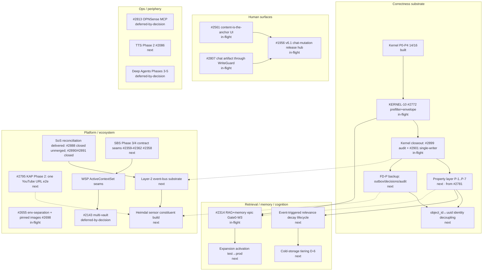

State: Advisory research artifact (RESEARCH-04, issue #2782, epic #2778; 2026-07-04). Decision-support only — it does NOT replace `docs/ROADMAP.md` (owner doc); divergences from the roadmap's implied ordering are listed as explicit owner decisions in `:: Owner decisions`, never silently asserted. Node statuses reflect GitHub issue state as of 2026-07-04.
Doc role: Reference (architecture evolution analysis)
Authority: Evidence-based; node inventory reconciled against open epics (#2762, #2314, #2143, #2561, #2655, #1956, #2778, #2813), the SBS target (`docs/SYSTEM_BREAKDOWN_STRUCTURE.md`, `docs/architecture/SBS_ROADMAP.md`), the kernel audit backlog, and the RESEARCH-01/02 artifacts. Where this artifact and an owner doc disagree, the owner doc wins.

# Mimer Evolution Graph — Capabilities, Prerequisites, Risk, Optionality

The roadmap is chronological; sequencing decisions need a different artifact: a graph whose nodes
are capabilities and whose edges are prerequisites, so each candidate step exposes what it unlocks,
what it forecloses, and what it costs to defer. Vocabulary comes from RESEARCH-01/02: "trustworthy
substrate" below means concretely *replay-sound events + single truth per concept + governed writes
at every seam + honest failure signals* (formal-model §3–§5).

## How to read a node

Five attributes per node: **R** risk (delivery + operational), **D** architectural debt removed,
**O** optionality gained, **M** maintenance cost added, **X** migration complexity. Scale L/M/H.
Status: `built` / `in-flight` / `next` (plausibly-next, no started work) / `deferred-by-decision`.

## Graph

Solid edges = hard prerequisites (correctness: building the successor without the predecessor
produces wrong or untrustworthy behavior). Dotted = soft prerequisites (cheaper-if-after).

## Node table

| Node | Status | R | D | O | M | X | Notes |
|---|---|---|---|---|---|---|---|
| Kernel P0–P4 (#2763–#2777 minus #2772) | built | — | H | H | L | — | 14/16 closed; the substrate bet already paid |
| KERNEL-10 #2772 prefilter + envelope | in-flight | M | H | H | L | L | Last kernel slice; converts the admissibility model from test-only to live |
| Kernel closeout (#2899 audit, #2901 single-writer) | in-flight | L | M | M | L | L | #2901 is a live I-S1 violation — a *regression of the kernel's own class* |
| Property layer P-1…P-7 (from #2781) | next | L | M | H | M | L | Turns the formal model into standing machine-checked law; O=H because every later change gets cheaper to verify |
| FD-P backup (outbox/decisions/audit) | next | L | H | M | L | L | The only canonical, non-rebuildable stores with **zero backup** (formal-model §5); pure ops, no code risk |
| object_id↔uuid identity decoupling | next | M | H | H | M | H | Kills the §5 coupling caveat (DB rebuild orphans decisions/audit); X=H: forward-only migration + backfill |
| #2314 RAG/memory epic (Gate0–W3, W5) | in-flight | M | H | H | M | M | Now standing on an honest substrate (KERNEL-05/06 landed); lexical-mirror half of W4-RET-01 still epic-owned |
| Expansion activation (test→prod) | next | M | L | M | L | L | Gated work already passed TEST; remaining: promote + answer-quality pass |
| Event-triggered relevance decay | next | M | M | H | M | M | Ratified direction (D-2 floor, D-6 posture); needs P-7 pin first so decay can't silently break lineage |
| Cold-storage tiering (D-6) | next | L | L | L | M | M | Non-aggressive by decision; not urgent until volumes hurt |
| #2561 content-is-the-anchor UI | in-flight | M | M | M | M | L | Serial by design (one overlay) |
| #2807 chat artifact via WriteGuard | in-flight | L | M | M | L | L | Closes the last canonical-artifact class writing outside WG |
| #1956 v6.1 release hub (chat mutation etc.) | in-flight | M | L | H | M | L | Release-channel mechanics exist; the hub is sequencing, not building |
| #2655/#2698 env separation, pinned images | in-flight | M | M | M | L | M | Operational safety for every later promotion |
| SoS reconciliation (#2888 closed unmerged; #2890/#2891 closed) | delivered | L | M | M | L | L | ADR and glossary reconciliation have landed |
| #2795 KAP Phase 2 (one YouTube URL e2e) | next | M | L | H | M | L | First acquisition vertical; platform-first precedent; ends at candidate |
| Layer-2 event-bus substrate | next | H | M | H | H | H | Fable design delivered (#4545): generalize the outbox discipline, stream-native deferred as ADR-gated transport swap — [`layer2-event-bus-and-kap-backbone.md :: Event-bus direction`](layer2-event-bus-and-kap-backbone.md#event-bus-direction); **build still premature before kernel closeout** — the outbox contract is its foundation either way |
| Heimdal sensor constituent | next | H | L | H | H | M | Consent OFF-default fixed; KAP-backbone question resolved at design level (#4545): one shared backbone contract — [`layer2-event-bus-and-kap-backbone.md :: KAP-backbone decision`](layer2-event-bus-and-kap-backbone.md#kap-backbone-decision); O=H (every constituent consumes its stream) but R/M=H (new always-on surface, privacy seam) |
| SBS Phase 3/4 contract seams (#2359/#2360/#2361/#2362/#2358) | next | L | M | M | L | L | Contract-first, module-lazy: cheap insurance against boundary erosion |
| WSP ActiveContextSet seams | next | M | H | H | M | M | Kills the `activeVault` scalar leak (transition debt D1); prerequisite for multi-vault done right |
| #2143 multi-vault | deferred-by-decision | M | L | M | M | M | Correct to defer until WSP seams exist — building it on `activeVault` would harden the debt |
| TTS Phase 2 (#2086 → closes #1699 AC4) | next | L | L | L | L | L | Bounded, independent, user-visible |
| #2813 OPNSense MCP | deferred-by-decision | M | L | L | M | L | Ops-lane; may reopen the deferred D4/ADR-0047 MCP-topology stance when concrete |
| Deep Agents Phases 3–5 | deferred-by-decision | H | L | M | H | M | Blocked conceptually on bounded-context enforcement (#2772) and typed boundaries — both landing; still not next |

## Readings

### (a) Critical path to a trustworthy substrate

`#2772 → kernel closeout (#2899 + #2901) → property layer (P-1/P-2/P-5 first) → FD-P backup →
identity decoupling`. Everything on this path is L/M delivery risk and removes H debt; nothing else
in the graph is safe to *trust* (as opposed to build) before it: evals over a divergent store
measure noise (audit §7 dependency spine), and every capability that records decisions/receipts
inherits FD-P's zero-backup exposure. FD-P backup is the single cheapest H-debt node in the graph —
it is an ops task, not a code project.

### (b) Highest optionality-per-risk next moves

1. **Property layer** (L risk, H optionality — makes all future change cheaper to verify).
2. **FD-P backup** (L risk, H debt removed — one runbook + one cron).
3. **SoS enactment** (L risk docs-only; unblocks clean naming for every ecosystem workstream).
4. **#2807 chat-WriteGuard** (L risk, closes a governance gap; already in flight).
5. **KAP Phase 2 vertical** (M risk, H optionality — proves the acquisition-constituent pattern
   end-to-end that Heimdal will reuse; ends at candidate so contamination risk is bounded).

### (c) Capabilities whose cost rises the longer they wait

- **FD-P backup** — every day adds unrecoverable canonical rows (decisions, audit, outbox history).
- **Identity decoupling** — the decisions/audit corpus anchored to runtime `object_id`s grows
  monotonically; backfill cost grows with it.
- **#2901 second-writer removal** — dual-writer drift compounds; each week of coexistence widens
  the divergence a doctor has to reconcile.
- **Registered-mirror census (P-2)** — `emit_outbox=False` call sites accrete with every feature
  (11 today, 7 at the June audit); the census is cheapest now.
- **WSP seams before multi-vault** — every new feature written against `activeVault` (or
  `VAULT_ROOT` idioms) adds one more site the seam must later migrate.

### What this graph recommends deferring (deferral is a decision)

- **Layer-2 event bus + Heimdal build** — until kernel closeout + FD-P backup land. Heimdal's
  event stream inherits whatever event-log honesty the substrate has; building the ecosystem's most
  privacy-sensitive constituent on an unfinished journal contract is the one sequencing error this
  graph exists to prevent. (KAP Phase 2 is the right precursor instead — same pattern, bounded.)
- **Multi-vault (#2143)** — until WSP ActiveContextSet seams exist (already the de-facto owner call).
- **Cold-storage tiering, Deep Agents 3–5, OPNSense MCP, enterprise/multi-node SFC** — no forcing
  function; conform to contract-first/module-lazy.

## Owner decisions (roadmap divergences)

**OD-1 — v6.1 chat-mutation surface vs substrate closeout.**
*Problem:* ROADMAP implies v6.1 (chat mutation, capability consumption) is the next major; the graph
puts kernel closeout + property layer + backup first.
*Options:* (a) substrate-first, v6.1 after (2–3 weeks of L-risk work first); (b) parallel tracks
(surfaces on Sonnet lanes, substrate on the critical path); (c) v6.1-first.
*Consequences:* (a) delays visible features, buys every later feature a verified substrate;
(b) realistic given multi-agent capacity — main risk is review bandwidth, not conflict (disjoint
surfaces); (c) chat mutation writes through seams P-1/P-5 would have pinned — new surface, unpinned
guarantees, highest silent-defect exposure. *Graph's recommendation:* (b), with (a)'s ordering
inside the substrate track.

**OD-2 — What follows the substrate: #2314 RAG/memory vs KAP Phase 2.**
*Problem:* both are H-optionality; the roadmap sequences neither explicitly.
*Options:* (a) #2314 first (retrieval quality compounds; oldest open architecture epic);
(b) KAP Phase 2 first (new capability class, proves the constituent pattern, feeds content the
retrieval work then benefits from); (c) interleave (KAP's bounded slice inside #2314's larger arc).
*Consequences:* (a) deepens the core loop, no new content sources; (b) widens input, retrieval
debt remains; (c) most total progress, most coordination. *Graph's recommendation:* (c) — KAP
Phase 2 is one bounded vertical; #2314 is a long arc that shouldn't block it.

**OD-3 — Heimdal timing.**
*Problem:* Fable-window pressure (charter, owner decisions fresh) argues for starting Heimdal now;
the graph's edges argue the event-bus substrate question should wait for kernel closeout.
*Options:* (a) design now (Fable: bus architecture + KAP-backbone decision, docs only), build after
substrate; (b) build now; (c) full defer.
*Consequences:* (a) captures the frontier-design value while the window exists, builds nothing on an
unfinished journal — the design *names* its substrate prerequisites; (b) risks baking outbox
semantics that #2899/#2901 may still move; (c) loses the window. *Graph's recommendation:* (a).
*Delivered:* option (a)'s design deliverable landed via #4545 —
[`layer2-event-bus-and-kap-backbone.md`](layer2-event-bus-and-kap-backbone.md); its
[substrate-prerequisites section](layer2-event-bus-and-kap-backbone.md#substrate-prerequisites)
names kernel closeout, FD-P backup, and the property layer and keeps build work waiting on them,
conforming to this graph's deferral recommendation.

**OD-4 — Backup as an interrupt.**
*Problem:* FD-P backup appears on no roadmap track at all (observability audit named it; nothing
owns it).
*Options:* (a) file + execute now as ops-lane work; (b) fold into #2655 deployment epic; (c) wait
for cold-storage design.
*Consequences:* (a) days-level effort, closes the largest unbounded-loss exposure; (b) coherent
home but couples to a slower epic; (c) confuses tiering (lifecycle) with backup (disaster) — they
are different problems. *Graph's recommendation:* (a).

## SBS reconciliation (binding)

Per-claim reconciliation against `docs/SYSTEM_BREAKDOWN_STRUCTURE.md` and `docs/architecture/SBS_*`:

- **Conforms:** the critical-path reading is the SBS dependency posture applied in time (authority
  and persistence honesty before cognition surfaces); WSP-before-multi-vault is the SBS's own
  "scope collapse into active vault" failure-mode mitigation; deferral posture matches
  contract-first/module-lazy (ADR-0016) and SFC single-node V1 (ADR-0020); the Heimdal/event-bus
  nodes conform to the three-layer model in `docs/HEIMDAL/ECOSYSTEM_SOS_MODEL.md` (substrate
  promotion is Layer-1-governed, enacted via ADR/CES, not by this graph).
- **Extends:** (a) "FD-P backup" names a durability obligation the SBS assigns PDM but no fitness
  rule or roadmap track owns — flagged to CES as a fitness-rule extend-candidate; (b) the
  identity-decoupling node operationalizes the formal model's §5 coupling caveat, already flagged to
  CES by RESEARCH-02 — this graph only sequences it.
- **Proposes reshaping:** none. (The SoS-enactment node *routes* the already-owner-decided ADR-0043
  reshape through its own CES/ADR channel; this graph takes no position beyond sequencing it.)

## Related docs

- `docs/ROADMAP.md` (owner doc this advises, never replaces)
- `docs/architecture/formal-model.md` §5 (failure domains; the backup and identity nodes)
- `docs/audits/SYSTEM_REDESIGN_CORRECTNESS_KERNEL_2026-07-02.md` §7 (dependency spine this extends past the kernel)
- `docs/architecture/SBS_ROADMAP.md`, `docs/architecture/SBS_CURRENT_TO_TARGET_MAPPING.md` (transition-debt register)
- `docs/HEIMDAL/ECOSYSTEM_SOS_MODEL.md`, ADR-0043 (ecosystem layer of the graph)
- `docs/testing/invariant-synthesis-2026-07.md` (RESEARCH-03; the property-layer node)
- `docs/foundation/ARCHITECTURAL_CONSTITUTION.md` (RESEARCH-07; the laws the critical path serves)
