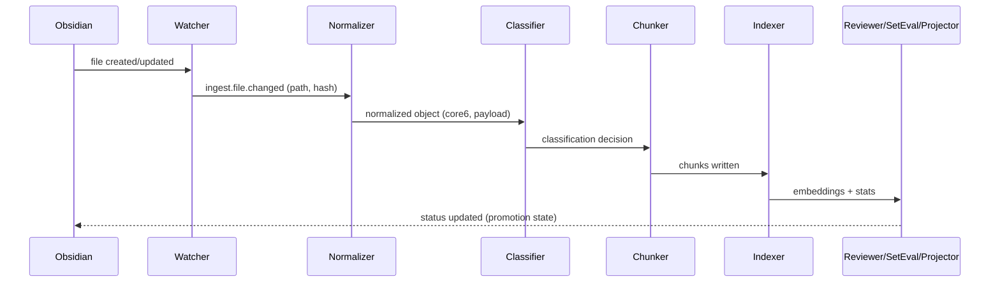
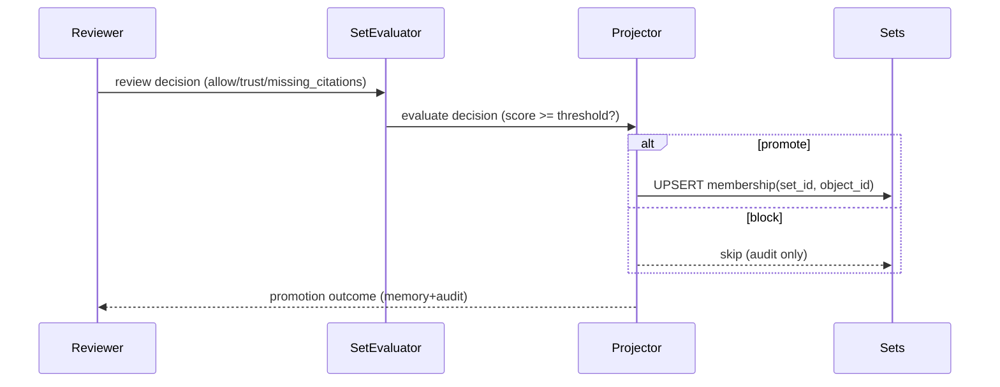
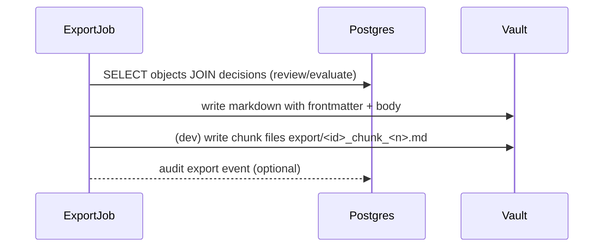
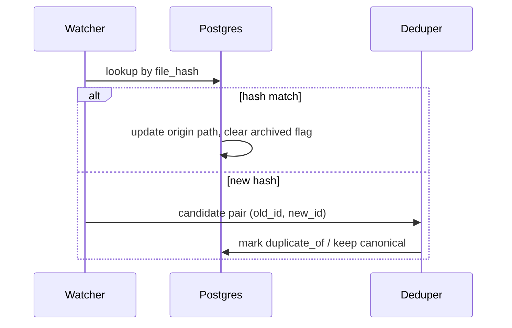

State: Legacy (archived); superseded by SoT v4.10 (see INGEST.md, OBSIDIANSYNC.md, HUMAN-FLOWS.md).
# Obsidian Integration & Lifecycle — SoT v4.3 Deep Dive

This addendum documents how SoT v4.3 connects the ingestion pipeline with an Obsidian vault while preserving the Core-6 data model and promotion governance.

## 1. File-first lifecycle (historical)
- Watcher-driven ingest with hash-based provenance was a v4.3 concept. Reality-MVP uses manual CLI ingest (`vault-alpha-ingest`) with UUID healing and HybridStore writes (see `docs/INGEST.md` and `docs/HUMAN-FLOWS.md`).

## 2. Promotion pathway (historical)
- Reviewer logs trust, citations, duplicate flags and produces `review` decisions + memory.
- SetEvaluator computes promotion score (`evaluate` decisions) using review, citation, embedding stats.
- Projector enforces `membership(set_id, object_id)` when `promote=true`, emitting audit and episodic memory entries.

## 3. Export workflow (historical)
- `scripts/export_objects.py` selects objects with `review_state="approved"` or `promote=true`.
- YAML frontmatter includes Core-6 plus `trust`, `maturity`, `evidence_level`, `review_state`, and provenance timestamps.
- Body contains normalized text; optional chunk appendices (`export/<id>_chunk_<n>.md`) for development.
- Audit excerpts and episodic snapshots appended for traceability.

## 4. Rename/update reconciliation (historical)
- Describes a watcher comparing hashes. Reality-MVP has no watcher; path changes are handled via ingest CLI and VaultMirror reconciliation.

## 5. Backfill hygiene (historical)
- `make backfill` and view-based audits are not part of Reality-MVP; current ingest is rebuilt via CLI as needed.

## 6. Operational checklist (historical)
- Watch services/export jobs referenced here are not active in v4.10. Use `docs/INGEST.md` and `docs/OBSIDIANSYNC.md` for the current Obsidian vault integration (manual CLI ingest, UUID healing, panel stripping).
