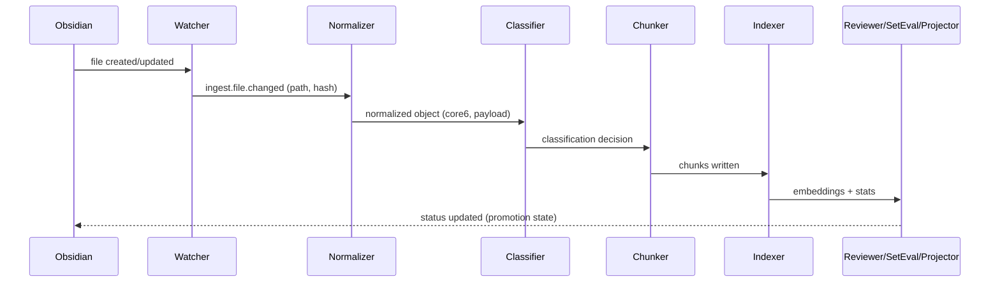
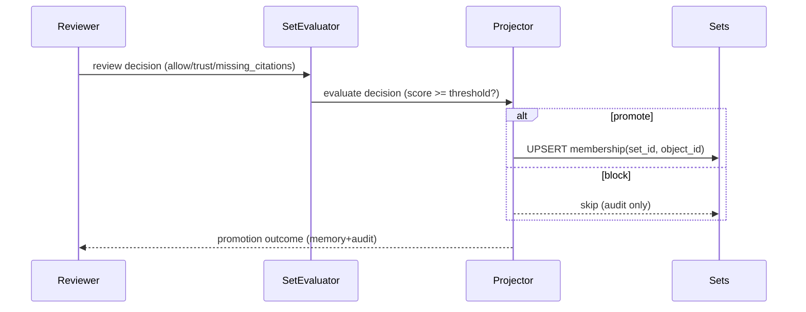
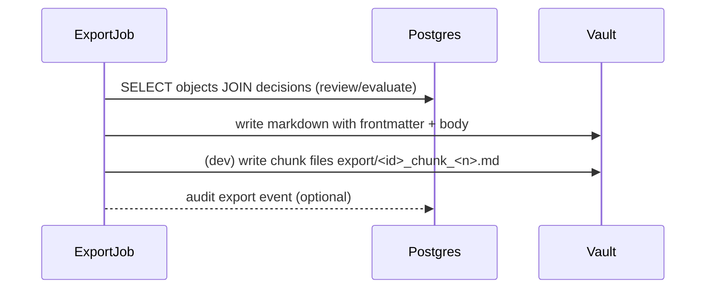
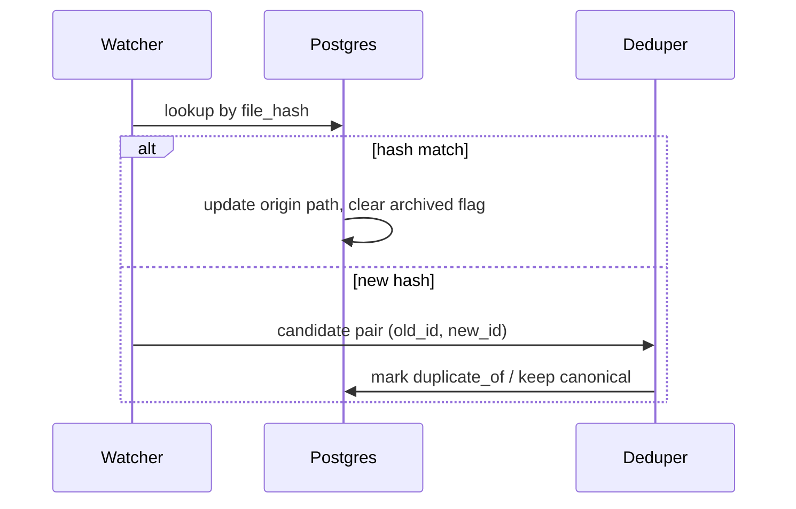

# Obsidian Integration & Lifecycle — SoT v4.3 Deep Dive

This addendum documents how SoT v4.3 connects the ingestion pipeline with an Obsidian vault while preserving the Core-6 data model and promotion governance.

## 1. File-first lifecycle
- **Create**: New Markdown files under the watch path trigger normalization; the file hash becomes the provenance key.
- **Update**: Hash/mtime deltas re-run the normalizer while keeping `core6.id` and `created` intact; `updated` reflects the new ingest time.
- **Rename**: Hash match with new path results in `core6.origin` update only; deduper is bypassed.
- **Delete**: Missing files mark the object as `archived=true` (manual removal from vault; DB row retained for audit).
- **Conflict**: Distinct hashes with same title are sent to Deduper; canonical object keeps the original `core6.id`, alternates receive suffix `(alt n)`.

## 2. Promotion pathway
- Reviewer logs trust, citations, duplicate flags and produces `review` decisions + memory.
- SetEvaluator computes promotion score (`evaluate` decisions) using review, citation, embedding stats.
- Projector enforces `membership(set_id, object_id)` when `promote=true`, emitting audit and episodic memory entries.

## 3. Export workflow
- `scripts/export_objects.py` selects objects with `review_state="approved"` or `promote=true`.
- YAML frontmatter includes Core-6 plus `trust`, `maturity`, `evidence_level`, `review_state`, and provenance timestamps.
- Body contains normalized text; optional chunk appendices (`export/<id>_chunk_<n>.md`) for development.
- Audit excerpts and episodic snapshots appended for traceability.

## 4. Rename/update reconciliation
- The watcher compares file hashes to `objects.file_hash`.
- If hash unchanged but path differs → update `core6.origin` only.
- If hash changed → re-run full pipeline.
- Ambiguity triggers Deduper to prevent duplicate published items.

## 5. Backfill hygiene
- `make backfill` (wrapper for `app/jobs/backfill.py`) fills historical gaps: missing chunks → chunker, missing embeddings → indexer, missing reviews/evaluations → reviewer/set_evaluator, promoted-without-membership → projector.
- Views (`view_objects_missing_chunks`, `view_chunks_missing_embeddings`, `view_objects_missing_review`, `view_objects_ready_for_projection`) track outstanding items before/after the job.

## 6. Operational checklist
- Ensure watch service mirrors the vault path into SetDB.
- Run export job after promotion or nightly cron; configure vault path through CLI.
- Maintain Ollama/LLM credentials consistent with ingestion tests.
- Periodically execute `make backfill` to keep historical notes aligned with new lifecycle rules.

The v4.3 lifecycle preserves SoT v4.2 guarantees while allowing Obsidian to remain the human-first editing surface.
