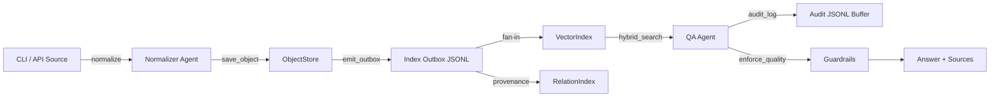

State: Historical (SoT v4.x). Diagrams here are legacy; for v5.5 baseline and v5.6 forward line, prefer `docs/ARCHITECTURE.md` and `docs/HUMAN-FLOWS.md`.

Historical reference only:
- These diagrams are kept for background and legacy visualization.
- Do not use them as the primary source for current runtime wiring or component boundaries.

## v5.5 Baseline Delta (Current Reality)
- Registry watcher is the runtime default; legacy snapshot watcher is dev-only.
- DB outbox (Postgres) is the canonical queue; JSONL audit log is non-canonical and used for lag inspection.
- Watcher auto-run remains off unless allowlisted; LangGraph/Reasoning rollout is opt-in.
- See `docs/STATUS.md` and `docs/ARCHITECTURE.md` for the current baseline and forward line.

# Legacy Diagrams

Visual references for the SoT v4.5 ingestion, store, and promotion flows. Rendered via Mermaid and exportable with `mmdc`.

<!-- SECTION:DIAGRAMS:BEGIN -->
## Ingestion → Stores → QA


## Promotion → Reasoning Prep
```mermaid
flowchart TD
    INTENT[promote.intent.created] --> PROMO[Promotion Agent]
    PROMO -->|validate cooldown| CHECK[Policy + cooldown]
    PROMO -->|update frontmatter| VAULT[ObjectStore]
    PROMO -->|emit provenance| REL2[RelationIndex]
    VAULT -->|emit_outbox=False| QUIET[(No loop)]
    PROMO -->|promote.done| OUTBOX2[Index Outbox]
    OUTBOX2 --> INDEXER[Index / Rerank Workers]
    REL2 --> REASON[Reasoning Layer (RDF/OWL draft)]
```

### Export to PNG/SVG
1. Install Mermaid CLI locally: `npm install -g @mermaid-js/mermaid-cli`.
2. Copy a block into an `.mmd` file or run `mmdc -i docs/archive/architecture/DIAGRAMS.md -o artifacts/docs-diagrams.svg --page --scale 1`.
3. Store exported images under `docs/diagrams/` if they should be versioned; CI only requires the source Markdown.
<!-- SECTION:DIAGRAMS:END -->
