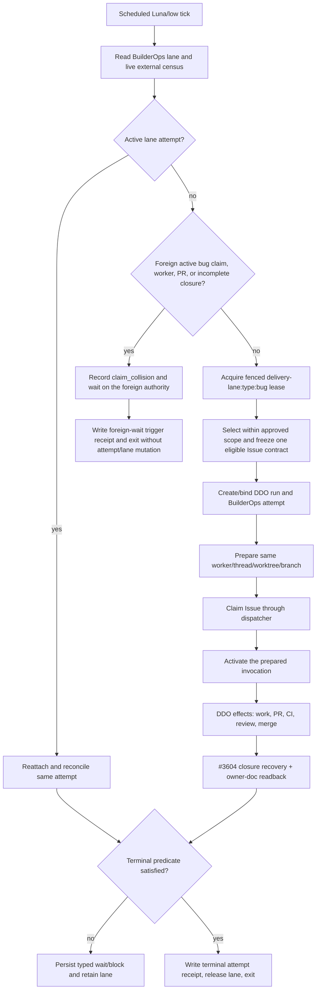

State: Advisory audit snapshot (2026-08-05). Anchors reflect `origin/main` at
`ff1c6e0eb506bfc22f2d3168e1f8558a2b1032d4` plus live GitHub and Codex-task evidence read on the
audit date. Executable reconciliation extends the existing Deterministic Delivery Orchestration
specification and live backlog; owner docs and live authority win on disagreement.
Doc role: Reference (audit snapshot)
Authority: Evidence-based Builder System structural analysis. This document does not activate a
control plane, mutate delivery lifecycle, or make target state current-state truth.
Owner: Builder System governance
Temporal class: snapshot
Review cadence: event-driven after DDO-05, BCP-06, or the scheduled bug pilot changes materially
Source of truth: subordinate to `docs/DOCS_INDEX.md`, Builder System owner contracts, live GitHub,
and the BuilderOps control-plane authority after its governed cutover
Last reviewed: 2026-08-05

# Autonomous Bug Delivery Architecture — Thin Trigger Over The Builder System

## Executive verdict

The inexpensive scheduled bug runner must not own a bug queue, retry ledger, terminal-state map, or
worker registry. Its target job is only to wake the shared delivery system, request a reconciled
tick for one repository-scoped `type:bug` lane, record the trigger result, and exit.

Global seriality for participating scheduled DDO runs belongs in the delivered BuilderOps generic
fenced-lease substrate, bound to one BuilderOps task/attempt and the existing DDO reducer. The
canonical lane resource is
`delivery-lane:type:bug` within the repository namespace. The lane holder is the stable delivery
attempt identity; every participating mutation carries the current lane fence alongside its
existing task/dispatcher/outbox authority. This reuses the generic
lease key `(repository, lease_kind, resource_id)` and its compare-by-holder/token/expiry behavior
instead of adding a bug-specific state machine
(`app/builderops/control_plane/migrations/0001_transaction_kernel.sql:135-147`,
`app/builderops/control_plane/store.py:1584-1649`,
`app/builderops/control_plane/store.py:1794-1971`).

Every scheduled tick must resume or reconcile existing delivery before selecting new work. A merged
PR is not terminal for the lane until verification/closure has completed every required lifecycle
step and the exact PR-specific post-merge owner-doc receipt has been read back. This rule would have
kept the lane occupied for #4612 and #4618 and prevented the observed later dispatches.

The normal detached Codex project-worktree bootstrap becomes a two-stage operation inside the
existing DDO/`WorkerRuntimePort` seam: reducer-authorized `prepare` creates and binds the Codex
thread, project worktree, unique branch, base SHA, and a `prepared` generation in the existing
worktree lifecycle registry without claiming, editing, or gaining active worktree authority; the
dispatcher claim then succeeds from that branch/worktree; the same lifecycle generation is promoted
to active and reducer-authorized `activate` resumes the same invocation. This extends DDO-05 and the
existing registry. It does not create a new orchestrator or registry.

No owner-grade architecture decision remains inside this scheduled-delivery scope. Making the lane
mandatory for every manual/direct `issue-to-code` pickup would be a broader governance decision and
is explicitly out of scope; the scheduled system instead detects foreign direct work and waits
without takeover. The unresolved in-scope work is technical and already has
authoritative homes: #4168 for durable DDO/BuilderOps effects and worker recovery, #3604 for
post-merge closure recovery, #4169 for CKM initiation/evidence projection, #4170 for acceptance,
#3793/#3690 for control-plane cutover and its BCP owner-doc enactment, and #4170/#4163 for DDO
acceptance and DDO/SBS owner-doc promotion.

## Charter, method, and classification

This is Builder System / CES work. It changes no Product/Runtime behavior, vault content, user
memory, HKA authority, or Product SBS contract. The audit itself is a docs/specification artifact
and performs no implementation.

The pass followed `architecture-research`:

1. parallel evidence-only exploration of BuilderOps/dispatcher, Codex worker/worktree/closure, and
   CKM/TCD/backlog history;
2. coordinator reread of the live code, tests, owner contracts, prior audits, automation
   configuration, source Codex task, and worker retry task;
3. explicit resolution of the ten research questions below;
4. extraction of a categorized invariant kernel; and
5. `feature-breakdown` reconciliation into the existing DDO specification and GitHub backlog.

The principal evidence set is:

- BuilderOps PostgreSQL task/attempt/receipt/lease/outbox schema and transaction code
  (`app/builderops/control_plane/migrations/0001_transaction_kernel.sql:53-172`,
  `app/builderops/control_plane/store.py:605-731`);
- DDO contracts, reducer, worker preflight, and current Codex launcher
  (`app/builderops/delivery_orchestration_contracts.py:112-131`,
  `app/builderops/delivery_orchestration_contracts.py:1325-1417`,
  `app/builderops/delivery_reducer.py:250-275`,
  `app/builderops/delivery_reducer.py:1620-1687`,
  `app/builderops/delivery_runner.py:245-430`,
  `app/builderops/epic_dispatch.py:63-210`);
- current closure and Human Exception contracts
  (`.codex/skills/verification-and-closure/SKILL.md:485-503`,
  `.codex/skills/post-merge-owner-doc/SKILL.md:43-79`,
  `docs/development/AUTONOMOUS_REVIEW_REPAIR_GATE_CONTRACTS.md:406-505`);
- CKM non-authority and evidence contracts
  (`docs/CAPABILITY_KNOWLEDGE_MODEL/README.md:117-123`,
  `app/builderops/ckm_reevaluation.py:1-25`,
  `tests/builderops/test_ckm_reevaluation.py:65-170`); and
- live GitHub Issues/PRs and the seven scheduled-run receipts described below.

The run ledger was supplied by the delegated source Codex task
`019fd0b8-f7e5-7b30-934e-9f07694bcd5f` and reconciled against live GitHub. Where a pre-claim
provider failure left no GitHub comment, the ledger is the positive event source and the linked
Issue's unchanged claim/comment state is the negative external readback.

### TCD posture

Architecture synthesis used Sol/xhigh capability; bounded evidence collection used cheaper
explorers. Human recovery time and hidden coordination defects dominate model price here. The
architecture therefore strengthens the shared identity/reconciliation mechanism rather than the
implementation worker model. The scheduled coordinator remains Luna/low for deterministic intake,
snapshots, and dispatch; a normal bounded implementation remains Terra/medium, with the existing
TCD escalation rules preserved (`AGENTS.md:243-264`).

## Empirical baseline: the first seven scheduled selections

| Selection | Observed outcome | Terminal-chain result | Structural evidence |
| --- | --- | --- | --- |
| #4614 | Stale/already-covered contract; dispatcher lease moved to blocked before coding | No delivery; truthful blocked receipt | Delivered-state and `Verify:` preflight worked, but the scheduler had no shared lane attempt to close or reconcile. [Receipt](https://github.com/RasmusTho/agentic-pkm-mvp/issues/4614#issuecomment-5163313213). |
| #4562 → PR #4615 | Merged and Issue closed | Complete, including PR-specific owner-doc and delivery receipts | [Owner-doc receipt](https://github.com/RasmusTho/agentic-pkm-mvp/issues/4562#issuecomment-5165641676) and [delivery receipt](https://github.com/RasmusTho/agentic-pkm-mvp/issues/4562#issuecomment-5165644850). |
| [#4195](https://github.com/RasmusTho/agentic-pkm-mvp/issues/4195) | Worker-start/project-worktree discovery timed out | No claim and no worker identity | Source-task run ledger records the pre-claim technical timeout; live Issue readback had no claim/comment receipt on the audit date. No durable attempt existed for a later tick to resume. |
| #4612 → PR #4617 | Merged and Issue closed | Incomplete: watchdog exists, owner-doc receipt and delivery receipt absent | [Pickup receipt](https://github.com/RasmusTho/agentic-pkm-mvp/issues/4612#issuecomment-5175690961) is label-only fallback; [watchdog](https://github.com/RasmusTho/agentic-pkm-mvp/issues/4612#issuecomment-5186595347) is explicitly not closure. |
| #4618 → PR #4620 | Merged and Issue closed | Incomplete: watchdog exists, owner-doc receipt and delivery receipt absent | [Watchdog](https://github.com/RasmusTho/agentic-pkm-mvp/issues/4618#issuecomment-5186523806); no claim receipt appears on the Issue. |
| #4622 → PR #4639 | Merged and Issue closed | Complete for the observed scheduled chain; owner-doc and review-thread closure receipts present | [Owner-doc receipt](https://github.com/RasmusTho/agentic-pkm-mvp/issues/4622#issuecomment-5181058395) and [review-thread receipt](https://github.com/RasmusTho/agentic-pkm-mvp/issues/4622#issuecomment-5181058726). A future DDO run still needs one normalized additive attempt-terminal receipt. |
| [#4611](https://github.com/RasmusTho/agentic-pkm-mvp/issues/4611) | Shared-root pickup refused; explicit project-worktree retry found a detached checkout and an older branch/worktree | No claim; stopped safely | Source-task run ledger records the detached checkout and prior branch/worktree readback; live Issue remained unclaimed. Correct refusal, but thread/worktree/branch identity was not inside a resumable shared attempt. |

Four PRs merged, but only two selections demonstrated the whole observed terminal chain. Later bugs
were dispatched while #4612 still lacked its required owner-doc receipt. The live evidence contains
no globally authoritative reason for selecting the later Issues over still-ready #4195 or #4611 and
no common DDO-07 pilot receipt. These runs are therefore a baseline, not evidence that DDO-07 or
global seriality is delivered.

## Current-to-target authority map

| Surface | Current authority | Current gap | Target role |
| --- | --- | --- | --- |
| `AGENTS.md` / skills | Normative delivery and TCD policy | Policy says serial bug delivery, but a prompt cannot enforce it globally | Policy only; tests and runtime mechanisms enforce the contract |
| Scheduled Luna runner | Time-based wakeup and local prompt | Reconstructs selection/resume from prompt memory; concurrent ticks and later ticks have no shared slot | Thin trigger: authenticate repository/lane, request one reconcile tick, persist trigger receipt, exit |
| CKM | Evidence/provenance projection and gap analysis | Delivery bridge #4169 is not delivered; no live capability-route loop | Derived capability recommendation and post-delivery evaluation only; never claim, transition, retry, release, or close |
| BuilderOps PostgreSQL control plane | Target durable tasks, attempts, receipts, generic/task leases, outbox, fencing, recovery | BCP-06 #3793 has not activated it as the only production authority; local CLI still has SQLite paths | Sole shared operational authority for lane lease, attempt, external-effect intent/readback, and terminal attempt receipt |
| DDO reducer | Legal delivery transitions and next-effect decisions | No repo-scoped bug lane; current order is claim → launch; launch resume is deliberately absent pending #4168 | Existing state machine gains lane-bound admission and two-stage worker prepare/claim/activate semantics |
| Dispatcher | Per-Issue claim/lease and pickup collision truth | Per-Issue ownership cannot enforce one active bug across different Issues | Remains the Issue claim authority; lane attempt records its exact task/lease/fence |
| Codex task / worker runtime | Provider session executes bounded work | Current transitional launcher starts in `repo_root`, only adds the worktree parent, and neither creates nor selects the planned worktree (`app/builderops/epic_dispatch.py:96-141`) | Provider-neutral prepared/active invocation with durable thread readback and start-once semantics |
| Worktree/branch lifecycle | Git plus generation-bound lifecycle registry | Registry has no non-authoritative `prepared` state; detached project worktree and earlier branch/worktree collisions are not bound to the scheduled attempt | The existing registry gains fail-closed `prepared` → `active` continuity for one generation; physical cleanup stays separate |
| GitHub Issue/PR/CI/review/merge | Contract, head, validation, delivery, and closure truth | Individual receipts exist, but the seven runs have no common join or terminal predicate | External truth remains authoritative and is read back into the attempt before every transition |
| `verification-and-closure` / `post-merge-owner-doc` | Merge/closure and PR-specific owner-doc receipt authority | Merge can be observed before cold-path closure finishes | #3604 resumes the missing suffix; lane release waits for its exact receipt chain |
| BuilderOps Vault learning | LearningSignal, retrospective, reevaluation, PromotionIntent | Could be misused as a convenient scheduler memory | Consumes terminal evidence after the fact; never owns live attempt/lease state |
| Automation memory / Codex chat | Convenience history | Not shared, fenced, or complete; can silently become pseudo-authority | Diagnostic cache only; every statement is re-derived from control-plane and live external truth |

The target is not fully activatable until BCP-06 #3793 completes the governed control-plane cutover.
Before that cutover, the PostgreSQL design is target truth and the live prompt runner remains a
transition surface; it must not claim that its local memory globally serializes delivery.

## Ranked weakness analysis

Findings are ranked by systemic blast radius multiplied by silence of failure.

### F1 — Seriality is policy, not shared mechanism

`AGENTS.md` requires one active bug implementation (`AGENTS.md:248-254`), while the dispatcher only
leases `issue:<N>` and cannot prevent another Issue from being claimed. The BuilderOps store already
supports the needed generic fenced lease, including one-winner concurrency and stale-token refusal
(`tests/builderops/control_plane/test_postgres_leases.py:210-250`). The missing piece is a canonical
repo-scoped lane resource bound to the DDO attempt. The observed dispatch past #4612 proves the gap
is live.

### F2 — Worker/worktree bootstrap is outside the resumable identity chain

The current Codex launcher instructs the worker to use a named worktree but invokes `codex exec -C`
at `repo_root`, adds only the worktree parent, and merely checks that the planned parent exists
(`app/builderops/epic_dispatch.py:96-141`, `:197-210`). Worker preflight registers a supplied
worktree only after validating the plan/effect/run/Issue chain; it does not allocate or branch it
(`app/builderops/delivery_runner.py:197-223`, `:245-356`). This split caused #4611 to land detached
beside a prior Issue branch and made #4195 unrecoverable after the start timeout.

### F3 — Merge and terminal lane release are currently different events

Closure explicitly invokes `post-merge-owner-doc` and forbids a delivery receipt until the exact
PR-specific receipt is present (`.codex/skills/verification-and-closure/SKILL.md:485-503`). The
owner-doc skill requires readback on every authenticated target and says a watchdog is not a receipt
(`.codex/skills/post-merge-owner-doc/SKILL.md:43-79`). #4612 and #4618 were merged/closed but still
miss that terminal suffix. #3604 already owns idempotent orphaned-delivery recovery; the bug lane
must consume its result instead of defining another closure policy.

### F4 — The end-to-end identity is joinable by a human, not yet by one attempt

DDO effect identity already binds run, plan, Issue, effect, expected authorities, PR, and exact head
where relevant (`app/builderops/delivery_orchestration_contracts.py:1325-1417`). BuilderOps adds
repository, task/attempt, leases/fences, outbox operation, and receipt sequence. Worktree generation,
Codex thread, dispatcher lease, GitHub checks, merge, and owner-doc comments remain separate
surfaces. Without one attempt envelope carrying all joins, restart code can observe each object but
cannot prove which combination it may reattach, repair, or supersede.

### F5 — The target control plane is implemented in parts but not the live authority

The PostgreSQL store refuses production SQLite fallback, but the repository-local BuilderOps CLI
still constructs the local store for its legacy path. BCP-05 #3603 remains open/blocked despite
substantial merged implementation, and BCP-06 #3793 plus BCP-07 #3690 remain blocked. An automation
cannot safely claim global authority before the governed source inventory, activation epoch,
client cutover, and no-fallback proof complete.

### F6 — Technical stop versus owner decision has one stale contradictory owner surface

The current classifier assigns unavailable dependencies and fail-closed technical failures to
`auto_backoff` or `blocked_technical`; retry exhaustion alone never means `needs_owner`
(`docs/development/AUTONOMOUS_REVIEW_REPAIR_GATE_CONTRACTS.md:411-438`). Verification repeats that a
review-runner outage is technical and never waives the gate
(`.codex/skills/verification-and-closure/SKILL.md:218-225`). SBS §12 still directs an unavailable
review gate to `agent:needs-human` and permits a scoped human override
(`docs/architecture/SBS_OPERATING_MODEL.md:443-456`). The target classifier must follow the newer
explicit Human Exception authority rule; the owner-doc contradiction needs reconciliation, not a
new runtime state.

### F7 — CKM has the right non-authority boundary but not the delivered evidence loop

CKM invariants already require provenance, projection-only egress, candidate/confirmed separation,
and rebuildability (`docs/CAPABILITY_KNOWLEDGE_MODEL/README.md:117-123`). Current reevaluation emits
observe-only candidate routes with all mutation channels false
(`app/builderops/ckm_reevaluation.py:110-179`). #4169 remains blocked, so actual delivery receipts do
not yet drive capability routing. The gap must be closed without allowing CKM maturity/gap scores to
select an Issue or advance lifecycle.

### F8 — Retrospective evidence is structurally separate but easy to misuse as live state

SBS correctly separates LearningSignals, retrospectives, PromotionIntents, GitHub truth, and CKM
projections (`docs/architecture/SBS_OPERATING_MODEL.md:224-328`). The scheduled runner's local memory
currently looks tempting because it lists prior selections. It is neither fenced nor complete and
must remain a cache. Live control resumes from BuilderOps plus GitHub/dispatcher/Git/worktree truth;
learning consumes the terminal receipts afterwards.

## Target architecture

### One shared correctness spine

The scheduler, reducer, adapters, and closure worker operate one attempt with two ownership layers:

- a **generic lane lease** serializes all participating scheduled DDO `type:bug` delivery for one
  repository; and
- the existing **task/Issue/effect authorities** govern the specific mutations inside that lane.

The generic lease does not authorize GitHub effects. It only proves which attempt may ask the DDO
reducer to proceed. Dispatcher claim, exact-head GitHub/CI/review evidence, and the closure skills
remain hard authorities.

### Attempt identity model

| Object | Required binding | Reattach/reconcile rule |
| --- | --- | --- |
| Scheduler tick | `repository`, `lane_resource_id`, `tick_id`, trigger timestamp | Never becomes the attempt; it wakes or observes one |
| Lane lease | `repository`, `generic`, `delivery-lane:type:bug`, `attempt_id` as holder, fencing token, expiry, receipt sequence | Same holder may heartbeat/replay; stale token performs no effect |
| BuilderOps task/attempt | `task_id`, `attempt_id`, authority envelope, DDO `run_id`, plan/profile refs, current state | Attempt genesis is durable before any external effect; a crash between lane claim and genesis is a no-effect initialization recovery |
| Issue contract | repository + Issue number + `authority_id` + contract hash/readiness snapshot | Stale contract blocks or supersedes before coding; live GitHub wins |
| Dispatcher claim | canonical dispatcher task id, Issue resource, lease id/holder/fence/expiry, pickup receipt | Same attempt reattaches; foreign active claim is `claim_collision`, never overwritten |
| Worker invocation | reducer effect/idempotency key, invocation id, provider/model/reasoning, Codex thread id | `not_started` starts once; unknown inspects/reattaches; terminal returns recorded result (`app/builderops/delivery_runner.py:387-430`) |
| Worktree | prepared receipt: canonical path, branch, base SHA, lifecycle generation, state=`prepared`, owner=`attempt_id`; post-claim promotion of the same generation to `active` | Same prepared/active identity reattaches; foreign/dirty/active binding is preserved and classified |
| Branch | unique `codex/bug-<issue>-<attempt-short>`, base SHA, worktree generation | Never reuse an earlier attempt's branch as a shortcut; reattach only through proved same-attempt identity |
| PR/CI/review | PR number, exact head SHA, check-run ids, review/finding disposition | New head invalidates head-bound evidence; unknown effects read GitHub before retry |
| Merge/closure | merge SHA, exact closing/governing sets, Issue/dispatcher/label state, owner-doc comment ids, `DeliveryReceipt.v2` ref, additive attempt-terminal receipt | Lane releases only after the complete terminal predicate below |
| CKM/Learning | terminal receipt refs, metrics, freshness, limitations | Derived consumers only; never part of the effect-eligibility predicate |

This is an append-only identity graph, not one mutable flat tuple. Later nodes bind earlier immutable
identities; a new PR head invalidates all earlier head-bound CI/review evidence rather than updating
it in place.

The generic lease and task/attempt creation need not become one new database transaction. The lane
claim receipt is the attempt's durable genesis marker. No delivery effect is eligible until the
corresponding BuilderOps task/attempt exists and binds that lane receipt/fence. A crash in between is
therefore recoverable initialization, not an ambiguous external effect.

### Scheduler tick: resume/reconcile before dispatch



The exact tick procedure is:

1. Read the current generic lane lease, BuilderOps attempts/outbox, dispatcher claims, open PRs,
   recently merged incomplete PRs, and worktree registry before ranking a candidate.
2. If the lane has a current holder, heartbeat only with the matching holder/fence and resume its
   first unresolved effect or closure prerequisite.
3. If no lane row is active but live external truth proves an active bug delivery, record the
   foreign identity as `claim_collision` and wait on its owning authority. Never adopt, take over,
   or wrap it in a new attempt. Write only a no-dispatch trigger receipt; do not create an attempt,
   acquire/release the lane, or dispatch another Issue.
4. Only when both checks are empty acquire the generic lane lease. Concurrent ticks race on that
   one database key; the loser records a no-dispatch trigger receipt and exits.
5. Select one Issue only inside an exact, already-approved request/plan/profile and freeze its live
   contract/readiness snapshot into the DDO plan/attempt. The trigger cannot authorize a backlog
   search by itself. Which durable initiation carrier holds that approval remains the governed
   DDO-06 boundary. CKM may supply an evidence-backed capability recommendation, but it does not
   rank or authorize the Issue.
6. Advance only through reducer-authorized, outbox-bound effects. On restart, reconcile `unknown`
   effects against the authoritative external system before retry.
7. After merge, invoke or resume #3604's existing closure-only recovery. Missing owner-doc receipt
   is an incomplete attempt, not a successful previous run.
8. Release the lane only through the terminal predicate. The cron process may exit at any point;
   the attempt does not depend on its process lifetime.

### Safe detached Codex project-worktree bootstrap

The present DDO transition order is `claim_issue` then `launch_worker`
(`app/builderops/delivery_reducer.py:250-266`), while the normal Codex project-worktree may exist
detached before a worker can pass the pickup preflight. DDO-05 must extend the shared reducer/worker
contract with one two-stage invocation, not let the scheduler improvise around it:

1. **Prepare authorization.** A versioned `preparing` reducer phase emits a durable prepare effect
   for one dormant invocation. The
   Codex carrier creates or reattaches the exact thread/project worktree but receives a
   bootstrap-only context: it may inspect Git, create/switch the unique attempt branch from the
   bound base SHA, and report the checkout; it may not claim, edit, commit, push, mutate GitHub, or
   claim active worktree lifecycle ownership.
2. **Prepared receipt and lifecycle generation.** Read back and persist a versioned
   `WorkerPreparedReceipt.v1` containing
   `thread_id`, canonical worktree path, branch, base SHA, cleanliness, and collision census. The
   existing worktree lifecycle registry records the same generation as `prepared`, owned by the
   attempt but carrying no claim, editing, turn, or active-worker authority. This is an additive
   state in the existing registry, not a second registry. No receipt means `unknown`; the same
   invocation is inspected/reattached, never replaced blindly.
3. **Collision rule.** A matching same-attempt generation reattaches. An older or foreign active,
   dirty, locked, claimed, or PR-bound branch/worktree is preserved and yields `claim_collision`.
   A terminal clean predecessor may be left for the existing cleanup doctor; a new unique branch
   does not require deleting it.
4. **Claim authorization.** Run `scripts/issue_pickup_claim.sh` from the prepared branch/worktree
   and persist its exact dispatcher or label-fallback receipt.
5. **Active worktree binding.** After the successful claim, promote the same registry generation
   from `prepared` to `active` and bind the dispatcher receipt to it. This preserves the current
   `issue-to-code` rule that active authority follows claim while making the pre-claim detached
   bootstrap durable and recoverable. DDO-05 must update the registry, `AGENTS.md`, and
   `issue-to-code` contract together.
6. **Activation authorization.** Only after claim and lifecycle-registration readback does the
   reducer activate/reattach the same Codex invocation with implementation authority. The worker
   continues through `issue-to-code` inside the bound checkout.

This makes the #4611 detached checkout a normal pre-claim preparation state and makes the #4195
start timeout resumable under the same invocation identity. It also preserves the current DDO rule
that an in-flight launch cannot be re-derived: current resume deliberately omits `launching` because
that could mint a second start-once identity (`app/builderops/delivery_reducer.py:1620-1627`).

### Exact terminal predicate

For a delivery with a PR, the lane may be released only when all are true:

```text
attempt is terminal
AND every authorized outbox effect is succeeded, reconciled terminal, or dead-lettered with a
    truthful blocked terminal outcome
AND the worker invocation is terminal and no active heartbeat/claim remains
AND the dispatcher task is completed or released with readback
AND the authenticated PR/Issue closure set is reconciled at the merge SHA
AND required agent-label cleanup and source-spec writeback are read back
AND the exact `post-merge owner-doc check: PR #<PR>;` receipt exists on every required target
AND the worktree lifecycle is recorded complete/released for this generation
AND one additive `DeliveryAttemptTerminalReceipt.v1` binds the entire identity graph, references
    the immutable `DeliveryReceipt.v2`, and records terminal/no-delivery outcome plus lane release
```

`DeliveryAttemptTerminalReceipt.v1` is a new BuilderOps control-plane receipt version. It does not
reinterpret the bytes or semantics of `DeliveryReceipt.v1`/`v2`; it joins their delivery result to
the owner-doc and lane-release suffix required by this operating profile.

Physical deletion of a clean worktree/branch is not a terminal gate; it belongs to the existing
generation-aware cleanup doctor. An active, dirty, mismatched, or foreign checkout remains preserved
evidence.

A no-delivery outcome—no eligible Issue, stale contract, pre-claim bootstrap failure, or a bounded
technical block—may release the lane only after a durable terminal/no-dispatch receipt proves that
no external effect is unknown, no Issue claim remains, no active worker remains, and any prepared
worktree lifecycle is released. `needs_owner` is not such a terminal: it retains the attempt/lane
until an owner-authorized cancel, supersession, or decision produces a new terminal receipt.

## Failure classes and authority

| Requested class | Meaning | Authoritative evidence | Attempt/lane posture | Next action |
| --- | --- | --- | --- | --- |
| `retriable_technical` | Reversible repo-local repair, bounded backoff, temporary provider/rate limit, or unknown effect with a deterministic readback path | DDO exception/effect record, BuilderOps attempt/outbox, live external readback | Non-terminal; retain lane and same attempt | Repair/back off/reconcile within budget; new worker identity only when the reducer authorizes a new attempt |
| `blocked_technical` | Fail-closed dependency/setup/diagnostic gap with no missing owner authority | Classifier receipt plus Issue/worker/effect cleanup truth | May become terminal and release only after all claims/effects/workers are resolved; otherwise retain | Mark truthful technical block, preserve evidence, file/use bounded recovery work; never create Human Exception solely for failure count |
| `claim_collision` | Another live task/lease/thread/worktree/branch/PR owns the same Issue or lane | BuilderOps/dispatcher fence plus Git/worktree/GitHub readback | Do not overwrite or take over. Observe and wait on the winning authority; never dispatch a second bug | Reconcile the foreign evidence until terminal, or let its owning authority prove the claim stale |
| `needs_owner` | Continuing needs an unapproved irreversible/external effect, security/privacy/cost commitment, production/release operator action, or resolution of contradictory source authority | One deduplicated Human Exception packet per the canonical classifier | Non-terminal; retain lane until explicit decision/cancel/supersession receipt | Invoke `owner-decision-brief`; no gate waiver follows automatically |

The existing DDO `DeliveryException` schema already carries kind, code, retryability, and evidence
refs (`app/builderops/delivery_orchestration_contracts.py:885-901`), but its current kind set and
reducer mapping are coarser (`app/builderops/delivery_orchestration_contracts.py:122-131`,
`app/builderops/delivery_reducer.py:158-163`, `:1047-1065`). DDO-05 should normalize these four
operator-relevant classes while retaining lower-level reason codes. `claim_collision` is a
coordination outcome, not a Human Exception.

## CKM capability routing without lifecycle authority

CKM consumes completed attempt/receipt evidence containing:

- coordinator and worker model/reasoning, turns, tokens/usage, and carrier provenance;
- deterministic versus model-decided transitions;
- worker starts, reattachments, CI waits, review/repair rounds, and lead time;
- technical-stop and Human Exception classes;
- duplicate-effect, escaped-defect, and terminal-closure results; and
- Issue type, risk surfaces, acceptance profile, and actual validation difficulty.

The DDO contracts already define the metric envelope and reject undercounted workers, reviews, CI,
human actors, and deterministic transitions
(`app/builderops/delivery_orchestration_contracts.py:2308-2355`, `:2495-2515`, `:3130-3156`).
#4169 should project those receipts into capability evidence and return a freshness-labelled,
explainable recommendation. The DDO compiler/TCD router decides the actual capability under
`AGENTS.md`; if CKM is unavailable or stale, it uses the policy default. CKM cannot:

- choose the next Issue from the ready pool;
- acquire, heartbeat, or release a lane/Issue lease;
- advance the reducer or retry an effect;
- mark a run terminal; or
- turn a model score into `needs_owner`.

The default scheduled route remains Luna/low for deterministic coordination and Terra/medium for a
normal implementation. Stronger capability follows existing TCD risk/escalation evidence rather
than a prompt-local rule.

## BuilderOps Vault learning and retrospective boundary

Live control state is PostgreSQL task/attempt/lease/outbox plus external authority readback.
BuilderOps Vault receives an `AgentWorklog` during research or a `LearningSignal` when a concrete
delivery divergence names an upstream artifact. A retrospective may cluster terminal receipts and
propose a skill/spec/TCD change. A concrete bounded `LearningSignal` may become a GitHub Issue
through `learning-to-issue` when it names an upstream artifact and resolvable `Verify:` targets.
`PromotionIntent` begins at PR/branch proposals, owner-doc or skill/AGENTS writeback, generated
projections, and Product/Runtime authority proposals. None of those records may keep the lane alive,
release it, reattach a worker, or override GitHub truth.

For the seven-run baseline, the durable learning is “prompt-local coordination failed to serialize
and close the chain.” The executable correction lives in the DDO/BuilderOps issues below; the run
memory itself is not migrated into live control-plane state.

## Invariant kernel

The minimal correctness kernel is MUST-ABD-1 through MUST-ABD-5. The remaining MUSTs protect
authority boundaries; GATE and DOCTOR entries prove or diagnose the kernel. These extend the
semantics of `docs/testing/invariant-tests.md`; they do not create a competing registry. BCP-07
#3690 should register only the invariants whose production enforcement has shipped.

| ID | Category | Invariant | Current enforcement | Executable proof owner |
| --- | --- | --- | --- | --- |
| MUST-ABD-1 | MUST | At most one current fenced participating scheduled DDO `delivery-lane:type:bug` attempt per repository may authorize progress. A stale fence authorizes nothing. | Generic fenced lease exists; canonical bug lane binding is new | #4168 / #3793 |
| MUST-ABD-2 | MUST | Every tick reconciles the same active attempt and observes/waits on foreign work or incomplete closure before new Issue selection. | Violated by the seven-run history | #4168 |
| MUST-ABD-3 | MUST | Every external effect and worker start resolves one repository/lane/run/attempt/Issue/effect identity; unknown outcomes are read back before retry. | DDO effect and BuilderOps outbox partly enforce; cross-surface join is new | #4168 |
| MUST-ABD-4 | MUST | A Codex project worktree has a `prepared` generation in the existing registry before claim; the same generation becomes `active` and receives implementation turns only after successful claim. No detached/foreign checkout receives implementation authority. | Violated by current launcher/worktree seam | #4168 |
| MUST-ABD-5 | MUST | Lane release requires the complete terminal predicate, including exact owner-doc receipt or a proved no-delivery terminal with zero unresolved effects. | Closure skill enforces locally; lane binding is new and observed violated | #4168 + #3604 |
| MUST-ABD-6 | MUST | CKM, DeliveryRunView, LearningSignals, retrospectives, automation memory, and Codex prose never authorize lifecycle or external effects. | Exists in owner docs/contracts; keep and add call-site tests | #4169 |
| MUST-ABD-7 | MUST | Technical stops and claim collisions never become owner decisions without one explicit canonical `needs_owner` authority category. | Current classifier enforces; SBS §12 contradicts | governance reconciliation + #4169 rendering |
| MUST-ABD-8 | MUST | Issue selection occurs only inside an exact approved delivery request/plan/profile; neither the cron trigger nor CKM may authorize a backlog-wide search. | Current automation prompt is not durable target authority; DDO initiation carrier remains unresolved | #4168 + #4169 |
| GATE-ABD-1 | GATE | Two concurrent scheduled ticks produce one lane winner/attempt and zero duplicate selection/claim/start. | New | #4168 test |
| GATE-ABD-2 | GATE | Crash/restart at lane claim, attempt genesis, prepare, claim, activation, PR, merge, owner-doc, and final receipt converges without duplicate effects. | Partial outbox/reducer tests exist | #4168 + #3604 + #4170 |
| GATE-ABD-3 | GATE | Detached bootstrap, older branch/worktree collision, unknown thread start, and same-attempt reattach obey prepare→claim→activate. | New; #4611/#4195 are fixtures | #4168 test |
| GATE-ABD-4 | GATE | Missing owner-doc receipt keeps the lane occupied; inserting the exact receipt lets the same attempt close and release once. | Closure gate exists; lane integration new | #3604 test |
| GATE-ABD-5 | GATE | CKM routing changes recommendations from terminal evidence but has zero lifecycle mutation channels. | Reevaluation non-mutation tests exist; delivery bridge new | #4169 test |
| GATE-ABD-6 | GATE | The strict-serial 4–8 bug pilot covers the seven-run baseline's outcome classes with zero duplicate workers/claims/PRs/closures and no quality regression. | New acceptance proof | #4170 |
| DOCTOR-ABD-1 | DOCTOR | Read-only reconciliation lists multiple active bug attempts/claims/PRs, stale lane fences, and foreign winners without mutating them. | New composition over existing reads | #4168 / operations |
| DOCTOR-ABD-2 | DOCTOR | Read-only identity census finds orphaned/unregistered worktrees, prior branches, missing thread joins, and lifecycle-generation mismatches. | Worktree cleanup reports parts; attempt join new | #4168 / existing worktree doctor |
| DOCTOR-ABD-3 | DOCTOR | Read-only terminal census finds merged PRs with missing owner-doc/delivery receipts or residual dispatcher/label/worktree state. | Watchdog and #3604 partly cover | #3604 |
| DOCTOR-ABD-4 | DOCTOR | Read-only contract census finds stale/missing `Verify:` targets before claim. | Existing readiness/delivered-state checks; keep | #4217 and existing validators |

Defense in depth beyond the minimal kernel includes physical worktree cleanup, optional Project
projection repair, CKM last-good rendering, LearningSignal retrospectives, and captioned owner
walkthroughs. None is permitted to compensate for a failed MUST.

## Research-question resolutions

### RQ1 — Which existing surface owns global seriality?

The BuilderOps PostgreSQL generic fenced lease owns seriality among participating scheduled DDO bug
deliveries. Use repository-scoped resource `delivery-lane:type:bug`, holder=`attempt_id`, and the
existing fencing token/receipt behavior. The DDO attempt consumes the lease; the lane does not
define a second state machine or govern unrelated direct/manual pickup. Dispatcher Issue leases
remain nested per-Issue claim authority.

### RQ2 — How is the full identity bound?

One BuilderOps attempt carries the append-only graph in “Attempt identity model”: lane receipt
and fence, DDO run/plan/profile, Issue authority/contract, dispatcher task/lease, reducer effect and
worker invocation, Codex thread, worktree generation/path, branch/base, PR/head/check-run ids,
merge/closure identities, owner-doc comment ids, and terminal receipt. A new head appends new
evidence and invalidates old head-bound proof. Each surface keeps its own authority; the attempt
proves correlation and allowable recovery.

### RQ3 — What does each scheduled run do before dispatch?

It reads the lane and the live external census; heartbeats/reconciles the same attempt when present;
observes and waits on any foreign active claim/PR/incomplete closure when no lane row survived; and
selects only when both are empty. It never adopts foreign work. The cron run can end after one
reconcile tick. It never assumes that the previous cron process completed.

### RQ4 — How is detached Codex bootstrap made safe before claim?

The shared DDO worker runtime uses the exact `preparing`→prepared receipt and registry
generation→dispatcher claim→promote the same generation `active`→activate sequence above.
Preparation may create the unique branch but cannot edit, claim, receive implementation turns, or
register active lifecycle ownership. Unknown preparation reattaches by invocation/thread identity.
A foreign worktree/branch is a collision and is preserved. The existing transitional launcher from
#4248 is absorbed rather than extended as a second orchestration path.

### RQ5 — How is terminal closure verified before slot release?

Through the exact terminal predicate above. In particular, merge or Issue closure alone is
insufficient. #3604 resumes the missing terminal suffix, `post-merge-owner-doc` writes and reads back
the exact receipt, the attempt writes one additive `DeliveryAttemptTerminalReceipt.v1`, and only
then does a fenced release expire the generic lane. #4612 and #4618 remain the negative fixtures.

### RQ6 — How does CKM use delivery evidence without becoming authority?

It ingests immutable terminal receipt projections and computes an explainable capability/TCD
recommendation with source refs and freshness. DDO/TCD policy chooses the actual route. CKM exposes
no lease, transition, retry, selection, merge, or closure mutation. Current observe-only
reevaluation is the boundary precedent; #4169 delivers the bridge.

### RQ7 — What are the four stop classes and who owns them?

The failure table is normative for this target: retryable technical stays in the same attempt;
blocked technical may terminate only after safe cleanup/readback; claim collision follows the
winning authority; needs-owner requires a canonical Human Exception category and keeps the attempt
open. `AUTONOMOUS_REVIEW_REPAIR_GATE_CONTRACTS.md` owns the owner boundary; DDO/BuilderOps own the
technical state; dispatcher/GitHub/Git own collision facts.

### RQ8 — How are duplicate workers and orphans prevented?

One fenced lane prevents cross-Issue concurrency among participating scheduled DDO bug runs; the
dispatcher prevents same-Issue double claim;
outbox operation identity prevents effect replay; one prepared invocation/thread prevents duplicate
worker starts; worktree generation and unique branch prevent checkout reuse; exact-head evidence
prevents stale PR/CI acceptance; the terminal predicate prevents missed closure. Doctors report
orphaned or contradictory external truth without silently deleting it.

### RQ9 — What is the smallest correctness kernel?

MUST-ABD-1 through MUST-ABD-5: one fenced lane, resume-first, complete effect identity/readback,
prepare-before-claim-before-activate, and closure-before-release. MUST-ABD-6 through MUST-ABD-8
protect evaluation, owner-decision, and selection-authority boundaries. The six GATEs prove
concurrency/restart/closure/routing/pilot behavior; the four DOCTORs detect external drift that
cannot safely be auto-mutated.

### RQ10 — Which existing backlog is extended instead of duplicated?

Parent #4163 remains the capability/acceptance hub. #4168 receives lane, identity, worker bootstrap,
and terminal release mechanics; #3604 receives the DDO-attempt closure join; #4169 receives actual
receipt-driven capability routing and technical/owner rendering; #4170 receives the seven-run
baseline and strict-serial pilot; #4466 consumes the same durable attempt identity for repair;
#3793 activates the single authority/no-fallback client set; #3690 enacts only BCP owner truth,
while #4170/#4163 retain DDO acceptance and DDO/SBS owner-doc promotion. #3603 is the existing
verifier/control-plane prerequisite. #4248 and #3229 remain delivered transitional history. No new
epic, spec directory, or bug-runner issue is warranted.

## SBS reconciliation

| Structural claim | SBS disposition | Reason |
| --- | --- | --- |
| Scheduled bug runner is a trigger over BuilderOps/DDO | Conforms | Builder System automation and operational state already belong inside the Builder System boundary; Product Runtime is untouched |
| Generic bug-lane lease in BuilderOps | Extends | Reuses the existing generic lease and BCP authority class; adds a resource convention and invariant, not a subsystem |
| DDO prepare→claim→activate | Extends | Evolves the existing deterministic reducer and provider-neutral worker seam; no separate CAO/Product orchestrator is created |
| GitHub/dispatcher/Git remain external hard truth | Conforms | Matches SBS delivery authority and DDO INV-DDO-1/6/7 |
| CKM routes/evaluates from receipts but cannot mutate lifecycle | Conforms | Matches CKM projection-only and SBS Builder learning/evaluation separation |
| LearningSignals/retrospectives consume terminal evidence | Conforms | Matches the SBS governed Builder learning loop and PromotionIntent boundary |
| Human Exception only for explicit authority categories | Conforms to current canonical classifier; owner-doc correction required | SBS §12 is stale and should be reconciled; this audit does not silently rewrite its current-state claim |
| No new Product/Runtime surface or SBS ownership move | Conforms | No reshape, ADR, or Product owner decision is required |

There is no SBS reshape proposal. All target changes stay inside existing Builder System/BuilderOps,
DDO, CKM, and GitHub integration boundaries.

## Dependency-ordered reconciled backlog

The handoff uses `feature-breakdown` in `create-or-update-breakdown` mode against the existing
`docs/DETERMINISTIC_DELIVERY_ORCHESTRATION/` specification. No new specification directory or
parent issue is created.

| Order | Existing authority | Reconciled responsibility and acceptance kernel | Dependency / non-overlap note |
| --- | --- | --- | --- |
| 0 | Parent #4163 + this DDO spec PR | Add INV-DDO lane/resume/identity/closure/CKM boundaries and preserve the parent as the validation hub | Docs/spec only; no runtime claim |
| 1 | #3603 (BCP-05) | Finish the already-scoped API-only verifier/executor composition-root and host receipt so downstream closure and cutover have one durable consumer | Do not reopen PR #3620 or create another verifier |
| 2 | #4168 (DDO-05) | Bind `delivery-lane:type:bug`, resume-first census, one identity envelope, prepare→claim→activate WorkerRuntime, unknown-effect readback, and release predicate to the existing PostgreSQL/outbox. Verify concurrent ticks, detached/collision bootstrap, restart points, and missing-owner-doc retention | Reuses #3792; does not activate BCP-06 or implement closure policy |
| 3 | #3604 | Bind its existing merged-closure recovery request/receipt to an active DDO attempt when present and emit the terminal closure readback that #4168 consumes. Verify #4612/#4618 fixtures keep the lane occupied until exact receipt | Owns closure policy/recovery; must not duplicate DDO reducer or lane lease |
| 4 | #4217 and #4466 | #4217 repairs vacuous fast-lane evidence before it is used as acceptance proof. #4466 adds durable retry effects/invocations inside the same #4168 attempt and lane | Neither owns global seriality or a new worker registry |
| 5 | #4169 (DDO-06) | Project terminal evidence into CKM capability/TCD routing, preserve zero lifecycle mutation, and render technical ambiguity as blocked-system unless the canonical classifier proves `needs_owner` | Does not gate CLI delivery on CKM availability and does not select Issues |
| 6 | #3793 (BCP-06) | Include the scheduled bug trigger and every DDO/closure client in the producer/client inventory, cut them to authenticated PostgreSQL/API authority, and prove no SQLite/prompt-memory fallback before activation | Owns production authority cutover, not DDO semantics |
| 7 | #4170 (DDO-07) | Use these seven runs as the baseline; execute a 4–8 Issue **strict-serial bug-lane** pilot in addition to the existing max-two generic fast-lane profile; prove concurrent ticks, restart matrix, detached bootstrap, closure receipt, TCD routing, zero duplicate effects, and quality non-regression | Blocked on #4168/#4169, #3604 terminal integration, cutover proof, and substantive #4217 evidence |
| 8 | #3690 (BCP-07) plus #4170/#4163 closure | #3690 promotes proved control-plane reality and shipped BCP invariants. #4170/#4163 own DDO acceptance, SBS §12 reconciliation, DDO owner-doc promotion, and final parent receipts | The BCP and DDO owner-doc scopes remain separate; neither implements missing runtime behavior |

### Verify-able additions to the existing task contracts

DDO-05/#4168 gains at minimum:

- `tests/builderops/control_plane/test_delivery_lane.py::test_concurrent_scheduler_ticks_share_one_fenced_bug_attempt`
- `tests/builderops/control_plane/test_delivery_lane.py::test_resume_and_foreign_census_precede_new_selection`
- `tests/builderops/control_plane/test_delivery_lane.py::test_selection_requires_exact_approved_scope`
- `tests/builderops/test_delivery_worker_runtime.py::test_detached_project_worktree_prepares_then_claims_then_activates`
- `tests/ops/test_agent_worktree.py::test_prepared_generation_promotes_active_without_rebinding`
- `tests/ops/test_agent_worktree.py::test_prepared_generation_cleanup_preserves_foreign_or_active_state`
- `tests/governance/test_agent_instruction_contracts.py::test_prepared_worktree_authority_requires_claim_before_active`
- `tests/builderops/control_plane/test_delivery_outbox.py::test_attempt_identity_graph_appends_head_evidence_and_invalidates_prior_head_proof`
- `tests/builderops/test_delivery_orchestration_recovery.py::test_lane_release_requires_complete_terminal_identity_chain`
- `tests/builderops/test_delivery_orchestration_recovery.py::test_attempt_terminal_receipt_preserves_delivery_receipt_v1_v2_bytes`

#3604 gains:

- `tests/dispatcher/test_closure_consumer.py::test_active_delivery_attempt_waits_for_owner_doc_receipt_before_lane_release`
- `tests/dispatcher/fixtures/closure/merged_missing_owner_doc_4612.json`
- `tests/dispatcher/fixtures/closure/merged_missing_owner_doc_4618.json`

DDO-06/#4169 gains:

- `tests/builderops/ckm/test_delivery_bridge.py::test_capability_route_uses_terminal_delivery_evidence_without_lifecycle_authority`
- `tests/builderops/ckm/test_delivery_bridge.py::test_technical_ambiguity_does_not_render_as_needs_owner`

DDO-07/#4170 gains one parent-linked `autonomous_bug_delivery_pilot.v1` receipt containing the seven
baseline cases, exact lane/run/attempt identities, coordinator/worker TCD, restart/failure matrix,
every merge/closure/owner-doc receipt, and replay no-op evidence.

## Feature-breakdown handoff receipt

Capability boundary: autonomous scheduled bug delivery is a strict-serial application profile of
Deterministic Delivery Orchestration, not a separate capability or state machine.

Specification directory: `docs/DETERMINISTIC_DELIVERY_ORCHESTRATION/` (updated in place).

Parent feature issue: existing #4163; no new parent.

Implementation tasks: existing #3603 → #4168 → #3604 → #4217/#4466 → #4169 → #3793 → #4170 →
#3690 BCP enactment plus #4163 DDO closure. The live dependency ordering may serialize
#4217/#4466/#4169 more strictly if
their diffs overlap; no parallelism claim is part of this audit.

Evidence surface: stable task specs in the DDO directory, live executable state in the named Issues,
PR/CI/GitHub as delivery truth, BuilderOps attempt/receipt as operational coordination, parent #4163
as validation hub, and owner docs only after acceptance.

Backlog result: update existing contracts; create zero new Issues. This is the smallest handoff that
preserves the shared architecture and avoids another prompt-local coordination layer.

## Residual risks and review triggers

- BCP-06 is not live. No documentation or automation should describe the generic lane as current
  production authority before #3793 proves cutover and no fallback.
- The exact provider adapter for resuming a prepared Codex thread is implementation detail inside
  #4168, but the prepare→claim→activate semantics and identity/readback tests are mandatory. A
  provider limitation is `blocked_technical`, not an owner decision or permission to bypass the
  sequence.
- #3604's current artifact/host design must be reconciled onto the same BuilderOps outbox/attempt
  when #4168 is available. A second closure queue or terminal state is a blocking duplication.
- SBS §12 remains a current-state documentation contradiction until the DDO-07/#4163 owner-doc
  promotion or an earlier bounded governance repair lands. Runtime routing follows the canonical
  classifier meanwhile.
- The seven-run baseline is small and selection-biased. It is sufficient to expose structural
  failure modes, not to accept TCD targets; #4170 owns the controlled pilot and comparison.
