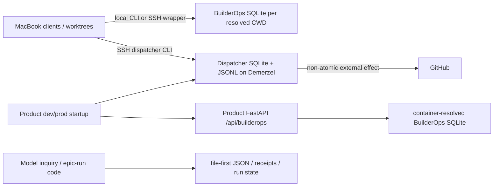
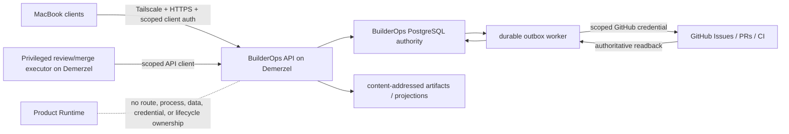

State: Advisory architecture audit snapshot, 2026-07-15. Evidence baseline: `origin/main` at `1e66c16120a9bbd0b1c91c3b50162be805d407c7`; PR/Issue state observed the same day. Subordinate to owner docs and ADRs. Executable handoff: `docs/BUILDEROPS_CONTROL_PLANE/`.
Doc role: Reference (architecture audit)
Authority: Evidence and synthesis only. ADR-0010 owns the authority seam; proposed ADR-0062 owns the target decision after acceptance; GitHub Issues own implementation work.
Owner: BuilderOps governance / Architecture spine
Temporal class: Point-in-time audit; refresh rather than silently treating live-state claims as current.

# BuilderOps independent control-plane audit — 2026-07-15

## 1. Question and method

This audit resolves one architecture question: what must change for BuilderOps to become a permanent,
API-first control plane on Demerzel without transferring product or delivery authority?

The pass inspected the current BuilderOps store/API, dispatcher, Product startup and Compose
topology, deployment/health/backup contracts, open ADR PR #3691, issue #3686 / PR #3695, and the
existing Demerzel orchestration work in issue #3603 / PR #3620. Three independent read-only evidence
passes covered runtime/persistence, Demerzel operations, and backlog reconciliation. No live host was
queried, so host claims below are limited to repository-recorded evidence.

## 2. Authority baseline

ADR-0010 remains the governing boundary:

- repo files and accepted ADRs own durable repository truth;
- GitHub Issues own executable task contracts;
- PR head SHA, required CI, review gates, protection rules, and merge results own delivery truth;
- BuilderOps may own volatile/durable operational coordination, evidence, and promotion intent; and
- a projection or BuilderOps receipt cannot silently supersede repo/GitHub authority.

The proposed target conforms to that split. PostgreSQL becomes the single authority only for the
BuilderOps operational plane, not for product behavior or delivery acceptance.

## 3. Current topology

Evidence:

- `app/api/app.py:92-95,274-277` imports and mounts BuilderOps in Product FastAPI;
- `scripts/start_full_system.sh:847-884` invokes BuilderOps/dispatcher bootstrap as part of Product
  dev/prod startup;
- `app/builderops/config.py:9-46`, `app/builderops/boundary.py:43-63`, and
  `scripts/builderops_cli.sh:25-46` resolve and initialize local SQLite authority;
- `docker-compose.yaml:71-168,363-368` has no BuilderOps service or volume;
- `app/dispatcher/config.py:11-62` and `docs/AGENT_ISSUE_DISPATCHER.md:234-244` define a separate
  dispatcher SQLite/JSONL authority;
- `app/builderops/model_inquiry.py:81-174` and `app/builderops/epic_run_state.py:83-201` add
  authority-bearing file state outside the generic store; and
- `docs/AGENT_ISSUE_DISPATCHER.md:540-563` documents SSH-wrapped direct CLI access rather than a
  service API.

## 4. Ranked findings

### F1 — Critical: authority is fragmented and clients can create authority locally

The generic store, dispatcher, model-inquiry files, and epic-run JSON do not share one transaction or
one location. The same default BuilderOps path resolves relative to the invoking worktree/container.
Issue #3686 is the observed worktree form; host bootstrap vs. container resolution adds another path.
Local CLI construction creates the database instead of failing when a shared authority is absent.

Impact: mutually invisible leases, conflicting idempotency results, incomplete receipt history, and
an inability to prove which database was authoritative.

### F2 — Critical: Product Runtime owns the BuilderOps process and HTTP route

Product startup bootstraps BuilderOps/dispatcher and Product FastAPI publishes BuilderOps routes. No
independent lifecycle, image pin, database, migration, health, backup, or credential boundary exists.

Impact: Product deployment can start, stop, relocate, or publish BuilderOps; BuilderOps cadence and
merge credentials cannot be isolated from Product blast radius. The proposed ADR's T2 extraction
trigger is met.

### F3 — High: remote mutation has no BuilderOps-specific authentication boundary

`app/api/routes/builderops.py:12-159` applies no authentication dependency, and API tests mutate
through Product FastAPI without a key. Tailscale is private routing, not application identity.

Impact: exposing the current route to MacBook clients would make caller identity, scope, rotation,
and revocation undefined and would put authority-bearing mutations behind the wrong trust zone.

### F4 — High: state plus external effects are not atomically recoverable

The generic SQLite store has useful local transactions for records/idempotency/leases/receipts, but
no outbox. Dispatcher DB changes and JSONL append are separate, and GitHub promotion calls happen
between separately written intent and receipt artifacts.

Impact: crash/time-out windows can leave ambiguous external effects, missing receipts, duplicate
attempts, or event projections that disagree with durable state.

### F5 — High: Demerzel orchestration is being built against the authority being retired

Issue #3603 and PR #3620 correctly own review/repair/verification/merge orchestration, recovery,
idempotent ingest, and host-authenticated execution, but their durable ledger extends dispatcher
SQLite.

Impact: merging the orchestration unchanged would deepen the obsolete store and force a second
migration. The orchestration logic should be retained and adapted to the BuilderOps API/PostgreSQL
authority after its foundation exists.

### F6 — High: no production-grade BuilderOps backup/restore or cutover contract exists

The Product deployment has reusable Compose/PostgreSQL/migration/pin patterns, but its production
operations provide forensic dumps rather than a scheduled, proved restore lifecycle. BuilderOps has
no separate backup surface at all.

Impact: moving authority without inventory, pre-import backup, restore drill, and one-way cutover can
lose leases/history or make SQLite the accidental rollback authority.

## 5. Research-question resolution

### RQ1 — What is the correct authority and topology?

One independent BuilderOps service boundary on Demerzel, reached only through an authenticated API,
with one PostgreSQL operational authority. MacBook clients and host executors are API clients; only
the control-plane data layer talks to PostgreSQL. Product Runtime owns none of it.

### RQ2 — What must be atomic?

Idempotency, guarded state transition, lease/fencing validation, append-only receipt, and outbox
intent commit in one PostgreSQL transaction. External GitHub effects use at-least-once outbox
delivery plus deterministic reconciliation and authoritative readback. This is not false
"exactly-once GitHub"; it is exactly-one accepted local transition with reconciled external effect.

### RQ3 — How does cutover avoid silent loss or split brain?

Inventory and freeze every SQLite/JSONL/JSON authority source, hash it, dry-run a versioned read-only
import, preserve provenance, quarantine conflicts, invalidate live leases into a new authority epoch,
back up before import, reconcile counts/hashes, cut all clients to the API, then disable legacy
writers and archive sources read-only. No rollback path re-enables SQLite.

### RQ4 — Where does merge authority live?

In a privileged Demerzel executor with repo-scoped GitHub permission and host-local model sessions.
It is a BuilderOps API client, not a database client. It may execute only an outbox/attempt that
passed issue/SHA/CI/review/protection gates and becomes terminal only after GitHub readback. General
clients and Product Runtime never receive merge credentials.

### RQ5 — How independent is the lifecycle?

Operationally independent now: separate Compose project, database service/volume/role/secrets,
migrations, release pin, health/readiness, probe, backup/restore, and receipts. Source code may remain
in this repository behind a hard build/package seam until a later source-repository extraction
trigger fires.

## 6. Target topology

Minimum deployable unit:

- independent BuilderOps Compose project with `api`, migration gate, outbox/worker, and PostgreSQL;
- separate persistent volume, database role/secret, immutable release pin, and schema lineage;
- `/healthz` for process liveness and `/readyz` for database/schema/outbox readiness;
- structured secret-safe status for queue age, dead letters, lease conflicts, API auth failures,
  GitHub rate-limit/credential state, and executor heartbeat;
- scheduled encrypted backup outside the database volume, retention, and a disposable restore drill;
  and
- a host-level probe independent of Product `/readyz` and Product worker heartbeat.

## 7. Invariant kernel

| ID | Class | Invariant | Planned enforcement |
|---|---|---|---|
| BCP-INV-01 | MUST | Every production authority-bearing client uses authenticated API; no direct DB/local fallback. | client contract tests + static inventory gate |
| BCP-INV-02 | MUST | Exactly one production PostgreSQL authority epoch exists. | schema metadata + startup/readiness gate |
| BCP-INV-03 | MUST | State, idempotency, receipt, and outbox intent commit atomically. | transaction/fault-injection tests |
| BCP-INV-04 | MUST | External effects become terminal only after deterministic reconciliation/readback. | outbox crash-window tests |
| BCP-INV-05 | MUST | Lease fencing rejects stale workers across expiry/restart. | concurrent claim/heartbeat tests |
| BCP-INV-06 | MUST | Product Runtime owns no BuilderOps route, process, data, credential, or health path. | architecture/Compose route-removal gate |
| BCP-INV-07 | GATE | Independent migrations, backup, restore drill, release pin, and health pass before cutover. | deploy/cutover receipt |
| BCP-INV-08 | GATE | All legacy stores are inventoried, frozen, reconciled, and archived; live leases are not imported. | migration manifest + reconciliation receipt |
| BCP-INV-09 | MUST | Merge credentials are repo-scoped and unavailable to Product/general clients. | secret/permission inventory + negative auth tests |
| BCP-INV-10 | DOCTOR | Outbox age/dead letters, lease conflicts, credential/rate-limit state, and executor heartbeat are visible without secrets. | status/metrics contract |

These are target-state invariants. They enter `docs/testing/invariant-tests.md` only with the task
that lands their executable enforcement; this audit does not claim they are shipped.

## 8. Reconciliation with existing work

| Surface | Disposition |
|---|---|
| PR #3691 / ADR-0062 | Canonical decision surface; update in place. |
| Issue #3686 / PR #3695 | Preserve as fragmentation evidence and migration inventory; host-stable SQLite target is superseded before merge. |
| Issue #3603 / PR #3620 | Reuse orchestration and executor work; adapt its state/claim boundary to BuilderOps API/PostgreSQL after foundation tasks. Do not create a second orchestrator. |
| Issue #3690 | Reuse as post-acceptance owner-doc enactment; replace host-stable SQLite wording. |
| Issue #3174 | Retains repo-explicit skill-targeting/promotion-copy scope; do not duplicate it in control-plane runtime tasks. |
| Issue #3288 / model-inquiry specs | Preserve capability; migrate file-only terminal state/receipts into the control plane while retaining hash-addressed artifacts. |
| Issue #3224 | Retains autonomous review/repair/closure validation-hub role. |

## 9. SBS reconciliation

- **Conforms:** BuilderOps remains a Builder System enabling system around the Product, as
  `docs/architecture/SBS_OPERATING_MODEL.md §3` requires.
- **Extends:** the Builder System gains an explicit independently deployed control-plane unit and
  API/client boundary.
- **Does not reshape Product SBS:** removing Product-owned BuilderOps routes/startup restores the
  existing authority/classification seam; it does not add a Product subsystem.
- **Required later writeback:** issue #3690 updates the SBS operating model and Builder System
  process map only after ADR acceptance and implementation truth permits the relevant claims.

## 10. Recommendation and handoff

Accept the revised ADR-0062 and execute `docs/BUILDEROPS_CONTROL_PLANE/` in dependency order. Do not
merge host-stable SQLite or SQLite-backed orchestration as the production target. Start runtime work
only after the decision/spec contract is merged and each issue has resolvable `Verify:` targets.

No unresolved owner decision blocks that sequence. Authentication technology, ports, backup target
and retention values, schema layout, and later source-repository extraction are bounded
implementation/later-trigger decisions subject to the invariants above.
