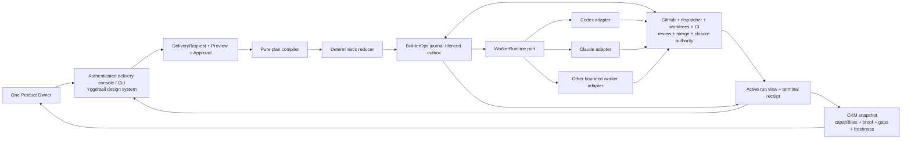

State: Advisory architecture audit snapshot, 2026-07-28. Repository baseline: `origin/main` at `53e0d5cf25928ee83bfd0b2dee766e124a2302b0`; live GitHub reconciled the same day. Subordinate to owner docs, accepted ADRs, and executable GitHub Issues. Normative reconciliation is recorded in `docs/DETERMINISTIC_DELIVERY_ORCHESTRATION/`.
Doc role: Reference (architecture audit)
Authority: Evidence and synthesis only. Existing DDO parent #4163 and children #4167–#4170 own executable work; GitHub, dispatcher leases, exact PR heads, CI, review, merge, and closure evidence retain delivery authority.
Owner: Builder System governance / Architecture spine
Temporal class: snapshot
Review cadence: event-driven
Source of truth: mixed
Last reviewed: 2026-07-28
Last verified against: `origin/main` `53e0d5cf25928ee83bfd0b2dee766e124a2302b0`, live GitHub #4080 and #4163–#4170, and the official external sources linked in section 9

# Builder delivery agent operating system audit — 2026-07-28

## 1. Question and method

This audit answers the architecture question behind the owner's request:

> How should one Product Owner direct a workforce of AI agents from a capability cockpit, how do
> the pieces fit together from intent to accepted delivery, which steps must be deterministic, how
> does runtime recovery work, and should Yggdrasil adopt or borrow from an external agent operating
> system?

The pass used:

- three independent read-only Sol/high evidence reviews over CKM/cockpit, DDO/BuilderOps, and worker
  runtimes;
- a live REST reconciliation of #4080, #4163–#4170, relevant merged PRs, and `origin/main`;
- the decisions and user stories recorded in the owner conversation that led to this audit;
- model-inquiry provenance from `inq_20260728T162342Z_5ac617b7`; the inquiry ended in
  `provider_error` with terminal receipt
  `receipt_inq_20260728T162342Z_5ac617b7_run_terminal`, so no provider answer is treated as evidence;
- three subsequent independent Sol/high role simulations covering ecosystem strategy, durable
  runtime, and cockpit/handoff governance; and
- current official documentation for candidate external runtimes and coding-agent harnesses.

The audit does not authorize runtime implementation by itself. It reconciles the already-filed DDO
capability so its next slice can become a strict Issue contract without creating a parallel epic.

## 2. Plain-language resolution

Yggdrasil should **not adopt another product as its complete agent operating system**.

Yggdrasil already owns the parts that must remain authoritative:

- what work is approved;
- which Issues belong to the delivery;
- who holds the active lease;
- which exact plan and PR head are current;
- whether tests and review passed;
- whether retry is safe after a crash;
- which Issues may be merged and closed; and
- what evidence makes a capability accepted.

Codex, Claude, and later coding agents should plug in as **replaceable workers** behind one
Yggdrasil-owned worker contract. A durable workflow product may later carry wake/sleep, queues, and
restart, but it must never become a second authority for GitHub effects or delivery truth.

The future owner experience is therefore:

1. open one capability;
2. see the proof that exists and what is missing;
3. inspect a plain-language delivery preview;
4. approve the exact preview;
5. let deterministic code advance all routine steps;
6. be interrupted only for a decision the explicit authority rules reserve for the owner; and
7. receive an accepted, partial, blocked, failed, cancelled, or superseded terminal result with
   links to proof.

The static CKM Cockpit remains read-only. A separate authenticated delivery console or command/API
owns approval and control. Any future interactive surface must use the governed Yggdrasil Design
System workflow.

## 3. Live baseline

### 3.1 Delivered

- CKM Direction B is delivered and independently accepted. Parent #4080, children #4081–#4086,
  completion #4222, and their delivery PRs are terminal.
- `ckm overview --cockpit` exists on `main` and renders a deterministic, local, non-authoritative
  snapshot from one captured projection batch
  (`app/builderops/cli.py:725-788`,
  `app/builderops/ckm/overview_html.py:1100-1261`).
- DDO-01 #4164, DDO-02 #4165, and DDO-03 #4166 are closed.
- Carrier-neutral semantic delivery contracts exist
  (`app/builderops/delivery_orchestration_contracts.py:28-48,3126-3144`).
- The pure v2 plan compiler exists and produces deterministic plans or typed refusals
  (`app/builderops/delivery_plan_compiler.py:301-353`).
- BuilderOps already has a PostgreSQL transaction/outbox kernel with fencing, unknown-effect
  reconciliation, and durable receipts
  (`app/builderops/control_plane/migrations/0001_transaction_kernel.sql:101-198`,
  `app/builderops/control_plane/store.py:1756-1868`).
- Existing verified merge/closure code binds exact head and exact Issue authority and records the
  continuous prepared → merged → reconciled → restored phase chain
  (`app/dispatcher/verified_merge.py:327-417,829-925,1034-1144`).
- The Yggdrasil design-handoff gate is delivered and fails closed unless the live Yggdrasil Design
  System and repo token source match
  (`.codex/skills/yggdrasil-design-handoff/SKILL.md:27-48`).

### 3.2 Open target work

- #4167: deterministic reducer and bounded adapters;
- #4168: durable delivery-effect binding and recovery;
- #4169: governed CKM initiation and receipt projection; and
- #4170: TCD, fault-recovery, and capability acceptance.

### 3.3 Drift corrected by this delivery

The Direction B code and live GitHub state are terminal, but several checked-in docs still say
Direction B is pre-acceptance and #4080 is open. The owner-doc and temporal corrections travel in
the same PR as this audit.

DDO lifecycle text also lags live GitHub: `docs/DOCS_INDEX.md` and parts of the DDO README still
describe #4164 and #4165 as not delivered.

## 4. Owner operating stories

These stories preserve the conversation in durable, testable language. They describe the target
operator experience, not current shipped behavior unless explicitly stated.

### US-AOS-01 — Understand one capability

As the Product Owner, I can open a capability such as “YouTube” and see:

- what the capability promises;
- which specifications define it;
- which code and tests provide evidence;
- what has been accepted;
- what evidence is missing or stale; and
- what remains before the selected meaning of “delivered” is true.

Specs, code, and tests must be first-class proof groups, not something I must infer from technical
artifact metadata.

### US-AOS-02 — Know who can decide

As the Product Owner, I see exactly one of:

- **AI can continue** — explicit policy authorizes the next bounded action;
- **Needs your decision** — a named authority rule reserves the decision for me; or
- **Blocked by evidence/system** — no decision can legitimately unblock it yet.

The renderer never guesses. Missing, conflicting, or ambiguous rules fail closed to
**Needs your decision**.

### US-AOS-03 — Preview before approval

As the Product Owner, I can inspect scope, exclusions, dependency waves, risk, budget, estimated
TCD, and the chosen meaning of “delivered” before approving anything.

The preview is read-only. Approval binds the exact canonical preview/request hashes. Any scope or
authority drift requires a new preview and approval.

### US-AOS-04 — One deliberate start action

As the Product Owner, after reading the preview I can start delivery with one deliberate action.
That action approves an exact immutable request; it does not give a UI general mutation authority.

### US-AOS-05 — Direct single-Issue path

As the Product Owner, an exact strictly ready single Issue can go directly through `issue-to-code`
without a synthetic epic.

### US-AOS-06 — Capability/issue-set path

As the Product Owner, a capability, epic, or explicit multi-Issue set is planned through
`deliver-issue-set`. After approval, deterministic code admits work, advances dependency waves, and
invokes bounded workers. No routine worker-to-worker coordination is required.

### US-AOS-07 — Follow a live run

As the Product Owner, I can see which wave and step are active, what the system is waiting for, the
current exact PR head, which gate is next, and whether the run is active, paused, cancelling,
blocked, or terminal.

This live operational view is separate from the static CKM knowledge snapshot.

### US-AOS-08 — Be notified only when useful

As the Product Owner, I am notified only when:

- a decision is explicitly mine;
- a run becomes unexpectedly blocked;
- an accepted budget/policy limit is reached; or
- the run is terminal.

Routine CI waits, lease renewals, and deterministic transitions do not demand attention.

### US-AOS-09 — Control a run safely

As the Product Owner, I can request pause, resume, cancel, or supersession. Each command is typed,
authenticated, idempotent, and subject to the current run version and effect state. A cancellation
request never pretends that already-committed external effects were undone.

### US-AOS-10 — Recover without duplicate work

As the Product Owner, a restart does not create a second worker, PR, merge, or closure. The system
distinguishes:

- definitely not started;
- active and reattachable;
- terminal;
- unknown and requiring readback; and
- safe to retry.

### US-AOS-11 — See why a worker was chosen

As the Product Owner, every model/provider choice shows its role, capability tier, reasoning
effort, cost/quality reason, fallback posture, and actual usage. A cheaper single call is not treated
as cheaper if it creates more rework or human steering.

### US-AOS-12 — Require independent exact-head review

As the Product Owner, final review is independent of implementation and binds the exact current
head. A new commit invalidates prior CI/review evidence.

### US-AOS-13 — Close the knowledge loop

As the Product Owner, terminal delivery evidence triggers a CKM reevaluation. The next generated
cockpit snapshot links the exact receipt, shows freshness and limitations, and retains the last
known-good artifact if regeneration fails.

### US-AOS-14 — Work without the cockpit

As the Product Owner, the governed CLI/API remains usable when CKM rendering or the interactive
console is unavailable. The knowledge projection is never a delivery availability dependency.

### US-AOS-15 — Learn the surface cheaply

As the Product Owner, the accepted interactive surface includes a short plain-language walkthrough.
The preferred artifact is a 3–5 minute screen recording with captions produced after the flow is
stable, not a costly custom film.

## 5. Target topology



The arrows do not transfer authority:

- CKM proposes and explains; it does not execute.
- the UI authenticates commands; it does not decide hidden policy;
- the compiler is pure;
- the reducer decides legal transitions, not external truth;
- BuilderOps makes effects durable and reconcilable, not authoritative;
- workers implement or review but cannot self-expand their authority; and
- GitHub/dispatcher/exact-head evidence remains the effect boundary.

## 6. Decision ownership

| Decision | Owner | Examples |
| --- | --- | --- |
| Product intent and irreversible authority | Product Owner | capability scope, external policy, approval, override of a blocking invariant |
| Routine delivery progression | Deterministic code | readiness, dependency waves, claims, fencing, waits, retry eligibility, current-head invalidation, closure eligibility |
| Bounded cognition | Model worker | implementation, architecture analysis, novel diagnosis after deterministic classification, independent review |
| Durable execution and reconciliation | BuilderOps | event/effect journal, idempotency, unknown-state readback, receipts, active-run projection |
| Delivery authority | External live systems | GitHub Issue/PR state, dispatcher lease, worktree/branch truth, CI check identity, merge and closure evidence |
| Knowledge projection | CKM | derived capability/evidence/gap/freshness view and reevaluation signal |

The one-owner deployment does not need multi-principal consensus or Byzantine trust. It does need
exact hashes, immutable evidence, authentication, fencing, and fail-closed ambiguity handling.

## 7. Contract reconciliation

### G1 — Separate request, preview, and approved initiation

Current `DeliveryInitiation.v1` requires `ApprovalEvidence`
(`app/builderops/delivery_orchestration_contracts.py:429-515`), and the compiler accepts only that
type (`app/builderops/delivery_plan_compiler.py:336-353`). DDO-06 nevertheless promises compiler
preview before approval.

The reconciled contract is:

1. `DeliveryRequest.v1` — canonical proposed scope, exclusions, policy, budget, acceptance profile,
   source authorities, and projection provenance; no approval;
2. `DeliveryPreview.v1` — pure compiler result over the exact request and live planning snapshot,
   including request/snapshot/preview hashes, waves or typed refusals, risk, and estimated TCD; and
3. `DeliveryInitiation.v2` — approval evidence binding the exact request and preview hashes plus
   current authority freshness.

`DeliveryInitiation.v1` remains readable evidence for delivered DDO-02/03 history. New execution
must not fabricate approval to obtain a preview.

### G2 — Define one provider-neutral WorkerRuntime seam

The repository currently has:

- prose `subagent_handoff_receipt`;
- runtime-neutral but launch-unbound `StructuredWorkerResult`;
- Codex-specific `CoordinatorLauncher`/`CodexExecLauncher`;
- model-inquiry adapters; and
- generic BuilderOps outbox recovery.

No single contract binds the pack, invocation, effect, provider session, and result.

The reconciled seam is:

#### `worker-context-pack.v1`

- context-pack ID and canonical content hash;
- run, plan, effect, Issue authority, and contract-hash refs;
- role and required skills;
- source anchors plus the complete AC/`Verify:` ledger;
- constraints, out of scope, classification, and authority limits;
- base SHA, expected branch, and isolated worktree;
- allowed effects/tools, validation commands, stop conditions, repair budget, cancellation token,
  and deadline;
- return schema; and
- provenance.

#### `worker-invocation.v1`

- invocation ID;
- context-pack ref/hash;
- run/plan/effect refs;
- adapter/runtime target;
- requested and effective provider/model/reasoning identity;
- credential/session reference class without secrets;
- sandbox/tool policy;
- start deadline and heartbeat policy;
- idempotency key; and
- provenance.

Provider, model, effort, and credentials belong here, not in the semantic context pack.

#### `worker-result.v2`

- result ID and status;
- exact context-pack and invocation refs;
- run, plan, effect, Issue authority, and contract hash;
- branch/worktree, exact head, PR, and changed files;
- AC-by-AC verdicts and validation evidence;
- lifecycle mutations and BuilderOps routing;
- owner-doc result;
- typed exceptions, residual risk, and next legal action;
- actual usage/TCD evidence; and
- provenance.

Free text may explain a result but must never drive a reducer transition.

#### `WorkerRuntimePort`

The port must provide typed operations equivalent to:

- `start`;
- `inspect`;
- `heartbeat`;
- `interrupt`;
- `reattach`;
- `await_terminal`; and
- `cancel`.

The port must distinguish `not_started`, `starting_unknown`, `running`, `idle`, `terminal`,
`unreachable`, and `cancelled`. The same invocation/idempotency key starts at most once:
`not_started` permits its first start; terminal readback returns the recorded result and never
launches again. A retry after terminal failure requires a new reducer-authorized effect and
invocation identity within the repair budget.

### G3 — Make lifecycle controls first-class

The current reducer event vocabulary has no pause, resume, cancel, or supersede command
(`app/builderops/delivery_orchestration_contracts.py:969-993`), while the DDO spec already describes
pause and supersession.

The reducer contract must add authenticated, version-bound control requests and observed outcomes.
Commands do not perform effects directly. The reducer emits the next legal effect or records why it
cannot yet comply.

Additive `DeliveryReceipt.v2` must include `superseded` as a terminal outcome, bind the immutable
acceptance profile, and retain both the superseded run identity and the superseding
request/initiation reference. `DeliveryReceipt.v1` remains readable history and is not
reinterpreted.

### G4 — Separate active status from CKM knowledge

BuilderOps owns a rebuildable `DeliveryRunView.v1` derived from journal/effect/live-authority
evidence. It includes current wave, per-Issue phase, wait reason, worker invocation status, PR/head,
gate status, owner-decision request, last transition, next legal transition, and freshness.

This is the live console source. CKM consumes terminal receipts and optional linked run summaries
only as derived evidence; it does not become the live state store.

### G5 — Name what “delivered” means

The current receipt proves a GitHub-merged-and-closed delivery. Capabilities may require a stronger
terminal profile. `DeliveryAcceptanceProfile.v1` therefore names the selected gate, for example:

- `github_merged`;
- `test_verified`;
- `promoted_to_test`; or
- `production_verified`.

The chosen profile is part of request, preview, initiation, immutable initial reducer state, and
receipt identity. `DeliveryPlan.v1` remains byte-compatible; DDO-04 binds the exact profile reference
and hash alongside the plan in initial run state, preserves it through fenced transitions and
effects, and repeats it in `DeliveryReceipt.v2`. A run cannot change its meaning of “delivered” after
approval. DDO-04 defines the versioned profile before its reducer or any downstream slice depends on
it; DDO-06 preserves the binding across the authenticated handoff, and DDO-07 validates profiles in
pilots rather than inventing the schema late.

### G6 — Human notification is a projection of typed state

Notifications are emitted only for a typed `OwnerDecisionRequest`, unexpected terminal blocker,
budget/policy exhaustion, or terminal receipt. They are derived outputs and never authorize state
changes.

## 8. Worker/runtime conformance and fault matrix

Any Codex, Claude, GitHub-hosted, local, or future adapter must pass the same conformance suite:

For conformance only, a **normalized result payload** is the projection of a fully validated
`worker-result.v2` onto shared delivery-domain fields: status, run/plan/effect/Issue/exact-head
authority, AC verdicts, validation, lifecycle outcome, typed exceptions, owner-doc result, and next
legal action. The harness preserves exact context-pack, plan, reducer-authorized worker-launch
effect, Issue, and head identities; maps valid invocation identities to fixture placeholders; and
excludes invocation/carrier/provider/model/session/usage/provenance envelope values from equality.
Every envelope field remains mandatory in production. Raw result and downstream event bytes are not
expected to match across carriers.

| Case | Required result |
| --- | --- |
| Same context pack through two adapters | Exact context-pack, plan, worker-launch effect, Issue, and head identities plus the same normalized result payload; complete invocation/carrier/provider/model/session/usage/provenance envelopes remain explicit and may differ |
| Crash before provider accepts start | `not_started` or evidenced `starting_unknown`; no fabricated session |
| Crash after provider start before session receipt | readback/reattach; the same invocation identity never starts again |
| Duplicate start with same idempotency key | one logical invocation |
| Context or Issue authority changes before start | fail closed; new pack/plan required |
| Result uses another invocation or pack | reject |
| Result uses stale PR head | reject and invalidate dependent CI/review |
| Parent/coordinator authority is lost | interrupt/terminate or fail closed per adapter contract |
| Cancel races with an external effect | reconcile the effect; receipt distinguishes committed work |
| Adapter is unreachable | no authority inference; typed unavailable/unknown state |
| Free-text summary contradicts typed result | typed result governs; contradiction is evidence |
| Restart after terminal result | reattach/read terminal result; never launch again |

Provider adapters may add detail but may not:

- claim Issues independently;
- mutate GitHub lifecycle outside an emitted authorized effect;
- choose new scope;
- weaken sandbox/tool policy;
- retry unknown side effects blindly;
- hide provider/model/fallback identity; or
- report dry-run/mock output as real execution.

## 9. External ecosystem decision

| Candidate | Useful capability | Decision | Boundary |
| --- | --- | --- | --- |
| OpenAI Codex SDK/CLI | coding threads, resume, programmatic local control | Adopt as a worker adapter | Never the DDO reducer, effect authority, or durable journal |
| Claude Agent SDK / Managed Agents | coding-agent sessions, tools, event stream, interrupt/status | Adopt as a worker adapter when credentials and conformance are available | Same provider-neutral pack/result and effect boundary as Codex |
| DBOS | Postgres-backed durable workflows, queues, IDs, recovery | Bounded proof of concept only after native DDO reducer/outbox exists | Carrier owns liveness only; BuilderOps/GitHub retain semantic state and authority |
| Restate | durable execution and invocation semantics | Reference/alternative if DBOS POC fails its exit criteria | Do not introduce a second journal or authority |
| Temporal | mature durable workflow reference model | Inspiration, not the first implementation | Operational weight is unjustified for the current one-owner deployment |
| LangGraph | durable stateful model graphs and human interrupts | Use only inside a bounded cognitive worker if needed | Never replace deterministic DDO progression or GitHub authority |
| GitHub Agentic Workflows / third-party coding agents | hosted repository automation and coding-agent execution | Optional low-risk carrier pilot | Public-preview surface; use declared safe outputs and still return Yggdrasil receipts |
| CrewAI/AutoGen-style multi-agent frameworks | conversational multi-agent coordination | Do not use as the core | Adds model-decided coordination where DDO is explicitly removing it |

Official evidence:

- [OpenAI Codex SDK](https://learn.chatgpt.com/docs/codex-sdk) exposes programmatic threads and
  resume and explicitly positions Codex as a specialist inside broader orchestration.
- [Claude Managed Agents migration](https://platform.claude.com/docs/en/managed-agents/migration)
  distinguishes an operator-run Agent SDK process from Anthropic-managed sessions, while
  [session events](https://platform.claude.com/docs/en/managed-agents/events-and-streaming) expose
  status and interrupts.
- [DBOS workflows](https://docs.dbos.dev/python/tutorials/workflow-tutorial) provide durable
  recovery, workflow IDs/idempotency, and queues over Postgres; these are carrier properties, not
  Yggdrasil delivery authority.
- [Restate durable execution](https://docs.restate.dev/foundations/key-concepts#durable-execution)
  and [Temporal workflows](https://docs.temporal.io/workflows) remain comparison references.
- [LangGraph interrupts](https://docs.langchain.com/oss/python/langgraph/interrupts) restart a node
  on resume and require idempotent side effects, reinforcing rather than replacing the DDO effect
  boundary.
- [GitHub Agentic Workflows](https://docs.github.com/en/copilot/concepts/agents/about-github-agentic-workflows)
  are public preview, read-only by default, and constrain writes through declared safe outputs.

### DBOS proof-of-concept gate

A DBOS POC is allowed only after #4167 and the native #4168 binding establish the semantic
reference implementation. The POC uses one representative worker-launch/wait/recovery flow and must
prove:

- the exact DDO plan and reducer-authorized worker-launch effect identity remain unchanged, while
  the normalized delivery-domain result matches and complete
  invocation/carrier/provider/model/session/usage/provenance envelope fields may differ explicitly;
- no DBOS record directly authorizes GitHub;
- carrier state can be discarded and reconstructed from BuilderOps plus live GitHub;
- the complete fault matrix passes with no duplicate invocation/effect;
- pause/cancel/supersession semantics remain owned by DDO; and
- measured TCD is lower than the native carrier for the accepted delivery, including operator and
  operational cost.

Abandon the POC if it creates a second semantic journal, requires unfenced blind retry, hides an
unreconstructable state, adds a production service without measured human-time benefit, or makes
the delivery dependent on a vendor control plane.

## 10. Cockpit and projection loop

The cockpit already implements a trustworthy static capability snapshot, but specs/code/tests are
not yet first-class proof groups and it has no live-run or explicit owner-decision view.

The target loop is:

1. delivery records a terminal `DeliveryReceipt.v2`;
2. a projection updater consumes the receipt and advances a CKM source watermark;
3. CKM reevaluates only affected capabilities;
4. a new immutable cockpit snapshot is generated with generation time, state identity, digest,
   watermarks, source refs, and limitations;
5. publication switches to the new snapshot only after successful complete generation; and
6. on failure, the last-good snapshot remains visible with an explicit stale/regeneration warning.

Manual regeneration and the governed CLI/API remain available.

The static cockpit stays network-free and non-mutating. A future authenticated console may display
the static snapshot and live run view together, but it is a separate surface and must enter through
`.codex/skills/yggdrasil-design-handoff/SKILL.md`.

## 11. Owner-language map

Technical names remain in contracts and receipts, but the owner surface uses these explanations:

| Contract term | Owner-facing language |
| --- | --- |
| Capability | What the system should be able to do |
| Evidence | Proof we currently have |
| Gap/finding | Proof or work that is missing |
| Delivery request | Proposed work |
| Preview | Exactly what will be attempted |
| Approval hash | Proof that the approved plan did not change |
| Wave | Work that can safely run at the same time |
| Lease/fence | Protection against two agents doing the same work |
| Exact head | The precise code version being tested/reviewed |
| Reconciliation | Check what actually happened before retrying |
| Acceptance profile | What “delivered” means for this capability |
| Terminal receipt | Final result and its proof |
| Superseded | Replaced by a newer approved attempt |

This map addresses technical language, not Swedish-versus-English translation.

## 12. Invariant kernel

| ID | Class | Invariant | Enforcement owner |
| --- | --- | --- | --- |
| AOS-01 | MUST | No projection, carrier, model session, or local checkpoint grants GitHub effect authority. | DDO reducer/effect adapters |
| AOS-02 | GATE | Preview precedes approval; approval binds exact request, preview, and current authority hashes. | DDO-06 contracts/compiler |
| AOS-03 | MUST | Routine progression is a pure deterministic transition over typed evidence. | DDO-04 reducer |
| AOS-04 | GATE | Every worker receives one hash-addressed semantic context pack and one separate invocation. | WorkerRuntime contract |
| AOS-05 | GATE | Every result binds pack, invocation, run, plan, effect, Issue, and exact head where relevant. | WorkerRuntime/result validation |
| AOS-06 | MUST | Unknown start/effect state is read back before retry; one logical action has one idempotency identity. | DDO-05 outbox/reconciliation |
| AOS-07 | MUST | “AI can continue” is emitted only from explicit authority rules; ambiguity needs owner decision. | reducer/owner-decision classifier |
| AOS-08 | MUST | Active-run operational state is separate from CKM knowledge projection. | BuilderOps/CKM boundary tests |
| AOS-09 | MUST | Terminal receipts advance CKM evidence through a rebuildable, freshness-labelled projection. | DDO-06 bridge |
| AOS-10 | GATE | Acceptance meaning is immutable across request, preview, initiation, reducer state, execution, and receipt without changing `DeliveryPlan.v1`. | acceptance-profile contract |
| AOS-11 | GATE | New interactive/visual surfaces use the live Yggdrasil Design System gate. | design-handoff governance |
| AOS-12 | MUST | Model/provider/reasoning/fallback and actual TCD remain visible and never alter semantic scope. | invocation/receipt |
| AOS-13 | GATE | CI/review/merge/closure bind the exact current PR head and authenticated Issue set. | existing verification/closure paths |
| AOS-14 | MUST | Free text never drives a reducer transition. | schema and reducer tests |

These are target invariants. Add them to `docs/testing/invariant-tests.md` only alongside executable
enforcement; this audit does not claim they are shipped.

## 13. Reconciliation with existing DDO work

No new epic or specification directory is required.

| Existing owner | Reconciliation |
| --- | --- |
| #4163 / DDO README | Retain as the sole capability and acceptance hub; add this architecture gate and owner stories |
| #4167 / DDO-04 | Own reducer controls, `DeliveryAcceptanceProfile.v1`, WorkerRuntime port, context/invocation/result bindings, additive `DeliveryReceipt.v2`, and deterministic owner-decision routing |
| #4168 / DDO-05 | Own durable invocation/effect state, reattachment, unknown-start/effect reconciliation, and active-run projection |
| #4169 / DDO-06 | Own request → preview → approval, CKM terminal receipt projection/reevaluation, notification projection, and static-vs-authenticated UI boundary |
| #4170 / DDO-07 | Validate immutable acceptance profiles, conformance/fault matrix, TCD comparison, and any later DBOS POC decision |
| Direction B #4080 | Terminal delivered history; correct stale owner/status docs in this delivery |

The next code slice is still #4167, but it may become `agent:ready` only after its live Issue body
matches the reconciled DDO-04 contract and passes strict readiness validation. #4168–#4170 remain
serially blocked.

## 14. SBS reconciliation

- **Conforms:** this is Builder System work under
  `docs/architecture/SBS_OPERATING_MODEL.md :: Builder System Boundary And Work Classification`.
  It changes no Product/Runtime behavior, memory, HKA authority, or Product SBS.
- **Extends:** the Builder System gains a named WorkerRuntime port, delivery-control vocabulary,
  active-run projection, and capability-to-receipt seam.
- **Does not reshape:** GitHub authority, dispatcher pickup, BuilderOps data ownership, CKM
  projection authority, CES stewardship, and existing Product subsystems remain unchanged.
- **Later reshape trigger:** adopting an external durable runtime as production infrastructure,
  creating a hosted multi-user console, or moving delivery authority away from GitHub requires a
  separate ADR/SBS pass. None is authorized here.

## 15. TCD plan

```yaml
tcd_plan:
  task_summary: Reconcile the CKM-to-delivery architecture and make the existing DDO chain executable without a parallel agent-OS control plane.
  assumptions:
    - one human Product Owner operates the current installation
    - GitHub and existing verified delivery paths remain authority
    - DDO-01 through DDO-03 are delivered
  complexity: very_high
  risk: high
  verification_difficulty: hard
  human_review_burden: high
  defect_blast_radius: high
  budget_pressure: low
  recommended_capability:
    workflow_or_skill: architecture-research -> docs-authoring -> deliver-issue-set
    model_family: Codex Sol
    reasoning_effort: high
    tools:
      - isolated git worktree
      - read-only subsystem explorers
      - GitHub REST
      - focused docs/governance validation
      - independent exact-SHA architecture review
    github_context_required: true
  cheapest_acceptable_path: Amend existing DDO-04 through DDO-07 and correct Direction B truth in one docs PR; do not create another epic or implement a carrier before the native contracts.
  escalation_triggers:
    - provider-neutral worker lifecycle cannot fit DDO-04/DDO-05 without a second authority
    - external carrier requires a new production service or schema authority
    - preview/approval cannot preserve immutable compiler identity
    - two review rounds reject the same stateful mechanism
  deescalation_triggers:
    - contract and regression matrix are fixed
    - implementation is one bounded module with named tests
    - carrier comparison remains a non-production fixture
  review_gate: Independent Sol/high architecture review of the exact docs SHA, then lane CI and merge verification.
```

## 16. Resolution

The architecture decision is:

> Build the Yggdrasil delivery control kernel on the existing DDO, BuilderOps, dispatcher, GitHub,
> and CKM boundaries. Treat Codex, Claude, and other coding agents as replaceable workers behind one
> provider-neutral WorkerRuntime contract. Keep routine progression deterministic and effects
> fenced/reconcilable. Keep the static cockpit read-only, place approval and run control in a
> separate authenticated Yggdrasil-designed surface, and borrow a durable workflow carrier only
> through a bounded conformance POC after the native semantic kernel is proven.

The next implementation authority remains #4167 after its reconciled live contract becomes strictly
ready. This audit creates no competing backlog and makes no current-state claim for the unimplemented
reducer, worker port, CKM bridge, or durable carrier.
