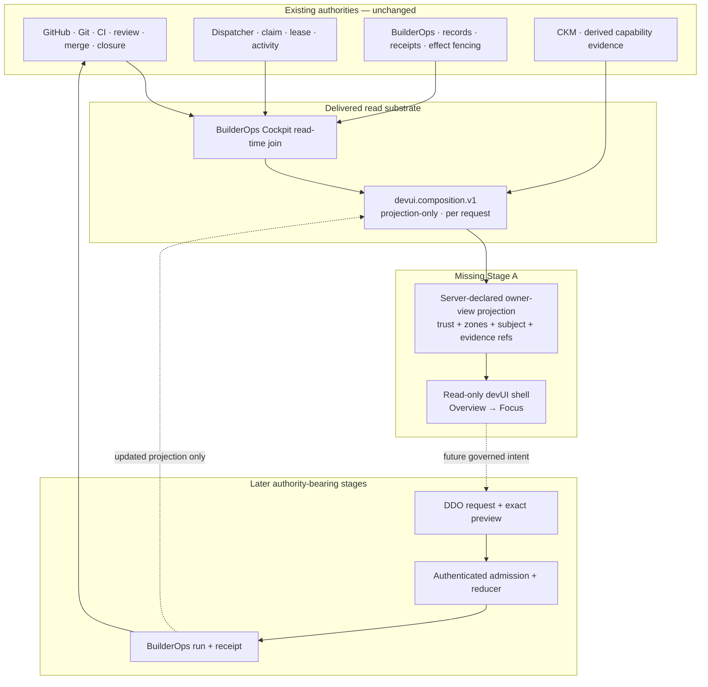

State: Advisory architecture audit snapshot (2026-08-09). Repository baseline: `origin/main` at `47c96567404dea747168c545e1181b5224834422`. Subordinate to current owner docs, accepted ADRs, and live GitHub contracts. The recommended sequencing is not implementation authority until it receives an explicit disposition and is promoted into the owning docs/specification through the normal PR path.
Doc role: Reference (architecture audit and implementation-planning input)
Authority: Evidence-based Builder System structural analysis. Owner docs win on disagreement; this audit changes no runtime, design-system gate, delivery authority, GitHub state, or accepted devUI contract.
Owner: Builder System governance
Temporal class: advisory snapshot
Review cadence: event-driven after owner disposition, a devUI owner-doc/spec promotion, restored external design access, or an authority-bearing BuilderOps/DDO change
Source of truth: `docs/DOCS_INDEX.md` for document routing; `docs/DEVUI.md` for accepted owner functions; `docs/plans/DEVUI_IMPLEMENTATION.md` for current sequencing; cited implementation/tests and live GitHub objects for current delivery state

# Builder System and devUI execution architecture — 2026-08-09

## 1. Charter, classification, and method

This pass reconciles the 2026-08-08 Builder System meta-analysis, the accepted devUI contract, the
delivered `devui.composition.v1` seam, the current repository design assets, and the temporary loss
of Claude Design access. It answers four research questions:

1. What architecture is current after the composition seam merged?
2. What can Codex advance without creating a parallel authority or pretending the external
   Yggdrasil design-system gate has passed?
3. What is the smallest honest read-shell architecture for **Now**, **Needs you**, and **Ready to
   try**?
4. In what order should documentation, specification, implementation, external design validation,
   and later command work proceed?

Classification: **Builder System target-state architecture and planning** at the Builder System/CES
boundary. It does not reshape the Product/Runtime SBS. The work is advisory analysis now; any later
shell implementation is Builder System implementation work. A future authenticated command path is
boundary work because it crosses from an owner-facing Builder surface into DDO/BuilderOps delivery
authority (`docs/architecture/SBS_OPERATING_MODEL.md:70-136`).

Method:

- three read-only evidence briefs covered Builder authority/workflow, devUI code/contracts/tests,
  and design/SBS boundaries;
- every retained structural claim was rechecked against the cited repository source at the baseline
  SHA;
- focused devUI composition/API tests passed at the baseline: 47 tests passed; and
- live GitHub was reconciled on 2026-08-09 before backlog planning.

Local token receipt at the baseline:

```text
shasum -a 256 companion-ui/companion-app/colors_and_type.css \
  app/web/static/colors_and_type.css \
  docs/BUILDEROPS_COCKPIT/design/2026-07-30-cockpit-exploration/colors_and_type.css
=> 7d8cdd49f59061f895959159a08e82348e7e02eb8b8ba7426020a50c7fa915b1 for all three files
```

## 2. Executive verdict

The architecture should **not** be restarted and it does **not** need a new control plane. The
delivered composition seam is the correct evidence substrate: it rebuilds independent Cockpit and
CKM reads per request, preserves their authority and completeness, and turns provider failure into a
typed refusal rather than false emptiness (`app/builderops/devui_composition.py:1-6,331-459`).

The next missing architectural component is a small, server-declared **owner-view projection** between
that substrate and the browser. The current envelope exposes two provider payloads, not owner zones,
selected-subject identity, or normalized owner states (`app/builderops/devui_composition.py:440-459`).
Rendering the raw payload directly in JavaScript would force the browser to reclassify delivery
truth, contradicting the design-governance rule that the server declares authority and the UI renders
it (`companion-ui/docs/DESIGN_HANDOFF_GOVERNANCE.md:100-108`).

Codex can therefore advance most of Stage A without Claude Design, but only after the accepted docs
explicitly distinguish two activities:

- **constrained implementation by reuse** — exact repository tokens, already shipped Cockpit
  patterns, accepted information behavior, and no novel visual language; and
- **new visual exploration or material redesign** — still blocked until the live Yggdrasil
  design-system selection/parity receipt can be produced.

The current owner contract says the detailed visual design must pass the handoff before
implementation, and the current plan repeats that prerequisite (`docs/DEVUI.md:275-304`;
`docs/plans/DEVUI_IMPLEMENTATION.md:84-95`). The design-handoff skill also runs its gate as an
unconditional workflow step for work that creates or changes a visual surface
(`.codex/skills/yggdrasil-design-handoff/SKILL.md:3,27-62`). This audit cannot waive those contracts.
The workflow-correct next move is disposition, `PromotionIntent`, and a bounded governance/owner-doc
change that defines any reuse-only implementation mode before implementation.
When Claude Design access returns, its handoff should review the working shell and propose a delta;
it must not invalidate proven read semantics or force a restart.

## 3. Current architecture after PR #4683



Authority remains distributed by category. GitHub/Git/CI/review/merge/closure own delivery truth;
dispatcher owns volatile coordination; BuilderOps owns durable builder-operational records and
receipts; CKM remains derived and non-authoritative; devUI owns neither their state nor their
transitions (`docs/DEVUI.md:30-58,247-270`).

The composition seam is local-only, GET-only, rejects forwarded identity, and preserves independent
provider failures (`app/api/routes/devui.py:16-101`; `tests/api/test_devui_api.py:97-213`). It is a
sound local single-operator base, not a remote or multi-user UI contract.

## 4. Ranked weakness analysis

Ranking uses systemic impact: blast radius multiplied by silence of failure.

### F1 — Raw provider data is not an owner-view contract

The accepted contract requires three zones and one owner-facing state, reason, next step, action
legality, freshness, and evidence path per item (`docs/DEVUI.md:60-75`). The delivered envelope returns
only `work` and `capabilities` provider contributions (`app/builderops/devui_composition.py:440-459`).
There is no normalized zone, item, focus, command, or receipt object.

If the browser invents this mapping, owner semantics become client policy. A thin server-side,
read-only owner-view projection is therefore the minimal missing seam. It must carry references to
source payload identities rather than copy authority.

### F2 — Current Cockpit vocabulary can create false owner meaning

`Needs you` currently follows the `agent:needs-human` label. The label contract itself requires a
named human decision, tradeoff, missing input, or authority question, so the problem is not that the
label is invalid (`.codex/skills/_shared/LABEL_TAXONOMY.md:18-27`). The provider payload does not carry
that named category into the evidence the owner view must explain
(`app/builderops/cockpit_registry.py:745-780,953-984`). The accepted devUI contract requires the
category and says technical ambiguity stays a system block (`docs/DEVUI.md:109-127`). Until the
structured category is available in the read contract, the owner-view adapter cannot prove the
decision rail's required explanation from the payload alone.

The Cockpit also presents the entire terminal `done` band as “Ready for you to use,” even though
terminal delivery may lack a proven verification receipt (`app/web/static/cockpit.js:182-205`;
`app/builderops/cockpit_chain.py:251-292,469-485`). devUI explicitly distinguishes merged,
delivered, ready-to-try, tried, and accepted states (`docs/DEVUI.md:212-219`). The owner-view adapter
must fail closed: incomplete try evidence stays in **Now**, never in **Ready to try**.

### F3 — State evidence exists, but owner-state normalization does not

Cockpit distinguishes fresh, stale, empty, unavailable, unread planes, and count withdrawals;
CKM carries snapshot completeness and can prove a complete zero-result read
(`app/builderops/devui_composition.py:99-183,186-305`). The wrapper normalizes only provider
`available` versus `refused` and otherwise passes provider vocabularies through
(`app/builderops/devui_composition.py:308-459`).

The owner view needs separate, composable evidence axes rather than one overloaded state enum:

- availability: `available`, `unavailable`, or `refused`;
- freshness: `fresh`, `stale`, or `unknown`;
- coverage: `complete`, `partial`, `unread`, or `missing`;
- cardinality: `nonempty`, `verified_empty`, or `not_countable`; and
- linkage: `linked`, `unlinked`, or `not_assessed`.

This preserves combinations such as fresh-but-unlinked and stale-but-complete. `zero` is a value only
when availability, coverage, and cardinality evidence prove it; it is never a fallback for any
unavailable state.

### F4 — The design gate and the delivery objective are sequenced too coarsely

The repo already contains the binding token sheet, a byte-identical served copy, and shipped Cockpit
patterns for trust framing, evidence, source states, narrow/200%, print, and many-at-once behavior
(`app/web/static/cockpit.html:28-122`; `app/web/static/cockpit.css:1-31,33-145,208-265`). At this
baseline, the binding source (`companion-ui/companion-app/colors_and_type.css`), served copy
(`app/web/static/colors_and_type.css`), and retained Cockpit design copy
(`docs/BUILDEROPS_COCKPIT/design/2026-07-30-cockpit-exploration/colors_and_type.css`) share SHA-256
`7d8cdd49f59061f895959159a08e82348e7e02eb8b8ba7426020a50c7fa915b1`.

The external gate still requires live design-system selection and live/repo token parity before new
visual generation (`companion-ui/docs/DESIGN_HANDOFF_GOVERNANCE.md:42-68`). The problem is not that
the gate is wrong; it is that the plan has only “handoff first” or “no shell.” A governance-promoted
constrained-reuse lane can preserve the gate for new design while allowing implementation of already
accepted behavior with already shipped primitives.

That lane is not implicit in the current `yggdrasil-design-handoff` skill: the skill triggers for a
new visual surface and then instructs the workflow to run the live gate
(`.codex/skills/yggdrasil-design-handoff/SKILL.md:3,50-62`). Avoiding a silent bypass therefore
requires one explicit governance choice. Either keep all visual implementation blocked and advance
only contracts/composer/tests, or promote a narrowly specified reuse-only mode into the skill as
well as the devUI owner docs. This audit recommends the latter, with a fail-closed stop on any new
primitive, token, visual idiom, or unresolved layout decision.

### F5 — Current plans do not yet reflect the delivered seam

The 2026-08-06 audit correctly identifies itself as an earlier snapshot, but its findings and order
still say there is no delivered facade (`docs/audits/DEVUI_ARCHITECTURE_2026-08-06.md:1-8,101-109,137-143`).
Current owner docs and code now record `devui.composition.v1` as delivered
(`docs/DEVUI.md:333-348`; `app/builderops/devui_composition.py:36,440-459`). This audit supersedes only
that snapshot's sequencing input; it does not supersede the accepted owner contract.

### F6 — Builder System process-map backlog rows contain delivered items

The process map still lists deterministic readiness classification, PR evidence-pack generation,
and post-merge docs classification as missing or future work, while their scripts and workflows are
present and wired (`docs/development/BUILDER_SYSTEM_PROCESS_MAP.md:747-761`;
`.github/workflows/issue-pr-governance.yml:162-197`; `.github/workflows/pr-evidence-pack.yml:1-89`;
`.github/workflows/post-merge-docs-classifier.yml:1-83`). This does not block devUI Stage A, but it
means the process map must not be copied mechanically into owner-facing “missing work” claims.

## 5. Research-question resolutions

### RQ1 — What architecture is current?

The current system has a delivered read substrate and no devUI shell. Its stable boundary is:

```text
distributed authorities → source-specific read models → devui.composition.v1
```

The target adds two projections, not one new authority:

```text
devui.composition.v1 → server-declared owner view → read-only browser shell
```

Command/receipt remains a separately authenticated future branch, not an extension of the read
adapter.

### RQ2 — What can Codex advance without Claude Design?

Before owner-doc promotion, Codex can safely produce this audit, a proposed normalized contract,
test fixtures, and a feature breakdown. It must not claim a design receipt or implement a new visual
surface under the current owner-doc wording.

After an accepted disposition and governance/owner-doc promotion, Codex can implement the
constrained read shell using exact existing tokens and proven Cockpit patterns, provided it
introduces no new visual language, design-system extension, source, write path, browser persistence,
or authority. Open visual questions are recorded for the later handoff rather than answered by
invention. Without that governance promotion, Codex can advance only the nonvisual contract,
composer, fixtures, and tests.

When external access returns, Claude Design can inspect the running shell and produce a governed
delta package. Crossing B then normalizes only accepted improvements; already verified read
semantics remain the baseline.

### RQ3 — What is the smallest honest owner-view model?

The minimal model is rebuildable and referential:

```text
OwnerView
  contract_version
  authority = projection_only
  composed_at
  source_composition_ref
  trust {state, blind_spots, withdrawals, source_refs}
  zones {
    now[]
    needs_you[]
    ready_to_try[]
  }

OwnerItem
  subject_ref
  title
  owner_state
  why_shown
  next_step
  action_legal
  evidence_state {
    availability
    freshness
    coverage
    cardinality
    linkage
  }
  evidence_refs[]
  source_refs[]
```

This is a versioned view contract, not a persisted entity. It may point to Cockpit thread IDs and
CKM public IDs only where an existing deterministic join exists. Otherwise it exposes `unlinked` or
`not_assessed`; it never infers a relationship.

### RQ4 — What sequence minimizes rework?

Promote semantics first, then implement the owner-view adapter and fixtures, then the shell, then
visual validation. Command work stays on its existing blocked dependency chain. This lets the later
design handoff improve hierarchy and interaction treatment without changing authority, zone
eligibility, or failure semantics.

## 6. Invariant set

These extend the semantics of `docs/testing/invariant-tests.md`; they do not create a competing
registry. IDs are local audit handles until promoted.

| ID | Category | Invariant | Current enforcement |
|---|---|---|---|
| DVA-01 | MUST | devUI owns no durable delivery, decision, run, receipt, or acceptance state. | Exists — keep: composition is rebuilt per read and projection-only (`app/builderops/devui_composition.py:1-6,440-459`). |
| DVA-02 | MUST | Provider failure, missing evidence, or unread coverage never renders as zero or verified empty. | Partial: provider refusal and stale withdrawals are enforced; owner-view normalization is new (`app/builderops/devui_composition.py:99-183,308-437`). |
| DVA-03 | MUST | The server declares owner zone/state and evidence references; the browser does not reclassify raw provider data. | New; required by the existing server-declares/UI-renders rule (`companion-ui/docs/DESIGN_HANDOFF_GOVERNANCE.md:100-108`). |
| DVA-04 | MUST | `Needs you` requires the named owner-authority category to be present in the rendered read contract; technical ambiguity stays a system block. | Partial: label governance requires a named human reason, but the current provider payload does not expose that category for owner explanation (`.codex/skills/_shared/LABEL_TAXONOMY.md:18-27`; `app/builderops/cockpit_registry.py:745-780,953-984`). |
| DVA-05 | MUST | `Ready to try` requires the promoted evidence kernel; terminal or merged status alone is insufficient. | Violated by current Cockpit presentation (`app/web/static/cockpit.js:195-205`). |
| DVA-06 | GATE | All healthy/partial/refused combinations and fresh/stale/missing/unread/unavailable/verified-empty states have hostile-input and cross-field tests at the production composition call site. | Partial: composition/provider tests exist; owner-view tests are new (`tests/builderops/test_devui_composition.py:132-363`; `tests/api/test_devui_api.py:97-378`). |
| DVA-07 | GATE | Overview → Focus preserves subject, goal, evidence refs, completeness, and owner state at desktop, narrow, 200%, keyboard, print, JavaScript-off, many-at-once, and degraded-source states. | New for devUI; analogous Cockpit patterns exist (`app/web/static/cockpit.css:208-265`). |
| DVA-08 | MUST | Stage A contains no action endpoint, credential, local storage, durable browser decision, or hidden fallback write. | New for shell; GET-only substrate already enforces the lower boundary (`tests/api/test_devui_api.py:97-145`). |
| DVA-09 | DOCTOR | A read-only reconciliation reports source coverage, withdrawn claims, unlinked subjects, and views that cannot lawfully populate a zone. | Partial source data exists; normalized doctor output is new. |
| DVA-10 | GATE | New visual generation or material redesign remains blocked without the live Yggdrasil selection/parity receipt; constrained reuse records exact token/component provenance. | Existing fail-closed governance (`companion-ui/docs/DESIGN_HANDOFF_GOVERNANCE.md:42-87`). |

Minimal correctness kernel: **DVA-01 through DVA-05 plus DVA-08**. DVA-06 and DVA-07 prove the
kernel across hostile and presentation states; DVA-09 is repairability; DVA-10 protects design
provenance.

## 7. SBS reconciliation

| Structural claim | SBS disposition | Reason |
|---|---|---|
| devUI read shell and owner-view projection are Builder System work. | Conforms | Builder System is an enabling system outside Product/Runtime SBS; devUI is already classified at that boundary (`docs/architecture/SBS_OPERATING_MODEL.md:70-111`; `docs/audits/DEVUI_ARCHITECTURE_2026-08-06.md:12-16`). |
| CKM, Cockpit, dispatcher, BuilderOps, and GitHub retain separate authority. | Conforms | No subsystem ownership or control boundary moves (`docs/DEVUI.md:247-270`). |
| The owner-view adapter is a rebuildable projection, not a new store or task model. | Extends implementation detail only | It fills a missing Builder read seam without changing the target SBS. |
| A constrained-reuse design workflow mode permits composition from exact existing primitives before external design validation. | Extends Builder workflow only | Requires an explicit governance-contract amendment; it moves no Product SBS authority and cannot silently weaken the external-generation gate. |
| A later authenticated devUI command crosses into DDO/BuilderOps authority. | Conforms as boundary work | Both Builder surface and owning mechanism docs must govern it; this audit does not activate it. |
| No Product HIX surface or Product human-flow semantics change. | Conforms | devUI scope explicitly excludes Product Runtime (`docs/DEVUI.md:145-156`). |

No SBS reshape, new macro-domain, new subsystem, or SBS stewardship decision is proposed.

## 8. Dependency-ordered implementation plan

### Phase 0 — disposition and promotion (now)

1. Owner disposition of this audit: accept, reject, defer, or request a bounded revision.
2. If accepted, create one `PromotionIntent` naming this audit as source and targeting
   `docs/DEVUI.md`, `docs/plans/DEVUI_IMPLEMENTATION.md`, and the reuse-mode clarification in
   `.codex/skills/yggdrasil-design-handoff/SKILL.md`.
3. In one bounded governance-lane PR, amend the owner/workflow surfaces to:
   - insert the server-declared owner-view seam;
   - define constrained reuse versus novel design generation, including a fail-closed stop when an
     existing primitive does not answer the visual question;
   - keep the external handoff mandatory for novel visual work and final visual acceptance; and
   - record that later design work is a delta over the shell, not a restart.
4. Reconcile the stale future-work rows in `docs/development/BUILDER_SYSTEM_PROCESS_MAP.md` separately;
   they are not a Stage-A implementation dependency.

Acceptance kernel: promoted docs name one authority-safe Stage-A path; a promotion receipt points to
the merged docs SHA; no code or GitHub implementation issue exists before that contract is accepted.

### Phase 1 — feature breakdown (after promoted docs)

Use `feature-breakdown` to create one specification directory and a blocked validation parent. The
recommended independently mergeable task order is:

1. **Owner-view contract and fixtures** — specify zone eligibility, state algebra, item identity,
   evidence refs, trust frame, deterministic non-joins, and verified-empty proof.
   `Verify:` contract examples and invalid cross-field fixtures in the new specification; every axis
   and zone eligibility rule maps to a named test in `tests/builderops/test_devui_owner_view.py`.
2. **Server-side owner-view composer** — pure read adapter over `devui.composition.v1`; no
   persistence, cache, source read, or browser classification.
   `Verify:` `tests/builderops/test_devui_owner_view.py` proves healthy, partial, refused, stale,
   unlinked, and verified-empty combinations plus DVA-01 through DVA-05 at the production composer
   call site.
3. **Read route and overview shell** — local-only GET route plus trust frame and the three zones,
   built from exact existing token/component provenance.
   `Verify:` `tests/api/test_devui_owner_view_api.py` proves local-only GET/no mutation and exact
   contract version; a static-asset contract test proves only the binding token source and named
   existing primitives are used.
4. **Focus and progressive evidence** — selected-subject navigation, glance/understand/verify/inspect,
   stable context, no durable browser state.
   `Verify:` `tests/companion_ui/test_devui_journeys.py` follows one server-declared subject from
   overview through all four depths and asserts identical state/evidence refs with no local-storage,
   action-endpoint, or provider-switch dependency.
5. **Failure/accessibility/browser proof** — hostile/cross-field tests plus desktop, narrow, 200%,
   keyboard, print, JavaScript-off, many-at-once, complete-empty, partial, stale, missing, and refused
   journeys; archive screenshots and open visual questions.
   `Verify:` the same browser suite names each required journey; the task receipt records screenshot
   paths, token SHA-256, accessibility results, and unresolved visual questions without claiming an
   external design receipt.
6. **Read-only owner pilot** — verify that the owner can answer Now, Needs you, and Ready to try
   without opening CKM/Cockpit/Signboard and without a false decision or readiness claim.
   `Verify:` parent-validation receipt records the exact tested SHA, source conditions, owner answers,
   any reconstruction step, and a pass/fail disposition for each of the three zones; no “tried” or
   durable acceptance state is created.

Cross-task interaction invariant: an item is never terminally classified by the browser. The same
server-produced subject/state/evidence identity flows from overview through focus and every degraded
state. If a downstream shell or focus slice is absent, the prior API projection remains independently
usable and no decision/effect is lost because Stage A owns none.

### Phase 2 — deferred external design validation (when access returns)

1. Run the full live Yggdrasil design-system gate and record the required receipt.
2. Provide the running shell, exact token hash, screenshots/state matrix, owner-pilot evidence,
   accepted information behavior, and open visual questions as the targeted handoff package.
3. Ask for improvements to hierarchy, geometry, component choice, and interaction treatment without
   changing zone semantics, authority, or source-state honesty.
4. For a Builder-only devUI surface, normalize accepted deltas through the local owner doc or
   specification as required by the design-handoff skill; use Companion UI Crossing B only if a
   later disposition explicitly places the surface in that handoff chain
   (`.codex/skills/yggdrasil-design-handoff/SKILL.md:67-77`). Create only bounded delta Issues.
   Rejected or deferred ideas receive an explicit disposition.

This phase validates and improves the shell; it does not restart Stage A.

### Phase 3 — later command and receipt work

Keep request/preview/approval/run/receipt activation separate. The current plan's dependency chain
remains authoritative: #3603, #4168, #4169, #3604, #4217, #4466, #3793, #4170, and later #3690
(`docs/plans/DEVUI_IMPLEMENTATION.md:110-153`). Read-only request/preview fixtures may be specified,
but no authority-bearing control enters the Stage-A route or browser bundle.

## 9. Live backlog reconciliation (2026-08-09)

- [#4682](https://github.com/RasmusTho/agentic-pkm-mvp/issues/4682) is closed and
  [PR #4683](https://github.com/RasmusTho/agentic-pkm-mvp/pull/4683) is merged; they delivered
  `devui.composition.v1`. Do not reopen or duplicate this slice.
- Parent [#4447](https://github.com/RasmusTho/agentic-pkm-mvp/issues/4447) and children
  [#4448](https://github.com/RasmusTho/agentic-pkm-mvp/issues/4448)-[#4453](https://github.com/RasmusTho/agentic-pkm-mvp/issues/4453)
  are closed; they remain reusable Cockpit inputs and browser precedents, not the devUI shell backlog.
- No open Issue or PR matching devUI shell implementation was found by the live queries
  `gh issue list --state open --search 'devUI in:title,body'` and
  `gh pr list --state open --search 'devUI in:title,body'` on 2026-08-09.
- [#3603](https://github.com/RasmusTho/agentic-pkm-mvp/issues/3603),
  [#4168](https://github.com/RasmusTho/agentic-pkm-mvp/issues/4168),
  [#4169](https://github.com/RasmusTho/agentic-pkm-mvp/issues/4169),
  [#3604](https://github.com/RasmusTho/agentic-pkm-mvp/issues/3604),
  [#4466](https://github.com/RasmusTho/agentic-pkm-mvp/issues/4466),
  [#3793](https://github.com/RasmusTho/agentic-pkm-mvp/issues/3793),
  [#4170](https://github.com/RasmusTho/agentic-pkm-mvp/issues/4170), and
  [#3690](https://github.com/RasmusTho/agentic-pkm-mvp/issues/3690) are open and blocked;
  [#4217](https://github.com/RasmusTho/agentic-pkm-mvp/issues/4217) is open.
  They continue to own the authority-bearing mechanism chain. The Stage-A feature breakdown must not
  absorb or duplicate them.

Therefore the accepted Stage-A owner-view/read-shell capability should become one new specification
and parent validation hub only after Phase 0. It must link to the closed inputs and open Stage-B
dependencies rather than forming a parallel delivery program.

## 10. Promotion handoff

Recommended disposition: **accept with one explicit scope boundary** — authorize a docs promotion
for the owner-view seam and constrained-reuse Stage A, while leaving new visual generation and every
write path deferred.

Proposed promotion target:

```text
Source: docs/audits/BUILDER_SYSTEM_DEVUI_EXECUTION_ARCHITECTURE_2026-08-09.md
Disposition: accepted as implementation-planning input
Target authority surfaces:
  - docs/DEVUI.md
  - docs/plans/DEVUI_IMPLEMENTATION.md
  - .codex/skills/yggdrasil-design-handoff/SKILL.md
Intended output:
  - server-declared owner-view seam
  - explicit constrained-reuse Stage-A workflow mode
  - later design-delta validation rule
Excluded:
  - runtime implementation
  - design-system receipt
  - authenticated commands or effects
```

Only the merged target-doc PR makes that sequencing authoritative. This audit remains a reference
snapshot regardless of disposition.

## 11. Yggdrasil Design Handoff Receipt

```text
Yggdrasil Design Handoff Receipt:
- Surface: devUI read-only owner shell
- Authority state: advisory architecture only; no visual generated or revised
- Design system name: Yggdrasil Design System
- Design system ID: f2b13410-af14-4875-8029-445352123f57 (repository-recorded identity; not live-verified in this pass)
- Selection/attachment mechanism: unavailable; external Claude Design access deferred
- Repo token source: companion-ui/companion-app/colors_and_type.css
- Token SHA-256: 7d8cdd49f59061f895959159a08e82348e7e02eb8b8ba7426020a50c7fa915b1
- Token parity: fail (live parity not available; local repo copies match each other)
- Output/project: none
- Visual verification: not run; no new visual exists
- Crossing state: before exploration / not eligible for Crossing B
- Open authority questions: owner disposition on constrained-reuse Stage A and its workflow-contract amendment
```

The fail result blocks new design generation. It does not invalidate the evidence analysis or the
proposed docs-first implementation sequence.
