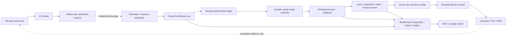

State: Advisory architecture audit snapshot (2026-08-11). This document changes no workflow,
authority, automation, Issue, PR, label, deployment, or shipped capability. Current owner docs,
live GitHub/Git/CI state, BuilderOps receipts, and installed-host evidence outrank it.

Authority: Builder System architecture research under `docs/architecture/SBS_OPERATING_MODEL.md`.
Executable work remains owned by the reconciled Issues in section 12.

Evidence basis: `origin/main` `2638fb4f1df70871db85ce8e3f3cf5461ef0d5e0`, live GitHub readback
on 2026-08-11, and the installed-host/automation inventory available to this audit.

# Builder verification and closure scaling architecture

## 1. Decision frame

The target is **200 accepted PR deliveries per week**. It cannot be met by allowing only one open
PR, one active repository-wide delivery, or one globally serialized verification chain. It also
cannot be met safely by removing exact-head, CI, review, merge, closure, or receipt gates.

The design problem is to let many independent PRs progress concurrently while every effect remains
fenced to the smallest correct authority identity, scarce capacity is scheduled explicitly, and
terminal delivery stays reconstructible from current truth.

Two tracks remain separate:

1. **Track 1 — operational unblock:** finish #4712 → #3603 installed-main containment and acceptance
   without waiting for, or broadening into, the scale redesign.
2. **Track 2 — scale architecture:** reconcile #3604 and DDO/BuilderOps against the whole Builder
   System before implementation. This audit is the map, not implementation authority.

## 2. Executive verdict

The Builder System already has most safety primitives required for concurrency: repository-,
Issue/task-, PR/head-, operation-, worker-, worktree-, and host-scoped identities; fenced
PostgreSQL task leases and outbox claims; exact-head verification and merge readback; crash recovery;
read-only projections; and TCD/terminal receipts.

The blockers are incomplete and inconsistent composition:

- the legacy SQLite verifier enforces one global subscription slot, while the API-backed verifier
  claims per run;
- GitHub produces verification artifacts, but no repository-owned installed pickup scheduler joins
  them to the explicit verification-cycle CLI;
- the installed programmatic merge path is dry-run without a conditional transport;
- #3604's autonomous orphaned post-merge closure is not implemented and still specifies one active
  subscription-backed chain across verification and closure;
- observability exposes only part of queue, lease, recovery, and capacity truth;
- lifecycle/type vocabularies disagree across labels, Project, dispatcher, DDO, verification, and
  projections; and
- devUI has delivered pure composers, but not the full control runtime/UI or authoritative producers
  for `Needs you` and `Ready to try`.

The target shape is a **fenced worker pool over the existing durable authority plane**, not a second
orchestrator: parallel per-run verification, parallel idempotent closure, separate resource caps,
a short revalidated merge critical section, and read-only capacity/lag projections.

## 3. Current flow and authority

| Segment | Current posture | Authority |
|---|---|---|
| CI → request | Implemented, exact-head and artifact-only | GitHub artifact plus live PR/CI readback |
| Request discovery | Bounded code exists; no production caller found | No installed autonomous pickup authority proved |
| Verification ledger | API path is per-run; legacy SQLite is globally singleton | BuilderOps task lease on API path |
| Review/repair | Implemented with budgets and head rebinding | Run, review evidence, exact PR head |
| Merge readiness | Durable and fenced | BuilderOps task/outbox plus GitHub truth |
| Real programmatic merge | Refuses without conditional base+manifest transport | Host executor and GitHub conditional/readback authority |
| Orphaned post-merge closure | #3604 contract exists; consumer/reconciler absent | Not shipped |
| Owner-doc follow-up | Classifier and watchdog exist | GitHub artifacts/comments, then `post-merge-owner-doc` |

## 4. Full impact map

### Must change for scale

| Surface | Required responsibility |
|---|---|
| #3604 | Remove the cross-stage singleton; split model-bearing verification from deterministic closure; specify cursors, deduplication, leases, and terminal-lag targets. |
| Pickup runtime | Add one governed installed scheduler that discovers artifacts, durably advances a cursor/watermark, records an admission obligation before capacity wait, and calls the existing API-backed cycle. Reconcile eligible current-head CI successes that lack an ingested task so artifact expiry or a host outage cannot silently drop work. No second ledger. |
| Worker runtime | Configurable, observable verification and closure pools; claims remain per task/run/operation. |
| Resource admission | Separate caps for subscription/model, host-global validation, GitHub/API budget, privileged executor, and merge queue. |
| OEF/status/metrics | Queue depth/age, worker capacity, lease contention, phase latency, retries, head churn, recovery, unknown-effect age, merge wait, and closure lag. |
| TCD receipts | Queue/wait percentiles, utilization, model versus deterministic service time, terminal suffix latency, and capacity-denial reason. |
| Lifecycle contracts | Orthogonal object kind, external lifecycle, operational phase, and blocker reason. |
| Installed operations | Versioned scheduler/pools, heartbeat, containment, drain, recovery, upgrade, rollback, and doctor contracts. |

### Must be verified unchanged

- `verification-and-closure` remains the one terminal policy; current-head CI, review, acceptance,
  merge, closure, parent, and owner-doc gates are not weakened.
- `pr-integration` remains readiness/repair only; `publish-pr` and `issue-to-code` produce handoffs,
  never terminal delivery.
- DDO reducer authorizes effects; runners/adapters execute them; neither invents GitHub truth.
- BuilderOps remains the one durable task/lease/outbox authority with fail-closed recovery.
- worktree generation and host-global test leases retain their existing narrow scopes.
- GitHub Actions producers stay artifact-only and least privilege.
- technical failure, capacity delay, or retry exhaustion does not automatically become
  `needs_owner`.

### Projection-only consumers

| Consumer | May | Must not |
|---|---|---|
| OEF/status | Observe, evaluate, alert, and gate configured fitness checks | Select, claim, retry, merge, close, or change policy |
| Cockpit | Read-time join with freshness/refusal | Own a queue or cached lifecycle state |
| devUI | Explain evidence and issue governed requests | Infer authority or become scheduler/store |
| CKM | Evaluate delivery/TCD evidence | Advance attempts or convert scores into lifecycle |
| Project | Provide optional visibility | Gate pickup, verification, or terminality |

## 5. Concurrency and fencing

The smallest correct fence wins.

| Work/effect | Fence identity | Concurrency posture |
|---|---|---|
| Issue implementation | repository + Issue/task | One claim per Issue; many Issues |
| Worktree | path + branch + generation | One owner per generation; many worktrees |
| Verification | repository + PR + stage + current head | One canonical chain per PR/stage; many PRs |
| Model launch | credential/provider capacity slot | Bounded pool; capacity is not lifecycle authority |
| Repair | run + mechanism/domain + attempt | Bounded inside one run |
| Host-global test | named host resource | Serialize only users of that resource |
| Outbox effect | repository + operation key | One claim per logical effect; many keys |
| Merge eligibility | PR/head + base + manifest/policy + credential generation | Revalidate before effect |
| Merge application | merge queue or conditional transport | Short critical section, not global verification mutex |
| Closure | repository + PR + merge SHA + contract/stage | Parallel, idempotent, live re-fetch before mutation |
| Parent acceptance | parent + child ledger | May lag children; not a worker mutex |

The API ledger already supports per-run task claims. Restoring a global active-run scan there would
discard the migration's concurrency semantics. Starting several consumers is nevertheless unsafe
until shared subscription, host, API, and executor resources have explicit admission and metrics.

## 6. Capacity model for 200 PR/week

Two hundred PRs per five-day week is 40 per working day, or 5 accepted deliveries per hour across an
eight-hour day. Burstiness and long tails determine the real pool size. For each resource class `r`:

`required_concurrency_r >= arrival_rate_r × p95_service_time_r / target_utilization_r`

Acceptance requires observed:

- arrivals and terminal deliveries per hour/day/week;
- eligible current-head CI successes versus durably admitted, superseded, or explicitly refused requests;
- WIP by queued, admitted, running, backoff, repairing, merge-wait, closure-pending, and unknown;
- p50/p95/p99 queue age and phase service time;
- configured, active, and available slots by resource class;
- lease conflicts, takeovers, duplicate effects, recovery, head churn, and repair cycles;
- merge wait/duration and merge-to-close/owner-doc/terminal-receipt lag; and
- accepted-delivery quality, not just opened or merged PR count.

Current `TcdMetrics` lacks weekly rate, queue depth, wait percentiles, and utilization. BuilderOps
health has pending/claimed outbox count, oldest age, active leases, dead letters, heartbeat, and
recovery state, but `/metrics` exports only a subset. `lease_conflicts_total` exists in the model but
the live provider does not populate it, so it reads as the default zero.

## 7. Lifecycle and object taxonomy

Do not create a label for every internal state. Use four axes:

1. **Object kind:** Issue slice, parent/feature hub, epic/program hub, PR, verification run, delivery
   attempt, or BuilderOps record.
2. **External lifecycle:** ready, active, review, blocked, done where applicable.
3. **Operational phase:** queued, admitted, verifying, repairing, merge-ready, merge-wait, closing,
   closure-pending, backoff, recovering. Keep this in durable run state and projections.
4. **Blocker reason:** dependency, technical, claim collision, capacity/backoff, external state,
   owner authority, superseded, or evidence recovery. Use typed evidence, not labels alone.

Contradictions to resolve:

- `AGENTS.md` names PR/Project `Blocked`, but the canonical Project matrix has no `Blocked`.
- Canonical types permit `task|bug|refactor`; live Issues also use feature, epic, and decision.
- On 2026-08-11, 207 open Issues comprised 140 task, 31 bug, 9 feature, 6 epic, 2 decision, and 1
  refactor; the counts leave some objects unclassified.
- The same snapshot had 134 blocked, 26 needs-human, 23 ready, and 24 without one of those agent
  labels. They cannot describe PR blockage or run phases.
- Dispatcher, DDO, verification receipts, Project, Cockpit, and devUI have non-isomorphic states.
- Cockpit treats `agent:needs-human` as enough for `needs_you`; Overview correctly requires a named
  owner-authority category and governing source.
- DDO maps some authority conflict/drift to owner decision, a documented divergence from the
  canonical Human Exception classifier.
- `blocked_technical` exists in governance vocabulary but not as a verification-run status.

Publish a crosswalk and migration rule before adding labels or bulk relabeling.

## 8. devUI, observability, skills, and automations

Overview/Focus may show phase, freshness, next autonomous action, and correlated Issue/PR/head/run
evidence. `Needs you` stays withdrawn without a canonical Human Exception. `Ready to try` needs its
own receipt-backed producer; merge, closure, and delivery are not substitutes.

Builder System Control should expose resource pools, configured caps, active claims, available
slots, oldest queue age, heartbeat/recovery epoch, source freshness/refusal, exact workflow adapter,
and governed pause/drain/resume/reconcile requests. It remains projection and command admission, not
policy or scheduling authority.

Directly affected adapters are `issue-to-code`, `publish-pr`, `pr-integration`,
`verification-and-closure`, `post-merge-owner-doc`, `deliver-issue-set`,
`issue-maintenance-change-control`, `backlog-reconciliation-drift-audit`, `resume-work`, the learning
skills, and `automation-maintenance`. Each later receives one disposition: changed contract,
verified unchanged, or projection-only consumer. A bulk rewrite is not justified.

GitHub dispatch/evidence/governance workflows remain producers and gates. Project writers remain a
serialized projection path outside the verification hot path. Post-merge classifier/watchdog remain
observers or bounded nudgers; #3604 owns autonomous closure. The active daily review-comment audit
is adjacent maintenance, not the primary scheduler. No dedicated Codex app automation currently
proves an installed verification/closure pickup loop.

## 9. Failure taxonomy

| Failure | Durable posture | Response |
|---|---|---|
| No model/subscription slot | queued/backoff | Wait; no Human Exception or API-key fallback |
| Artifact expired or pickup window missed | discovery-gap obligation | Reconstruct from live PR/current-head CI truth, then durably admit, supersede, or refuse |
| Host resource busy | queued on named resource | Wait boundedly |
| API budget pressure | backoff with evidence | Cursor/REST; no hot polling |
| Head changes | invalidate head evidence | Rebind same PR/stage; retain budgets |
| Lease expires | fresh fenced takeover | Resume durable state, not an unproven process |
| Effect times out | unknown | Read back before retry/success |
| Base/manifest drifts | invalid merge authority | Re-verify; no merge |
| Merge succeeds, closure incomplete | closure-pending by merge SHA | Idempotent terminal suffix recovery |
| Owner-doc receipt missing | non-terminal suffix | Run existing classifier/skill/watchdog path |
| Genuine authority ambiguity | Human Exception packet | Ask once with exact decision |
| Technical evidence inconclusive | evidence recovery/blocked-technical | Diagnose; do not relabel as owner decision |

## 10. Invariant kernel

These are candidates for later promotion into the single registry at
`docs/testing/invariant-tests.md`; this audit does not fork that registry.

| ID | Class | Invariant |
|---|---|---|
| BVC-01 | MUST | One active canonical chain per repository + PR + stage; every head-bound effect names the exact head. |
| BVC-02 | GATE | A worker acts only under a current task/effect fence; capacity admission is never authority. |
| BVC-03 | GATE | Model, host-test, API, executor, and merge capacity are separate resources; none becomes a repository mutex. |
| BVC-04 | MUST | Every external effect has one operation key; timeout becomes unknown and requires readback. |
| BVC-05 | GATE | Merge binds head, base, manifest/policy, credential generation, CI/review, and conditional/queue fence. |
| BVC-06 | MUST | Closure binds repository + PR + merge SHA + contract/stage and deduplicates event/recovery triggers. |
| BVC-07 | GATE | Delivery is not terminal before acceptance-profile closure, owner-doc decision, and final readback. |
| BVC-08 | MUST | Projection/OEF/Cockpit/devUI/CKM/learning/TCD cannot mutate lifecycle or policy. |
| BVC-09 | DOCTOR | Queue, phase latency, capacity, contention, churn, retries, unknowns, merge wait, closure lag, and freshness are observable. |
| BVC-10 | GATE | `Needs you` requires a canonical Human Exception; technical/capacity blockage stays distinct. |
| BVC-11 | MUST | Object kind, external lifecycle, operational phase, and blocker reason remain orthogonal. |
| BVC-12 | DOCTOR | Installed scheduler, pools, executor, and recovery expose version, health, capacity, and last terminal receipt. |
| BVC-13 | MUST | More capacity cannot weaken repair budgets, review, exact-head evidence, or defect accounting. |
| BVC-14 | GATE | Drain/restart leaves no orphaned lease, unknown effect, or closure obligation. |
| BVC-15 | MUST | Every eligible current-head full-path CI success becomes durably admitted, superseded, or explicitly refused; host outage and artifact expiry cannot silently erase pre-ingest work. |

## 11. Resolved questions

- Many independent PRs may be open and active; only identity conflicts and named scarce resources
  serialize.
- The API ledger does not require a global verification singleton. That assumption survives in the
  legacy SQLite path and #3604's current contract.
- Deterministic closure can use a separate parallel pool; model-bearing exceptions use separate
  bounded capacity.
- devUI and OEF remain projections/command admission, never scheduler or authority.
- More labels may be needed for reconciled object kinds, but not for every phase/blocker.
- Current evidence does not prove 200 PR/week. That claim requires installed load, crash, drain, and
  quality/TCD acceptance.

## 12. Backlog reconciliation and handoff

No new Issue should be filed until the target is accepted and `feature-breakdown` proves an existing
Issue cannot hold the slice.

| Authority | Reconciled role |
|---|---|
| #4712 | Track 1 containment. PR #4718 carries an explicit do-not-merge receipt; recovery remains separate. |
| #3603 | Track 1 installed-main API/PostgreSQL verifier acceptance via `bcp05_demerzel_cycle.v1`; no scale broadening. |
| #3604 | Primary Track 2 closure contract. Amend before implementation: its cross-stage singleton conflicts with the target and API semantics. |
| #4163 | DDO parent validation hub, not a second verifier. |
| #4168 | Durable effect/outbox reconciliation; reuse for scheduler/closure effects, not another ledger. |
| #4169 | CKM/devUI initiation and receipt projection; evidence/request consumer only. |
| #4170 | TCD/crash/quality acceptance. Its max-two pilot does not prove the 200/week profile. |
| #4466 | Durable bounded CI repair identity after #4168; remains per-attempt. |
| #3793 / BCP-06 | Installed activation, legacy retirement, and rollback after acceptance. |
| #3690 / BCP-07 | Owner-doc enactment after proved installed reality. |

After owner acceptance, `feature-breakdown` should test this provisional slice map: lifecycle
crosswalk; discovery/admission; verification pool; closure worker; conditional merge/queue;
OEF/doctor; devUI/Cockpit/CKM adapters; skill/automation conformance; and load/crash/drain/quality
acceptance. This is a decomposition hypothesis, not permission to create nine Issues.

## 13. Evidence anchors

| Claim area | Repository evidence |
|---|---|
| Artifact-only exact-head producer | `.github/workflows/verification-dispatch-request.yml:3-18,93-175,190-213`; `scripts/build_verification_dispatch_request.py:74-87,126-243` |
| Bounded discovery, expiry gap, and no repository caller | `app/dispatcher/verification_consumer.py:321-331,912-928,1172-1261`; `app/dispatcher/cli.py:772-856,1180-1202`; `docs/development/BUILDER_SYSTEM_PROCESS_MAP.md:719,734` |
| Legacy global singleton | `app/dispatcher/verification_dispatch.py:317-318,1774-1825` |
| API per-run claim and multi-active status | `app/dispatcher/verification_api.py:596-635`; `app/dispatcher/cli.py:482-534` |
| Exact-head and pre-effect revalidation | `app/dispatcher/verification_consumer.py:4470-4659,5097-5313`; `app/dispatcher/verification_merge.py:457-689` |
| Conditional transport refusal / installed dry-run | `app/dispatcher/verification_github.py:157-164,912-937`; `app/dispatcher/cli.py:720-856` |
| Post-merge observer versus missing closure worker | `.github/workflows/post-merge-docs-classifier.yml:3-83`; `.github/workflows/post-merge-owner-doc-watchdog.yml:256-350,387-490`; `docs/development/BUILDER_SYSTEM_PROCESS_MAP.md:170-172,734` |
| BuilderOps identity, leases, outbox and recovery | `app/builderops/control_plane/migrations/0001_transaction_kernel.sql:53-198`; `app/builderops/control_plane/store.py:1494-1534,1798-1987,1989-2087,2186-2495,348-389` |
| Existing health and metrics gap | `app/builderops/control_plane/health.py:17-30,68-147,167-232`; `app/builderops/control_plane/service.py:527-554` |
| TCD receipt fields | `app/builderops/delivery_orchestration_contracts.py:2308-2354` |
| devUI/Cockpit/CKM non-authority | `docs/DEVUI.md:32-60,84-113,381-456,514-554`; `app/builderops/devui_composition.py:370-459`; `app/api/routes/cockpit.py:1-8,66-81` |
| Skills and terminal authority | `.codex/skills/publish-pr/SKILL.md:257-270,391-422`; `.codex/skills/pr-integration/SKILL.md:8-19,93-112`; `.codex/skills/verification-and-closure/SKILL.md:145-228,449-505,554-641` |
| Label and Project vocabulary conflict | `AGENTS.md:104-110`; `.codex/skills/_shared/LABEL_TAXONOMY.md:8-35`; `.codex/skills/_shared/LIFECYCLE_TRUTH_MATRIX.md:11-44` |
| Human Exception boundary | `docs/development/AUTONOMOUS_REVIEW_REPAIR_GATE_CONTRACTS.md:405-437`; `app/dispatcher/verification_consumer.py:452-480` |
| DDO capacity, identities and projection boundary | `app/builderops/delivery_orchestration_contracts.py:447-460,668-680,1167-1214,1260-1282,1345-1417`; `docs/DETERMINISTIC_DELIVERY_ORCHESTRATION/README.md:208-233` |

Live GitHub readback on 2026-08-11 supplied the Issue/PR population counts and current states of
#3603, #3604, #4163, #4168–#4170, #4466, #4712, and PR #4718. Those values are snapshot evidence,
not durable owner authority; every implementation pickup must re-read them.

## 14. Docs Governance Decision

Docs Governance Decision:
- Artifact role: audit snapshot
- Owner: Builder System architecture under `docs/architecture/SBS_OPERATING_MODEL.md`
- Action: one advisory evidence/design map; no current-state owner-contract edit
- Traceability: live #3603/#3604/#4163/#4168–#4170/#4466/#4712 and exact `origin/main`
- DOCS_INDEX impact: add one audit row
- SBS/interface ownership: Builder System; GitHub and installed host retain delivery/operation authority
- Next skill or no-change receipt: `feature-breakdown` only after target acceptance
- Human Exception: none
