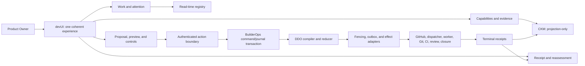

State: Advisory audit snapshot (2026-08-06). Anchors reflect `origin/main` at `3f140bba2c677c37d81b7e166133e24e4e182845` and owner direction captured on the audit date. The proposed owner-function contract is `docs/DEVUI.md`; executable sequencing is in `docs/plans/DEVUI_IMPLEMENTATION.md`.
Doc role: Reference (audit snapshot)
Authority: Evidence-based Builder System structural analysis. This document changes no runtime, authority, GitHub state, or delivery lifecycle and does not make target state current-state truth.
Owner: Builder System governance
Temporal class: snapshot
Review cadence: event-driven after DDO-05, DDO-06, BCP-06, or material devUI design changes
Source of truth: subordinate to `docs/DOCS_INDEX.md`, accepted ADRs, capability contracts, and live delivery authority; `docs/DEVUI.md` becomes owner authority only after acceptance
Last reviewed: 2026-08-06

# devUI architecture — evidence synthesis 2026-08-06

## Purpose and classification

This audit establishes the target architecture for a single Product Owner development experience. It answers how devUI can bring together capability evidence, current work, delivery choices, and delivery initiation without turning CKM into authority or creating another delivery state machine.

Classification: **Builder System target-state documentation and architecture work** at the Builder System/CES boundary. No Product/Runtime SBS is changed.

## Summary decision

`devUI` is the Product Owner's single perceived entry to the development system:

```text
understand → choose → preview → approve → follow → receipt → reassess
```

It is a coherent presentation and interaction shell, not a new authority. The responsibilities beneath it remain separate:

- CKM: capabilities, evidence, gaps, candidates, and freshness;
- BuilderOps Cockpit: read-time work register and source freshness;
- DDO: request, preview, reducer, and delivery contracts;
- authenticated action boundary: approval and controls;
- BuilderOps: journal, fencing, reconciliation, live run, and receipts; and
- GitHub, CI, Git/worktree, dispatcher, review, merge, and closure: delivery truth.

“Separate delivery console” means a **separate internal trust and action boundary**, not a second product surface. CKM's static HTML remains inert. devUI can display CKM data and authenticated controls in one experience without giving one component or endpoint both responsibilities.

## Evidence map

| Area | Evidence and consequence |
| --- | --- |
| Owner/process | `docs/DEVUI.md` owns the owner experience; `docs/development/BUILDER_SYSTEM_PROCESS_MAP.md` owns internal process; `docs/architecture/SBS_OPERATING_MODEL.md` owns SBS/SoT routing; `docs/HUMAN-FLOWS.md` remains Product Runtime human flow. |
| CKM | ADR-0057 establishes projection-only, non-authoritative CKM. `CkmQueryService` provides bounded typed read access, but local `ckm-local-access-v1` has no remote audience/auth/redaction policy. |
| Cockpit | `/cockpit` and `/api/cockpit/registry` are read-only joins across operational sources. Cockpit owns no approval, task workflow, durable attention state, or CKM maturity. |
| DDO | DDO-01–04 provide contracts, pure compiler/reducer, WorkerRuntime seam, and receipts. DDO-05–07 are not complete. DDO-06/#4169 owns request, preview, exact approval, run view, controls, and receipt-to-CKM. |
| BuilderOps | ADR-0062 targets an API-first BuilderOps service with PostgreSQL operational authority. BCP-01–04 exist in development baseline; BCP-06 production cutover remains incomplete. |
| ADR-0064 | UI must expose model/provider/reasoning degradation honestly; missing credentials cannot appear as active analysis. |
| ADR-0065 | Future `done`/`ignore`/`never_show_again` are receipt-backed owner decisions after cutover, not run state and not cockpit-local state. |

Key anchors: `docs/adr/ADR-0057-capability-knowledge-model-kvasir.md:23-72`, `docs/adr/ADR-0062-builderops-ecosystem-wide-enabling-system.md:15-19`, `:42-94`, `docs/DETERMINISTIC_DELIVERY_ORCHESTRATION/README.md:264-288`, `docs/DETERMINISTIC_DELIVERY_ORCHESTRATION/CONNECT_CKM_INITIATION_AND_DELIVERY_RECEIPTS.md:17-47`, `app/api/routes/cockpit.py:21-77`, and `app/builderops/ckm/query_service.py:1-143`.

## Names and responsibility boundaries

| Name | Current form | Actual responsibility | Relation to devUI |
| --- | --- | --- | --- |
| CKM Development Overview / CKM Cockpit Direction B | Generated local HTML | Static, non-authoritative capability and evidence lens | Remains export/snapshot/fallback; informs capability mode |
| BuilderOps Cockpit | Served `/cockpit` | Live read-only register of work threads and source freshness | Feeds devUI work mode; gains no action responsibility |
| Delivery console | Planned | Authenticated request, preview, approval, live run, and typed controls | Decision/run mode inside one devUI experience, with separate internal trust boundary |
| devUI | Working name | Owner navigation, context, language, and interaction flow | The owner-perceived shell across the other responsibilities |

`devUI` conflicts semantically with `make dev-ui`, which starts Companion UI (`Makefile:203-210`). It remains a working name only until technical names are normalized.

## Target architecture



devUI may compose versioned read models and own navigation/context, but it cannot create a common authority store. Mutations go to separate authenticated endpoints with exact request, preview, version, and freshness binding. `DeliveryRequest.v1` carries owner objective, capability link, evidence basis, scope, exceptions, and acceptance profile. devUI is never the durable carrier; the carrier question concerns `DeliveryInitiation.v2` only.

## Owner process

| Step | What devUI shows | System responsibility |
| --- | --- | --- |
| Understand | Capability, proof, gaps, freshness, active work | Read CKM and registry; no mutation |
| Choose | Capability, problem, or bounded Issue set | Bind confirmed material to request draft |
| Preview | Scope, exceptions, waves, risk, TCD, policy | Pure compiler returns plan or typed refusal |
| Approve | Exact decision and consequence | Authenticated boundary binds request+preview+freshness to initiation |
| Reconcile | Same run or clear waiting state | Reconcile lane, attempt, outbox, dispatcher, GitHub, worker, worktree |
| Execute | Concise state and next lawful step | Prepare → claim → activate; reducer-driven effects |
| Verify | CI/review/merge/closure chain | Existing authority gates run on exact head |
| Finish | Terminal outcome and remaining risk | Closure, owner receipt, worktree release, terminal receipt |
| Reassess | Capability impact | Receipt becomes derived CKM/TCD evidence |

Pause, resume, cancel, and supersede are typed reducer requests, never direct effects. Cancel cannot claim to roll back committed external effects (`app/builderops/delivery_reducer.py:1-26`, `:472-487`).

## Findings and invariant kernel

| Finding | Consequence |
| --- | --- |
| No delivered façade | CKM renderer and Cockpit registry cannot compose directly; create a versioned read façade. |
| DDO-06 blocked on DDO-05 | No current surface can initiate, approve, or follow a `DeliveryRun`. |
| No shared read contract | CKM has versioned envelopes; Cockpit returns generic data. Do not couple UI to internal forms. |
| CKM access is local-only | Remote/service CKM read must refuse until access policy is accepted. |
| Target authority is inactive | No interim authority in browser, Product FastAPI, SQLite, or files. |
| CKM evidence may mislead | Show proof groups and require source review; never derive scope from maturity aggregate. |
| Two-surface wording drift | Treat delivery console as internal boundary; reconcile live #4169 before implementation. |
| Technical ambiguity classification | It is a system block unless a named Human Exception applies. |

The required invariant kernel is:

1. The owner completes one coherent loop from situation to reassessment.
2. CKM remains derived, provenance-preserving, and non-authoritative.
3. Preview/approval bind exact source, scope, version, and freshness.
4. A run has one durable operational source of truth.
5. UI failure cannot duplicate, advance, or replace delivery authority.
6. Partial source state is explicit; missing is never fabricated as complete.
7. Read surfaces carry no credentials or durable local decisions.
8. Terminal receipts return as derived evidence, never CKM authority mutation.
9. Watermarks, health, and last-good state are observable and dated.
10. Remote CKM access refuses absent access policy.

## Transition and ordered handoff

| Current | Target | Transition rule |
| --- | --- | --- |
| Static CKM overview | Capability mode plus static fallback | Preserve Direction B inertness |
| Cockpit registry | Work mode in devUI | Reuse read model; do not move action authority |
| DDO pure contracts | Preview/run mode | Activate only through DDO-05, DDO-06, and BCP-06 gates |
| Product-hosted transition routes | BuilderOps authenticated action API | No browser/Product/SQLite fallback authority |
| Fragmented receipts | Capability reassessment | Return derived evidence only |

Implementation order:

1. Accept `docs/DEVUI.md`, normalize technical naming, and complete a governed Yggdrasil design handoff.
2. Define versioned read façade contracts and accept CKM access policy.
3. Deliver the read-only owner shell.
4. Complete #3603 / BCP-05 and #4168 / DDO-05, including closure/retry dependencies #3604, #4217, and #4466.
5. Implement dormant DDO-06/#4169 request, preview, initiation, run view, and receipt bridge.
6. Complete BCP-06/#3793 cutover; activate controls only after its receipt.
7. Pilot owner decisions, degraded state, and receipt feedback.
8. Remove transition wording and paths only after enacted authority proves the replacement.

Feature breakdown must reuse live Issue contracts rather than create a parallel delivery registry. Every slice needs `Verify:` targets, the invariants it proves, and a clear classification as read-only, contract-only, dormant, or authority-bearing.
