State: Builder System architecture and process map.
Doc role: Development governance / system-of-systems map
Authority: Descriptive inventory plus target automation roadmap for the Builder System. This document does not change workflows, skills, scripts, issue templates, CI, branch protection, or GitHub state.
Owner: Builder System governance
Temporal class: operational
Review cadence: event-driven
Source of truth: observed repo files and read-only GitHub command output cited inline
Last reviewed: 2026-08-07

# Builder System Process Map

## 1. Executive Model

Yggdrasil's Builder System is the continuous-development enabling system around the Product/Runtime System. It builds, verifies, releases, governs, and learns from Product/Runtime changes; it is not itself a Product SBS runtime subsystem [docs/architecture/SBS_OPERATING_MODEL.md:68-93].

Rasmus provides intent, preferences, constraints, and strategic direction. Tier-selected review,
dispatch, CI triage, PR closing, post-merge documentation checking, and learning capture should be
performed by the Builder System when the governing contracts are sufficient. Human attention is an
exception path: the canonical builder instructions say the default posture is to act, and to
escalate only for irreversible, external-facing, or genuinely ambiguous authority decisions
[AGENTS.md :: Agency default]. The review-gate fallback policy applies only when the selected delivery
path requires that gate and it is unavailable. It keeps the work technically blocked and routes
through the autonomous classifier; a human path opens only for a separately named authority
exception
[docs/architecture/SBS_OPERATING_MODEL.md §12].

The Builder System has these layers:

1. Intent layer: human intent enters through docs, issues, tasks, explicit decisions, and strategic constraints. Observed authority: `PROJECT_KERNEL`, charter, docs, and GitHub issue contracts route intent; `AGENTS.md` names the owner as the authority for irreversible and strategic calls [AGENTS.md :: Agency default], [docs/DOCS_INDEX.md:48-90].
2. Docs-as-code/spec authority layer: docs are primary Builder System authority, not background. `docs/DOCS_INDEX.md` is the stable role/routing map and says to read Core SoT docs before references, and plans/historical docs as context only [docs/DOCS_INDEX.md:1-17].
3. Contract layer: GitHub issues, PR templates, shared skill contracts, labels, `Verify:` markers, and SBS impact blocks define executable work [`.codex/skills/_shared/ISSUE_CONTRACT.md`:12-72], [`.github/ISSUE_TEMPLATE/task.yml`:73-109].
4. Dispatch/routing layer: dispatcher queue/leases, labels, skill routing, model/reasoning policy, and worktree isolation select work and prevent collisions; Project status is projection evidence only [docs/AGENT_ISSUE_DISPATCHER.md:132-180], [AGENTS.md :: Parallel-agent execution].
5. Execution layer: skills, agents, scripts, local worktrees, implementation PRs, and publication boundaries perform work [`.codex/skills/README.md`:144-164], [`.codex/skills/publish-pr/SKILL.md`:53-159].
6. Verification/evidence layer: local validation, CI, REST-only check waiting, tier-selected review, delivery receipts, optional Project reconciliation, and owner-doc receipts prove work. Terminal epic lifecycle dry-runs use the same latest-check-run-per-name selector as CI handoff, with a numeric run-id fallback and fail-closed latest non-green checks; Issue, PR, and CI blockers are reported independently from whether optional projection writes are allowed [`.codex/skills/verification-and-closure/SKILL.md`:46-77], [`.codex/skills/_shared/CI_WAIT_CONTRACT.md`:22-82], [`app/builderops/epic_lifecycle_plan.py`].
7. Closure/spec-feedback layer: merge, issue closure, dispatcher completion, parent validation receipts, post-merge owner-doc decisions, and roadmap/spec state updates close work truthfully [`.codex/skills/verification-and-closure/SKILL.md`:194-208], [docs/development/PARENT_ISSUE_CLOSURE.md:13-49].
8. Continuous improvement and reevaluation layer: BuilderOps records, learning signals, evidence
   packs, review findings, TCD signals, CKM projections, retrospectives, skill/docs updates, fitness
   rules, transition debt, and bounded issues improve and reevaluate the Builder System without
   contaminating Product/Runtime memory [docs/architecture/SBS_OPERATING_MODEL.md:194-261],
   [docs/development/DELIVERY_FEEDBACK_LOOP.md:1-220].
9. Exception layer: `agent:needs-human`, blocker receipts, release operator acknowledgements, and Human Exception packets stop autonomous continuation when authority is missing; CI/review/merge gates remain non-waivable [`.codex/skills/_shared/LABEL_TAXONOMY.md`:18-27], [docs/architecture/SBS_OPERATING_MODEL.md §12].

### Authority-crossing rule for research and design

Research findings and external design handoffs are supporting inputs until they receive an explicit
disposition: accepted, rejected, deferred, or requiring an owner decision. When accepted material
crosses into a normative owner document or specification, the route must use the existing BuilderOps
`PromotionIntent` boundary with source references, target authority surface/ref, intended output, and
the resulting receipt. `PromotionIntent` is proposal and provenance material only; the target repo
document or specification becomes authoritative through the normal PR workflow. A research note,
design package, or chat transcript alone cannot define implementation scope or create an executable
Issue.

## Evidence Legend

Statuses in this document use the requested terms:

- observed: implemented in files, workflows, scripts, settings, or command output.
- inferred: strongly implied by multiple observed artifacts but not directly implemented.
- missing: required by the intended architecture but no implementation was found.
- implicit: described in prose or skills but not machine-enforced.
- unknown: evidence unavailable.
- not_found: explicitly searched and absent.

Read-only GitHub evidence used:

- `gh auth status && gh workflow list` on 2026-07-08: authenticated as `RasmusTho`; workflows listed active: App Image Build, architecture-ci, Companion UI Browser Runtime, ci-lite, CI Smoke, CI, harness-selfverify, import-linter, integration-nightly, Issue and PR Governance, Post-Merge Owner Doc Watchdog, Project PR Opened, Project PR Stage Change, Project Status Reconcile, release-uat, settings-ci, smoke, Dependabot Updates, Dependency Graph, CodeQL.
- `gh run list --limit 30` on 2026-07-08: recent runs included in-progress PR #3208 CI and a failed Issue and PR Governance run for PR #3208; recent successful merge/push runs for PR #3207.
- `gh pr list --state open --limit 100` on 2026-07-08: open PRs #3208, #3201, #3198.
- `gh issue list --state open --limit 50` on 2026-07-08: open issues included `agent:ready`, `agent:blocked`, `agent:needs-human` work such as #3199, #3190, #3178, #3177, #3176, #3172, #3171.
- `gh label list --limit 200` on 2026-07-08: canonical labels exist (`type:task`, `type:bug`, `type:refactor`, `prio:*`, `agent:*`, `lane:governance`) but many non-canonical labels also exist, including `governance`, `ci`, `maintenance`, `docs`, and legacy/default labels.
- `gh api repos/RasmusTho/agentic-pkm-mvp/branches/main/protection` on 2026-07-08: `Branch not protected` / HTTP 404.
- `gh api repos/RasmusTho/agentic-pkm-mvp/branches/stable/protection` on 2026-07-08: `stable` protected; required status checks are `smoke`, `smoke-docker`, and `pr-contract`; strict is `true`; required approving review count is `0`; CODEOWNERS review is not required.
- `gh api repos/RasmusTho/agentic-pkm-mvp --jq '{allow_auto_merge,...}'` on 2026-07-08: `allow_auto_merge=false`, default branch `main`, merge/squash/rebase allowed, delete branch on merge disabled.
- `find .claude -path '.claude/worktrees' -prune -o -type f -print`: repo-level `.claude` files are `.claude/hooks/README.md`; no repo-level `.claude/settings*.json` files were found.
- `gh issue list --state open --search "builder OR BuilderOps OR Kvasir OR CKM OR dispatcher OR review repair OR governance" --limit 80` on 2026-07-09: open Builder System work included #3229 (dispatcher-backed epic runner), #3224 (autonomous review and repair gates), #3138/#3139-#3148 (CKM/Kvasir), #3226 (process-map reconciliation), #3257 (epic-runner lifecycle transition plans), #3260-#3266 (continuous improvement / reevaluation operationalization), and #3171/#3174 (cross-repo Builder System governance).
- PR #3222 merged 2026-07-08: the artifact-only CI failure context collector is now implemented by `.github/workflows/pr-ci-failure-context.yml` and `scripts/collect_ci_failure_context.py`, with workflow and script tests. It observes failed PR-triggered workflow runs, produces a context artifact, and neither reruns nor repairs CI.

## 2. Component Inventory

| Component | Status | Current artifact(s) | Responsibility | Inputs | Outputs | Mutation authority | Evidence |
| --- | --- | --- | --- | --- | --- | --- | --- |
| intent capture | partially_implemented | Docs, issues, `AGENTS.md`, `docs/DOCS_INDEX.md` | Capture strategy and constraints as repo-governed artifacts | Human intent, owner docs | Docs, issues, decisions | PR or GitHub issue | [AGENTS.md :: Agency default], [docs/DOCS_INDEX.md:11-17] |
| Product Owner development experience (`devUI`) | accepted_target; read sources partially implemented | `docs/DEVUI.md`, CKM Direction B, BuilderOps Cockpit, DDO-06 | Present one coherent see → decide → act → verify flow while preserving separate evidence, auth, execution, and delivery authorities | CKM/read registry/run/receipt projections plus exact owner actions | Owner-readable state, typed requests, decisions, and receipts | None in the shell; CKM is read-only and every action routes through its owning authenticated contract | [docs/DEVUI.md:30-80], [docs/DEVUI.md:116-168], [docs/DEVUI.md:219-270], [docs/DETERMINISTIC_DELIVERY_ORCHESTRATION/CONNECT_CKM_INITIATION_AND_DELIVERY_RECEIPTS.md:17-57] |
| docs/spec authority | implemented | `docs/DOCS_INDEX.md`, owner docs, SBS docs | Route doc authority and conflict resolution | Docs tree | Owner-doc truth and routing | Docs PR | [docs/DOCS_INDEX.md:1-17], [docs/DOCS_INDEX.md:80-90] |
| docs index | implemented | `docs/DOCS_INDEX.md` | Stable role map and reading order | Repo docs | Role and owner routing | Docs PR | [docs/DOCS_INDEX.md:1-17], [docs/DOCS_INDEX.md:48-90] |
| owner docs | implemented | `docs/ARCHITECTURE.md`, `docs/STATUS.md`, subsystem docs, contracts | Current shipped truth and contract ownership | Code, PRs, accepted delivery | Current-state claims | PR | [docs/architecture/SBS_OPERATING_MODEL.md:332-342] |
| SRS/SBS/system engineering docs | partially_implemented | `docs/SYSTEM_BREAKDOWN_STRUCTURE.md`, `docs/architecture/**`, `docs/REQUIREMENTS_INDEX.md` | Target classification, boundary, requirements coverage | Architecture and requirements | SBS impact, debt, fitness rules | PR | [docs/DOCS_INDEX.md:56-64], [docs/architecture/SBS_OPERATING_MODEL.md:42-66] |
| governance docs | implemented | `AGENTS.md`, `docs/development/**`, `.codex/skills/**` | Builder workflow authority | Task and delivery evidence | Process rules | PR | [AGENTS.md :: Reading order], [docs/architecture/SBS_OPERATING_MODEL.md:173-186] |
| issue contract | implemented | `.codex/skills/_shared/ISSUE_CONTRACT.md`, `.github/ISSUE_TEMPLATE/task.yml` | Executable backlog shape | Source docs | Issue body with `Verify:` markers | Issue creation/edit | [`.codex/skills/_shared/ISSUE_CONTRACT.md`:12-72], [`.github/ISSUE_TEMPLATE/task.yml`:73-109] |
| issue template | implemented | `.github/ISSUE_TEMPLATE/task.yml` | Form enforcement for task contracts | Human/agent issue creation | Structured issue fields | GitHub issue form | [`.github/ISSUE_TEMPLATE/task.yml`:1-119] |
| issue readiness validator | partially_implemented | `issue-pr-governance.yml`, `validate_source_anchors.py`, skills | Enforce sections and source anchors for ready/blocked issues | Issue body/labels | Failed checks or valid issue | GitHub Action read/write labels only for cleanup | [`.github/workflows/issue-pr-governance.yml`:40-78] |
| issue queue | partially_implemented | GitHub labels, dispatcher SQLite | Expose ready work | strictly validated `agent:ready`, dispatcher pull | Queue entries | GitHub labels; dispatcher store | [docs/AGENT_ISSUE_DISPATCHER.md:132-180] |
| dispatcher | implemented | `app/dispatcher/**`, `docs/AGENT_ISSUE_DISPATCHER.md`, Makefile targets | Queue, claim, lease, heartbeat, completion | GitHub `agent:ready` issues | Local tasks/leases/events | Local dispatcher DB only | [docs/AGENT_ISSUE_DISPATCHER.md:21-36], [Makefile:356-361], [app/dispatcher/cli.py:31-32] |
| model router | implicit | `AGENTS.md` TCD policy, `.codex/agents/*.toml` | Choose model/reasoning by risk | Task risk/TCD | Model/effort choice | Agent/session config | [AGENTS.md :: Total Cost of Development], [`.codex/agents/slice-implementer.toml`:1-20] |
| skill router | partially_implemented | `AGENTS.md`, `.codex/skills/README.md` | Route work to workflow skill | Task class | Skill path | Agent behavior | [AGENTS.md :: Repo-local skill routing], [`.codex/skills/README.md`:64-128] |
| context builder | implemented (dry-run helper) | `docs/DOCS_INDEX.md`, skill first-context sections, `app/builderops/epic_dispatch.py` | Select source docs and owner docs, then emit minimal worker packet | Issue source anchors, docs index, candidate issue facts | Runtime-neutral Codex/Claude context packet | Local JSON output; optional run-state evidence | [AGENTS.md :: Reading order], [`.codex/skills/issue-to-code/SKILL.md`:236-256], [app/builderops/epic_dispatch.py:1] |
| worktree/branch allocator | partially_implemented | `scripts/agent_workspace_preflight.sh`, branch-truth gate | Detect worktree/branch drift; refuse shared root by default | Branch/worktree | Preflight pass/fail | Local script | [`.codex/skills/_shared/BRANCH_TRUTH_GATE.md`:9-77], [scripts/agent_workspace_preflight.sh:55-61] |
| claim coordinator | implemented | dispatcher claim + `scripts/issue_pickup_claim.sh` | Claim issue and remove ready label | Ready issue | Lease plus label mutation | Dispatcher + `gh issue edit` | [`.codex/skills/issue-to-code/SKILL.md`:129-175], [scripts/issue_pickup_claim.sh:39-59] |
| implementation agent | implemented | `issue-to-code`, `slice_implementer` adapter | Execute bounded issue | Ready issue, owner docs | Diff, validation, PR | Local files/PR | [`.codex/skills/issue-to-code/SKILL.md`:236-260], [`.codex/agents/slice-implementer.toml`:1-20] |
| validation runner | partially_implemented | Makefile, `scripts/run_with_host_lease.py`, CI, `DEV_WORKFLOW` | Run local and CI checks; atomically serialize host-global local suites across worktrees | Changed files, execution id, repo-common lease | Logs/status plus acquire/release receipt | Local kernel lock/CI | [docs/development/DEV_WORKFLOW.md:60-89], [scripts/run_with_host_lease.py], [`.github/workflows/ci-smoke.yaml`:17-104] |
| CI workflows | implemented | `.github/workflows/**` | Automated checks and projections | PR/push/schedule/manual | Check runs/artifacts/comments | GitHub Actions | `gh workflow list`; [`.github/workflows/ci-smoke.yaml`:4-13], [`.github/workflows/import-linter.yaml`:14-33] |
| CI failure context collector | implemented (artifact-only) | `.github/workflows/pr-ci-failure-context.yml`, `scripts/collect_ci_failure_context.py` | Build a bounded context pack for failed PR-triggered CI runs | Failed workflow-run metadata and downloaded logs | JSON/Markdown context artifact; no rerun or repair | GitHub Actions artifact upload only | [PR #3222](https://github.com/RasmusTho/agentic-pkm-mvp/pull/3222), [`.github/workflows/pr-ci-failure-context.yml`:1-61], [scripts/collect_ci_failure_context.py:1-537] |
| verification dispatch producer | implemented (artifact-only) | `.github/workflows/verification-dispatch-request.yml`, `scripts/build_verification_dispatch_request.py` | Emit one versioned, idempotent request after successful `CI Smoke` for the current PR head | Completed `CI Smoke` workflow run plus live PR snapshot carrying exactly one explicit `Governing-Issue`, exact closing identities, authenticated `Final-Review-Rounds`, then that issue's live snapshot; non-governing references remain supporting evidence | `verification_dispatch_request.v3` JSON/Markdown artifact | GitHub Actions artifact upload only; ambiguous or mismatched governing/closing authority emits no request; no agent, merge, issue, label, comment, or dispatcher mutation | [issue #3602](https://github.com/RasmusTho/agentic-pkm-mvp/issues/3602), [`.github/workflows/verification-dispatch-request.yml`], [scripts/build_verification_dispatch_request.py] |
| Demerzel verification consumer / merge executor | implemented in repo; installed-main acceptance pending | `app/dispatcher/verification_consumer.py`, `app/dispatcher/verification_api.py`, `app/dispatcher/verification_merge.py` | Consume authenticated current-head requests through BuilderOps API/PostgreSQL/outbox; separate uncredentialed review-only `verified` authority from host-fenced merge or safe no-merge | Current request, API task lease, exact issue sets/head, clean-review anchor/round count/repair budget, protected-base manifest, host credential generation, authenticated PR-workflow check suites | `builderops_merge_ready.v1`, task-bound outbox operation binding the fixed non-closing merge text, exact GitHub commit readback | Review child has no ambient GitHub mutation path; only the host executor may resolve the scoped credential and invoke an injected conditional/merge-queue transport; push/manual suites cannot mask failed PR checks, and missing API, fence, manifest, fixed merge text, transport, or readback fails closed | [issue #3603](https://github.com/RasmusTho/agentic-pkm-mvp/issues/3603), [`docs/BUILDEROPS_CONTROL_PLANE/DEMERZEL_REVIEW_MERGE_ORCHESTRATION.md`], [`app/dispatcher/verification_api.py`], [`app/dispatcher/verification_merge.py`] |
| CI repair orchestrator | implicit | `pr-integration`, escalation docs | Repair CI when triggered | CI failure | Fix or block | Agent PR commits | [`.codex/skills/pr-integration/SKILL.md`:50-67] |
| PR publisher | implemented | `publish-pr` skill | Branch, commit, push, PR | Local validated diff | PR | Git/GitHub | [`.codex/skills/publish-pr/SKILL.md`:29-37], [`.codex/skills/publish-pr/SKILL.md`:53-159] |
| PR contract validator | implemented | `issue-pr-governance.yml` | Check PR body lane/issue/paths/BuilderOps routing | PR body/files | Failed or passed check | GitHub Action | [`.github/workflows/issue-pr-governance.yml`:79-218] |
| review gate | partially_implemented | Local convergence review through `review_before_ci_gate.py`, final `/code-review` skill in `verification-and-closure`, optional Codex verdict resolver | Review high-risk mechanisms before expensive proof and independently review current PR head before merge | Local publishable diff plus convergence packet; current PR diff | Findings/pass | Local receipt, agent comments, or blocked-technical receipt | [scripts/review_before_ci_gate.py], [`.codex/skills/verification-and-closure/SKILL.md`:116-225], [app/dispatcher/poll_backoff.py:21] |
| merge gate | implemented light path / partially_implemented full path | `verification-and-closure`, `scripts/await_pr_checks.sh`; full path also uses `scripts/prepare_verified_issue_set_merge.py`, `scripts/build_verified_issue_set_merge_phase.py`; branch protection on `stable` only | Decide merge eligibility with tier-selected depth; fence mutable PR-body closure authority only on the full path | Light: current-SHA CI + exact single-issue ACs. Full: CI/review/exact closing-issue ACs plus governing issue-set contract | Light: plain merge + native closure readback. Full: exact-head merge or block with trusted authority and durable prepared/merged/reconciled/restored phase receipts plus exact closure attribution | REST merge plus explicit issue mutations; platform on `stable` | [`.codex/skills/verification-and-closure/SKILL.md`], [`app/dispatcher/verified_merge.py`], [`app/dispatcher/verification_consumer.py`], `gh api stable protection -> required checks` |
| issue closure worker | partially_implemented | `verification-and-closure` | Close issues and set Done | Merged PR | Closed issue, labels removed, receipts | GitHub | [`.codex/skills/verification-and-closure/SKILL.md`:194-208] |
| post-merge docs/spec classifier | partially_implemented | `post-merge-owner-doc` skill, classifier and watchdog workflows | Decide owner-doc update/follow-up/no-change | Merged PR diff plus canonical body authority or one unique trusted same-head merge-authority receipt during neutralization | Docs PR, follow-up issue, or PR-specific receipt on every closed child and distinct open governing parent; issue-free receipt on PR | Agent/GitHub Action nudge | [`.codex/skills/post-merge-owner-doc/SKILL.md`], [`.github/workflows/post-merge-docs-classifier.yml`], [`.github/workflows/post-merge-owner-doc-watchdog.yml`] |
| autonomous closure gate | implicit | `verification-and-closure` prerequisites | Ensure closure is safe | ACs, CI, review, owner-doc receipt | Delivery receipt | Agent | [`.codex/skills/verification-and-closure/SKILL.md`:103-115], [`.codex/skills/verification-and-closure/SKILL.md`:194-208] |
| promotion/release gate | partially_implemented | release-channel docs/skills, stable branch protection | Gate test/prod promotion | Promotion plan and operator ack | Stable update/verify/rollback | Operator + skills | [`.codex/skills/promote-test-to-prod/SKILL.md`:109-113], `gh api stable protection` |
| Mimer/product-lane workflow | implemented | Product docs, `mimer-*` skills | Runtime client operations separate from Builder workflow | Vault/user requests | Governed Mimer actions | Product authority paths | [`.codex/skills/README.md`:220-250] |
| BuilderOps/governance workflow | partially_implemented | BuilderOps docs/API/skills | Store worklogs, learning, promotion intents, receipts | Agent workflow evidence | BuilderOps records/projections | BuilderOps CLI/API; promotion explicit | [docs/builderops/BUILDEROPS_VAULT_BOUNDARY.md:13-81], [docs/builderops/BUILDEROPS_PROMOTION_GATEWAY.md:13-45] |
| learning/retrospective loop | partially_implemented | `capture-learning`, `learning-retrospective`, BuilderOps records | Promote learning into artifacts | Divergences | LearningSignal, proposals, PRs/issues | BuilderOps + PR | [`.codex/skills/capture-learning/SKILL.md`:19-90], [`.codex/skills/learning-retrospective/SKILL.md`:27-150] |
| continuous improvement / reevaluation loop | partially_implemented | `docs/development/DELIVERY_FEEDBACK_LOOP.md`, `capture-learning`, `learning-retrospective`, BuilderOps records/projections, PR evidence packs, CI failure context artifacts, CKM/Kvasir specs | Close the loop from evidence and delivery learning back into workflow changes, fitness rules, transition debt, issues, or discard/supersession receipts | LearningSignals, TCD signals, evidence packs, review findings, CKM maturity/gap projections, transition-debt and fitness outcomes | Applied governance edits, `already_satisfied` outcomes, bounded issues, PromotionIntents, fitness/debt updates, discard/supersession receipts | BuilderOps + GitHub/PR by explicit promotion or issue path only | [docs/development/DELIVERY_FEEDBACK_LOOP.md:1-220], [docs/architecture/SBS_OPERATING_MODEL.md:194-261], [docs/CAPABILITY_KNOWLEDGE_MODEL/README.md:1-80] |
| local hooks | documented_only | `.claude/hooks/README.md`; no repo-level `.claude/settings*.json` found | Local session guardrails | Local tool events | Hook decisions | None | [`.claude/hooks/README.md`:1-50], `find .claude ... -> hooks README only` |
| GitHub event automations | partially_implemented | `.github/workflows/**` | Validate issues/PRs, project status, docs watchdog, CI | GitHub events | Checks/comments/status projections | Actions token/PAT | [`.github/workflows/issue-pr-governance.yml`:3-12], [`.github/workflows/project-status-reconcile.yml`:3-23] |
| Codex Action integration | partially_implemented | Codex verdict resolver retained; the optional credential-gated `architecture-ci` docs-guardian path was removed by MAS-03 | Optional verdict read | PR bot surfaces | Verdict | Agent read | [`.codex/skills/verification-and-closure/SKILL.md`:165-192] |
| Claude Action integration | missing | Claude compatibility docs and local hook documentation only | GitHub-driven Claude agent tasks | N/A | N/A | None | [CLAUDE.md:1-8], [`.claude/hooks/README.md`:1-50] |
| human exception router | implicit | canonical authority classifier, `agent:needs-human`, this doc packet | Route explicit owner-authority exceptions; technical gate outage stays blocked | Named Human Exception category | Human Exception packet | Human decision | [`.codex/skills/_shared/LABEL_TAXONOMY.md`:18-27], [docs/architecture/SBS_OPERATING_MODEL.md §12] |

## 3. Docs-As-Code / Spec Authority Map

Observed current-state truth:

- `docs/DOCS_INDEX.md` is the canonical stable map for document roles, authority routing, and reading order [docs/DOCS_INDEX.md:1-17].
- Current runtime truth is routed to `docs/ARCHITECTURE.md` and `docs/STATUS.md` [docs/DOCS_INDEX.md:65-67].
- Current shipped reality wins over roadmap/design docs when they conflict [docs/DOCS_INDEX.md:80-90].
- Owner docs must be updated when behavior, contracts, or shipped truth changes [AGENTS.md :: Required rules], [docs/architecture/SBS_OPERATING_MODEL.md:332-342].

Observed target-state/proposal truth:

- Target SBS is target-state and not a shipped runtime map [docs/architecture/SBS_OPERATING_MODEL.md:28-34].
- SBS operating model owns process, not product sequencing [docs/architecture/SBS_OPERATING_MODEL.md:385-389].
- Plans/spec directories can define intent and spawn issues, but cannot be treated as shipped without code/test/owner-doc evidence [docs/development/AGENT_OPERATING_PROTOCOL.md:60-83].

Observed docs-to-issue path:

- `docs-to-issue` converts active docs into bounded GitHub issues without inventing strategy [`.codex/skills/docs-to-issue/SKILL.md`:6-20].
- Issues cite source anchors and source docs [`.codex/skills/docs-to-issue/SKILL.md`:83-104].
- Every AC needs a resolvable `Verify:` target before `agent:ready` [`.codex/skills/docs-to-issue/SKILL.md`:92-95], [docs/development/DEV_WORKFLOW.md:226-255].

Observed code-to-doc feedback:

- PR template requires owner-doc writeback resolution [`.github/pull_request_template.md`:34-39].
- Verification checks owner-doc writeback and roadmap cleanup before closure [`.codex/skills/verification-and-closure/SKILL.md`:46-77].
- Post-merge owner-doc skill chooses exactly: docs PR, follow-up issue, or no-change receipt [`.codex/skills/post-merge-owner-doc/SKILL.md`:44-68].

Observed contradiction handling:

- Current-state SoT wins over roadmap/design for current runtime [docs/DOCS_INDEX.md:80-90].
- Target-state docs must not be presented as shipped behavior [AGENTS.md :: Change classification], [docs/architecture/SBS_OPERATING_MODEL.md:28-34].

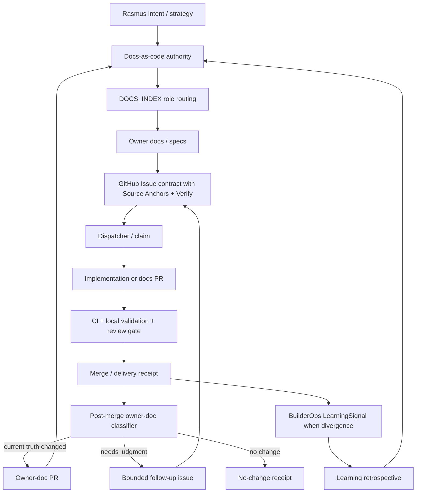
```mermaid
flowchart TD
  Intent["Rasmus intent / strategy"] --> Docs["Docs-as-code authority"]
  Docs --> Index["DOCS_INDEX role routing"]
  Index --> Owner["Owner docs / specs"]
  Owner --> Issue["GitHub Issue contract with Source Anchors + Verify"]
  Issue --> Claim["Dispatcher / claim"]
  Claim --> PR["Implementation or docs PR"]
  PR --> CI["CI + local validation + review gate"]
  CI --> Merge["Merge / delivery receipt"]
  Merge --> OwnerCheck["Post-merge owner-doc classifier"]
  OwnerCheck -->|current truth changed| OwnerPR["Owner-doc PR"]
  OwnerCheck -->|needs judgment| Followup["Bounded follow-up issue"]
  OwnerCheck -->|no change| Receipt["No-change receipt"]
  OwnerPR --> Docs
  Followup --> Issue
  Merge --> Learning["BuilderOps LearningSignal when divergence"]
  Learning --> Retro["Learning retrospective"]
  Retro --> Docs
```

## 4. End-To-End Builder System Process Map

| Lane | Trigger | Actor | Input | Authority file(s) | Skill(s) | Script/workflow | Output | Mutation authority | Verification gate | Decision points | Feedback loops | Failure path | Human exception condition | Evidence |
| --- | --- | --- | --- | --- | --- | --- | --- | --- | --- | --- | --- | --- | --- | --- |
| intent capture | Human strategy/request | Rasmus + agent | Intent | `PROJECT_KERNEL`, `DOCS_INDEX`, owner docs | docs-authoring | PR/docs | Updated docs or issue-ready spec | PR | Docs review | current vs target | docs-to-issue | clarify docs | intent ambiguity | [docs/DOCS_INDEX.md:24-47] |
| docs/spec authoring | Docs-only change | Agent | Existing docs | `AGENTS.md`, `DOCS_INDEX`, `DEV_WORKFLOW` | docs-authoring | docs/governance checks | Docs PR | PR | factual claim verification | owner doc role | docs-to-issue later | switch to issue-first if implementation | authority ambiguity | [`.codex/skills/docs-authoring/SKILL.md`:18-48] |
| docs-to-issue | Active docs become executable work | Agent | Docs/source anchors | `ISSUE_CONTRACT`, `docs-to-issue` | docs-to-issue | gh; optional Project repair | Issue | GitHub | `Verify:` markers | executable? duplicate? ready? | issue maintenance | Backlog/needs-human | named human decision | [`.codex/skills/docs-to-issue/SKILL.md`:69-119] |
| feature breakdown | Capability too large | Agent | Owner/spec docs | feature-breakdown | feature-breakdown | gh/docs | Spec dir, parent/child issues | PR + GitHub | task specs with ACs | parent vs child | validation hub | blocked parent | target acceptance ambiguity | [`.codex/skills/feature-breakdown/SKILL.md`:25-47], [`.codex/skills/feature-breakdown/SKILL.md`:107-129] |
| issue intake | Issue opened/edited/labeled | GitHub Action + agent | Issue body | issue template, governance | docs-to-issue/learning-to-issue | `issue-pr-governance.yml` | Checked issue | Issue labels/comments | section/source checks | label/status | maintenance | failed governance check | missing human input | [`.github/workflows/issue-pr-governance.yml`:3-78] |
| issue validation | Before coding | Agent | Issue | `AGENT_OPERATING_PROTOCOL`, issue contract | issue-to-code | source-anchor validation | pass/block | labels; optional Project projection | all `Verify:` targets | source truth sufficient? | issue maintenance | `agent:blocked` or `needs-human` | authority unclear | [`.codex/skills/issue-to-code/SKILL.md`:19-72] |
| readiness classification | Queue eligibility | Agent + GitHub state | labels | label taxonomy, issue contract | issue-maintenance | readiness validator | ready/non-active | labels | strictly valid `agent:ready` | agent-ready? | drift repair | no pickup | named decision | [`.codex/skills/_shared/LABEL_TAXONOMY.md`], [`.codex/skills/_shared/ISSUE_CONTRACT.md`] |
| dispatcher / queue selection | Work pickup | Agent + dispatcher | Ready tasks | dispatcher contract | issue-to-code | `python -m app.dispatcher next/claim` | Lease/task | dispatcher DB + GitHub label | lease acquired | priority and fit | release/reclaim | fallback to GitHub-label-only | dispatcher unavailable plus unsafe fallback | [docs/AGENT_ISSUE_DISPATCHER.md:165-180] |
| model routing | Before work | Agent | risk/TCD | `AGENTS.md` TCD | relevant skill | none | model/effort choice | session only | review outcome | under/over-model? | learning | escalate capability | >10 min human steering or repeated failures | [AGENTS.md :: Total Cost of Development] |
| skill routing | Task start | Agent | task class | `AGENTS.md`, skills README | matching skill | none | loaded skill | none | skill instructions | narrowest skill | learning | wrong skill -> repair | unclear route | [AGENTS.md :: Repo-local skill routing], [`.codex/skills/README.md`:64-128] |
| context building | Before edit | Agent | source anchors | `DOCS_INDEX`, owner docs | active skill | rg/cat | context | none | owner docs read | current vs target | docs repair | stop | owner doc unavailable | [docs/DOCS_INDEX.md:11-17], [docs/development/AGENT_OPERATING_PROTOCOL.md:23-37] |
| repo orientation | Before edit | Agent | git/docs | `AGENTS.md` | agentic-pkm/skill | `git status`, rg | state | none | diff/status | dirty tree? | resume-work | stop if conflict | destructive ambiguity | [AGENTS.md :: Agency default], [AGENTS.md :: Parallel-agent execution] |
| work pickup / claim | Active work begins | Agent | ready issue | issue-to-code | issue-to-code | `scripts/issue_pickup_claim.sh` | In Progress, label removed | GitHub/dispatcher | gh view verify | claim can proceed? | release/blocked | blocked label/comment | human decision | [`.codex/skills/issue-to-code/SKILL.md`:129-175], [scripts/issue_pickup_claim.sh:39-59] |
| implementation | Claimed issue | Agent | issue + owner docs | issue-to-code | issue-to-code | local tests | diff | files | local validation | can proceed? | local repair | block issue | safety/authority risk | [`.codex/skills/issue-to-code/SKILL.md`:236-260] |
| mechanism convergence review | Before expensive validation when high-risk stateful work triggers | Fresh reviewer | local publishable SHA + convergence packet | review/repair contract | issue-to-code / publish-pr | `review_before_ci_gate.py` + independent review | clean/blocking receipt | none | invariants/states/crash-ordering/races/test map | clean? | focused repair + refreshed packet | block expensive proof | authority conflict only | [docs/development/AUTONOMOUS_REVIEW_REPAIR_GATE_CONTRACTS.md#mechanism-convergence-gate] |
| local validation | Before PR | Agent | changed files | `DEV_WORKFLOW` | issue-to-code | ruff/mypy plus governing `Verify:` and affected-subsystem pytest; host-leased repo-wide suite only on explicit contract/cross-system escalation | validation log; lease receipt only when escalated | repo-common kernel lock only for broad suite | selected checks pass | affected scope; cross-system blast radius? | local repair | fix or block | cannot verify | [docs/development/DEV_WORKFLOW.md:60-89], [scripts/run_with_host_lease.py] |
| PR publication | Local diff ready | Agent | validated diff | publish-pr | publish-pr | git/gh | branch/commit/PR | GitHub | branch-truth gate | lane? file set? | PR repair | stop on drift | publication ambiguity | [`.codex/skills/publish-pr/SKILL.md`:53-159] |
| PR contract validation | PR opened/edited | GitHub Action | PR body/files | PR template/governance | none | `issue-pr-governance.yml` | pass/fail check | none | pr-contract | issue link? lane? | body repair | check failure | none unless authority needed | [`.github/workflows/issue-pr-governance.yml`:79-218] |
| CI | PR/push/schedule/manual | GitHub Actions | PR head | workflows | none | `.github/workflows/**` | checks/artifacts | none | check status | failure? stale? | CI repair | block | blocked-technical/backoff | `gh workflow list`; [`.github/workflows/ci-smoke.yaml`:4-15] |
| CI triage | CI fail/stale | Agent | check logs | PR escalation | pr-integration | `await_pr_checks.sh`, gh api | failure class | PR commits if caused | re-run/recheck | caused-by-PR? | CI repair loop | block | unresolved residual risk | [docs/development/PR_ESCALATION_PATHS.md:12-20] |
| PR integration / repair | Triggered by CI/review/drift | Agent | PR | PR hot/escalation | pr-integration | git/gh/tests | ready-for-verification or blocked | PR commits/comments | current SHA + checks | blocking? | repair loops | blocked-* | repeated failure | [`.codex/skills/pr-integration/SKILL.md`:38-67] |
| machine review (full path only) | Full-path PR reaches review gate | Agent/subagent | PR diff | verification-and-closure | code-review via verification | local subagent | findings/pass | comments | review gate | blocking finding? | review repair | stop after repeated failure | blocked-technical/capability triage | [`.codex/skills/verification-and-closure/SKILL.md`:116-163] |
| merge gate | Verification complete | Agent | PR + issue + CI; full path also consumes v2 closer context | verification-and-closure | verification-and-closure | `await_pr_checks.sh`; full path adds verified merge preparer/phase writer and REST/GraphQL attribution | light plain merge/readback or full exact-head merge/block with trusted phase ledger | GitHub | tier-selected CI/AC/review/closure gate | eligible? full-path race/crash? | repair or idempotent full-path recovery | no merge before the selected path's prerequisites | non-waivable selected path | [`.codex/skills/verification-and-closure/SKILL.md`], [`app/dispatcher/verified_merge.py`] |
| issue closure | After merge | Agent + automation | merged PR | Issue/PR truth; optional projection matrix | verification-and-closure | gh; optional Project ops | closed issue; optional Done projection | GitHub | readback | partial? | closure loop | follow-up issue | closure ambiguity | [`.codex/skills/verification-and-closure/SKILL.md`:194-208] |
| post-merge docs/spec feedback | After merge | Agent + watchdog | merged diff + authenticated issue targets | post-merge-owner-doc | post-merge-owner-doc | watchdog workflow | docs PR/follow-up/no-change plus PR-specific receipts | closed children + distinct open governing parent, or PR for issue-free lane | receipt exists for this PR on every target | owner doc changed? | docs loop | nudge | wording judgment | [`.codex/skills/post-merge-owner-doc/SKILL.md`], [`.github/workflows/post-merge-owner-doc-watchdog.yml`] |
| promotion/release | Test/prod promotion | Agent + operator | candidate ref/plan | release docs/skills | promote-* | release workflows/scripts | promotion receipt | operator + PR to stable | health/smoke | reversible? | rollback loop | rollback/block | prod/stable authority | [`.codex/skills/promote-test-to-prod/SKILL.md`:109-113], `gh api stable protection` |
| Mimer/product-lane work | Runtime client task | App agent/human | vault/runtime request | Mimer contracts | `mimer-*` | product APIs/files | governed runtime action | Product authority | Mimer receipts | user/runtime authority | Product loops | human gate | durable knowledge mutation | [`.codex/skills/README.md`:220-250] |
| BuilderOps/governance work | Workflow/governance change | Agent | learning/worklog/docs | BuilderOps docs | capture-learning, learning-retrospective | BuilderOps CLI/API | records, proposals, PRs | BuilderOps + PR | receipt/projection | promote? | learning loop | fallback log | authority crossing | [docs/builderops/BUILDEROPS_VAULT_BOUNDARY.md:40-81] |
| learning/retrospective | Divergence or cadence | Agent | LearningSignals | delivery feedback | capture-learning, learning-retrospective | BuilderOps CLI | proposals/PRs/issues | BuilderOps + PR | receipt | upstream artifact? | retro loop | proposal-only | human review in default mode | [docs/development/DELIVERY_FEEDBACK_LOOP.md:67-188] |
| continuous improvement / reevaluation | Divergence, epic close, review/CI/TCD pattern, CKM projection, or cadence | Agent + BuilderOps + optional human review | LearningSignals, evidence packs, review findings, TCD signals, CKM projections, fitness/debt state | delivery feedback, SBS operating model, CKM specs | learning-retrospective, capture-learning, future learning-to-issue | BuilderOps CLI/API, gh, docs/governance PRs | applied edit, already-satisfied receipt, bounded issue, PromotionIntent, debt/fitness update, discard/supersession receipt | BuilderOps + GitHub/PR through explicit gates | terminal outcome per signal | Product vs Builder? actionability? authority crossing? | reevaluation loop | unresolved signals remain open | strategic/Product authority or unsafe promotion | [docs/development/DELIVERY_FEEDBACK_LOOP.md:1-220], [docs/CAPABILITY_KNOWLEDGE_MODEL/README.md:51-77] |
| human exception routing | Explicit authority-classifier outcome | Agent | authority evidence | this doc + classifier | active skill | issue/PR comment | Human Exception packet | human | named authority decision | continue without authority? | returns to queue | `agent:needs-human` | irreversible/external/strategic or other canonical Human Exception category | [docs/architecture/SBS_OPERATING_MODEL.md §12] |

## 5. Dispatcher And Routing Model

Observed: the repo has an actual dispatcher implementation and a documented operational deployment. It is not merely a label convention. The dispatcher has SQLite task/lease/event storage, a CLI, GitHub pull-sync, queue/claim/heartbeat/complete commands, tests, and Makefile targets [docs/AGENT_ISSUE_DISPATCHER.md:21-36], [app/dispatcher/cli.py:31-32], [Makefile:356-361], [tests/dispatcher/test_agent_loop.py:1-30].

Authority roles are intentionally split: GitHub Issues / PRs / CI are durable delivery truth;
Dispatcher SQLite owns volatile queue, claim, lease, and heartbeat coordination; the external
BuilderOps Vault owns durable BuilderOps Markdown artifacts but no SQLite or live claims; and
GitHub Project plus Signboard remain rebuildable projection surfaces.

Mechanism classification:

| Mechanism | Classification | Current behavior | Evidence |
| --- | --- | --- | --- |
| how work becomes eligible | deterministic + agentic | Issue must carry a strictly validated `agent:ready` label and satisfy its contract and `Verify:` targets; Project Status does not gate pickup | [`.codex/skills/issue-to-code/SKILL.md`], [docs/development/DEV_WORKFLOW.md] |
| how work is queued | deterministic + partial | Dispatcher SQLite pulls open `agent:ready` issues and owns volatile queue/lease state; the external BuilderOps Vault stores durable artifacts | [docs/AGENT_ISSUE_DISPATCHER.md] |
| how an agent selects an issue | agentic | Priority order plus engineering judgment; dispatcher `next` returns ready tasks but no full lane scheduler | [`.codex/skills/issue-to-code/SKILL.md`:109-124], [docs/AGENT_ISSUE_DISPATCHER.md:168-170] |
| labels affect readiness | deterministic | `agent:ready` is the external pickup qualifier after strict validation; `agent:blocked` and `needs-human` are non-active | [`.codex/skills/_shared/LABEL_TAXONOMY.md`] |
| Project status affects routing | none | Project is an optional legacy projection and is not consulted by dispatcher sync or pickup | [docs/AGENT_ISSUE_DISPATCHER.md :: Source-of-Truth Boundaries] |
| work is claimed | deterministic | Dispatcher lease then GitHub label removal; fallback GitHub-label-only | [`.codex/skills/issue-to-code/SKILL.md`:133-175] |
| branch/worktree allocation | partially deterministic | Dedicated worktree required by policy; preflight detects shared root/drift; no central allocator | [AGENTS.md :: Parallel-agent execution], [`.codex/skills/_shared/BRANCH_TRUTH_GATE.md`:9-77] |
| model choice | agentic | TCD policy and adapter defaults; no deterministic router service | [AGENTS.md :: Total Cost of Development], [`.codex/agents/issue-set-coordinator.toml`:1-21] |
| skill choice | agentic + documented | `AGENTS.md` and skill README route by task class | [AGENTS.md :: Repo-local skill routing], [`.codex/skills/README.md`:64-128] |
| docs/source context selection | agentic + documented | `DOCS_INDEX`, source anchors, owner docs; no context-builder script | [docs/DOCS_INDEX.md:11-17], [docs/development/AGENT_OPERATING_PROTOCOL.md:23-37] |
| parallel collision prevention | deterministic + partial | Dispatcher leases, label removal, worktree preflight; no branch allocator | [docs/AGENT_ISSUE_DISPATCHER.md:152-180], [scripts/agent_workspace_preflight.sh:55-61] |
| stale claims detection | deterministic + partial | Dispatcher TTL/heartbeat and reclaim semantics; GitHub-label-only fallback has weaker stale detection | [docs/AGENT_ISSUE_DISPATCHER.md:165-180], [tests/dispatcher/test_leases.py:194-222] |
| failed work returns to queue | partially implemented | Dispatcher release/block; GitHub labels for blocked; no automated failed-work requeue from CI | [docs/AGENT_ISSUE_DISPATCHER.md:142-150], [`.codex/skills/issue-to-code/SKILL.md`:176-195] |
| human exception removed from normal queue | deterministic in labels | `agent:needs-human` normally Backlog and not ready | [`.codex/skills/_shared/LABEL_TAXONOMY.md`:18-27] |
| epic context-budget observation | deterministic + advisory | At slice boundaries, a versioned run-state receipt records explicit context measurement or `unknown`, checkpoint/digest data, cost inputs, and independent lifecycle/execution/model-tier recommendations. It performs no dispatch, spawn, acceptance, CI, review, merge, or closure mutation. | [`app/builderops/epic_run_context_budget.py`], [`tests/builderops/test_epic_run_context_budget.py`], [docs/AGENT_ISSUE_DISPATCHER.md :: Epic-runner context-budget observation] |

The context-budget evaluator is measurement infrastructure, not a routing authority. Its
`checkpoint_rotate` and `thin_worker` values are recommendations on separate axes: delegating a
slice does not clear coordinator context, and refreshing changed external state does not alone force
rotation. Persisted worker-isolation, setup-cost, merge-risk, policy, uncertainty, and external-state
evidence deterministically reconstructs lifecycle, execution, model-tier, and reason fields during
every generic run-state update or load. The receipt's policy is explicit and versioned, so the
three-slice #3229 pilot remains a
replayable observation (three inline routes, zero implementation-worker starts, long-lived Sol
coordinator) rather than evidence that Sol or any fixed threshold was cheapest. Missing context,
token, cost, or human-minute measurements remain `unknown`; available inputs may be reported without
inventing the rest or fabricating an accepted-slice denominator.

Authority is unchanged. The evaluator's effect lists are empty and its gate invariants retain CI,
merge, and closure as separate required surfaces; independent review remains separate on the full
delivery path only. It neither rotates/compresses a
coordinator nor starts workers or parallel execution. Dispatcher lease state, live GitHub Issue/PR
truth, exact branch/SHA, CI, and review state must still be refreshed and acted on through their
existing owning workflows.

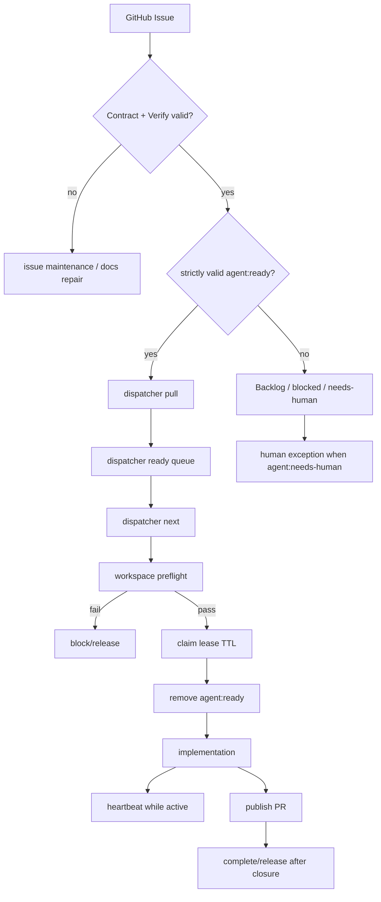
```mermaid
flowchart TD
  Issue["GitHub Issue"] --> Shape{"Contract + Verify valid?"}
  Shape -->|no| Repair["issue maintenance / docs repair"]
  Shape -->|yes| Ready{"strictly valid agent:ready?"}
  Ready -->|no| Backlog["Backlog / blocked / needs-human"]
  Ready -->|yes| Pull["dispatcher pull"]
  Pull --> Queue["dispatcher ready queue"]
  Queue --> Next["dispatcher next"]
  Next --> Preflight["workspace preflight"]
  Preflight -->|fail| Block["block/release"]
  Preflight -->|pass| Lease["claim lease TTL"]
  Lease --> Label["remove agent:ready"]
  Label --> Work["implementation"]
  Work --> Heartbeat["heartbeat while active"]
  Work --> PR["publish PR"]
  PR --> Complete["complete/release after closure"]
  Backlog --> Human["human exception when agent:needs-human"]
```

## 6. State Machines

### Issue Lifecycle

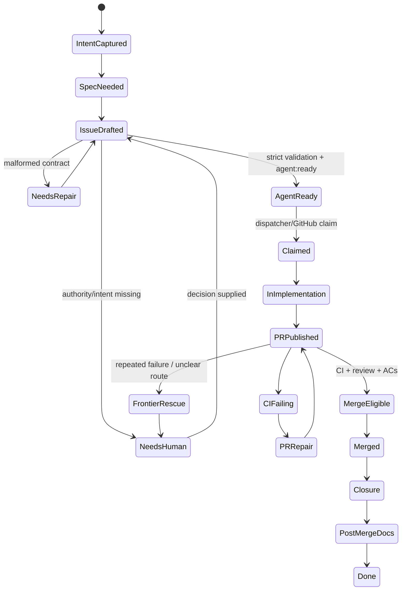
```mermaid
stateDiagram-v2
  [*] --> IntentCaptured
  IntentCaptured --> SpecNeeded
  SpecNeeded --> IssueDrafted
  IssueDrafted --> NeedsRepair: malformed contract
  NeedsRepair --> IssueDrafted
  IssueDrafted --> NeedsHuman: authority/intent missing
  NeedsHuman --> IssueDrafted: decision supplied
  IssueDrafted --> AgentReady: strict validation + agent:ready
  AgentReady --> Claimed: dispatcher/GitHub claim
  Claimed --> InImplementation
  InImplementation --> PRPublished
  PRPublished --> CIFailing
  CIFailing --> PRRepair
  PRRepair --> PRPublished
  PRPublished --> FrontierRescue: repeated failure / unclear route
  FrontierRescue --> NeedsHuman
  PRPublished --> MergeEligible: CI + review + ACs
  MergeEligible --> Merged
  Merged --> Closure
  Closure --> PostMergeDocs
  PostMergeDocs --> Done
```

### PR Lifecycle

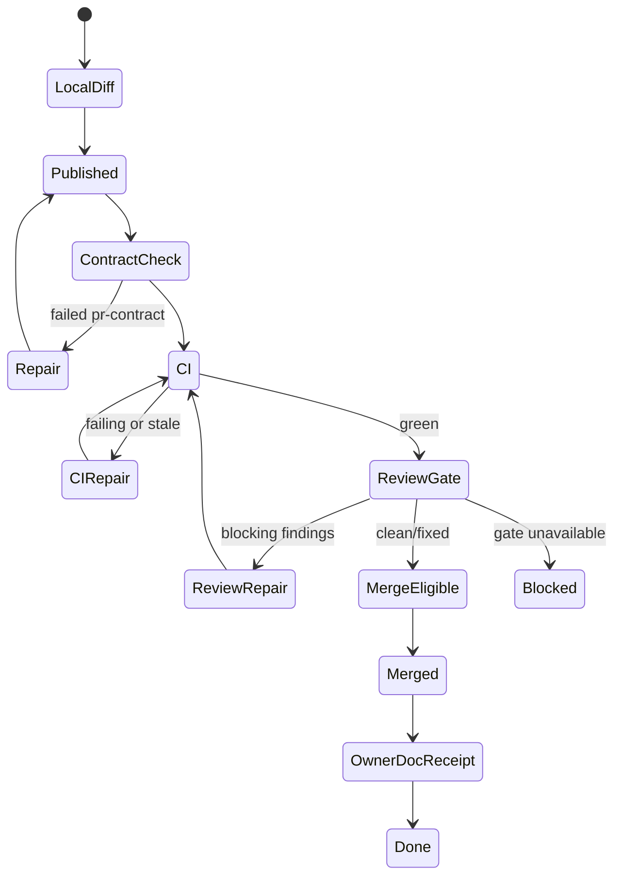
```mermaid
stateDiagram-v2
  [*] --> LocalDiff
  LocalDiff --> Published
  Published --> ContractCheck
  ContractCheck --> Repair: failed pr-contract
  Repair --> Published
  ContractCheck --> CI
  CI --> CIRepair: failing or stale
  CIRepair --> CI
  CI --> ReviewGate: green
  ReviewGate --> ReviewRepair: blocking findings
  ReviewRepair --> CI
  ReviewGate --> MergeEligible: clean/fixed
  MergeEligible --> Merged
  Merged --> OwnerDocReceipt
  OwnerDocReceipt --> Done
  ReviewGate --> Blocked: gate unavailable
```

### Epic PR Batching Policy

Default to one coherent child issue slice per PR. A parent epic orders work and receipts; it is not
permission to create one mega-PR. Multiple child issues may share a PR only when they share the same
owner/review surface, validation and CI risk profile, rollback behavior, owner-doc writeback surface,
PR lane, and BuilderOps routing story.

Allowed examples:

- docs-only batches across the same development docs when review, validation, and owner-doc writeback
  are identical;
- shared helper plus direct tests when the helper is the single reason every child changes;
- mechanical governance fixture updates when all children validate through the same targeted tests.

Forbidden examples:

- runtime behavior plus governance workflow or process changes in one PR;
- Product owner-doc contract changes batched with Builder System process edits;
- children with different rollback behavior, reviewers, required CI surfaces, or owner-doc writebacks;
- batching merely because children share a parent epic.

Use `app.builderops.epic_pr_batching_policy.evaluate_epic_pr_batching_policy` as a lintable local
preflight for obvious over-batching risk. The policy is advisory governance evidence only: it does
not weaken PR review, required CI, issue receipts, or branch protection.

### Agent Work Lifecycle

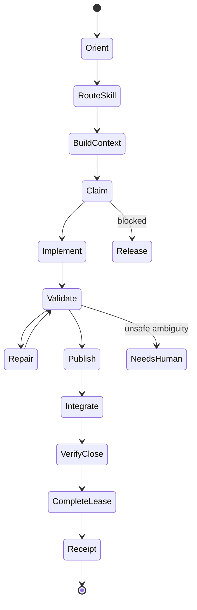
```mermaid
stateDiagram-v2
  [*] --> Orient
  Orient --> RouteSkill
  RouteSkill --> BuildContext
  BuildContext --> Claim
  Claim --> Implement
  Implement --> Validate
  Validate --> Repair
  Repair --> Validate
  Validate --> Publish
  Publish --> Integrate
  Integrate --> VerifyClose
  VerifyClose --> CompleteLease
  CompleteLease --> Receipt
  Receipt --> [*]
  Claim --> Release: blocked
  Validate --> NeedsHuman: unsafe ambiguity
```

### CI Repair Lifecycle

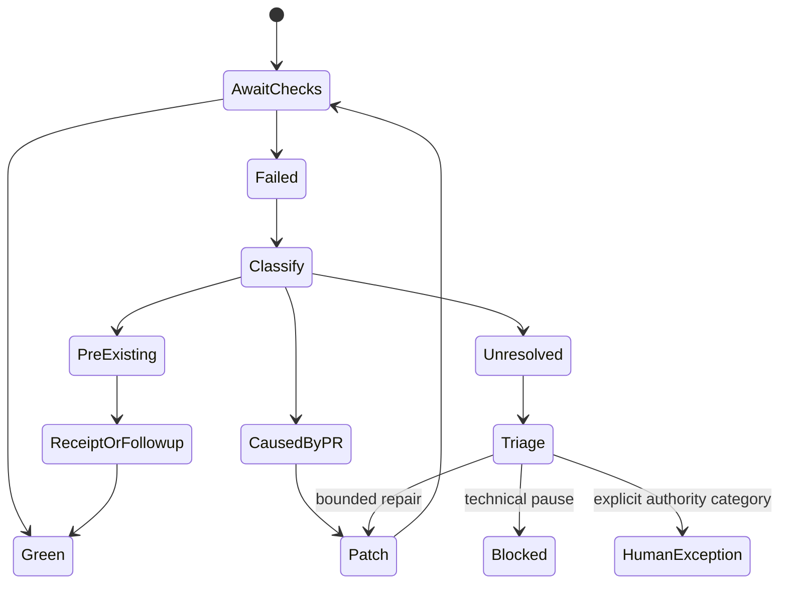
```mermaid
stateDiagram-v2
  [*] --> AwaitChecks
  AwaitChecks --> Green
  AwaitChecks --> Failed
  Failed --> Classify
  Classify --> CausedByPR
  Classify --> PreExisting
  Classify --> Unresolved
  CausedByPR --> Patch
  Patch --> AwaitChecks
  PreExisting --> ReceiptOrFollowup
  ReceiptOrFollowup --> Green
  Unresolved --> Triage
  Triage --> Blocked: technical pause
  Triage --> Patch: bounded repair
  Triage --> HumanException: explicit authority category
```

### Docs/Spec Feedback Lifecycle

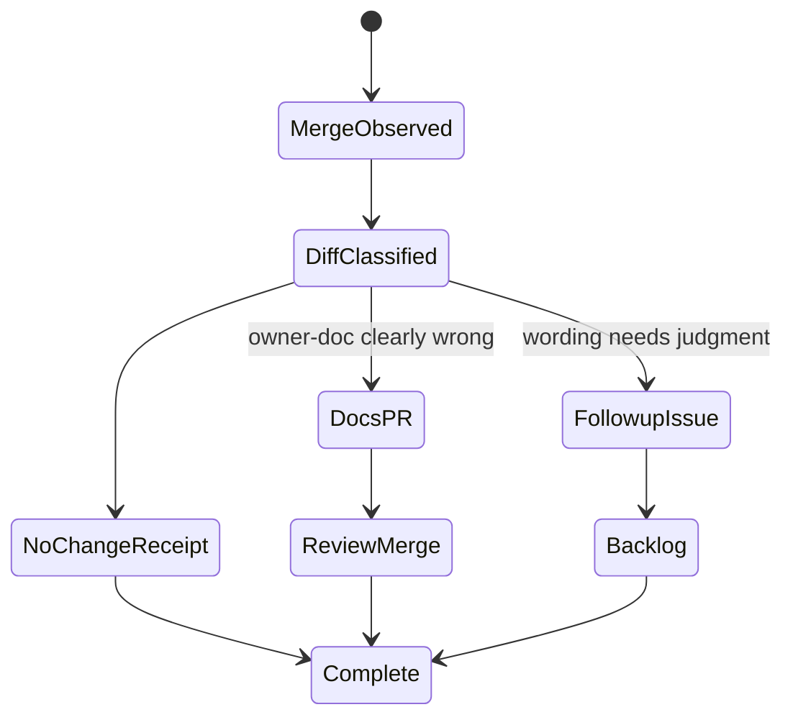
```mermaid
stateDiagram-v2
  [*] --> MergeObserved
  MergeObserved --> DiffClassified
  DiffClassified --> DocsPR: owner-doc clearly wrong
  DiffClassified --> FollowupIssue: wording needs judgment
  DiffClassified --> NoChangeReceipt
  DocsPR --> ReviewMerge
  FollowupIssue --> Backlog
  NoChangeReceipt --> Complete
  ReviewMerge --> Complete
  Backlog --> Complete
```

### Human Exception Lifecycle

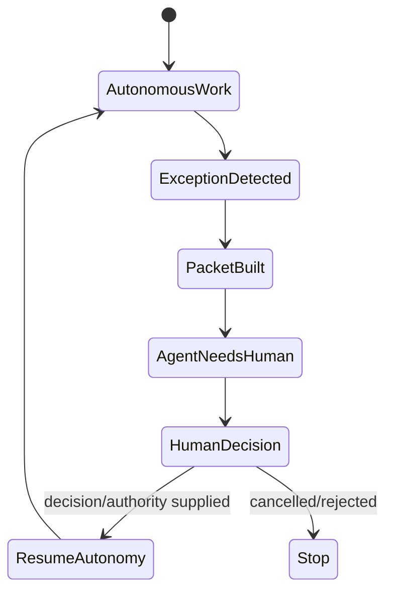
```mermaid
stateDiagram-v2
  [*] --> AutonomousWork
  AutonomousWork --> ExceptionDetected
  ExceptionDetected --> PacketBuilt
  PacketBuilt --> AgentNeedsHuman
  AgentNeedsHuman --> HumanDecision
  HumanDecision --> ResumeAutonomy: decision/authority supplied
  HumanDecision --> Stop: cancelled/rejected
  ResumeAutonomy --> AutonomousWork
```

### Verification dispatch recovery

Verification-dispatch recovery is fail-closed but normally autonomous. The host
uses this sequence: `disabled -> preflight -> observe-only -> pilot ->
limited-enable -> enabled`. Preflight and pilot are non-mutating: they validate
the installed commit, schema/profile compatibility, authentication posture, and
receipt parsing before a request is claimed or any GitHub mutation is possible.
A failed preflight or pilot returns to `disabled` as `blocked_technical`; it
creates an evidence-backed compatibility recovery path and does not create a
Human Exception merely because a retry budget is exhausted. The only route to
`agent:needs-human` is the authority classifier in
`AUTONOMOUS_REVIEW_REPAIR_GATE_CONTRACTS.md :: Escalation classifier`.

## 7. Decision Points

| Decision point | Current mechanism | Deterministic? | Agentic? | Human? | Inputs | Outputs | Failure mode | Evidence |
| --- | --- | --- | --- | --- | --- | --- | --- | --- |
| Is source truth sufficient? | `DOCS_INDEX` + operating protocol | partial | yes | if unclear | source anchors/docs | proceed/repair | target-state treated as shipped | [docs/DOCS_INDEX.md:80-90], [docs/development/AGENT_OPERATING_PROTOCOL.md:73-83] |
| Is this current-state or target-state? | doc role headers/index | partial | yes | if ambiguous | doc role | classification | false current claim | [docs/DOCS_INDEX.md:11-17], [docs/architecture/SBS_OPERATING_MODEL.md:28-34] |
| Is an issue executable? | issue contract + `Verify:` | partial | yes | no | ACs/body | ready/repair | untestable AC | [`.codex/skills/_shared/ISSUE_CONTRACT.md`:53-72] |
| Is issue agent-ready? | strict issue validation + label | yes | yes | no | body/labels | queue eligible | malformed issue labeled ready | [`.codex/skills/_shared/ISSUE_CONTRACT.md`], [`.codex/skills/_shared/LABEL_TAXONOMY.md`] |
| Product/Runtime, Builder, or boundary? | SBS classification | partial | yes | if unclear | touched surface | SBS impact | wrong authority | [docs/architecture/SBS_OPERATING_MODEL.md:95-118] |
| Risk level? | TCD + PR hot path | partial | yes | no | lane/touched surface | low/normal/high | under-modeling | [AGENTS.md :: Total Cost of Development], [docs/development/PR_HOT_PATH.md:12-25] |
| Docs-only/code/runtime/governance/release/Mimer/BuilderOps? | lane and skill routing | partial | yes | no | files/scope | lane | wrong lane | [docs/development/DEV_WORKFLOW.md:107-169], [`.codex/skills/README.md`:130-164] |
| Requires frontier planning? | feature-breakdown/deliver-issue-set | no | yes | maybe | scope size | breakdown | parent issue used as slice | [`.codex/skills/feature-breakdown/SKILL.md`:25-47] |
| Requires human exception? | escalation classifier | partial | yes | yes | explicit authority category | packet/blocker | unnecessary interrupt or unsafe continue | [AGENTS.md :: Agency default], [docs/development/AUTONOMOUS_REVIEW_REPAIR_GATE_CONTRACTS.md :: Escalation classifier] |
| Can an agent claim? | dispatcher/preflight/labels | yes | yes | no | queue/preflight | lease/claim | double claim | [docs/AGENT_ISSUE_DISPATCHER.md:152-180] |
| Can implementation proceed? | issue-to-code stop conditions | partial | yes | if unclear | issue/docs/env | proceed/block | scope drift | [`.codex/skills/issue-to-code/SKILL.md`:62-72] |
| Which tests/checks required? | `DEV_WORKFLOW`, issue `Verify:` | partial | yes | no | touched files/ACs | validation plan | missing coverage | [docs/development/DEV_WORKFLOW.md:60-83] |
| Can CI failure be auto-repaired? | PR escalation | no | yes | if unresolved | logs/checks | fix/follow-up/block | blind retry | [docs/development/PR_ESCALATION_PATHS.md:12-20] |
| Is review finding blocking? | review gate rules | no | yes | no | findings | fix/block | unresolved finding merged | [`.codex/skills/verification-and-closure/SKILL.md`:131-163] |
| PR eligible for auto-merge? | verification prerequisites | partial | yes | no | CI/review/ACs | merge/block | main unprotected | [`.codex/skills/verification-and-closure/SKILL.md`:103-115], `gh api main protection -> 404` |
| Can issue be closed? | verification/closure | partial | yes | if partial/ambiguous | merge/ACs | close/follow-up | false done | [`.codex/skills/verification-and-closure/SKILL.md`:209-217] |
| Owner doc/spec update needed? | PR template + post-merge skill | partial | yes | if wording judgment | diff | docs PR/follow-up/no-change | drift | [`.github/pull_request_template.md`:34-39], [`.codex/skills/post-merge-owner-doc/SKILL.md`:76-85] |
| Promotion needs operator authority? | release skills | yes | yes | yes | plan | execute/stop | prod mutation without ack | [`.codex/skills/promote-test-to-prod/SKILL.md`:109-113] |
| Learning signal promotion? | capture-learning/retro | partial | yes | default retro review | divergence | record/proposal/issue | learning lost or product memory contamination | [`.codex/skills/capture-learning/SKILL.md`:19-90], [docs/architecture/SBS_OPERATING_MODEL.md:235-261] |

## 8. Feedback Loops

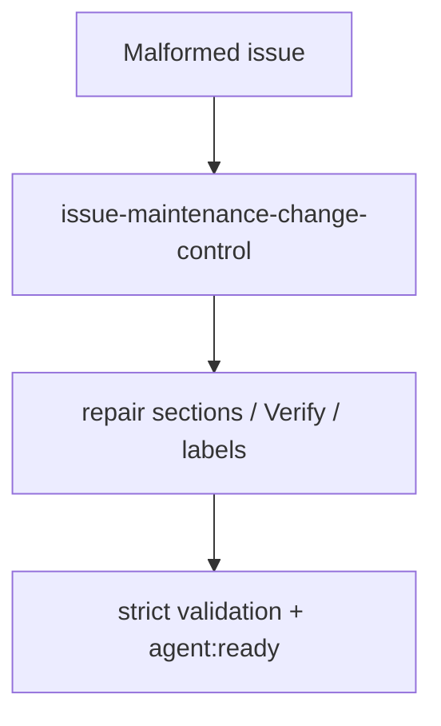
```mermaid
flowchart TD
  MalformedIssue["Malformed issue"] --> Maintenance["issue-maintenance-change-control"]
  Maintenance --> RepairContract["repair sections / Verify / labels"]
  RepairContract --> Ready["strict validation + agent:ready"]
```

Issue readiness repair loop: triggered by malformed issue, stale anchors, missing `Verify:`, or
drift; actor is agent/maintenance skill; no max retry is defined; authoritative state is GitHub
Issue body/labels, with Project included only for explicit projection repair; escalates to
`agent:needs-human` when authority or input is missing [docs/development/AGENT_OPERATING_PROTOCOL.md:73-83], [`.codex/skills/README.md`:168-178].

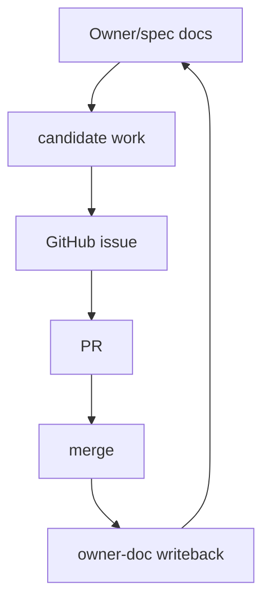
```mermaid
flowchart TD
  Docs["Owner/spec docs"] --> Candidate["candidate work"]
  Candidate --> Issue["GitHub issue"]
  Issue --> PR["PR"]
  PR --> Merge["merge"]
  Merge --> OwnerDoc["owner-doc writeback"]
  OwnerDoc --> Docs
```

Docs/spec-to-issue loop: triggered when active docs become bounded executable work; no max retry; state is source docs plus issue source anchors; returns to normal flow when issue is `agent:ready`; escalates when work is vague or needs owner judgment [`.codex/skills/docs-to-issue/SKILL.md`:69-119].

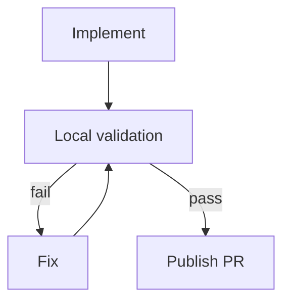
```mermaid
flowchart TD
  Implement["Implement"] --> Validate["Local validation"]
  Validate -->|fail| Fix["Fix"]
  Fix --> Validate
  Validate -->|pass| Publish["Publish PR"]
```

Implementation/local validation repair loop: triggered by local failing check; no max retry in scripts; evidence is terminal output/PR body; escalates under TCD triggers such as two failed attempts or hard-to-assess risk [AGENTS.md :: Total Cost of Development].

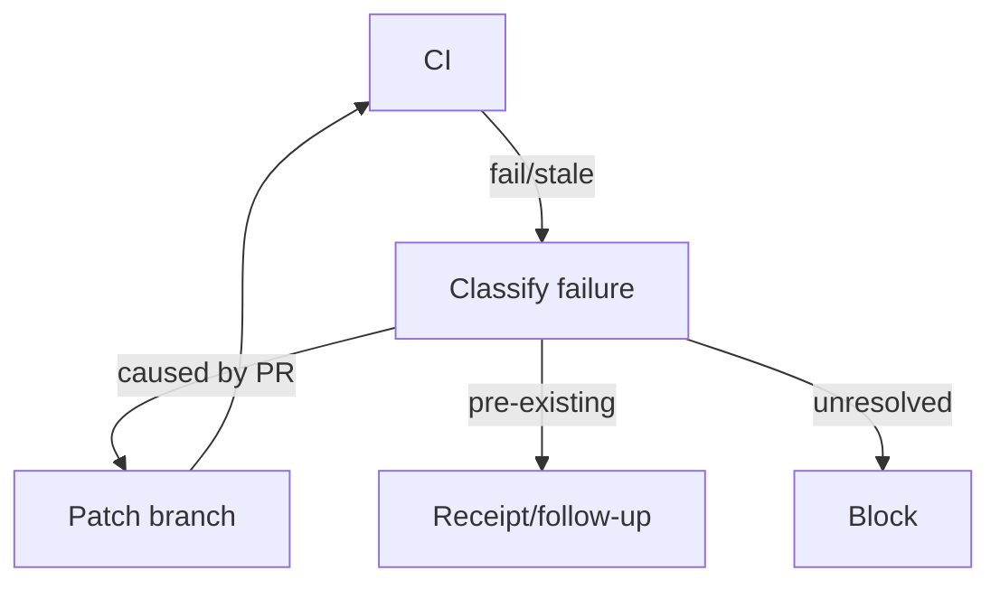
```mermaid
flowchart TD
  CI["CI"] -->|fail/stale| Classify["Classify failure"]
  Classify -->|caused by PR| Patch["Patch branch"]
  Patch --> CI
  Classify -->|pre-existing| Receipt["Receipt/follow-up"]
  Classify -->|unresolved| Block["Block"]
```

CI repair loop: triggered by failing/missing/stale check; actor is pr-integration/verification; stop condition is caused-by-PR fixed, pre-existing receipted, or unresolved block; evidence is CI checks/logs; returns by re-running checks [docs/development/PR_ESCALATION_PATHS.md:12-20].

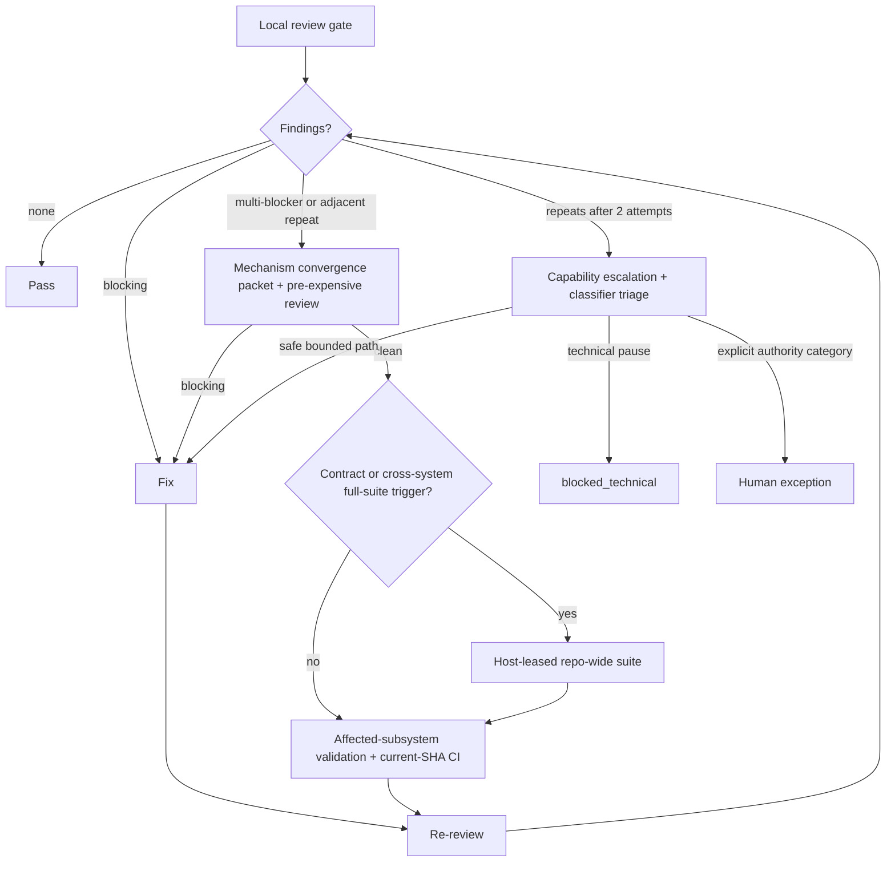
```mermaid
flowchart TD
  Review["Local review gate"] --> Findings{"Findings?"}
  Findings -->|none| Pass["Pass"]
  Findings -->|blocking| Fix["Fix"]
  Fix --> ReReview["Re-review"]
  ReReview --> Findings
  Findings -->|multi-blocker or adjacent repeat| Converge["Mechanism convergence packet + pre-expensive review"]
  Converge -->|clean| Scope{"Contract or cross-system full-suite trigger?"}
  Scope -->|no| Proof["Affected-subsystem validation + current-SHA CI"]
  Scope -->|yes| Full["Host-leased repo-wide suite"]
  Full --> Proof
  Proof --> ReReview
  Converge -->|blocking| Fix
  Findings -->|repeats after 2 attempts| Triage["Capability escalation + classifier triage"]
  Triage -->|safe bounded path| Fix
  Triage -->|technical pause| Block["blocked_technical"]
  Triage -->|explicit authority category| Human["Human exception"]
```

Full-path review repair loop: re-run after substantive fixes; stop after one clean independent round
by default. Require a second clean round only for declared high-risk runtime work or a
low-convergence circuit-breaker trigger on the same mechanism/domain key. A multi-blocker or
adjacent repeat finding in one stateful mechanism triggers a convergence packet and independent
review before another full-suite/CI cycle. Light-path PRs do not enter this loop. A repeated
mechanism after two attempts enters capability escalation plus classifier triage, not an automatic
owner interrupt [`.codex/skills/verification-and-closure/SKILL.md`:145-225].

Frontier rescue loop: triggered by repeated failure, feature-level issue, hidden invariants, or route
ambiguity; actor is agent; state moves to issue maintenance, feature-breakdown, capability
escalation, or technical block. It reaches `agent:needs-human` only after the canonical classifier
names an explicit authority category; evidence is a blocker receipt or follow-up issue
[`.codex/skills/issue-to-code/SKILL.md`:121-124], [AGENTS.md :: Total Cost of Development].

Closure loop: triggered after merge/verification; actor is verification-and-closure; authoritative
state is Issue/PR/dispatcher, with Project optional. A crash in the open neutralized window resumes
only from exact receipt/body/budget truth plus a continuous `prepared` phase; a crash after merge
resumes from the same trusted authority plus the continuous durable phase ledger. It returns to done
only after the restored phase, exact live authorized closure attribution with no unauthorized
closure, labels removed, owner-doc receipt, and dispatcher complete/release when applicable.
Optional Project `Done` repair does not gate closure. Explicit authenticated issue closes require a
null closer plus the delivery actor/time fence, while automatic attribution requires the exact
target PR/repository/merge SHA; a foreign PR closer is unrelated even when the expected issue is
closed [`.codex/skills/verification-and-closure/SKILL.md`].

The neutralized-body `pr-contract` window is receipt-authenticated: `Refs` plus
`Verified-Closing-Issues` pass only when one trusted, non-conflicting exact-head authority receipt
matches the live body digest and its exact governing, closing, and cumulative supporting sets. The
verification-dispatch producer reads at most `closingIssuesReferences(first: 11)` in one GraphQL call
and fails before pagination when the ten-closing-issue contract is exceeded.

Same-head deployed-v1 recovery preserves historical attempts and repair budget only when the fresh
v2 artifact retains the exact legacy supporting set and its authenticated closing set stays within
the governing issue plus that set. A changed or unknowable legacy issue authority remains inert.

Post-merge docs/spec loop: triggered after merged PR; actor is post-merge skill plus watchdog nudge;
outputs a docs PR, follow-up issue, or no-change result, then records the same PR-specific result on
every closed child and any distinct open governing parent. Only an OWNER, MEMBER, or COLLABORATOR
receipt suppresses the watchdog nudge; issue-free lanes use the PR thread. The
classifier and watchdog trust the same unique collaborator-authored same-head authority receipt during
the temporary neutralized-body window. The watchdog requires the receipt's governing, closing, and
live supporting sets to exactly match the canonically parsed live original or neutralized body. After
an authenticated merge, mutable-body drift may instead recover the same durable authority only when
the exact merged identity and a non-conflicting continuous prepared-through-merged phase chain bind
that receipt. A present but invalid trusted receipt fails target selection closed; it never falls back
to the mutable body or `closingIssuesReferences`. Forged, stale, conflicting, generic, different-PR,
or unphased body-mismatched receipts cannot select a watchdog target
[`.codex/skills/post-merge-owner-doc/SKILL.md`], [`.github/workflows/post-merge-docs-classifier.yml`],
[`.github/workflows/post-merge-owner-doc-watchdog.yml`].

Learning/retrospective loop: triggered by divergence or approximately 10 delivery-learning records; actor is capture-learning/learning-retrospective; default mode proposes edits for human review; autonomous mode only when explicitly requested [`.codex/skills/learning-retrospective/SKILL.md`:25-32], [`.codex/skills/learning-retrospective/SKILL.md`:108-145].

Continuous improvement / reevaluation loop: triggered by a concrete divergence, repeated review or CI
failure pattern, high-TCD delivery, epic close, CKM/Kvasir projection, or approximately 10 unprocessed
delivery-learning records. Actor is `learning-retrospective` or a bounded governance/automation
worker. State is BuilderOps `LearningSignal`/receipt records, PR evidence packs, CI failure context,
review findings, TCD rationale, transition-debt/fitness-rule state, and CKM projections. Stop
condition is one terminal outcome per in-scope signal: applied governance edit, already satisfied,
bounded GitHub Issue, `PromotionIntent`, debt/fitness update, or discard/supersession receipt. CKM
output remains projection-only and never mutates Product/Runtime authority by itself
[docs/development/DELIVERY_FEEDBACK_LOOP.md:1-220], [docs/CAPABILITY_KNOWLEDGE_MODEL/README.md:51-77].

Promotion/rollback loop: triggered by test/prod promotion; actor is release skills plus operator; stop condition is PASS receipt or rollback verification; human/operator ack is required for prod promotion [`.codex/skills/promote-test-to-prod/SKILL.md`:109-113].

Human exception loop: triggered only by an explicit canonical authority category such as an
irreversible external action, strategic choice, or genuinely ambiguous authority. Technical
failure remains blocked/repairable and does not enter the loop. State is `agent:needs-human` plus a
packet and returns when the decision supplies authority [docs/architecture/SBS_OPERATING_MODEL.md §12].

## 9. Automation Surface Matrix

| Step | Current form | Better target form | Why | Attention reduction | Token reduction | Risk | Evidence |
| --- | --- | --- | --- | --- | --- | --- | --- |
| issue section validation | GitHub Action | deterministic script + GitHub Action | Keep malformed issues out of ready queue | medium | low | low | [`.github/workflows/issue-pr-governance.yml`:40-78] |
| `Verify:` validation | skill-enforced prose | deterministic script + GitHub Action | Detect non-executable ACs before pickup | high | medium | medium | [docs/development/DEV_WORKFLOW.md:226-255] |
| source anchor validation | script in Action | deterministic script | Already appropriate | medium | medium | low | [`.github/workflows/issue-pr-governance.yml`:68-78] |
| dispatcher pull/claim | script/CLI + skill | hybrid: script + agent | Keep queue deterministic while selection remains judgment-based | high | medium | medium | [docs/AGENT_ISSUE_DISPATCHER.md:165-180] |
| model routing | agent policy | shared contract, later deterministic hints | Avoid under-modeling; no deterministic model service yet | medium | low | medium | [AGENTS.md :: Total Cost of Development] |
| skill routing | docs/skill index | shared contract + optional checker | Prevent wrong workflow entry | medium | medium | low | [`.codex/skills/README.md`:64-128] |
| context builder | dry-run helper + agent review | hybrid: script + agent | Build compact source pack from issue anchors | high | high | medium | [docs/development/AGENT_OPERATING_PROTOCOL.md:23-37], [app/builderops/epic_dispatch.py:1] |
| worktree/branch preflight | deterministic script | Claude hook + script for local sessions | Local safety before mutation | high | medium | medium if hook blocks valid work | [scripts/agent_workspace_preflight.sh:55-61] |
| CI wait | script | deterministic script | Already avoids GraphQL drain | high | high | low | [scripts/await_pr_checks.sh:1-25] |
| CI failure classification | skill prose | hybrid: GitHub Action + agent artifact | Artifact logs first, agent patches second | high | high | medium | [docs/development/PR_ESCALATION_PATHS.md:12-20] |
| review gate | local subagent | hybrid: agent + PR comments | Requires semantic review | high | low | medium | [`.codex/skills/verification-and-closure/SKILL.md`:116-163] |
| owner-doc classifier | skill + watchdog nudge | hybrid: GitHub Action artifact + agent | Event can collect diff/context; agent judges wording | high | high | medium | [`.github/workflows/post-merge-owner-doc-watchdog.yml`:47-83] |
| learning capture | skill + BuilderOps | skill + deterministic receipt helpers | Preserve learning without product-memory contamination | medium | medium | low | [docs/development/DELIVERY_FEEDBACK_LOOP.md:173-188] |
| continuous improvement / reevaluation | skill prose + BuilderOps + emerging evidence artifacts | hybrid: retrospective runner + evidence/CKM inputs + terminal-outcome ledger | Prevent LearningSignals, review findings, TCD patterns, and CKM gaps from accumulating without process change or explicit discard | high | medium | medium | [docs/development/DELIVERY_FEEDBACK_LOOP.md:1-220], [docs/CAPABILITY_KNOWLEDGE_MODEL/README.md:51-77] |
| human exception | implicit labels | manual exception gate + packet template | Make escalation bounded and useful | high | medium | low | [docs/architecture/SBS_OPERATING_MODEL.md §12] |

## 10. Hooks And Local Automation Assessment

Claude Code hooks currently present: documentation_only. Repo-level `.claude` contains `.claude/hooks/README.md`; no repo-level `.claude/settings*.json` files were found by `find .claude -path '.claude/worktrees' -prune -o -type f -print` [`.claude/hooks/README.md`:1-50].

Local automation configs currently present: observed for Codex. `.codex/config.toml` and `.codex/agents/**` provide Codex configuration/adapters; `.claude/hooks/README.md` documents the intended Claude local hook posture but no repo-level `.claude/settings*.json` config is present [`.claude/hooks/README.md`:1-50], [`.codex/agents/verification-closer.toml`:1-21].

Candidate hooks:

| Hook class | Event type | Target form | Should become hook? | Reason | Risk | Evidence |
| --- | --- | --- | --- | --- | --- | --- |
| block dangerous Bash commands | PreToolUse | Claude hook | yes, human-gated allowlist | Prevent destructive operations before shell execution | false positives | hook posture is documented but no repo-level Claude settings file is present [`.claude/hooks/README.md`:1-50] |
| block prod/vault/secret/migration commands | PreToolUse | Claude hook + manual exception | yes | Prod/stable/vault are stop-condition surfaces | blocking legitimate ops | [docs/development/AGENT_OPERATING_PROTOCOL.md:31-35] |
| verify repo root and branch | SessionStart / PreToolUse | hook invoking script | yes | Redirect and branch drift are local-session risks | low | [`.codex/skills/_shared/BRANCH_TRUTH_GATE.md`:9-77] |
| run formatter/lint subset after edits | PostToolUse / Stop | script, not hook for all edits | maybe | Deterministic validation belongs in scripts; hook should only suggest or receipt | latency | [docs/development/DEV_WORKFLOW.md:60-83] |
| reduce long test logs | PostToolUse | hook or wrapper script | maybe | Saves tokens after command output | hiding evidence | [`.codex/skills/_shared/CI_WAIT_CONTRACT.md`:22-82] |
| create local validation receipt | Stop | hook + script | yes for local sessions | Reduces forgotten receipts | stale receipts | [docs/development/PR_HOT_PATH.md:50-54] |
| prevent protected branch mutation | PreToolUse | hook | yes | Local safety before Git operations | false positive for deliberate release work | [AGENTS.md :: Parallel-agent execution] |
| suppress routine notifications | Notification | hook | maybe | Reduce attention drain | missed important blockers | [AGENTS.md :: Agency default] |
| emit Human Exception packet | Stop / SubagentStop | hook/template | yes, only on stop-condition state | Ensures escalation is actionable | over-escalation | [docs/architecture/SBS_OPERATING_MODEL.md §12] |
| PreCompact context receipt | PreCompact | hook | yes | Preserve work state before compaction | stale context | [`.codex/skills/resume-work/SKILL.md` listed in AGENTS.md :: Repo-local skill routing] |

Tasks that should stay scripts: source-anchor validation, branch/worktree preflight, CI wait, skills consistency lint, project status reconcile, dispatcher operations. These are deterministic validation/mutation surfaces and already have scripts or CLI paths [scripts/agent_workspace_preflight.sh:1-61], [scripts/await_pr_checks.sh:1-25], [`.codex/skills/README.md`:189-195].

Tasks that belong in GitHub Actions: issue/PR contract validation, PR checks, project projection, post-merge watchdog, and artifact-only CI failure context collection. These are GitHub event concerns, not local editor session concerns [`.github/workflows/issue-pr-governance.yml`:3-12], [`.github/workflows/project-status-reconcile.yml`:3-23].

Forbidden or human-gated hooks: any hook that writes GitHub state, merges, pushes, executes production migrations, edits vault/HKA content, or applies promotion. Those cross authority boundaries and must use explicit commands, PRs, or operator acknowledgement [docs/builderops/BUILDEROPS_PROMOTION_GATEWAY.md:30-45], [`.codex/skills/promote-test-to-prod/SKILL.md`:109-113].

## 11. GitHub Event Automation Assessment

| Event | Current workflow | Candidate automation | Required permissions | Safe first mode | Human exception condition |
| --- | --- | --- | --- | --- | --- |
| issues opened/edited/labeled | `issue-pr-governance`, `project-status-reconcile` | Readiness artifact with missing `Verify:` and source-anchor report | issues read/write, contents read | label-only or comment-only | issue requires named human input |
| pull_request opened/synchronize/reopened/ready_for_review | CI, PR governance, project PR workflows | Evidence pack builder, PR contract artifact, CI context collector | contents read, pull-requests read/write for comments | artifact-only/comment-only | merge or patch authority needed |
| pull_request_review | none observed as trigger | Review finding classifier | pull-requests read | observe-only/comment-only | ambiguous blocking review |
| issue_comment | none observed as trigger | Command parser for `/dispatch`, `/repair`, `/evidence` in observe-only | issues read | observe-only | mutation requested |
| workflow_run completed/failure | `pr-ci-failure-context` | CI failure context collector (delivered by PR #3222) | actions read, contents read, pull-requests read | artifact-only | patch/merge decision |
| workflow_run completed/success for `CI Smoke` | `verification-dispatch-request` | Current-head `verification_dispatch_request.v3` producer with exact closing and final-review authority | contents read, pull-requests read, issues read | artifact-only | Mac mini consumption or verification/closure action remains outside GitHub Actions |
| push to agent branches | CI workflows on PR/push | Branch drift/evidence update | contents read | artifact-only | force-push/branch rewrite |
| schedule | harness-selfverify, integration-nightly, project reconcile | queue health, stale claim report | read mostly | artifact-only | stale claim override |
| workflow_dispatch | many workflows | manual diagnostics | per workflow | observe-only/artifact-only | operator action |
| repository_dispatch | missing | external dispatcher trigger | contents/actions | observe-only | external actor trust unclear |

Evidence: workflow triggers are observed in `.github/workflows/issue-pr-governance.yml` [`.github/workflows/issue-pr-governance.yml`:3-12], project reconcile [`.github/workflows/project-status-reconcile.yml`:3-23], CI smoke [`.github/workflows/ci-smoke.yaml`:4-13], harness selfverify [`.github/workflows/harness-selfverify.yml`:10-16], and release UAT [`.github/workflows/release-uat.yaml`:3-7].

## 12. Agent/Action Integration Points

| Integration point | Trigger | Agent role | Inputs | Allowed tools | Forbidden tools | Output | Risk | First safe rollout |
| --- | --- | --- | --- | --- | --- | --- | --- | --- |
| issue dispatcher | schedule/comment/ready label | queue classifier | issue body/labels; optional Project projection ignored for pickup | gh read, dispatcher pull/next | merge/push/prod writes | dispatch recommendation artifact | duplicate claims | observe-only then label-only |
| CI repair agent | workflow_run failure | failure classifier/patch proposer | logs, PR diff | gh read, checkout, tests | merge, force-push, prod | failure context + candidate patch | bad patch | artifact-only then patch-branch with guardrails |
| PR review agent | PR opened/synchronize after CI green | semantic reviewer | PR diff, issue, docs | code-review comments | merge/labels except comments | inline findings | noisy findings | auto-review/comment-only |
| verification dispatch producer | completed successful `CI Smoke` run | deterministic request builder | workflow run, current PR head, linked issue, evidence-pack identity | GitHub read APIs, artifact upload | model/agent invocation, dispatcher call, merge, branch/issue/label/comment mutation | versioned JSON/Markdown request with stable idempotency key | stale or replayed event | artifact-only producer delivered; Mac mini consumer remains #3603 and autonomous closure remains #3604 |
| post-merge docs agent | PR merged | owner-doc classifier | merge diff, issue, DOCS_INDEX | gh read/comment, docs PR only after guardrails | product/runtime mutation | docs PR/follow-up/no-change receipt | wrong owner-doc wording | artifact-only then comment-only |
| evidence pack builder | PR opened/sync/check complete | evidence collector | issue, PR, checks, files | gh read, artifact upload | state mutation | markdown/JSON evidence pack | stale evidence | artifact-only |
| continuous improvement evaluator | cadence/epic close/projection refresh | signal classifier and closure-router | LearningSignals, evidence packs, review findings, TCD signals, CKM projections | gh read/comment, BuilderOps records, docs/governance PRs, issue creation through normal contract | product/runtime mutation, silent owner-doc writes, unreviewed promotion | terminal outcome ledger and bounded follow-up issues/PRs | over-promoting noisy signals | artifact-only report, then governance-lane PR/issue creation |
| human exception packet generator | stop condition/blocker | packet compiler | failures, tried actions, evidence | gh comment/issue label with confirmation | autonomous merge/production action | Human Exception packet | over-escalation | comment-only |

Codex Action integration retains the optional verdict reader, but MAS-03 removed the ungoverned
credential-gated docs-guardian path from `architecture-ci`; deterministic `adr_index.py` and
`docs_guard.py` remain. Light-path PRs have no independent review gate; full-path PRs use the local
review gate rather than the Codex verdict path
[`.codex/skills/verification-and-closure/SKILL.md`:116-170]. Claude Action
integration is missing; Claude-specific repo evidence is a compatibility entrypoint and local hook
documentation only [CLAUDE.md:1-8], [`.claude/hooks/README.md`:1-50].

No patch/merge authority should be enabled until branch protection and required guardrails are documented and enforced. `main` now enforces one required status check (`Unit tests (not pg)`) but no review or contract check, and repo auto-merge is disabled.

## 13. Branch Protection And Merge Guardrails

Current observed state:

- `main` is the default branch and is protected by a single required status check: `gh api repos/RasmusTho/agentic-pkm-mvp/branches/main/protection` on 2026-07-29 returned `contexts=["Unit tests (not pg)"]`, `strict=false`, `enforce_admins=true`, `required_pull_request_reviews=null`. (The same call returned HTTP 404 `Branch not protected` on 2026-07-08; protection was added between those observations — see `docs/development/GITHUB_GOVERNANCE_SETUP.md :: Governance receipts`.)
- `stable` is protected with strict required checks `smoke`, `smoke-docker`, and `pr-contract`; required approving review count is 0 and CODEOWNERS review is not required by branch protection.
- Repository auto-merge is disabled: `allow_auto_merge=false`.
- CODEOWNERS exists and names Rasmus for prod-critical files, promotion skills, and migrations [`.github/CODEOWNERS`:1-9].
- Docs claim required checks were added to `stable` on 2026-05-10 [docs/development/GITHUB_GOVERNANCE_SETUP.md:303-319].

Required target state before autonomous merge is safe:

- ~~Protect `main` or make the autonomous target a protected branch.~~ Done: `main` is protected (verified 2026-07-29).
- Require the actual checks used by the Builder System (`pr-contract`, CI/smoke/import-linter as appropriate). Partially done: `main` requires `Unit tests (not pg)` only; `pr-contract`, `smoke`, `smoke-docker`, and import-linter still run without being required on `main`.
- Decide whether CODEOWNERS review is required for prod-critical paths; current `stable` branch protection does not require it.
- Keep auto-merge disabled until evidence pack, review gate, and closure gate are deterministic enough to audit.
- Limit autonomous-merge eligibility to docs-only/governance Tier 1 or low-risk code after guardrails are enforced; prod/stable, migrations, release, vault/HKA/MEM authority, and external-facing irreversible changes remain human/operator exception paths [docs/development/AGENT_OPERATING_PROTOCOL.md:31-35], [`.codex/skills/promote-test-to-prod/SKILL.md`:109-113].

Conclusion: autonomous merge to `main` is not yet fully platform-safe. Platform protection now blocks a merge while `Unit tests (not pg)` is red, but it does not enforce `pr-contract`, smoke, import-linter, or any review requirement; those remain skill-enforced [`.codex/skills/verification-and-closure/SKILL.md`:95-115].

## 14. Human Exception Model

Rasmus may be called only for:

- safety-critical cases: prod/stable, secrets, migrations, vault/HKA/MEM authority, irreversible/external-facing actions.
- authority-critical cases: owner-doc/product authority, release operator acknowledgement, governance boundary crossings.
- intent-critical ambiguity: strategic direction or preference cannot be inferred from docs/source anchors.
- autonomous-failure-critical cases: bounded repair/review/rescue loops failed, stronger autonomous diagnosis cannot produce a safe bounded replan, and continuing would require an explicit authority category.

Technical failures, repair-budget exhaustion, host/schema compatibility pauses,
or static-quality findings do not independently qualify. They route through the
escalation classifier as `auto_repair`, `auto_backoff`, or
`blocked_technical`.

Canonical packet:

```markdown
# Human Exception Required
## Authority category
irreversible / external-facing / strategic / explicitly ambiguous authority / other named canonical Human Exception
## Original intent
## Current state
## What agents/automation tried
## Evidence
## Why autonomous continuation is unsafe
## Options
## Recommended option
## Consequence of doing nothing
```

Where to store/post:

- Issue-backed work: post on the governing issue and apply `agent:needs-human`; Status should be Backlog according to the label taxonomy and lifecycle matrix [`.codex/skills/_shared/LABEL_TAXONOMY.md`:18-27], [`.codex/skills/_shared/LIFECYCLE_TRUTH_MATRIX.md`:18-20].
- PR-blocked work: post on the PR and link the governing issue; do not merge when a required review gate is unavailable, and retain a blocked-technical receipt until the gate can run [docs/architecture/SBS_OPERATING_MODEL.md §12].
- BuilderOps material: create `PromotionIntent` or `LearningSignal` only when crossing authority or learning conditions are met; BuilderOps records do not themselves authorize Product/Runtime mutation [docs/builderops/BUILDEROPS_VAULT_BOUNDARY.md:40-81].

## 15. Gaps And Missing Components

| Missing/implicit component | Why needed | Evidence searched | Current workaround | Risk of absence | Proposed first implementation |
| --- | --- | --- | --- | --- | --- |
| queue/readiness classifier | Make `agent:ready` deterministic beyond section/source checks | issue workflow, skills, scripts | agent judgment + governance check | malformed ready work | deterministic `Verify:`/DoR checker Action |
| model router | Reduce under/over-modeling | `AGENTS.md`, `.codex/agents` | TCD prose + adapter defaults | excess human steering or cost | shared routing receipt schema |
| skill router | Prevent wrong workflow | `AGENTS.md`, skills README | agent reads index | wrong lane | low-risk linter for skill entrypoint mentions |
| context builder | Reduce repeated source loading | DOCS_INDEX, skills, `app/builderops/epic_dispatch.py` | dry-run helper plus agent review | token/time waste | helper builds runtime-neutral context pack from issue source anchors |
| worktree/branch allocator | Avoid branch collision | branch gate, dispatcher docs | preflight detects, no central reservation | late collision | dispatcher branch/worktree reservation extension |
| repair orchestrator | Bounded automated CI/review repair | pr-integration | agentic loop | endless or unsafe retries | patch-branch agent with retry ledger |
| review gate runner | Make local review auditable in GitHub | verification skill | local subagent by agent | invisible review gaps | comment-only review Action or receipt artifact |
| evidence pack builder | Single source for PR closure | PR hot path, verification | PR body/manual receipt | stale/incomplete evidence | artifact-only Action |
| autonomous closure gate | Before issue close/merge | verification skill | agent checklist | false Done | deterministic closure checklist artifact |
| post-merge docs classifier | Event-driven docs loop | skill + watchdog | watchdog nudges human/agent | docs drift | artifact-only diff classifier then comment-only |
| exception router | Standard escalation | labels/fallback policy | ad hoc blocker comments | unusable escalations | Human Exception packet template + label/comment helper |
| hook layer | Local safety/token reduction | `.claude` search | no hooks | branch/root/prod mistakes | SessionStart/PreToolUse hooks that call existing scripts |
| main branch protection | Platform guardrails | `gh api main protection` | skill discipline only | unsafe autonomous merge | protect `main` with required checks |
| auto-merge policy | Closure automation | repo settings | disabled | unclear authority | document eligibility after branch protection |

## 16. Mermaid Diagrams Required

### System Context Diagram

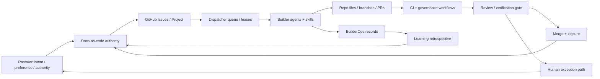
```mermaid
flowchart LR
  Rasmus["Rasmus: intent / preference / authority"] --> Docs["Docs-as-code authority"]
  Docs --> Issues["GitHub Issues / Project"]
  Issues --> Dispatcher["Dispatcher queue / leases"]
  Dispatcher --> Agents["Builder agents + skills"]
  Agents --> Repo["Repo files / branches / PRs"]
  Repo --> CI["CI + governance workflows"]
  CI --> Review["Review / verification gate"]
  Review --> Merge["Merge + closure"]
  Merge --> Docs
  Agents --> BuilderOps["BuilderOps records"]
  BuilderOps --> Learning["Learning retrospective"]
  Learning --> Docs
  Review --> Exception["Human exception path"]
  Exception --> Rasmus
```

### Docs-As-Code Feedback Loop

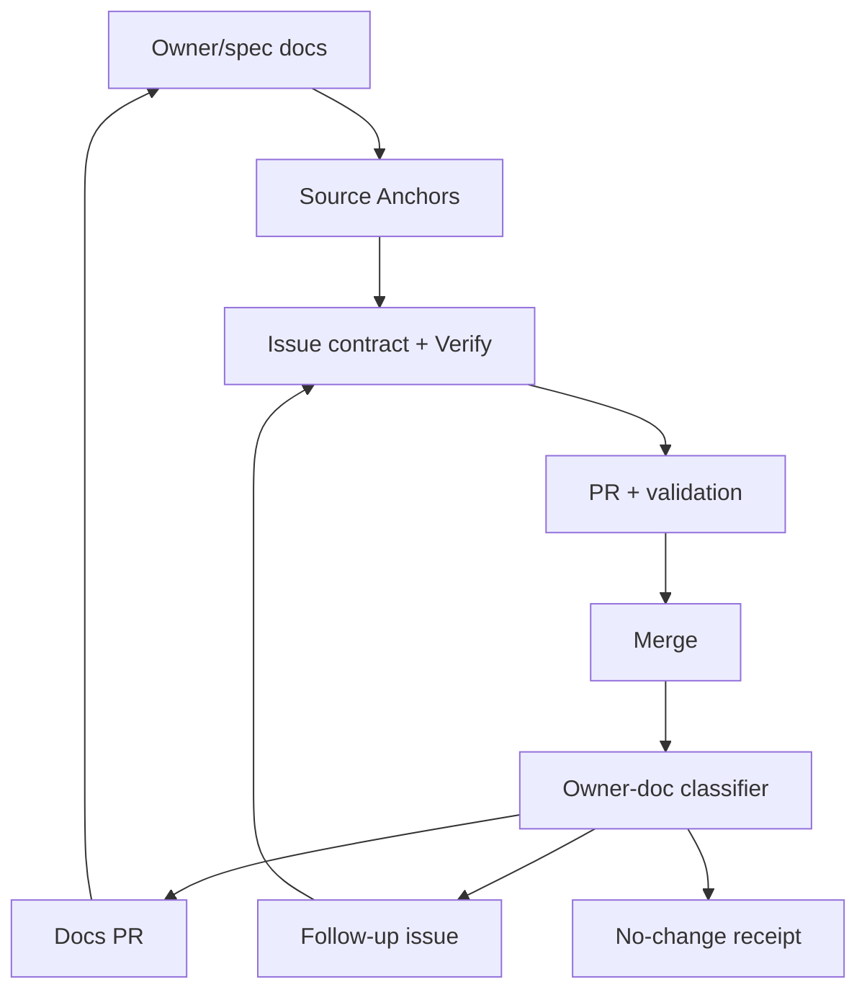
```mermaid
flowchart TD
  Docs["Owner/spec docs"] --> SourceAnchors["Source Anchors"]
  SourceAnchors --> Issue["Issue contract + Verify"]
  Issue --> PR["PR + validation"]
  PR --> Merge["Merge"]
  Merge --> OwnerDocCheck["Owner-doc classifier"]
  OwnerDocCheck --> DocsPR["Docs PR"]
  OwnerDocCheck --> Followup["Follow-up issue"]
  OwnerDocCheck --> Receipt["No-change receipt"]
  DocsPR --> Docs
  Followup --> Issue
```

### End-To-End Builder System Flowchart

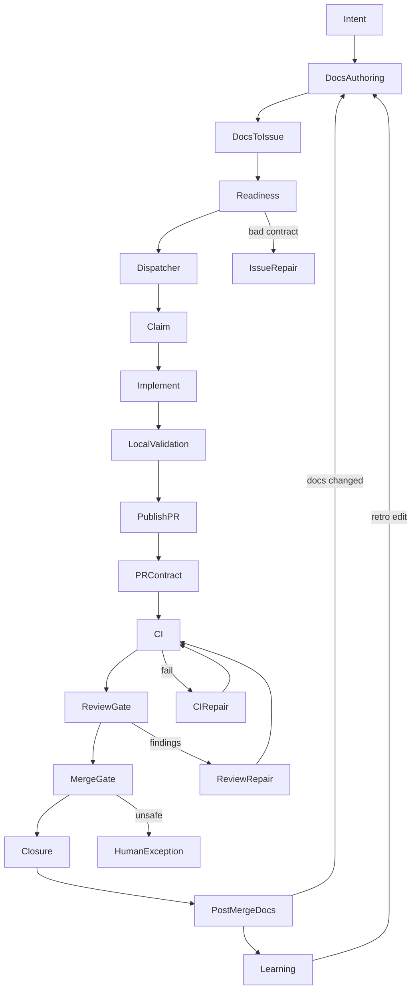
```mermaid
flowchart TD
  Intent --> DocsAuthoring --> DocsToIssue --> Readiness --> Dispatcher --> Claim --> Implement --> LocalValidation --> PublishPR --> PRContract --> CI --> ReviewGate --> MergeGate --> Closure --> PostMergeDocs --> Learning
  Readiness -->|bad contract| IssueRepair
  CI -->|fail| CIRepair --> CI
  ReviewGate -->|findings| ReviewRepair --> CI
  MergeGate -->|unsafe| HumanException
  PostMergeDocs -->|docs changed| DocsAuthoring
  Learning -->|retro edit| DocsAuthoring
```

### Dispatcher/Routing Flow

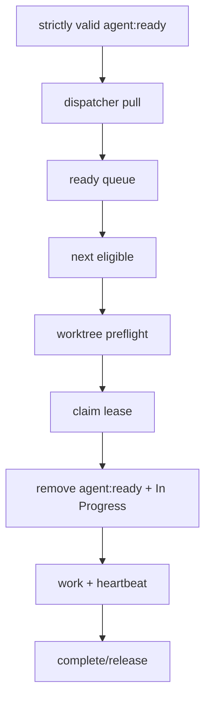
```mermaid
flowchart TD
  ReadyIssue["strictly valid agent:ready"] --> PullSync["dispatcher pull"]
  PullSync --> Queue["ready queue"]
  Queue --> Next["next eligible"]
  Next --> Preflight["worktree preflight"]
  Preflight --> Claim["claim lease"]
  Claim --> GithubClaim["remove agent:ready + In Progress"]
  GithubClaim --> Work["work + heartbeat"]
  Work --> Complete["complete/release"]
```

### Issue Lifecycle State Machine

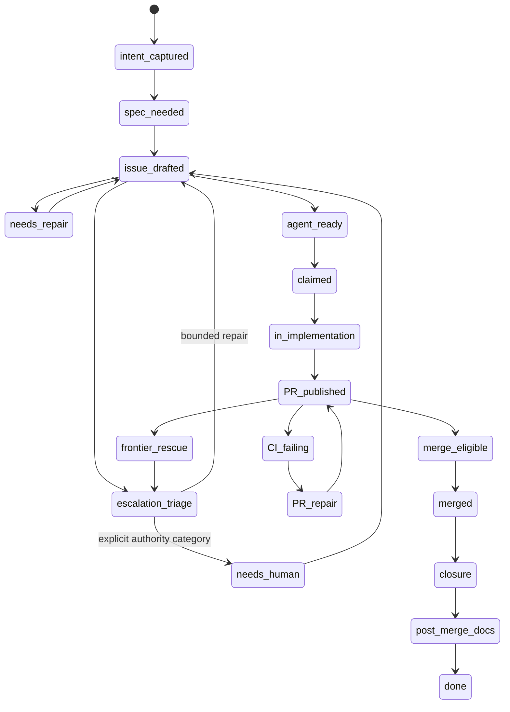
```mermaid
stateDiagram-v2
  [*] --> intent_captured
  intent_captured --> spec_needed
  spec_needed --> issue_drafted
  issue_drafted --> needs_repair
  needs_repair --> issue_drafted
  issue_drafted --> escalation_triage
  escalation_triage --> needs_human: explicit authority category
  escalation_triage --> issue_drafted: bounded repair
  needs_human --> issue_drafted
  issue_drafted --> agent_ready
  agent_ready --> claimed
  claimed --> in_implementation
  in_implementation --> PR_published
  PR_published --> CI_failing
  CI_failing --> PR_repair
  PR_repair --> PR_published
  PR_published --> frontier_rescue
  frontier_rescue --> escalation_triage
  PR_published --> merge_eligible
  merge_eligible --> merged
  merged --> closure
  closure --> post_merge_docs
  post_merge_docs --> done
```

### PR Lifecycle State Machine

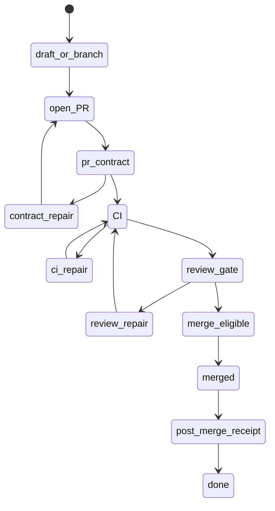
```mermaid
stateDiagram-v2
  [*] --> draft_or_branch
  draft_or_branch --> open_PR
  open_PR --> pr_contract
  pr_contract --> contract_repair
  contract_repair --> open_PR
  pr_contract --> CI
  CI --> ci_repair
  ci_repair --> CI
  CI --> review_gate
  review_gate --> review_repair
  review_repair --> CI
  review_gate --> merge_eligible
  merge_eligible --> merged
  merged --> post_merge_receipt
  post_merge_receipt --> done
```

### CI Repair Loop

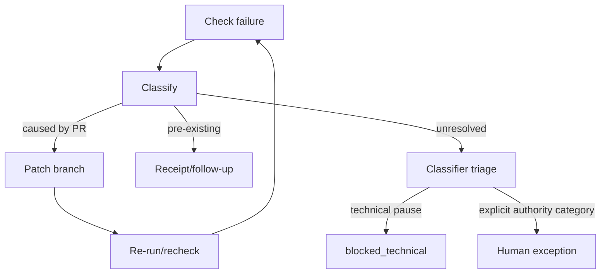
```mermaid
flowchart TD
  Check["Check failure"] --> Classify["Classify"]
  Classify -->|caused by PR| Patch["Patch branch"]
  Patch --> Recheck["Re-run/recheck"]
  Recheck --> Check
  Classify -->|pre-existing| Followup["Receipt/follow-up"]
  Classify -->|unresolved| Triage["Classifier triage"]
  Triage -->|technical pause| Block["blocked_technical"]
  Triage -->|explicit authority category| Human["Human exception"]
```

### Review/Repair Loop

```mermaid
flowchart TD
  Review["Review gate"] --> Blocking{"Blocking?"}
  Blocking -->|no| Pass["Pass"]
  Blocking -->|yes| Fix["Fix"]
  Fix --> Reverify["Re-review/reverify"]
  Reverify --> Review
  Blocking -->|repeated| Triage["Capability escalation + classifier triage"]
  Triage -->|safe bounded path| Fix
  Triage -->|technical pause| Block["blocked_technical"]
  Triage -->|explicit authority category| Exception["Human exception"]
```

### Post-Merge Docs/Spec Feedback Loop

```mermaid
flowchart TD
  Merge["Merged PR"] --> Diff["Read diff"]
  Diff --> Decision{"Owner doc impact?"}
  Decision -->|clear| DocsPR["Open docs PR"]
  Decision -->|judgment| Issue["Open follow-up issue"]
  Decision -->|none| Receipt["No-change receipt"]
  DocsPR --> Receipt
  Issue --> Receipt
```

### Human Exception Loop

```mermaid
flowchart TD
  Stop["Stop condition"] --> Triage["Escalation classifier"]
  Triage -->|technical route| Recover["auto-repair / auto-backoff / blocked_technical"]
  Triage -->|explicit authority category| Packet["Human Exception packet"]
  Packet --> Label["agent:needs-human"]
  Label --> Decision["Rasmus decision"]
  Decision -->|authorize| Resume["Resume autonomous flow"]
  Decision -->|reject| Close["Close/block/discard"]
```

## 17. Recommended Implementation Sequence

| PR | Goal | Mode | Why now | Rollback | Human exception risk |
| --- | --- | --- | --- | --- | --- |
| 1 | Land this process map | docs-only | Required before automating dispatch/routing | Revert doc PR | low |
| 2 | Add deterministic readiness/`Verify:` checker that reports only | observe-only | No dispatcher automation before readiness is deterministic | Remove workflow/script | low |
| 3 | CI failure context artifact builder on `workflow_run` — delivered by PR #3222 | artifact-only | Context is now available before any future CI self-heal | Disable workflow | low |
| 4 | Add evidence pack builder for PRs | artifact-only | Closure needs one auditable packet | Disable workflow | low |
| 4a | Emit a current-head, idempotent verification request after successful `CI Smoke` — delivered by #3602 | artifact-only | Makes the verification handoff observable without granting GitHub Actions agent or closure authority | Disable workflow | low |
| 5 | Protect `main` with documented required checks | manual exception gate | No autonomous merge before branch protection | Remove rule | medium, platform authority |
| 6 | Add post-merge docs classifier artifact | artifact-only | Watchdog currently nudges but does not classify | Disable workflow | low |
| 7 | Add local Claude/Codex session hooks for repo root, branch, and dangerous command blocking | hybrid: script + agent | Reduces local safety failures and token reloads | Remove hook config | medium, false positives |
| 8 | Add comment-only CI repair agent using failure context | comment-only | Suggest fixes without patch authority | Disable Action/comment command | medium |
| 9 | Add patch-branch CI repair for low-risk deterministic failures | patch-branch | Only after context and guardrails exist | Disable patch mode | high |
| 10 | Add autonomous closure for docs-only/governance Tier 1 with protected branch and evidence pack | autonomous-closure | Only after branch protection, evidence, and review gates are enforceable | Disable closure workflow | high |

Rules applied:

- Process map first.
- No autonomous merge before branch protection.
- No CI self-heal before CI failure context collector.
- No routine human review gate.
- No broad skill rewrite.
- No full SkillOpt system yet.
- Docs-as-code/spec structure remains primary authority.
- Dispatcher/routing is documented before automating dispatch.
- Rasmus is exception authority, not routine reviewer/dispatcher/triager/closer.
