State: Builder System normative process architecture with verified current-to-target coverage.
Doc role: Development governance / process architecture and system-of-systems map
Authority: Owns the single L0 Builder System root, the separate value-stream and cross-cutting governance process hierarchies, L3-to-L2 instruction mapping, and information/evidence/representation architecture. Existing skills, scripts, templates, owner docs, and live systems remain the executable authorities named by this architecture. Target process descriptions do not claim shipped automation or runtime behavior.
Owner: Builder System governance
Temporal class: operational
Review cadence: event-driven
Source of truth: observed repo files and read-only GitHub command output cited inline
Last reviewed: 2026-08-11

# Builder System Process Map

## Normative Process Architecture

This section is the primary written process. The implementation inventory, state machines, and
diagrams later in this document provide evidence and detail; they do not replace this hierarchy.
Where a current executable workflow is named, its owning skill, owner document, script, GitHub
object, or live system remains authoritative for execution. Where this section says **target**, it
defines intended process shape only.

Normative terms use their usual meanings: **must** is required for process conformance, **should** is
the normal path with proportionate exceptions, and **may** is optional. Status terms mean:

- **current**: verified in an owner document, skill, script, template, or live authority;
- **partial**: current mechanisms cover part of the process but not the whole interface;
- **target**: intended architecture that is not yet fully implemented;
- **advisory**: research or audit input that has not crossed into normative authority.

### Scope and boundary

The Builder System is the continuous-development enabling system around Yggdrasil's
Product/Runtime System. It turns intent and operational evidence into governed, accepted changes.
It may be reused as a portable pattern, but this repository's owner docs and contracts govern this
instance. It is not a competing product runtime, Product SBS subsystem, knowledge authority,
backlog alternative, or lifecycle authority.

The Builder System begins when owner intent, a verified need, or an operational signal is taken up
for shaping. It ends only provisionally: an accepted change enters operation, and operational
evidence returns to planning or process governance. Product operation remains Product/Runtime
authority. The Builder System observes it and may propose or deliver changes through the normal
repo path; it cannot silently convert observations, BuilderOps records, chat, or projections into
Product truth.

### L0 root — Governed Builder System Delivery & Operations System

L0 contains exactly one root: the **Governed Builder System Delivery & Operations System**. Its
purpose is to turn owner intent and operational evidence into accepted, operated, and continuously
improved software-product outcomes while preserving Product/Runtime authority, bounded change,
verifiable completion, safe recovery, and durable learning.

Three non-competing views describe this one root:

1. the **primary value-stream process hierarchy** — how value and corrective action flow;
2. the **cross-cutting governance process hierarchy** — how intent, contracts, risk, evidence, and
   process authority constrain and improve the value stream; and
3. the **information, evidence, and representation architecture** — which artifacts are systems of
   record, control-plane state, proof, or rebuildable views.

These views answer different questions and must not be flattened into one sequence.

Hierarchy consistency rule:

- every non-root process belongs to exactly one parent in its own process hierarchy;
- a cross-cutting governance process may attach to many value-stream processes, but it is not
  duplicated as a value-stream stage;
- information, evidence, and representation classes are architecture, not process stages;
- an L3 work instruction is bound to one named L2 subprocess as its primary parent and cannot be a
  sibling of an L1 or L2 process; references from other subprocesses are reuse, not duplicate
  parentage.

### Target operating model — a governed agentic dark factory

**Target-state vision — not current delivered reality.** The intended operating model is a fully
agentic **dark factory for governed software-product delivery**: once intent, policy, scope, and
authority are sufficiently explicit, agents can carry routine, bounded, reversible work through
shaping, contract formation, execution, verification, integration, release handling, observation,
and improvement without routine human attendance or babysitting.

"Dark factory" describes an unattended normal flow, not an opaque one. The target must remain
evidence-lit, inspectable, interruptible, and accountable. Every effect still binds to its owning
source, exact change, policy, evidence gate, receipt, and recovery path. Fully agentic operation
does not mean unlimited agent discretion, the removal of governance, or the transfer of authority
to a dashboard, projection, model session, or orchestration layer.

The maturity transition is explicit:

| Maturity posture | Human involvement | Agent authority and controls |
| --- | --- | --- |
| **Current** | Human escalation occurs relatively often across shaping, ambiguous routing, operational recovery, release decisions, and incomplete automation. Several strong delivery workflows can run autonomously, but the whole lifecycle is not unattended. | Authority is fragmented across current skills, scripts, docs, GitHub, CI, runbooks, and operator steps; early shaping and post-release feedback remain partial. |
| **Transition** | Repeated routine questions are removed from the human path only after their decision boundaries are made explicit. Humans remain available for true exceptions and may inspect, interrupt, or narrow delegated authority. | Encode repeatable decisions as owner-approved policies, bounded Issue contracts, permission scopes, deterministic preflights, exact-head evidence gates, retry/repair budgets, safe defaults, rollback paths, and durable receipts. Expand autonomy in staged, reversible increments with observed evidence before broader mutation rights. |
| **Target** | Human escalation is the exception rather than the normal path. Humans retain strategic and legal/ethical ownership plus decisions that are genuinely irreversible, external-facing, authority-ambiguous, or protected by an explicit operator contract. | Agents operate the routine value stream end to end within explicit policy and bounded authority, fail closed outside it, recover or replan autonomously when safe, and return only real authority decisions with concise evidence and consequences. |

The transition must not hide current limitations by relabeling them as autonomy. A workflow is not
target-dark-factory capable until its normal decisions, allowed mutations, evidence freshness,
failure handling, and stop conditions are explicit enough to run without inventing authority.
Conversely, frequent human escalation in current practice is a maturity signal: repeated reversible
decisions should be converted into policy, evidence gates, or narrower delegated authority rather
than preserved as permanent approval steps.

Target autonomy is constrained by these guardrails:

1. Agents may exercise only explicitly delegated, bounded, and auditable authority; they may not
   infer broader permission from task urgency, technical capability, or a projection.
2. Required CI, verification, review, release, safety, privacy, migration, and environment gates
   remain non-waivable. Human approval cannot fabricate a passing gate.
3. Routine/reversible decisions should become policy-driven and evidence-gated; irreversible,
   external-facing, strategic, or genuinely authority-ambiguous decisions stay human-owned.
4. Mutations must preserve limited blast radius, isolation, idempotency or reconciliation where
   applicable, a safe stop, and a tested or explicit recovery/rollback path.
5. Evidence must identify the authoritative source, exact revision or effect, freshness, outcome,
   and unknowns. Missing evidence fails closed rather than becoming optimistic completion.
6. devUI, CKM, Signboard, BuilderOps Cockpit, Delivery Graph, Project views, and other projections
   may orient, explain, or prepare proposals; they never acquire lifecycle or mutation authority.
7. Human re-entry must remain possible at named control points without requiring the human to
   reconstruct hidden agent state or supervise every routine step.

This vision does not assert that every current workflow is unattended. The current-to-target table
below and the executable L3 owners determine what can run autonomously now; the dark-factory model
governs the direction of maturity, not the truth of present deployment.

#### Per-workflow autonomy qualification and demotion

Autonomy is qualified per named L2 subprocess or bounded workflow; it is never inferred from the
dark-factory vision or summarized by one universal composite score. Before a workflow is promoted
to a more autonomous mode, its accountable assessor must record falsifiable evidence for all of:

| Gate | Required evidence |
| --- | --- |
| Representative unattended traces | Multiple named traces covering normal work and the important risk/exception classes, each bound to exact inputs, effects, and outcomes |
| Contract and evidence sufficiency | Explicit entry/exit criteria, permissions, source authorities, freshness rules, and proof that completion cannot be fabricated by a missing or stale source |
| Stop and recovery proof | Demonstrated fail-closed stop, bounded retry/backoff, interruption reconstruction, rollback/reconciliation, and safe human re-entry |
| Exception ceiling | A workflow-specific maximum acceptable rate or class of unplanned human intervention, defined as a falsifiable threshold rather than a portfolio-wide score |
| Accountable assessment | Named process owner/assessor, assessment date, evidence refs, authorized autonomy mode, and residual risks |
| Regression and demotion triggers | Named events that automatically pause or reduce autonomy: authority drift, stale evidence, security/control failure, repeated defect/incident class, exception-ceiling breach, rollback failure, or inability to reconstruct state |

Promotion evidence must be current enough for the risk of the workflow. Demotion is a safety action,
not failure of the target vision; the workflow returns to observe-only, bounded-agent, or
human-operated mode until the failed gate is proved again.

### View 1 — primary value-stream process hierarchy

The primary value stream has four L1 macro-processes. They are iterative and may exchange feedback;
they are not mandatory stage gates. Each L2 subprocess has exactly one L1 parent.

| L1 ID and macro-process | Distinct outcome | Current coverage |
| --- | --- | --- |
| **V1 Shape & Decide** | A framed capability, verified need, or bounded operational concern with explicit assumptions, evidence, authority, and disposition. | **partial** — several governed routes exist, but no single proportional shaping interface covers all of them. |
| **V2 Define & Make Ready** | Accepted governing docs/specs and one canonical bounded GitHub Issue contract that is ready, blocked, deferred, or needs a real owner decision. | **current/partial** — docs/spec and Issue-contract mechanisms are strong; early decomposition and operational intake are uneven. |
| **V3 Deliver & Release** | An exact change that is implemented, integrated, verified, merged, closed truthfully, and released/deployed through the applicable current channel contract. | **current/strong through merge; partial for release** — Issue-to-merge is mature; the gated `stable` promotion model remains target/deferred under ADR-0040. |
| **V4 Operate & Improve** | A healthy operated product plus incidents, defects, improvements, and learning routed to owned corrective action or explicit terminal disposition. | **partial** — operations and individual feedback routes exist; the composed operation-to-corrective-action loop remains less formalized. |

#### V1 Shape & Decide — L2 children

| L2 ID | Child subprocess | Required output and boundary |
| --- | --- | --- |
| **V1.1 Frame intent, need, and capability** | Identify actor, need/outcome, constraints, assumptions, Product/Builder/boundary classification, and discovery depth. | A framed question or capability; no implementation authority is implied. |
| **V1.2 Research domain, architecture, and options** | Gather source-grounded evidence, diverge across credible alternatives, reconcile contradictions, and identify unknowns. | Advisory findings with provenance; research remains subordinate to owner docs. |
| **V1.3 Challenge the solution form and proportionality** | Before choosing agentic delivery, test the least costly adequate form: no change, policy or owner-doc repair, deterministic check/automation, manual one-off, bounded agent task, or capability/feature. | A reasoned solution-form choice that avoids using an agentic implementation slice when a smaller governed response satisfies the outcome. |
| **V1.4 Decide disposition and authority crossing** | Select continue, test, defer, reject, or Human Exception; promote accepted supporting material through `PromotionIntent` when authority classes change. | An explicit disposition and authorized destination, not an executable Issue by assertion. |

#### V2 Define & Make Ready — L2 children

| L2 ID | Child subprocess | Required output and boundary |
| --- | --- | --- |
| **V2.1 Author governing decisions, docs, and specifications** | Locate the owner, classify current/target/proposal status, author the smallest coherent authority surface, and preserve supersession/consequences. | Accepted owner doc, ADR, contract, or specification through normal PR authority. |
| **V2.2 Decompose capability and validation outcome** | Decide whether work is one bounded slice or a parent validation hub with dependency-ordered children; keep feature validation distinct from slice verification. | Bounded task/spec structure with source anchors and a validation path. |
| **V2.3 Triage operational defect or improvement evidence** | Reproduce/classify observations, distinguish incident recovery from corrective action, deduplicate known work, and route defects, improvements, or structural patterns proportionately. | Verified bounded defect/improvement input, broader research/learning route, or explicit non-actionable disposition. |
| **V2.4 Form the canonical bounded Issue contract** | Converge the docs/capability inflow from V2.1/V2.2 and the bug/improvement inflow from V2.3 on the same Issue shape. | One GitHub Issue with stable source anchors, SBS impact, acceptance criteria, `Verify:` targets, and truthful agent state. |
| **V2.5 Validate readiness and expose eligible work** | Reconcile duplicates/live delivery, validate contract and anchors, classify ready/blocked/needs-human, and expose eligible work to the queue. | Strictly valid `agent:ready` or a truthful non-active state; Project and other projections do not gate readiness. |

##### V2.4 convergence detail — the two canonical Issue inflows

All implementation-bound work converges on the canonical bounded GitHub Issue contract. The two
main inflows differ before that boundary and are identical after it.

```text
capability / docs inflow
  V1 shaping/research/disposition -> accepted owner doc/ADR/spec in V2.1
  -> capability decomposition in V2.2
  -> V2.4 bounded Issue

operation / improvement inflow
  V4 observation/response/analysis -> verified input in V2.3
  -> V2.4 bounded Issue when implementation-ready

V2.4 bounded Issue
  -> V2.5 readiness -> V3 claim/execution/proof/merge/closure
```

Shortcuts are proportionate, not authority bypasses:

- A small reversible change with a clear current owner contract may go directly from V1 framing to
  V2.4 and the light delivery path.
- An incident may prioritize V4.2 stabilization and rollback before full analysis; follow-up
  evidence still routes through V2.3/V2.4.
- A confirmed P0/P1 or implementation-bound bug uses a normal bounded bug Issue. A confirmed P2
  review defect may use the governed Known Defects registry until its promotion trigger fires.
- A vague aspiration, unverified symptom, chat note, dashboard gap, or projection anomaly is not an
  executable Issue until the relevant workflow makes it bounded and verifiable.

#### V3 Deliver & Release — L2 children

| L2 ID | Child subprocess | Required output and boundary |
| --- | --- | --- |
| **V3.1 Claim and execute the bounded change** | Acquire the one active claim, register isolated worktree identity, load bounded context, implement within scope, and maintain lease/receipts. | Local change and focused validation evidence bound to the Issue and worktree. |
| **V3.2 Reconstruct, resume, and revalidate interrupted work** | On interruption, read resumable orchestration state first, then reconstruct Issue/claim/worktree/branch/HEAD/PR/evidence state; revalidate stale anchors and leases; resume only unchanged authority or perform governed stale-lease takeover/release. | A refreshed, generation-safe execution context or a truthful technical/authority block; chat continuity never authorizes resume. |
| **V3.3 Publish and integrate the proposed change** | Apply branch-truth and publication gates, open/update the PR, run CI, and repair contract, drift, or integration failures while respecting shared-resource and review/CI backpressure. | Current-head PR that is ready for the applicable verification path or truthfully blocked. |
| **V3.4 Verify, accept, merge, and close** | Resolve delivery tier, prove exact-head ACs/checks, run full-path independent review when required, perform the current governed explicit merge/readback, close Issue/claim, and classify owner-doc impact. | Accepted merge and closure evidence; technical verification remains distinct from owner/product validation. Disabled GitHub auto-merge is not the merge mechanism. |
| **V3.5 Release, deploy, verify, or roll back** | Resolve the current channel model, authorize the candidate, prepare risk/migration/config delta, obtain only required operator authority, deploy the authorized SHA, prove live identity/health, run feature/owner acceptance when required, and accept or roll back with rollback verification. | Live-channel receipt or safe rollback/block; current `main`-tracking production and target gated-`stable` promotion remain distinct. |

#### V4 Operate & Improve — L2 children

| L2 ID | Child subprocess | Required output and boundary |
| --- | --- | --- |
| **V4.1 Operate and observe the Product/Runtime System** | Run the product under Product/Runtime authority and observe health, reliability, operator/user outcomes, freshness, and unknown states. | Current operational evidence; the Builder System does not become runtime authority. |
| **V4.2 Respond, stabilize, and recover** | Classify the event, limit harm, use runbooks, rollback/restore when authorized, and preserve incident evidence. | Restored or safely degraded service plus an incident/recovery record; stabilization alone does not close the underlying defect. |
| **V4.3 Analyze defects, improvements, and recurring patterns** | Confirm reproduction and impact, separate one bounded defect from a structural pattern, and identify corrective or learning destinations. | Input to V2.3/V2.4, V1 research, or cross-cutting process governance; speculation remains non-authoritative. |
| **V4.4 Close corrective action and value-stream learning** | Track the operational signal to a delivered correction, owner-doc/plan update, accepted risk, or explicit discard/supersession and feed outcome evidence back to shaping. | Closed product/value-stream loop; Builder-process learning crosses to G6 rather than becoming a duplicate value-stream stage. |

Small reversible work may take proportionate shortcuts between children, and evidence may send work
backward to an affected parent. The required Issue, CI, review, release, safety, and authority gates
still apply.

**Derived posture note — current governed delivery and release.**

Mutable posture was refreshed on 2026-08-11 before this claim was written:

- Live GitHub repository readback reports `allow_auto_merge=false`. Current autonomous delivery,
  where permitted, therefore uses the governed explicit merge path in `verification-and-closure`;
  it is not GitHub auto-merge.
- Live `main` protection readback requires `Unit tests (not pg)`, with strict status-check mode off
  and no required pull-request review object. Applicable contract, CI, and full-path review gates
  that are not platform-required remain workflow-enforced and non-waivable.
- `docs/RELEASE_CHANNELS/README.md :: Promotion model` remains the release authority: production's
  interim promotion ref is `main`. The remote `stable` ref still exists, but the protected
  test-receipt-to-`stable` promotion workflow is deferred target hardening and must not be described
  as the current production path.

These facts are mutable. Re-read GitHub settings, current release-channel owner docs, exact refs,
and the target host before a merge, release, or current-state report; this dated posture is not an
execution receipt.

**Derived navigation note — end-to-end operational continuity.**

This navigation sequence composes V3 and V4 without creating another process hierarchy:

```text
verified merge candidate
  -> authorized candidate under the current channel model
  -> deploy exact authorized SHA/image
  -> prove live identity, environment binding, health, and smoke
  -> run required feature/owner acceptance
  -> accept, or roll back and verify the rollback
  -> operate and observe
  -> respond/recover when needed
  -> route verified incident/defect/improvement evidence through V2.3 and V2.4
  -> close corrective action and feed outcome evidence to V1/V2 or G6
```

Merge is not deployment, deployment health is not feature/owner acceptance, incident stabilization
is not corrective-action closure, and rollback is not complete until the restored state is verified.

### View 2 — cross-cutting governance process hierarchy

Governance has its own root, **G0 Govern the Builder System**, subordinate to the L0 system. Its L1
processes attach where relevant across V1-V4; none is a serial value-stream stage.

| Governance L1 | L2 child subprocesses | Cross-cutting attachment |
| --- | --- | --- |
| **G1 Govern intent and portfolio** | **G1.1** maintain owner intent/constraints; **G1.2** prioritize or defer capabilities; **G1.3** preserve dispositions and supersession | Primarily V1 and V2, with operational evidence from V4 |
| **G2 Govern architecture and contracts** | **G2.1** assign system/interface ownership; **G2.2** maintain ADRs/contracts/SBS registers; **G2.3** define and evolve invariants/fitness rules | All value-stream nodes that read or change architecture or contracts |
| **G3 Govern change, flow, and release** | **G3.1** classify risk/proportional path; **G3.2** control claims, isolation, publication, and explicit merge; **G3.3** control WIP, dependencies, shared resources, review/CI backpressure, and preservation of independent ready work; **G3.4** control channel promotion, migration, rollback, and external effects | V2 readiness and all of V3 |
| **G4 Govern agent/tool security, operational risk, incidents, and exceptions** | **G4.1** admit principals/tools through the security contract; **G4.2** define safety/stop/recovery/revocation posture; **G4.3** classify technical block versus canonical Human Exception; **G4.4** retain protected operator decisions | Every agent/tool execution boundary, V3 release, and V4 operation/response; exception attachments may occur anywhere |
| **G5 Govern evidence and audit** | **G5.1** define proof/freshness requirements; **G5.2** preserve exact identity/provenance/receipts; **G5.3** reconcile live truth and stale projections | Every value-stream handoff |
| **G6 Govern process and learning** | **G6.1** capture Builder-process divergence; **G6.2** run retrospective/reevaluation; **G6.3** route each signal to governance edit, Issue, debt/fitness, promotion, or discard | Receives signals from V1-V4 and changes their governing L3 artifacts through normal authority |

Governance intensity follows risk and reversibility. It must not add a decorative human approval to
every value-stream node. Technical difficulty, a failed check, retry exhaustion, or a safe
fail-closed pause is not by itself a human decision.

#### G3 flow-control contract

Issue-set execution must apply the existing coordination controls proportionately rather than
maximizing concurrent starts. The coordinator or owning workflow must:

- limit WIP to work with real independent capacity and isolated worktrees;
- preserve dependency order and serialize conflict-, integration-, migration-, merge-, and
  shared-resource-critical phases;
- treat host-global validation leases, CI runners, GitHub API budget, review capacity, and merge
  capacity as shared constraints;
- stop adding work when review, CI, recovery, or integration queues are the bottleneck;
- keep independent, strictly ready work available when one lane blocks, rather than imposing a
  global singleton; and
- preserve exact claims, leases, receipts, and typed conflict evidence so backpressure does not
  create duplicate work or false closure.

`deliver-issue-set`, dispatcher/worktree contracts, and `AGENTS.md :: Parallel-agent execution`
remain the L3 owners of the current controls.

#### G4 agent/tool security admission contract

Every agent, model, script, automation, connector, or external tool that can read protected context
or cause an effect must have an admission record or governing contract appropriate to its security
level before use. The contract must identify:

| Field | Required statement |
| --- | --- |
| Principal and purpose | Named human, service, agent/session, workflow, or tool identity and the bounded outcome it may pursue |
| Permissions and effect scope | Allowed reads, writes, commands, repositories, APIs, environments, and explicitly forbidden effects |
| Credential scope | Credential owner, least-privilege scope, storage/forwarding rule, expiry/rotation, and whether delegation is permitted |
| Filesystem and network containment | Allowed roots, hosts, protocols, sandboxes/worktrees, and cross-host or external-service boundaries |
| Egress, secrets, and sensitive data | What may leave the boundary, redaction requirements, secret-handling rule, and prohibited destinations |
| Input/output trust and provenance | Trusted sources, untrusted-input treatment, output status, citation/receipt requirements, and injection/content risks |
| Budgets and timeouts | Model/tool/API/CI/runtime budgets, retry limits, timeouts, and stop-loss behavior |
| Receipt and exact identity | Principal, invocation/run id, policy/version, inputs or hashes, effects, result, time, and target authority |
| Rollback and revocation | How effects are reversed or reconciled, credentials/leases revoked, sessions stopped, and residual effects reported |
| Required security level | The proportional assurance level and the owner contract, test, review, or operator gate that establishes it |

**Current:** authority mostly relies on OS account boundaries, tool permissions, worktrees,
repository policy, scoped credentials, workflow permissions, and explicit operator delegation.
These are real controls but do not constitute uniform containment or repository-wide RBAC.
**Target:** admission is consistently least-privilege, policy-evaluated, contained, revocable, and
receipt-backed, with stronger sandbox/RBAC and egress controls where the risk justifies them. The
target is not claimed as shipped.

### Exception and human-decision model

The default response to a deviation is autonomous classification, repair, backoff, replan, or a
technical block. `docs/development/AUTONOMOUS_REVIEW_REPAIR_GATE_CONTRACTS.md :: Escalation
Classifier` owns the canonical routing decision; this summary must never narrow it. A Human
Exception is appropriate when the classifier establishes a real owner/operator authority category,
including:

1. irreversible action, accepted irreversible consequence, or external-facing commitment/effect;
2. strategic product, portfolio, legal, ethical, or cost/risk trade-off reserved to the owner;
3. genuinely conflicting, absent, or contradictory authority that owner docs and existing contracts
   cannot resolve;
4. security, privacy, secret/credential, protected-state, production/release, migration, or
   environment decisions whose governing contract requires human/operator authority;
5. any proposed guardrail bypass, policy exception, expanded permission, or acceptance of residual
   risk that an agent is not authorized to take; or
6. an explicit protected operator gate named by the governing workflow.

The exception packet must name the decision, authoritative evidence, options, consequences,
recommendation, and safe default if no decision is made. The decision returns work to the relevant
L2 subprocess; it does not waive CI, review, verification, release, or safety gates. If none of the
canonical authority conditions applies, use `agent:blocked` or the workflow's technical recovery
state rather than `agent:needs-human`.

### View 3 — information, evidence, and representation architecture

This view classifies artifacts and state; it is not a fourth process hierarchy. These surfaces must
remain separate even when a UI joins them.

| Surface/artifact | Class and authority | Write responsibility | Evidence/freshness expectation | Projection? |
| --- | --- | --- | --- | --- |
| Product owner docs, contracts, ADRs, and accepted specs | System of record for current Product truth, durable decisions, and intended contracts according to DOCS_INDEX role | Normal repo PR owned by the relevant Product/architecture authority | Commit/PR provenance; present-tense claims reconciled after delivery | No |
| Builder governance docs and repo-local skills | System of record for Builder System policy and executable work instructions within their declared scope | Docs/governance PR; matching owner and skill route | Commit/PR provenance; reviewed against current executable mechanisms | No |
| GitHub Issue | Canonical executable task contract and Issue lifecycle truth | Intake/maintenance/delivery workflow with claimant and closure receipts | Live body, labels, state, source anchors, and `Verify:` targets; reread before mutation | No |
| Git branch, commit, and PR | Canonical proposed change identity, review conversation, and integration state | Owning delivery agent/workflow in its isolated worktree | Exact branch/head/base, diff, review threads, and merge readback | No |
| CI checks, tests, review findings, and verification receipts | Evidence authority for the exact revision and named contract; not intent authority | CI, test runner, reviewer, and verification workflow | Exact SHA, run identity, outcome, and recency sufficient for the gate | No |
| Release plan/receipt and live target channel | Authority for authorized deployment attempt and observed operational state; channel owner docs define the model | Release/promotion workflow and required operator | Candidate/deployed SHA, environment binding, timestamp, health/smoke, rollback outcome; live host wins on current state | No |
| BuilderOps Vault record mutation | System of record for builder-operational objects such as LearningSignal, PromotionIntent, worklog, freshness, roadmap execution, and BuilderOps receipts; not Product or GitHub lifecycle truth | Designated BuilderOps writer/workflow may create or transition only the admitted BuilderOps record | Source refs, disposition/receipt lineage, writer identity, storage availability, and explicit unknown states | No, but limited to BuilderOps authority |
| Promotion from BuilderOps to GitHub, repo, or Product authority | Separate authority crossing; a BuilderOps record may propose and preserve provenance but cannot execute the destination mutation | Destination-owning workflow: Issue intake for GitHub task contract, PR for repo docs/code/contracts, or Product-governed writer for Product/runtime truth | PromotionIntent/source refs plus destination-specific authorization, exact mutation receipt, and live destination readback | No; the destination system becomes authoritative only through its own write path |
| Dispatcher queue, claim, lease, and heartbeat | Coordination/control plane for volatile work allocation; cannot redefine the Issue contract or delivery result | Dispatcher and canonical claim/release workflow | Current lease generation, owner, expiry/heartbeat, Issue identity; reconcile with live GitHub | No; coordination state |
| Skills, scripts, templates, and automations | L3 control mechanisms that execute or enforce parts of the process within explicit permissions | Repo PR for definitions; named workflow for execution | Version/commit plus execution output or receipt; fail closed when a required gate is unavailable | No; control mechanisms, not a global authority |
| GitHub Project, Signboard, devUI, CKM, BuilderOps Cockpit, Delivery Graph, and generated BuilderOps views | Read-only or rebuildable representation joining source-owned facts for orientation, gap detection, and action routing | Source-specific projector/composer only; commands route to the owning authenticated workflow | Source IDs, coverage, watermark/as-of time, freshness, missing/unknown states, deterministic rebuild where promised | **Yes** |
| Chat, model/provider session, screen, or design prototype | Conversation/provenance/supporting evidence only | Its originating tool or person | Link or artifact when useful; never sufficient for lifecycle or current-state claims | Yes/supporting artifact |

A representation may show a proposed action, but authorization and mutation occur only through the
owning source workflow. devUI and Delivery Graph therefore never become Issue, claim, merge,
release, runtime, or acceptance authority.

### Derived swimlane navigation view

This swimlane is derived from V1-V4, G1-G6, and the information architecture. It is navigation
only: placement in a lane grants no authority, and the written hierarchy and owning source
contracts win on conflict.

| Value-stream location | Agent / automation lane | Human owner / operator lane | Authoritative system / gate lane | Autonomy status |
| --- | --- | --- | --- | --- |
| V1 Shape & Decide | Gather evidence, frame options, challenge solution form, and prepare dispositions within bounded context | Supply strategic intent and decide only real product/portfolio, external, irreversible, or authority-conflict questions | Owner docs, ADR/decision authority, source evidence, and `PromotionIntent` when authority classes change | **Current:** human clarification is frequent. **Target:** routine shaping/disposition is agentic under explicit policy and evidence. |
| V2 Define & Make Ready | Author proposed docs/specs, decompose, deduplicate, draft canonical Issue, and validate readiness | Resolve genuinely missing intent/authority; accept owner decisions through the normal repo path | DOCS_INDEX/owner docs, docs PR, GitHub Issue, Issue contract, source anchors, readiness validator | **Current:** mixed agent/human. **Target:** routine bounded readiness is unattended; real owner decisions remain human. |
| V3.1-V3.4 Deliver | Claim, isolate, execute, reconstruct/resume, publish, repair, verify, and perform governed explicit merge/closure when authorized | Intervene only for canonical Human Exceptions or protected decisions; no routine merge babysitting in target | Dispatcher lease, worktree/branch/commit, GitHub Issue/PR, exact-head CI/review, merge and closure readback | **Current:** strong agentic segments with recurring escalation. **Target:** routine reversible delivery is unattended and evidence-gated. |
| V3.5 Release | Prepare authorized candidate, deploy through current channel contract, verify identity/health/acceptance, and run authorized rollback/reverification | Acknowledge protected prod/release/migration/external effects exactly where the owner contract requires | Release-channel owner docs, candidate SHA/image, target host/runtime identity, health/smoke, acceptance, promotion/rollback receipt | **Current:** production tracks `main`; operator involvement remains material. **Target:** gated automation expands, but protected authority remains human. |
| V4.1-V4.3 Operate & Respond | Observe, classify, stabilize, recover within delegated authority, preserve evidence, and prepare defect/improvement intake | Own protected production, safety, privacy, and external decisions; validate outcomes where required | Product/runtime owner docs, live host/runtime state, health/observability, incident and recovery evidence | **Current:** frequent operator participation. **Target:** routine response/recovery is agentic only after workflow-specific maturity proof. |
| V4.4 and G6 Improve | Route product corrections to V2 and Builder-process learning to G6; verify terminal dispositions | Decide strategic changes or authority crossings, not routine record processing | BuilderOps record authority first; later GitHub/repo/Product mutation only through the separate destination authority | **Current:** routes exist but use is uneven. **Target:** continuous closed-loop improvement with explicit cross-authority receipts. |

External-facing, irreversible, security/privacy/protected-state, guardrail-bypass, contradictory-
authority, and explicitly operator-gated decisions remain in the human lane in both current and
target postures. Their presence does not turn every nearby routine decision into a human gate.

### L3 — executable work instructions mapped to L2 parents

L3 contains individual skills, runbooks, scripts, state machines, templates, receipts, and
automation contracts. It contains no peer process categories. In this map, every representative L3
instruction names exactly one primary L2 parent; another subprocess may reference or invoke it
without duplicating its parentage.

| Primary L2 parent | Representative L3 work instruction(s) | Type and current/target boundary |
| --- | --- | --- |
| V1.1 | Owner-doc intake surfaces; process-card template in this doc | Template/owner-doc instruction; shaping interface is partial |
| V1.2 | `architecture-research`; `start-model-inquiry`; `yggdrasil-design-handoff` | Skills; advisory evidence until disposition/promotion |
| V1.3 | `AGENTS.md :: Proportional delivery`; `docs/development/GOVERNANCE_PROPORTIONALITY.md` | Policy/work instruction for choosing no change, deterministic, manual, bounded-agent, or capability form |
| V1.4 | `owner-decision-brief`; BuilderOps `PromotionIntent` contract and receipt | Skill/record contract; neither creates destination authority by itself |
| V2.1 | `docs-governance`; `docs-authoring`; DOCS_INDEX routing; ADR/spec templates | Skills/templates; repo authority arrives through PR |
| V2.2 | `feature-breakdown`; parent feature and child task templates | Skill/templates; parent remains validation hub, not direct pickup |
| V2.3 | `bug-to-issue`; `docs/OPERATIONS.md :: Incident handling`; relevant incident runbooks | Skill/runbooks; unproven observations do not become defects |
| V2.4 | `docs-to-issue`; `learning-to-issue`; `_shared/ISSUE_CONTRACT.md`; `.github/ISSUE_TEMPLATE/task.yml` | Skills/contracts/templates for the single Issue convergence boundary |
| V2.5 | `scripts/validate_issue_readiness.py`; `issue-maintenance-change-control`; dispatcher pull/queue contract | Script/skill/state contract; Project remains optional projection |
| V3.1 | `issue-to-code`; `scripts/issue_pickup_claim.sh`; `scripts/agent_worktree.py` lifecycle receipts | Skill/scripts/receipts for claim, isolation, execution, and heartbeat |
| V3.2 | `resume-work`; dispatcher heartbeat/reclaim rules; worktree lifecycle reconstruction and generation checks | Skill/state-machine instructions for resume, revalidation, release, and stale-lease takeover |
| V3.3 | `publish-pr`; conditional `pr-integration`; branch-truth gate; CI workflows | Skills/gates/automation contracts; publication never supplies verification authority |
| V3.4 | `verification-and-closure`; `scripts/await_pr_checks.sh`; review/repair state machines; `post-merge-owner-doc` | Skill/scripts/state machines/receipts for exact-head proof, explicit merge, closure, and writeback |
| V3.5 | Current release-channel owner docs and deployment runbooks; target `promote-to-test` -> `promote-test-to-prod` -> verify/rollback skills | Current and target instructions must retain their status labels; target `stable` flow is not current production truth |
| V4.1 | `docs/OPERATIONS.md`; `docs/HEALTH.md`; `docs/OBSERVABILITY.md`; status/health commands | Runbooks/commands under Product/runtime authority |
| V4.2 | `RUNBOOK_AGENTOPS_INCIDENT_TRIAGE`; go-live/restore runbooks; applicable rollback instructions | Runbooks/state transitions; stabilization and rollback require verification |
| V4.3 | `bug-to-issue` classification; `architecture-research` for structural recurrence; evidence-bridge classifiers | Skills/report-only helpers; candidates do not mutate backlog or Product truth |
| V4.4 | Corrective-action Issue/receipt; owner-doc writeback; feature validation receipt | Destination-specific work instructions; closes the product/value-stream loop |
| G3.3 | `deliver-issue-set`; host-global lease script; CI wait contract; dispatcher/worktree conflict rules | Flow-control skills/scripts/contracts; preserve independent ready work while respecting backpressure |
| G4.1 | Security owner docs; tool/workflow permission declarations; credential and environment contracts; admission fields above | Current controls are distributed; uniform containment/RBAC is target |
| G4.3 | Canonical escalation classifier; `owner-decision-brief`; Human Exception packet | Policy/skill/template; technical failure alone cannot select owner escalation |
| G5.2 | Exact-SHA check/review receipts, merge/closure readback, BuilderOpsReceipt, promotion/rollback receipts | Evidence contracts; each receipt is limited to its named authority/effect |
| G6.1 | `capture-learning`; BuilderOps `LearningSignal` contract | Skill/record contract; Builder learning never silently becomes Product memory |
| G6.2 | `learning-retrospective`; evidence/CKM reevaluation classifiers | Skill/report-only helpers; current default and autonomous modes retain their owning contracts |
| G6.3 | BuilderOps terminal-outcome ledger; governance PR/Issue promotion; debt/fitness registers; discard/supersession receipt | Records/destination instructions; every claimed signal reaches one explicit terminal outcome |

An L3 change that alters its L2 outcome, authority boundary, required evidence, or parent mapping
must update this architecture. A mechanical implementation change that preserves those contracts
updates only its L3 owner.

### Process-card template for L1 and L2 owners

Use this compact card when adding or materially changing an L1 or L2 process. Keep executable
commands and detailed state machines in L3 owners.

```markdown
## <ID> — <Process name>

- Hierarchy: primary value stream | cross-cutting governance
- Parent ID: L0 for a hierarchy root, otherwise exactly one L1 or governance parent
- Purpose / owner outcome:
- Scope and boundary:
- Status: current | partial | target
- Trigger(s):
- Inputs and source authorities:
- Entry criteria:
- Main activities:
- Outputs and destination authorities:
- Exit / acceptance criteria:
- Accountable process owner:
- Write actors and allowed mutations:
- Required evidence and freshness:
- Controls and proportionality:
- Exception / recovery paths:
- Human decision condition, if any:
- Feedback destinations:
- L3 work instructions:
- Known target gaps:
```

The card defines a process interface, not a ceremony checklist. Omit a human-decision condition
when none exists; do not invent one to complete the template. L3 instructions use the explicit
parent mapping table above rather than pretending to be process cards at the same level.

### Current-to-target coverage and priority gaps

| Area | Verified current practice | Target architecture not yet fully realized | Posture |
| --- | --- | --- | --- |
| Autonomy and human escalation | Strong Issue-to-merge workflows can act autonomously within contracts, but current practice still escalates to humans relatively often and the end-to-end lifecycle is not unattended | A governed dark-factory normal flow in which routine bounded reversible decisions are policy-driven and evidence-gated, while humans retain real strategic, irreversible, external-facing, authority-ambiguous, and explicit operator decisions | Treat frequent routine escalation as maturity debt; remove it only by making policy, evidence, permissions, recovery, and stop conditions explicit |
| Agent/tool security admission | OS/tool permissions, worktrees, workflow permissions, scoped credentials, and operator delegation provide distributed controls | Consistent principal/permission/credential/containment/egress/trust/budget/receipt/revocation/security-level admission with proportional sandbox/RBAC | Do not claim uniform containment today; strengthen the highest-risk boundaries first |
| Interruption and resume | `resume-work`, dispatcher heartbeat/reclaim, worktree lifecycle records, and live Git/GitHub reconstruction exist | Consistent resumable state, generation-safe stale-lease takeover, and automatic demotion when authority/evidence cannot be reconstructed | Resume from authoritative state, never chat continuity; fail closed on ambiguous claim or generation |
| Issue-set flow control | Dedicated worktrees, dependency/conflict checks, host-global lease, CI wait contract, and bounded issue-set coordination exist | Explicit backpressure based on WIP, shared resources, review/CI/integration capacity, with independent ready work preserved | Do not maximize starts or impose a global singleton; follow live bottleneck evidence |
| Idea to capability | Owner docs, docs authoring, Model Inquiry, design handoff, and architecture research provide usable routes | One proportional framing contract that preserves hypotheses, disposition, and source authority across routes | Formalize only when repeated work proves a shared contract useful; do not add a universal intake object now |
| Research to governing authority | Advisory audits/designs are explicitly subordinate; accepted cross-authority material uses `PromotionIntent` and PR | Consistent disposition and supersession receipts across every research/design route | Improve through existing owners, not a second research repository |
| Capability/spec to bounded work | `docs-to-issue` and `feature-breakdown` enforce anchors, dedupe, ACs, and `Verify:` | More consistent early capability decomposition and traceability from owner outcome to feature validation | Strengthen shaping/spec cards and acceptance linkage before adding automation |
| Issue to accepted merge | Claims, isolated worktrees, bounded execution, PR governance, exact-head CI/review, governed explicit merge, closure, and owner-doc feedback are mature; live GitHub auto-merge is disabled | Remaining automation and guardrail gaps are tracked in the implementation inventory and live backlog; dark-factory delivery need not depend on GitHub auto-merge | Preserve; optimize bottlenecks without weakening proof and re-read mutable GitHub settings before current-state claims |
| Release/deployment | Current release authority says production tracks `main`; deployment operations and runbooks exist | Test-receipt-to-gated-`stable` prod promotion is target/deferred; skills themselves state the current ADR-0040 exception | Never present target `stable` promotion as current; refresh channel docs, refs, and live target evidence before action/reporting |
| Operation to improvement | Health, observability, incident handling, `bug-to-issue`, known-defect intake, and learning routes exist | A composed observe -> respond -> recover -> analyze -> owned corrective-action loop with consistent closure evidence | Compose existing runbooks and intake routes before inventing incident platforms or ceremonies |
| Learning to planning and process | BuilderOps learning, reevaluation, terminal outcomes, governance PRs, debt, fitness, and Issue routes exist | Routine use across operational and product/value-stream signals remains uneven | Keep Product and Builder learning separated; require explicit promotion between authority classes |
| Unified owner representation | devUI, CKM, BuilderOps Cockpit, Signboard, and Delivery Graph concepts join evidence | A single coherent, source-fresh experience remains partial/target | Build only as a read/route layer; never transfer source authority to the representation |

The highest-leverage gaps are the two weak interfaces: early shaping before authoritative specs and
the post-release route from operations into owned corrective action. Integration, verification, and
quality capacity should be treated as likely flow constraints and monitored through delivery
evidence; this statement is a planning hypothesis, not measured proof.

### Future measurement posture

Total Cost of Development (TCD) is the north-star decision model: minimize expected cost per
accepted delivery, including human attention, rework, defects, delay, coordination, context, tools,
and model capability. This architecture does **not** require token metering, human-time tracking, a
composite score, or new instrumentation now.

If measurement later becomes decision-useful, start with low-cost, independently readable proxies:

- elapsed time from bounded-ready Issue to accepted merge;
- wait time versus active repair time at integration, CI, review, and release gates;
- first-pass acceptance and reopen/rollback/incident-follow-up counts;
- repeated failure mechanism or repeated clarification class;
- age of verified operational defect/improvement signals without a terminal disposition;
- percentage of sampled traces with intact intent -> Issue -> exact change -> proof -> operational
  outcome links.

Use individual measures to answer named questions. Do not collapse them into a universal score,
optimize token use in isolation, or treat a projection metric as authority. Add instrumentation only
when the expected reduction in human time, rework, defects, or delay exceeds its maintenance and
Goodhart cost.

## Supporting Implementation Inventory And Evidence

The remaining sections describe current components, detailed flows, automation candidates, and
historical verification. They support the normative architecture above. Time-sensitive claims in
them must be reverified against current owner docs and live authorities before operational use.

## 1. Executive Model

Yggdrasil's Builder System is the continuous-development enabling system around the Product/Runtime System. It builds, verifies, releases, governs, and learns from Product/Runtime changes; it is not itself a Product SBS runtime subsystem [docs/architecture/SBS_OPERATING_MODEL.md:68-93].

Rasmus provides intent, preferences, constraints, and strategic direction. Tier-selected review,
dispatch, CI triage, PR closing, post-merge documentation checking, and learning capture should be
performed by the Builder System when the governing contracts are sufficient. Human attention is an
exception path: the canonical builder instructions say the default posture is to act, and to
escalate only for irreversible, external-facing, or genuinely ambiguous authority decisions
[AGENTS.md :: Agency default]. The review-gate fallback policy applies only when the selected delivery
path requires that gate and it is unavailable. It keeps the work technically blocked and routes
through the autonomous classifier; a human path opens only for a separately named authority
exception
[docs/architecture/SBS_OPERATING_MODEL.md §12].

The supporting implementation inventory spans these non-hierarchical concerns:

1. Intent layer: human intent enters through docs, issues, tasks, explicit decisions, and strategic constraints. Observed authority: `PROJECT_KERNEL`, charter, docs, and GitHub issue contracts route intent; `AGENTS.md` names the owner as the authority for irreversible and strategic calls [AGENTS.md :: Agency default], [docs/DOCS_INDEX.md:48-90].
2. Docs-as-code/spec authority layer: docs are primary Builder System authority, not background. `docs/DOCS_INDEX.md` is the stable role/routing map and says to read Core SoT docs before references, and plans/historical docs as context only [docs/DOCS_INDEX.md:1-17].
3. Contract layer: GitHub issues, PR templates, shared skill contracts, labels, `Verify:` markers, and SBS impact blocks define executable work [`.codex/skills/_shared/ISSUE_CONTRACT.md`:12-72], [`.github/ISSUE_TEMPLATE/task.yml`:73-109].
4. Dispatch/routing layer: dispatcher queue/leases, labels, skill routing, model/reasoning policy, and worktree isolation select work and prevent collisions; Project status is projection evidence only [docs/AGENT_ISSUE_DISPATCHER.md:132-180], [AGENTS.md :: Parallel-agent execution].
5. Execution layer: skills, agents, scripts, local worktrees, implementation PRs, and publication boundaries perform work [`.codex/skills/README.md`:144-164], [`.codex/skills/publish-pr/SKILL.md`:53-159].
6. Verification/evidence layer: local validation, CI, REST-only check waiting, tier-selected review, delivery receipts, optional Project reconciliation, and owner-doc receipts prove work. Terminal epic lifecycle dry-runs use the same latest-check-run-per-name selector as CI handoff, with a numeric run-id fallback and fail-closed latest non-green checks; Issue, PR, and CI blockers are reported independently from whether optional projection writes are allowed [`.codex/skills/verification-and-closure/SKILL.md`:46-77], [`.codex/skills/_shared/CI_WAIT_CONTRACT.md`:22-82], [`app/builderops/epic_lifecycle_plan.py`].
7. Closure/spec-feedback layer: merge, issue closure, dispatcher completion, parent validation receipts, post-merge owner-doc decisions, and roadmap/spec state updates close work truthfully [`.codex/skills/verification-and-closure/SKILL.md`:194-208], [docs/development/PARENT_ISSUE_CLOSURE.md:13-49].
8. Continuous improvement and reevaluation layer: BuilderOps records, learning signals, evidence
   packs, review findings, TCD signals, CKM projections, retrospectives, skill/docs updates, fitness
   rules, transition debt, and bounded issues improve and reevaluate the Builder System without
   contaminating Product/Runtime memory [docs/architecture/SBS_OPERATING_MODEL.md:194-261],
   [docs/development/DELIVERY_FEEDBACK_LOOP.md:1-220].
9. Exception layer: `agent:needs-human`, blocker receipts, release operator acknowledgements, and Human Exception packets stop autonomous continuation when authority is missing; CI/review/merge gates remain non-waivable [`.codex/skills/_shared/LABEL_TAXONOMY.md`:18-27], [docs/architecture/SBS_OPERATING_MODEL.md §12].

### Authority-crossing rule for research and design

Research findings and external design handoffs are supporting inputs until they receive an explicit
disposition: accepted, rejected, deferred, or requiring an owner decision. When accepted material
crosses into a normative owner document or specification, the route must use the existing BuilderOps
`PromotionIntent` boundary with source references, target authority surface/ref, intended output, and
the resulting receipt. `PromotionIntent` is proposal and provenance material only; the target repo
document or specification becomes authoritative through the normal PR workflow. A research note,
design package, or chat transcript alone cannot define implementation scope or create an executable
Issue.

### Pre-Issue routing

The Builder System has four existing routes from intent or signal to an executable GitHub Issue.
They share the same Issue contract and downstream delivery flow, but they do not require the same
staging record before Issue creation.

| Source material | Route before Issue | When `PromotionIntent` applies | Issue crossing |
| --- | --- | --- | --- |
| Owner intent or active owner docs | Intent -> normative doc/spec -> `docs-to-issue` | Not required for ordinary extraction from an already authoritative repo doc/spec. | `docs-to-issue` creates the bounded Issue with source anchors and resolvable `Verify:` targets. |
| Accepted research or design | Supporting artifact -> explicit disposition -> `PromotionIntent` -> normative doc/spec through PR | Required when accepted supporting material crosses into a different authority class. The intent records source, target, intended output, and receipt; it does not write the target. | After the normative doc/spec is accepted through PR, `docs-to-issue` or `feature-breakdown` creates the Issue. |
| BuilderOps Model Inquiry | Question -> immutable artifacts/model turns -> consensus/synthesis -> deterministic `issue_ready` / `needs_input` / `not_ready` result -> file-first `PromotionIntent` | Required by the specialized inquiry promotion contract before any remote call. | Only the explicit `builderops inquiry promote <id> --create-issue` path may reconcile or create the Issue through REST and append the Issue receipt. |
| Delivery divergence or reevaluation signal | Delivery evidence -> `LearningSignal` -> classification | Not required when `learning-to-issue` converts an already bounded signal with source anchors and resolvable `Verify:` targets directly into an Issue. Use `PromotionIntent` for other authority-class crossings; otherwise close the signal through another documented terminal disposition. | `learning-to-issue` creates or repairs the bounded Issue, or the retrospective records another terminal outcome. |

The route owners remain `docs-to-issue` / `feature-breakdown`,
`docs/BUILDEROPS_MODEL_INQUIRY/PROMOTION_AND_TRACEABILITY.md`, and
`docs/development/DELIVERY_FEEDBACK_LOOP.md`; this table is their routing composition, not a new
workflow contract.

`PromotionIntent` is therefore the explicit staging boundary when material crosses authority classes;
it is not a mandatory wrapper around ordinary `docs-to-issue` extraction or every bounded
`LearningSignal`. The generic BuilderOps Promotion Gateway remains proposal, receipt, and state-
transition infrastructure only. Model Inquiry is the narrow explicit exception whose stronger
readiness and file-first evidence contract permits the separately invoked GitHub Issue mutation.

### Iterative intent–evidence loop

The routes above compose into a feedback loop, not a waterfall or mandatory phases:

```text
owner intent / need / outcome
  → bounded discovery or assumption test → disposition
  → normative owner doc / ADR / specification
  → Issue → agent work → PR / exact-SHA verification
  → optional owner validation
  → divergence, learning, or supersession back to the affected source
```

Discover/define and develop/deliver are repeatable divergent/convergent moves, not phase-completion
documents. A deterministic repair may start from an already normative Issue; uncertain product or
architecture work may loop through research and disposition before Issue creation.

Late changes remain allowed. When a change alters owner intent, a governing constraint, acceptance
criteria, authority ownership, or a costly-to-reverse boundary, the owning source preserves the
superseded decision and consequence and affected verification or validation is rerun. Routine
reversible technical choices stay in Issue, Git, PR, review and test evidence. Verified delivery,
**Ready to try**, owner tried, and owner accepted remain separate. See
`docs/audits/BUILDER_SYSTEM_INTENT_EVIDENCE_GOVERNANCE_2026-08-10.md`.

### Execution-control composition

The stable work identity is the existing repository, Issue, claim, worktree, PR, and evidence chain.
Where the governed DDO worker seam is used, `WorkerContextPack` and `WorkerInvocation` bind execution
to its run, plan, effect, Issue, base-head, context-pack, and runtime-target authority; durable binding
through worktree, PR, and terminal evidence remains target work. Codex or Claude threads, host
processes, provider sessions, and runtime observations are provenance and operational evidence only,
not work or delivery authority. A missing or unread execution source remains explicit `unknown` and
cannot create, select, advance, duplicate, or close work. This constraint does not claim that global
multi-host session ingestion is delivered today or that the Builder System is one monolithic service.

## Evidence Legend

Statuses in this document use the requested terms:

- observed: implemented in files, workflows, scripts, settings, or command output.
- inferred: strongly implied by multiple observed artifacts but not directly implemented.
- missing: required by the intended architecture but no implementation was found.
- implicit: described in prose or skills but not machine-enforced.
- unknown: evidence unavailable.
- not_found: explicitly searched and absent.

Read-only GitHub evidence used:

- `gh auth status && gh workflow list` on 2026-07-08: authenticated as `RasmusTho`; workflows listed active: App Image Build, architecture-ci, Companion UI Browser Runtime, ci-lite, CI Smoke, CI, harness-selfverify, import-linter, integration-nightly, Issue and PR Governance, Post-Merge Owner Doc Watchdog, Project PR Opened, Project PR Stage Change, Project Status Reconcile, release-uat, settings-ci, smoke, Dependabot Updates, Dependency Graph, CodeQL.
- `gh run list --limit 30` on 2026-07-08: recent runs included in-progress PR #3208 CI and a failed Issue and PR Governance run for PR #3208; recent successful merge/push runs for PR #3207.
- `gh pr list --state open --limit 100` on 2026-07-08: open PRs #3208, #3201, #3198.
- `gh issue list --state open --limit 50` on 2026-07-08: open issues included `agent:ready`, `agent:blocked`, `agent:needs-human` work such as #3199, #3190, #3178, #3177, #3176, #3172, #3171.
- `gh label list --limit 200` on 2026-07-08: canonical labels exist (`type:task`, `type:bug`, `type:refactor`, `prio:*`, `agent:*`, `lane:governance`) but many non-canonical labels also exist, including `governance`, `ci`, `maintenance`, `docs`, and legacy/default labels.
- Historical snapshot only: `gh api repos/RasmusTho/agentic-pkm-mvp/branches/main/protection` on
  2026-07-08 returned `Branch not protected` / HTTP 404. This has been superseded by the CURRENT
  2026-08-11 readback in Section 13 and must not drive execution.
- CURRENT protection readback on 2026-08-11: `main` is protected and requires `Unit tests (not pg)`
  with `strict=false`; `allow_auto_merge=false`. CURRENT governed delivery uses the explicit-merge
  path in `verification-and-closure`, not GitHub auto-merge.
- TARGET/DEFERRED channel evidence, refreshed 2026-08-11: `stable` is protected with required
  checks `smoke`, `smoke-docker`, and `pr-contract`, but the ref is dormant for production and
  diverged from `main`. This evidence does not authorize `promote-*`, `stable` mutation, or release
  execution under the CURRENT main-tracking channel contract.
- `find .claude -path '.claude/worktrees' -prune -o -type f -print`: repo-level `.claude` files are `.claude/hooks/README.md`; no repo-level `.claude/settings*.json` files were found.
- `gh issue list --state open --search "builder OR BuilderOps OR Kvasir OR CKM OR dispatcher OR review repair OR governance" --limit 80` on 2026-07-09: open Builder System work included #3229 (dispatcher-backed epic runner), #3224 (autonomous review and repair gates), #3138/#3139-#3148 (CKM/Kvasir), #3226 (process-map reconciliation), #3257 (epic-runner lifecycle transition plans), #3260-#3266 (continuous improvement / reevaluation operationalization), and #3171/#3174 (cross-repo Builder System governance).
- PR #3222 merged 2026-07-08: the artifact-only CI failure context collector is now implemented by `.github/workflows/pr-ci-failure-context.yml` and `scripts/collect_ci_failure_context.py`, with workflow and script tests. It observes failed PR-triggered workflow runs, produces a context artifact, and neither reruns nor repairs CI.

## 2. Component Inventory

| Component | Status | Current artifact(s) | Responsibility | Inputs | Outputs | Mutation authority | Evidence |
| --- | --- | --- | --- | --- | --- | --- | --- |
| intent capture | partially_implemented | Docs, issues, `AGENTS.md`, `docs/DOCS_INDEX.md` | Capture strategy and constraints as repo-governed artifacts | Human intent, owner docs | Docs, issues, decisions | PR or GitHub issue | [AGENTS.md :: Agency default], [docs/DOCS_INDEX.md:11-17] |
| Product Owner development experience (`devUI`) | accepted_target; read sources partially implemented | `docs/DEVUI.md`, CKM Direction B, BuilderOps Cockpit, DDO-06 | Present one coherent see → decide → act → verify flow while preserving separate evidence, auth, execution, and delivery authorities | CKM/read registry/run/receipt projections plus exact owner actions | Owner-readable state, typed requests, decisions, and receipts | None in the shell; CKM is read-only and every action routes through its owning authenticated contract | [docs/DEVUI.md:30-80], [docs/DEVUI.md:116-168], [docs/DEVUI.md:219-270], [docs/DETERMINISTIC_DELIVERY_ORCHESTRATION/CONNECT_CKM_INITIATION_AND_DELIVERY_RECEIPTS.md:17-57] |
| docs/spec authority | implemented | `docs/DOCS_INDEX.md`, owner docs, SBS docs | Route doc authority and conflict resolution | Docs tree | Owner-doc truth and routing | Docs PR | [docs/DOCS_INDEX.md:1-17], [docs/DOCS_INDEX.md:80-90] |
| docs index | implemented | `docs/DOCS_INDEX.md` | Stable role map and reading order | Repo docs | Role and owner routing | Docs PR | [docs/DOCS_INDEX.md:1-17], [docs/DOCS_INDEX.md:48-90] |
| owner docs | implemented | `docs/ARCHITECTURE.md`, `docs/STATUS.md`, subsystem docs, contracts | Current shipped truth and contract ownership | Code, PRs, accepted delivery | Current-state claims | PR | [docs/architecture/SBS_OPERATING_MODEL.md:332-342] |
| SRS/SBS/system engineering docs | partially_implemented | `docs/SYSTEM_BREAKDOWN_STRUCTURE.md`, `docs/architecture/**`, `docs/REQUIREMENTS_INDEX.md` | Target classification, boundary, requirements coverage | Architecture and requirements | SBS impact, debt, fitness rules | PR | [docs/DOCS_INDEX.md:56-64], [docs/architecture/SBS_OPERATING_MODEL.md:42-66] |
| governance docs | implemented | `AGENTS.md`, `docs/development/**`, `.codex/skills/**` | Builder workflow authority | Task and delivery evidence | Process rules | PR | [AGENTS.md :: Reading order], [docs/architecture/SBS_OPERATING_MODEL.md:173-186] |
| issue contract | implemented | `.codex/skills/_shared/ISSUE_CONTRACT.md`, `.github/ISSUE_TEMPLATE/task.yml` | Executable backlog shape | Source docs | Issue body with `Verify:` markers | Issue creation/edit | [`.codex/skills/_shared/ISSUE_CONTRACT.md`:12-72], [`.github/ISSUE_TEMPLATE/task.yml`:73-109] |
| issue template | implemented | `.github/ISSUE_TEMPLATE/task.yml` | Form enforcement for task contracts | Human/agent issue creation | Structured issue fields | GitHub issue form | [`.github/ISSUE_TEMPLATE/task.yml`:1-119] |
| issue readiness validator | partially_implemented | `issue-pr-governance.yml`, `validate_source_anchors.py`, skills | Enforce sections and source anchors for ready/blocked issues | Issue body/labels | Failed checks or valid issue | GitHub Action read/write labels only for cleanup | [`.github/workflows/issue-pr-governance.yml`:40-78] |
| issue queue | partially_implemented | GitHub labels, dispatcher SQLite | Expose ready work | strictly validated `agent:ready`, dispatcher pull | Queue entries | GitHub labels; dispatcher store | [docs/AGENT_ISSUE_DISPATCHER.md:132-180] |
| dispatcher | implemented | `app/dispatcher/**`, `docs/AGENT_ISSUE_DISPATCHER.md`, Makefile targets | Queue, claim, lease, heartbeat, completion | GitHub `agent:ready` issues | Local tasks/leases/events | Local dispatcher DB only | [docs/AGENT_ISSUE_DISPATCHER.md:21-36], [Makefile:356-361], [app/dispatcher/cli.py:31-32] |
| model router | implicit | `AGENTS.md` TCD policy, `.codex/agents/*.toml` | Choose model/reasoning by risk | Task risk/TCD | Model/effort choice | Agent/session config | [AGENTS.md :: Total Cost of Development], [`.codex/agents/slice-implementer.toml`:1-20] |
| skill router | partially_implemented | `AGENTS.md`, `.codex/skills/README.md` | Route work to workflow skill | Task class | Skill path | Agent behavior | [AGENTS.md :: Repo-local skill routing], [`.codex/skills/README.md`:64-128] |
| context builder | implemented (dry-run helper) | `docs/DOCS_INDEX.md`, skill first-context sections, `app/builderops/epic_dispatch.py` | Select source docs and owner docs, then emit minimal worker packet | Issue source anchors, docs index, candidate issue facts | Runtime-neutral Codex/Claude context packet | Local JSON output; optional run-state evidence | [AGENTS.md :: Reading order], [`.codex/skills/issue-to-code/SKILL.md`:236-256], [app/builderops/epic_dispatch.py:1] |
| worktree/branch allocator | partially_implemented | `scripts/agent_workspace_preflight.sh`, branch-truth gate | Detect worktree/branch drift; refuse shared root by default | Branch/worktree | Preflight pass/fail | Local script | [`.codex/skills/_shared/BRANCH_TRUTH_GATE.md`:9-77], [scripts/agent_workspace_preflight.sh:55-61] |
| claim coordinator | implemented | dispatcher claim + `scripts/issue_pickup_claim.sh` | Claim issue and remove ready label | Ready issue | Lease plus label mutation | Dispatcher + `gh issue edit` | [`.codex/skills/issue-to-code/SKILL.md`:129-175], [scripts/issue_pickup_claim.sh:39-59] |
| implementation agent | implemented | `issue-to-code`, `slice_implementer` adapter | Execute bounded issue | Ready issue, owner docs | Diff, validation, PR | Local files/PR | [`.codex/skills/issue-to-code/SKILL.md`:236-260], [`.codex/agents/slice-implementer.toml`:1-20] |
| validation runner | partially_implemented | Makefile, `scripts/run_with_host_lease.py`, CI, `DEV_WORKFLOW` | Run local and CI checks; atomically serialize host-global local suites across worktrees | Changed files, execution id, repo-common lease | Logs/status plus acquire/release receipt | Local kernel lock/CI | [docs/development/DEV_WORKFLOW.md:60-89], [scripts/run_with_host_lease.py], [`.github/workflows/ci-smoke.yaml`:17-104] |
| CI workflows | implemented | `.github/workflows/**` | Automated checks and projections | PR/push/schedule/manual | Check runs/artifacts/comments | GitHub Actions | `gh workflow list`; [`.github/workflows/ci-smoke.yaml`:4-13], [`.github/workflows/import-linter.yaml`:14-33] |
| CI failure context collector | implemented (artifact-only) | `.github/workflows/pr-ci-failure-context.yml`, `scripts/collect_ci_failure_context.py` | Build a bounded context pack for failed PR-triggered runs from CI Smoke, Issue and PR Governance, import-linter, architecture-ci, settings-ci, harness-selfverify, Companion UI Browser Runtime, and App Image Build | Failed allow-listed workflow-run metadata and downloaded logs | JSON/Markdown context artifact; no rerun or repair | GitHub Actions artifact upload only | [PR #3222](https://github.com/RasmusTho/agentic-pkm-mvp/pull/3222), [`.github/workflows/pr-ci-failure-context.yml`:1-62], [scripts/collect_ci_failure_context.py:1-537] |
| verification dispatch producer | implemented (artifact-only) | `.github/workflows/verification-dispatch-request.yml`, `scripts/build_verification_dispatch_request.py` | Emit one versioned, idempotent request after successful `CI Smoke` for the current PR head | Completed `CI Smoke` workflow run plus live PR snapshot carrying exactly one explicit `Governing-Issue`, exact closing identities, authenticated `Final-Review-Rounds`, then that issue's live snapshot; non-governing references remain supporting evidence | `verification_dispatch_request.v3` JSON/Markdown artifact | GitHub Actions artifact upload only; ambiguous or mismatched governing/closing authority emits no request; no agent, merge, issue, label, comment, or dispatcher mutation | [issue #3602](https://github.com/RasmusTho/agentic-pkm-mvp/issues/3602), [`.github/workflows/verification-dispatch-request.yml`], [scripts/build_verification_dispatch_request.py] |
| Demerzel verification consumer / merge executor | implemented in repo; installed-main acceptance pending | `app/dispatcher/verification_consumer.py`, `app/dispatcher/verification_api.py`, `app/dispatcher/verification_merge.py` | Consume authenticated current-head requests through BuilderOps API/PostgreSQL/outbox; separate uncredentialed review-only `verified` authority from host-fenced merge or safe no-merge | Current request, API task lease, exact issue sets/head, clean-review anchor/round count/repair budget, protected-base manifest, host credential generation, authenticated PR-workflow check suites | `builderops_merge_ready.v1`, task-bound outbox operation binding the fixed non-closing merge text, exact GitHub commit readback | Review child has no ambient GitHub mutation path; only the host executor may resolve the scoped credential and invoke an injected conditional/merge-queue transport; push/manual suites cannot mask failed PR checks, and missing API, fence, manifest, fixed merge text, transport, or readback fails closed | [issue #3603](https://github.com/RasmusTho/agentic-pkm-mvp/issues/3603), [`docs/BUILDEROPS_CONTROL_PLANE/DEMERZEL_REVIEW_MERGE_ORCHESTRATION.md`], [`app/dispatcher/verification_api.py`], [`app/dispatcher/verification_merge.py`] |
| CI repair orchestrator | implicit | `pr-integration`, escalation docs | Repair CI when triggered | CI failure | Fix or block | Agent PR commits | [`.codex/skills/pr-integration/SKILL.md`:50-67] |
| PR publisher | implemented | `publish-pr` skill | Branch, commit, push, PR | Local validated diff | PR | Git/GitHub | [`.codex/skills/publish-pr/SKILL.md`:29-37], [`.codex/skills/publish-pr/SKILL.md`:53-159] |
| PR contract validator | implemented | `issue-pr-governance.yml` | Check PR body lane/issue/paths/BuilderOps routing | PR body/files | Failed or passed check | GitHub Action | [`.github/workflows/issue-pr-governance.yml`:79-218] |
| review gate | partially_implemented | Local convergence review through `review_before_ci_gate.py`, final `/code-review` skill in `verification-and-closure`, optional Codex verdict resolver | Review high-risk mechanisms before expensive proof and independently review current PR head before merge | Local publishable diff plus convergence packet; current PR diff | Findings/pass | Local receipt, agent comments, or blocked-technical receipt | [scripts/review_before_ci_gate.py], [`.codex/skills/verification-and-closure/SKILL.md`:116-225], [app/dispatcher/poll_backoff.py:21] |
| merge gate | implemented light path / partially_implemented full path | `verification-and-closure`, `scripts/await_pr_checks.sh`; full path also uses `scripts/prepare_verified_issue_set_merge.py`, `scripts/build_verified_issue_set_merge_phase.py`; live `main` protection plus workflow-enforced gates | Decide merge eligibility with tier-selected depth; fence mutable PR-body closure authority only on the full path | Light: current-SHA CI + exact single-issue ACs. Full: CI/review/exact closing-issue ACs plus governing issue-set contract | Light: governed explicit merge + native closure readback. Full: exact-head explicit merge or block with trusted authority and durable prepared/merged/reconciled/restored phase receipts plus exact closure attribution | REST merge plus explicit issue mutations against the authorized target; GitHub auto-merge remains disabled | [`.codex/skills/verification-and-closure/SKILL.md`], [`app/dispatcher/verified_merge.py`], [`app/dispatcher/verification_consumer.py`], live `main` protection readback dated 2026-08-11 |
| issue closure worker | partially_implemented | `verification-and-closure` | Close issues and set Done | Merged PR | Closed issue, labels removed, receipts | GitHub | [`.codex/skills/verification-and-closure/SKILL.md`:194-208] |
| post-merge docs/spec classifier | partially_implemented | `post-merge-owner-doc` skill, classifier and watchdog workflows | Decide owner-doc update/follow-up/no-change | Merged PR diff plus canonical body authority or one unique trusted same-head merge-authority receipt during neutralization | Docs PR, follow-up issue, or PR-specific receipt on every closed child and distinct open governing parent; issue-free receipt on PR | Agent/GitHub Action nudge | [`.codex/skills/post-merge-owner-doc/SKILL.md`], [`.github/workflows/post-merge-docs-classifier.yml`], [`.github/workflows/post-merge-owner-doc-watchdog.yml`] |
| autonomous closure gate | implicit | `verification-and-closure` prerequisites | Ensure closure is safe | ACs, CI, review, owner-doc receipt | Delivery receipt | Agent | [`.codex/skills/verification-and-closure/SKILL.md`:103-115], [`.codex/skills/verification-and-closure/SKILL.md`:194-208] |
| release/deployment gate | current main-tracking operations; target stable promotion partially_implemented/deferred | Current `docs/RELEASE_CHANNELS/README.md`, deployment/operations runbooks; target promotion skills and `stable` protection | Apply the current authorized candidate to production and verify it; retain gated `stable` as target only | Current: authorized `main` candidate plus current channel/operator contract. Target: test receipt, promotion plan, and required operator acknowledgement | Current deploy/live identity/health/acceptance or rollback verification receipt. Target only: governed `stable` update/verify/rollback | Current deployment/operator path; target promotion skills may not mutate current production by claiming `stable` is active | `docs/RELEASE_CHANNELS/README.md :: Promotion model`, [`.codex/skills/promote-test-to-prod/SKILL.md`:1-20] |
| Mimer/product-lane workflow | implemented | Product docs, `mimer-*` skills | Runtime client operations separate from Builder workflow | Vault/user requests | Governed Mimer actions | Product authority paths | [`.codex/skills/README.md`:220-250] |
| BuilderOps/governance workflow | partially_implemented | BuilderOps docs/API/skills | Store worklogs, learning, promotion intents, receipts | Agent workflow evidence | BuilderOps records/projections | BuilderOps CLI/API; promotion explicit | [docs/builderops/BUILDEROPS_VAULT_BOUNDARY.md:13-81], [docs/builderops/BUILDEROPS_PROMOTION_GATEWAY.md:13-45] |
| learning/retrospective loop | partially_implemented | `capture-learning`, `learning-retrospective`, BuilderOps records | Promote learning into artifacts | Divergences | LearningSignal, proposals, PRs/issues | BuilderOps + PR | [`.codex/skills/capture-learning/SKILL.md`:19-90], [`.codex/skills/learning-retrospective/SKILL.md`:27-150] |
| continuous improvement / reevaluation loop | partially_implemented | `docs/development/DELIVERY_FEEDBACK_LOOP.md`, `capture-learning`, `learning-retrospective`, BuilderOps records/projections, PR evidence packs, CI failure context artifacts, CKM/Kvasir specs | Close the loop from evidence and delivery learning back into workflow changes, fitness rules, transition debt, issues, or discard/supersession receipts | LearningSignals, TCD signals, evidence packs, review findings, CKM maturity/gap projections, transition-debt and fitness outcomes | Applied governance edits, `already_satisfied` outcomes, bounded issues, PromotionIntents, fitness/debt updates, discard/supersession receipts | BuilderOps + GitHub/PR by explicit promotion or issue path only | [docs/development/DELIVERY_FEEDBACK_LOOP.md:1-220], [docs/architecture/SBS_OPERATING_MODEL.md:194-261], [docs/CAPABILITY_KNOWLEDGE_MODEL/README.md:1-80] |
| local hooks | documented_only | `.claude/hooks/README.md`; no repo-level `.claude/settings*.json` found | Local session guardrails | Local tool events | Hook decisions | None | [`.claude/hooks/README.md`:1-50], `find .claude ... -> hooks README only` |
| GitHub event automations | partially_implemented | `.github/workflows/**` | Validate issues/PRs, project status, docs watchdog, CI | GitHub events | Checks/comments/status projections | Actions token/PAT | [`.github/workflows/issue-pr-governance.yml`:3-12], [`.github/workflows/project-status-reconcile.yml`:3-23] |
| Codex Action integration | partially_implemented | Codex verdict resolver retained; the optional credential-gated `architecture-ci` docs-guardian path was removed by MAS-03 | Optional verdict read | PR bot surfaces | Verdict | Agent read | [`.codex/skills/verification-and-closure/SKILL.md`:165-192] |
| Claude Action integration | missing | Claude compatibility docs and local hook documentation only | GitHub-driven Claude agent tasks | N/A | N/A | None | [CLAUDE.md:1-8], [`.claude/hooks/README.md`:1-50] |
| human exception router | implicit | canonical authority classifier, `agent:needs-human`, this doc packet | Route explicit owner-authority exceptions; technical gate outage stays blocked | Named Human Exception category | Human Exception packet | Human decision | [`.codex/skills/_shared/LABEL_TAXONOMY.md`:18-27], [docs/architecture/SBS_OPERATING_MODEL.md §12] |

## 3. Docs-As-Code / Spec Authority Map

Observed current-state truth:

- `docs/DOCS_INDEX.md` is the canonical stable map for document roles, authority routing, and reading order [docs/DOCS_INDEX.md:1-17].
- Current runtime truth is routed to `docs/ARCHITECTURE.md` and `docs/STATUS.md` [docs/DOCS_INDEX.md:65-67].
- Current shipped reality wins over roadmap/design docs when they conflict [docs/DOCS_INDEX.md:80-90].
- Owner docs must be updated when behavior, contracts, or shipped truth changes [AGENTS.md :: Required rules], [docs/architecture/SBS_OPERATING_MODEL.md:332-342].

Observed target-state/proposal truth:

- Target SBS is target-state and not a shipped runtime map [docs/architecture/SBS_OPERATING_MODEL.md:28-34].
- SBS operating model owns process, not product sequencing [docs/architecture/SBS_OPERATING_MODEL.md:385-389].
- Plans/spec directories can define intent and spawn issues, but cannot be treated as shipped without code/test/owner-doc evidence [docs/development/AGENT_OPERATING_PROTOCOL.md:60-83].

Observed docs-to-issue path:

- `docs-to-issue` converts active docs into bounded GitHub issues without inventing strategy [`.codex/skills/docs-to-issue/SKILL.md`:6-20].
- Issues cite source anchors and source docs [`.codex/skills/docs-to-issue/SKILL.md`:83-104].
- Every AC needs a resolvable `Verify:` target before `agent:ready` [`.codex/skills/docs-to-issue/SKILL.md`:92-95], [docs/development/DEV_WORKFLOW.md:226-255].

Observed code-to-doc feedback:

- PR template requires owner-doc writeback resolution [`.github/pull_request_template.md`:34-39].
- Verification checks owner-doc writeback and roadmap cleanup before closure [`.codex/skills/verification-and-closure/SKILL.md`:46-77].
- Post-merge owner-doc skill chooses exactly: docs PR, follow-up issue, or no-change receipt [`.codex/skills/post-merge-owner-doc/SKILL.md`:44-68].

Observed contradiction handling:

- Current-state SoT wins over roadmap/design for current runtime [docs/DOCS_INDEX.md:80-90].
- Target-state docs must not be presented as shipped behavior [AGENTS.md :: Change classification], [docs/architecture/SBS_OPERATING_MODEL.md:28-34].

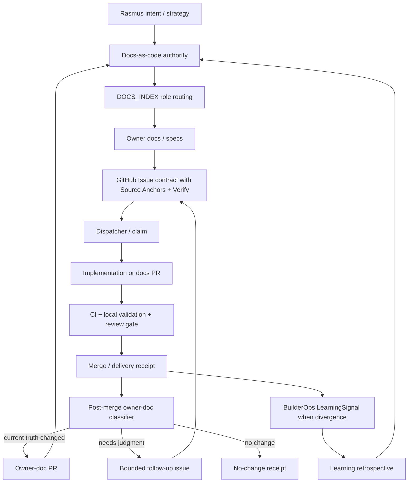
```mermaid
flowchart TD
  Intent["Rasmus intent / strategy"] --> Docs["Docs-as-code authority"]
  Docs --> Index["DOCS_INDEX role routing"]
  Index --> Owner["Owner docs / specs"]
  Owner --> Issue["GitHub Issue contract with Source Anchors + Verify"]
  Issue --> Claim["Dispatcher / claim"]
  Claim --> PR["Implementation or docs PR"]
  PR --> CI["CI + local validation + review gate"]
  CI --> Merge["Merge / delivery receipt"]
  Merge --> OwnerCheck["Post-merge owner-doc classifier"]
  OwnerCheck -->|current truth changed| OwnerPR["Owner-doc PR"]
  OwnerCheck -->|needs judgment| Followup["Bounded follow-up issue"]
  OwnerCheck -->|no change| Receipt["No-change receipt"]
  OwnerPR --> Docs
  Followup --> Issue
  Merge --> Learning["BuilderOps LearningSignal when divergence"]
  Learning --> Retro["Learning retrospective"]
  Retro --> Docs
```

## 4. End-To-End Builder System Process Map

| Lane | Trigger | Actor | Input | Authority file(s) | Skill(s) | Script/workflow | Output | Mutation authority | Verification gate | Decision points | Feedback loops | Failure path | Human exception condition | Evidence |
| --- | --- | --- | --- | --- | --- | --- | --- | --- | --- | --- | --- | --- | --- | --- |
| intent capture | Human strategy/request | Rasmus + agent | Intent | `PROJECT_KERNEL`, `DOCS_INDEX`, owner docs | docs-authoring | PR/docs | Updated docs or issue-ready spec | PR | Docs review | current vs target | docs-to-issue | clarify docs | intent ambiguity | [docs/DOCS_INDEX.md:24-47] |
| docs/spec authoring | Docs-only change | Agent | Existing docs | `AGENTS.md`, `DOCS_INDEX`, `DEV_WORKFLOW` | docs-authoring | docs/governance checks | Docs PR | PR | factual claim verification | owner doc role | docs-to-issue later | switch to issue-first if implementation | authority ambiguity | [`.codex/skills/docs-authoring/SKILL.md`:18-48] |
| docs-to-issue | Active docs become executable work | Agent | Docs/source anchors | `ISSUE_CONTRACT`, `docs-to-issue` | docs-to-issue | gh; optional Project repair | Issue | GitHub | `Verify:` markers | executable? duplicate? ready? | issue maintenance | Backlog/needs-human | named human decision | [`.codex/skills/docs-to-issue/SKILL.md`:69-119] |
| feature breakdown | Capability too large | Agent | Owner/spec docs | feature-breakdown | feature-breakdown | gh/docs | Spec dir, parent/child issues | PR + GitHub | task specs with ACs | parent vs child | validation hub | blocked parent | target acceptance ambiguity | [`.codex/skills/feature-breakdown/SKILL.md`:25-47], [`.codex/skills/feature-breakdown/SKILL.md`:107-129] |
| issue intake | Issue opened/edited/labeled | GitHub Action + agent | Issue body | issue template, governance | docs-to-issue/learning-to-issue | `issue-pr-governance.yml` | Checked issue | Issue labels/comments | section/source checks | label/status | maintenance | failed governance check | missing human input | [`.github/workflows/issue-pr-governance.yml`:3-78] |
| issue validation | Before coding | Agent | Issue | `AGENT_OPERATING_PROTOCOL`, issue contract | issue-to-code | source-anchor validation | pass/block | labels; optional Project projection | all `Verify:` targets | source truth sufficient? | issue maintenance | `agent:blocked` or `needs-human` | authority unclear | [`.codex/skills/issue-to-code/SKILL.md`:19-72] |
| readiness classification | Queue eligibility | Agent + GitHub state | labels | label taxonomy, issue contract | issue-maintenance | readiness validator | ready/non-active | labels | strictly valid `agent:ready` | agent-ready? | drift repair | no pickup | named decision | [`.codex/skills/_shared/LABEL_TAXONOMY.md`], [`.codex/skills/_shared/ISSUE_CONTRACT.md`] |
| dispatcher / queue selection | Work pickup | Agent + dispatcher | Ready tasks | dispatcher contract | issue-to-code | `python -m app.dispatcher next/claim` | Lease/task | dispatcher DB + GitHub label | lease acquired | priority and fit | release/reclaim | fallback to GitHub-label-only | dispatcher unavailable plus unsafe fallback | [docs/AGENT_ISSUE_DISPATCHER.md:165-180] |
| model routing | Before work | Agent | risk/TCD | `AGENTS.md` TCD | relevant skill | none | model/effort choice | session only | review outcome | under/over-model? | learning | escalate capability | >10 min human steering or repeated failures | [AGENTS.md :: Total Cost of Development] |
| skill routing | Task start | Agent | task class | `AGENTS.md`, skills README | matching skill | none | loaded skill | none | skill instructions | narrowest skill | learning | wrong skill -> repair | unclear route | [AGENTS.md :: Repo-local skill routing], [`.codex/skills/README.md`:64-128] |
| context building | Before edit | Agent | source anchors | `DOCS_INDEX`, owner docs | active skill | rg/cat | context | none | owner docs read | current vs target | docs repair | stop | owner doc unavailable | [docs/DOCS_INDEX.md:11-17], [docs/development/AGENT_OPERATING_PROTOCOL.md:23-37] |
| repo orientation | Before edit | Agent | git/docs | `AGENTS.md` | agentic-pkm/skill | `git status`, rg | state | none | diff/status | dirty tree? | resume-work | stop if conflict | destructive ambiguity | [AGENTS.md :: Agency default], [AGENTS.md :: Parallel-agent execution] |
| work pickup / claim | Active work begins | Agent | ready issue | issue-to-code | issue-to-code | `scripts/issue_pickup_claim.sh` | In Progress, label removed | GitHub/dispatcher | gh view verify | claim can proceed? | release/blocked | blocked label/comment | human decision | [`.codex/skills/issue-to-code/SKILL.md`:129-175], [scripts/issue_pickup_claim.sh:39-59] |
| implementation | Claimed issue | Agent | issue + owner docs | issue-to-code | issue-to-code | local tests | diff | files | local validation | can proceed? | local repair | block issue | safety/authority risk | [`.codex/skills/issue-to-code/SKILL.md`:236-260] |
| mechanism convergence review | Before expensive validation when high-risk stateful work triggers | Fresh reviewer | local publishable SHA + convergence packet | review/repair contract | issue-to-code / publish-pr | `review_before_ci_gate.py` + independent review | clean/blocking receipt | none | invariants/states/crash-ordering/races/test map | clean? | focused repair + refreshed packet | block expensive proof | authority conflict only | [docs/development/AUTONOMOUS_REVIEW_REPAIR_GATE_CONTRACTS.md#mechanism-convergence-gate] |
| local validation | Before PR | Agent | changed files | `DEV_WORKFLOW` | issue-to-code | ruff/mypy plus governing `Verify:` and affected-subsystem pytest; host-leased repo-wide suite only on explicit contract/cross-system escalation | validation log; lease receipt only when escalated | repo-common kernel lock only for broad suite | selected checks pass | affected scope; cross-system blast radius? | local repair | fix or block | cannot verify | [docs/development/DEV_WORKFLOW.md:60-89], [scripts/run_with_host_lease.py] |
| PR publication | Local diff ready | Agent | validated diff | publish-pr | publish-pr | git/gh | branch/commit/PR | GitHub | branch-truth gate | lane? file set? | PR repair | stop on drift | publication ambiguity | [`.codex/skills/publish-pr/SKILL.md`:53-159] |
| PR contract validation | PR opened/edited | GitHub Action | PR body/files | PR template/governance | none | `issue-pr-governance.yml` | pass/fail check | none | pr-contract | issue link? lane? | body repair | check failure | none unless authority needed | [`.github/workflows/issue-pr-governance.yml`:79-218] |
| CI | PR/push/schedule/manual | GitHub Actions | PR head | workflows | none | `.github/workflows/**` | checks/artifacts | none | check status | failure? stale? | CI repair | block | blocked-technical/backoff | `gh workflow list`; [`.github/workflows/ci-smoke.yaml`:4-15] |
| CI triage | CI fail/stale | Agent | check logs | PR escalation | pr-integration | `await_pr_checks.sh`, gh api | failure class | PR commits if caused | re-run/recheck | caused-by-PR? | CI repair loop | block | unresolved residual risk | [docs/development/PR_ESCALATION_PATHS.md:12-20] |
| PR integration / repair | Triggered by CI/review/drift | Agent | PR | PR hot/escalation | pr-integration | git/gh/tests | ready-for-verification or blocked | PR commits/comments | current SHA + checks | blocking? | repair loops | blocked-* | repeated failure | [`.codex/skills/pr-integration/SKILL.md`:38-67] |
| machine review (full path only) | Full-path PR reaches review gate | Agent/subagent | PR diff | verification-and-closure | code-review via verification | local subagent | findings/pass | comments | review gate | blocking finding? | review repair | stop after repeated failure | blocked-technical/capability triage | [`.codex/skills/verification-and-closure/SKILL.md`:116-163] |
| merge gate | Verification complete | Agent | PR + issue + CI; full path also consumes v2 closer context | verification-and-closure | verification-and-closure | `await_pr_checks.sh`; full path adds verified merge preparer/phase writer and REST/GraphQL attribution | light plain merge/readback or full exact-head merge/block with trusted phase ledger | GitHub | tier-selected CI/AC/review/closure gate | eligible? full-path race/crash? | repair or idempotent full-path recovery | no merge before the selected path's prerequisites | non-waivable selected path | [`.codex/skills/verification-and-closure/SKILL.md`], [`app/dispatcher/verified_merge.py`] |
| issue closure | After merge | Agent + automation | merged PR | Issue/PR truth; optional projection matrix | verification-and-closure | gh; optional Project ops | closed issue; optional Done projection | GitHub | readback | partial? | closure loop | follow-up issue | closure ambiguity | [`.codex/skills/verification-and-closure/SKILL.md`:194-208] |
| post-merge docs/spec feedback | After merge | Agent + watchdog | merged diff + authenticated issue targets | post-merge-owner-doc | post-merge-owner-doc | watchdog workflow | docs PR/follow-up/no-change plus PR-specific receipts | closed children + distinct open governing parent, or PR for issue-free lane | receipt exists for this PR on every target | owner doc changed? | docs loop | nudge | wording judgment | [`.codex/skills/post-merge-owner-doc/SKILL.md`], [`.github/workflows/post-merge-owner-doc-watchdog.yml`] |
| release/deployment | Accepted candidate under the current channel contract | Agent + operator | authorized `main` candidate today; target test receipt/plan only after gated-`stable` activation | current release-channel owner docs; target promotion skills are subordinate | current deployment/operations instructions; target `promote-*` only in target mode | deployed identity/health/acceptance receipt or verified rollback; target promotion receipt only after activation | current operator/deployment authority; target PR to `stable` is not today's prod path | live identity + health/smoke + required feature/owner acceptance | current or target channel model? reversible? protected effect? | verify/rollback/operate loop | rollback/block/Human Exception only for canonical authority category | `docs/RELEASE_CHANNELS/README.md :: Promotion model`, target [`.codex/skills/promote-test-to-prod/SKILL.md`] |
| Mimer/product-lane work | Runtime client task | App agent/human | vault/runtime request | Mimer contracts | `mimer-*` | product APIs/files | governed runtime action | Product authority | Mimer receipts | user/runtime authority | Product loops | human gate | durable knowledge mutation | [`.codex/skills/README.md`:220-250] |
| BuilderOps/governance work | Workflow/governance change | Agent | learning/worklog/docs | BuilderOps docs | capture-learning, learning-retrospective | BuilderOps CLI/API | records, proposals, PRs | BuilderOps + PR | receipt/projection | promote? | learning loop | fallback log | authority crossing | [docs/builderops/BUILDEROPS_VAULT_BOUNDARY.md:40-81] |
| learning/retrospective | Divergence or cadence | Agent | LearningSignals | delivery feedback | capture-learning, learning-retrospective | BuilderOps CLI | proposals/PRs/issues | BuilderOps + PR | receipt | upstream artifact? | retro loop | proposal-only | human review in default mode | [docs/development/DELIVERY_FEEDBACK_LOOP.md:67-188] |
| continuous improvement / reevaluation | Divergence, epic close, review/CI/TCD pattern, CKM projection, or cadence | Agent + BuilderOps + optional human review | LearningSignals, evidence packs, review findings, TCD signals, CKM projections, fitness/debt state | delivery feedback, SBS operating model, CKM specs | learning-retrospective, capture-learning, future learning-to-issue | BuilderOps CLI/API, gh, docs/governance PRs | applied edit, already-satisfied receipt, bounded issue, PromotionIntent, debt/fitness update, discard/supersession receipt | BuilderOps + GitHub/PR through explicit gates | terminal outcome per signal | Product vs Builder? actionability? authority crossing? | reevaluation loop | unresolved signals remain open | strategic/Product authority or unsafe promotion | [docs/development/DELIVERY_FEEDBACK_LOOP.md:1-220], [docs/CAPABILITY_KNOWLEDGE_MODEL/README.md:51-77] |
| human exception routing | Explicit authority-classifier outcome | Agent | authority evidence | this doc + classifier | active skill | issue/PR comment | Human Exception packet | human | named authority decision | continue without authority? | returns to queue | `agent:needs-human` | irreversible/external/strategic or other canonical Human Exception category | [docs/architecture/SBS_OPERATING_MODEL.md §12] |

## 5. Dispatcher And Routing Model

Observed: the repo has an actual dispatcher implementation and a documented operational deployment. It is not merely a label convention. The dispatcher has SQLite task/lease/event storage, a CLI, GitHub pull-sync, queue/claim/heartbeat/complete commands, tests, and Makefile targets [docs/AGENT_ISSUE_DISPATCHER.md:21-36], [app/dispatcher/cli.py:31-32], [Makefile:356-361], [tests/dispatcher/test_agent_loop.py:1-30].

Authority roles are intentionally split: GitHub Issues / PRs / CI are durable delivery truth;
Dispatcher SQLite owns volatile queue, claim, lease, and heartbeat coordination; the external
BuilderOps Vault owns durable BuilderOps Markdown artifacts but no SQLite or live claims; and
GitHub Project plus Signboard remain rebuildable projection surfaces.

Mechanism classification:

| Mechanism | Classification | Current behavior | Evidence |
| --- | --- | --- | --- |
| how work becomes eligible | deterministic + agentic | Issue must carry a strictly validated `agent:ready` label and satisfy its contract and `Verify:` targets; Project Status does not gate pickup | [`.codex/skills/issue-to-code/SKILL.md`], [docs/development/DEV_WORKFLOW.md] |
| how work is queued | deterministic + partial | Dispatcher SQLite pulls open `agent:ready` issues and owns volatile queue/lease state; the external BuilderOps Vault stores durable artifacts | [docs/AGENT_ISSUE_DISPATCHER.md] |
| how an agent selects an issue | agentic | Priority order plus engineering judgment; dispatcher `next` returns ready tasks but no full lane scheduler | [`.codex/skills/issue-to-code/SKILL.md`:109-124], [docs/AGENT_ISSUE_DISPATCHER.md:168-170] |
| labels affect readiness | deterministic | `agent:ready` is the external pickup qualifier after strict validation; `agent:blocked` and `needs-human` are non-active | [`.codex/skills/_shared/LABEL_TAXONOMY.md`] |
| Project status affects routing | none | Project is an optional legacy projection and is not consulted by dispatcher sync or pickup | [docs/AGENT_ISSUE_DISPATCHER.md :: Source-of-Truth Boundaries] |
| work is claimed | deterministic | Dispatcher lease then GitHub label removal; fallback GitHub-label-only | [`.codex/skills/issue-to-code/SKILL.md`:133-175] |
| branch/worktree allocation | partially deterministic | Dedicated worktree required by policy; preflight detects shared root/drift; no central allocator | [AGENTS.md :: Parallel-agent execution], [`.codex/skills/_shared/BRANCH_TRUTH_GATE.md`:9-77] |
| model choice | agentic | TCD policy and adapter defaults; no deterministic router service | [AGENTS.md :: Total Cost of Development], [`.codex/agents/issue-set-coordinator.toml`:1-21] |
| skill choice | agentic + documented | `AGENTS.md` and skill README route by task class | [AGENTS.md :: Repo-local skill routing], [`.codex/skills/README.md`:64-128] |
| docs/source context selection | partially deterministic + agentic | `DOCS_INDEX`, source anchors, and owner docs govern general selection; `app/builderops/epic_dispatch.py` builds bounded per-Issue context packs for its supported lane | [docs/DOCS_INDEX.md:11-17], [docs/development/AGENT_OPERATING_PROTOCOL.md:23-37], [`app/builderops/epic_dispatch.py`] |
| parallel collision prevention | deterministic + partial | Dispatcher leases, label removal, worktree preflight; no branch allocator | [docs/AGENT_ISSUE_DISPATCHER.md:152-180], [scripts/agent_workspace_preflight.sh:55-61] |
| stale claims detection | deterministic + partial | Dispatcher TTL/heartbeat and reclaim semantics; GitHub-label-only fallback has weaker stale detection | [docs/AGENT_ISSUE_DISPATCHER.md:165-180], [tests/dispatcher/test_leases.py:194-222] |
| failed work returns to queue | partially implemented | Dispatcher release/block; GitHub labels for blocked; no automated failed-work requeue from CI | [docs/AGENT_ISSUE_DISPATCHER.md:142-150], [`.codex/skills/issue-to-code/SKILL.md`:176-195] |
| human exception removed from normal queue | deterministic in labels | `agent:needs-human` normally Backlog and not ready | [`.codex/skills/_shared/LABEL_TAXONOMY.md`:18-27] |
| epic context-budget observation | deterministic + advisory | At slice boundaries, a versioned run-state receipt records explicit context measurement or `unknown`, checkpoint/digest data, cost inputs, and independent lifecycle/execution/model-tier recommendations. It performs no dispatch, spawn, acceptance, CI, review, merge, or closure mutation. | [`app/builderops/epic_run_context_budget.py`], [`tests/builderops/test_epic_run_context_budget.py`], [docs/AGENT_ISSUE_DISPATCHER.md :: Epic-runner context-budget observation] |

The context-budget evaluator is measurement infrastructure, not a routing authority. Its
`checkpoint_rotate` and `thin_worker` values are recommendations on separate axes: delegating a
slice does not clear coordinator context, and refreshing changed external state does not alone force
rotation. Persisted worker-isolation, setup-cost, merge-risk, policy, uncertainty, and external-state
evidence deterministically reconstructs lifecycle, execution, model-tier, and reason fields during
every generic run-state update or load. The receipt's policy is explicit and versioned, so the
three-slice #3229 pilot remains a
replayable observation (three inline routes, zero implementation-worker starts, long-lived Sol
coordinator) rather than evidence that Sol or any fixed threshold was cheapest. Missing context,
token, cost, or human-minute measurements remain `unknown`; available inputs may be reported without
inventing the rest or fabricating an accepted-slice denominator.

Authority is unchanged. The evaluator's effect lists are empty and its gate invariants retain CI,
merge, and closure as separate required surfaces; independent review remains separate on the full
delivery path only. It neither rotates/compresses a
coordinator nor starts workers or parallel execution. Dispatcher lease state, live GitHub Issue/PR
truth, exact branch/SHA, CI, and review state must still be refreshed and acted on through their
existing owning workflows.

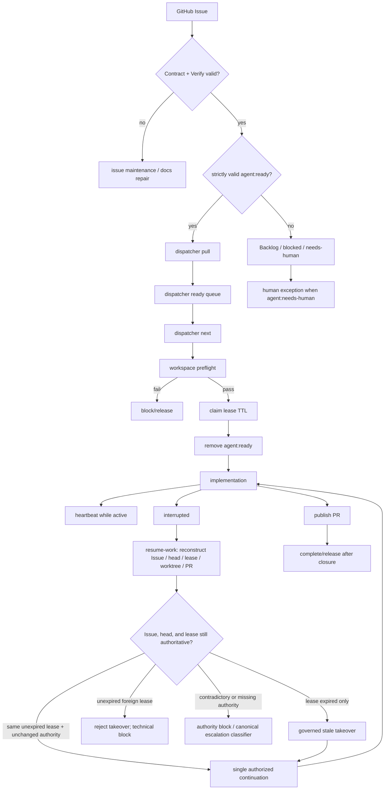
```mermaid
flowchart TD
  Issue["GitHub Issue"] --> Shape{"Contract + Verify valid?"}
  Shape -->|no| Repair["issue maintenance / docs repair"]
  Shape -->|yes| Ready{"strictly valid agent:ready?"}
  Ready -->|no| Backlog["Backlog / blocked / needs-human"]
  Ready -->|yes| Pull["dispatcher pull"]
  Pull --> Queue["dispatcher ready queue"]
  Queue --> Next["dispatcher next"]
  Next --> Preflight["workspace preflight"]
  Preflight -->|fail| Block["block/release"]
  Preflight -->|pass| Lease["claim lease TTL"]
  Lease --> Label["remove agent:ready"]
  Label --> Work["implementation"]
  Work --> Heartbeat["heartbeat while active"]
  Work --> PR["publish PR"]
  Work --> Interrupted["interrupted"]
  Interrupted --> Reconstruct["resume-work: reconstruct Issue / head / lease / worktree / PR"]
  Reconstruct --> Revalidate{"Issue, head, and lease still authoritative?"}
  Revalidate -->|same unexpired lease + unchanged authority| Continue["single authorized continuation"]
  Continue --> Work
  Revalidate -->|lease expired only| Takeover["governed stale takeover"]
  Takeover --> Continue
  Revalidate -->|unexpired foreign lease| Reject["reject takeover; technical block"]
  Revalidate -->|contradictory or missing authority| AuthorityBlock["authority block / canonical escalation classifier"]
  PR --> Complete["complete/release after closure"]
  Backlog --> Human["human exception when agent:needs-human"]
```

## 6. State Machines

### Issue Lifecycle

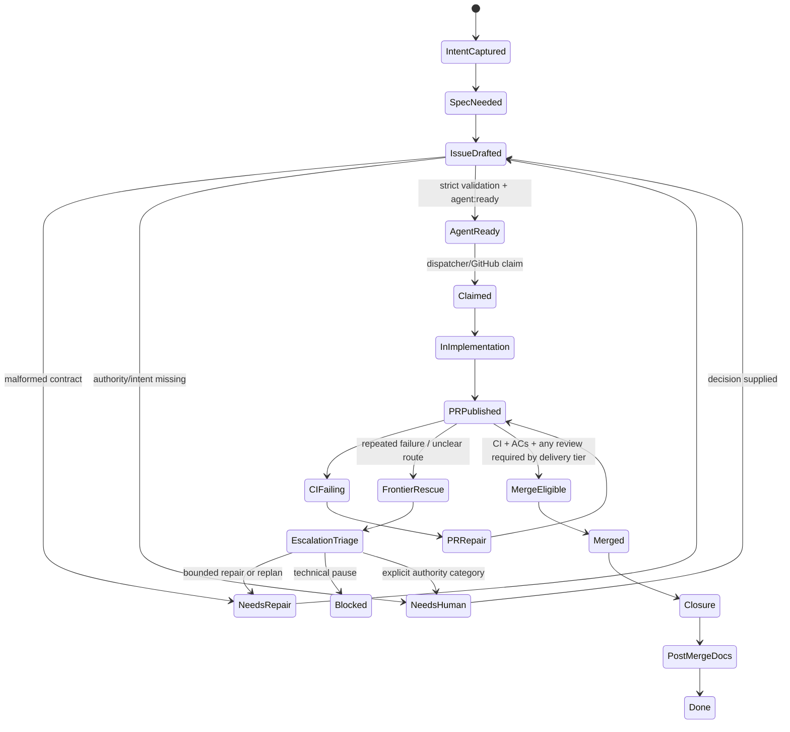
```mermaid
stateDiagram-v2
  [*] --> IntentCaptured
  IntentCaptured --> SpecNeeded
  SpecNeeded --> IssueDrafted
  IssueDrafted --> NeedsRepair: malformed contract
  NeedsRepair --> IssueDrafted
  IssueDrafted --> NeedsHuman: authority/intent missing
  NeedsHuman --> IssueDrafted: decision supplied
  IssueDrafted --> AgentReady: strict validation + agent:ready
  AgentReady --> Claimed: dispatcher/GitHub claim
  Claimed --> InImplementation
  InImplementation --> PRPublished
  PRPublished --> CIFailing
  CIFailing --> PRRepair
  PRRepair --> PRPublished
  PRPublished --> FrontierRescue: repeated failure / unclear route
  FrontierRescue --> EscalationTriage
  EscalationTriage --> NeedsRepair: bounded repair or replan
  EscalationTriage --> Blocked: technical pause
  EscalationTriage --> NeedsHuman: explicit authority category
  PRPublished --> MergeEligible: CI + ACs + any review required by delivery tier
  MergeEligible --> Merged
  Merged --> Closure
  Closure --> PostMergeDocs
  PostMergeDocs --> Done
```

### PR Lifecycle

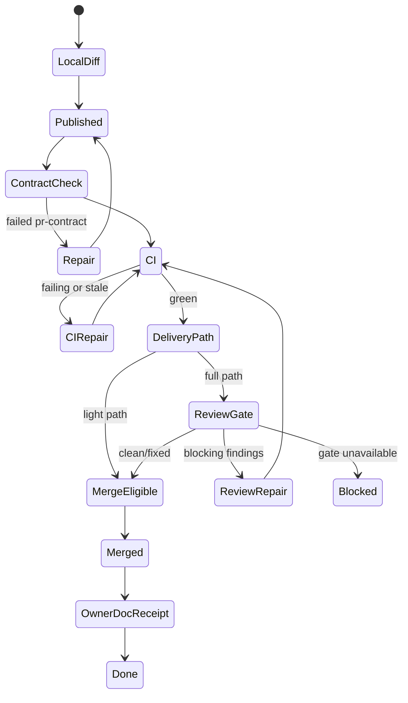
```mermaid
stateDiagram-v2
  [*] --> LocalDiff
  LocalDiff --> Published
  Published --> ContractCheck
  ContractCheck --> Repair: failed pr-contract
  Repair --> Published
  ContractCheck --> CI
  CI --> CIRepair: failing or stale
  CIRepair --> CI
  CI --> DeliveryPath: green
  DeliveryPath --> MergeEligible: light path
  DeliveryPath --> ReviewGate: full path
  ReviewGate --> ReviewRepair: blocking findings
  ReviewRepair --> CI
  ReviewGate --> MergeEligible: clean/fixed
  MergeEligible --> Merged
  Merged --> OwnerDocReceipt
  OwnerDocReceipt --> Done
  ReviewGate --> Blocked: gate unavailable
```

### Epic PR Batching Policy

Default to one coherent child issue slice per PR. A parent epic orders work and receipts; it is not
permission to create one mega-PR. Multiple child issues may share a PR only when they share the same
owner/review surface, validation and CI risk profile, rollback behavior, owner-doc writeback surface,
PR lane, and BuilderOps routing story.

Allowed examples:

- docs-only batches across the same development docs when review, validation, and owner-doc writeback
  are identical;
- shared helper plus direct tests when the helper is the single reason every child changes;
- mechanical governance fixture updates when all children validate through the same targeted tests.

Forbidden examples:

- runtime behavior plus governance workflow or process changes in one PR;
- Product owner-doc contract changes batched with Builder System process edits;
- children with different rollback behavior, reviewers, required CI surfaces, or owner-doc writebacks;
- batching merely because children share a parent epic.

Use `app.builderops.epic_pr_batching_policy.evaluate_epic_pr_batching_policy` as a lintable local
preflight for obvious over-batching risk. The policy is advisory governance evidence only: it does
not weaken PR review, required CI, issue receipts, or branch protection.

### Agent Work Lifecycle

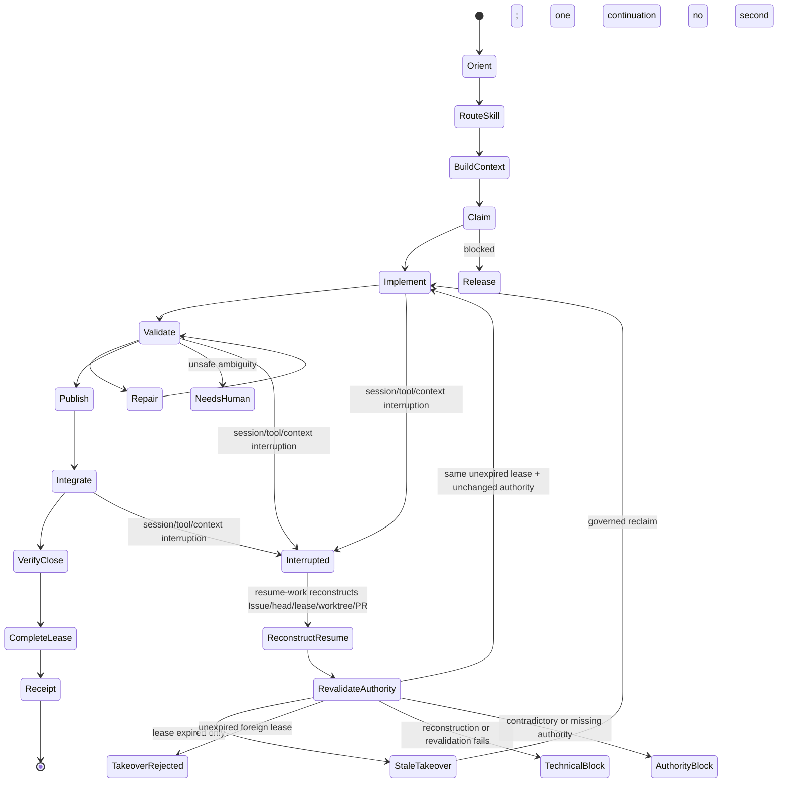
```mermaid
stateDiagram-v2
  [*] --> Orient
  Orient --> RouteSkill
  RouteSkill --> BuildContext
  BuildContext --> Claim
  Claim --> Implement
  Implement --> Validate
  Validate --> Repair
  Repair --> Validate
  Validate --> Publish
  Publish --> Integrate
  Integrate --> VerifyClose
  VerifyClose --> CompleteLease
  CompleteLease --> Receipt
  Receipt --> [*]
  Claim --> Release: blocked
  Validate --> NeedsHuman: unsafe ambiguity
  Implement --> Interrupted: session/tool/context interruption
  Validate --> Interrupted: session/tool/context interruption
  Integrate --> Interrupted: session/tool/context interruption
  Interrupted --> ReconstructResume: resume-work reconstructs Issue/head/lease/worktree/PR
  ReconstructResume --> RevalidateAuthority
  RevalidateAuthority --> Implement: same unexpired lease + unchanged authority; one continuation
  RevalidateAuthority --> StaleTakeover: lease expired only
  StaleTakeover --> Implement: governed reclaim; one continuation
  RevalidateAuthority --> TakeoverRejected: unexpired foreign lease; no second continuation
  RevalidateAuthority --> TechnicalBlock: reconstruction or revalidation fails
  RevalidateAuthority --> AuthorityBlock: contradictory or missing authority
```

### CI Repair Lifecycle

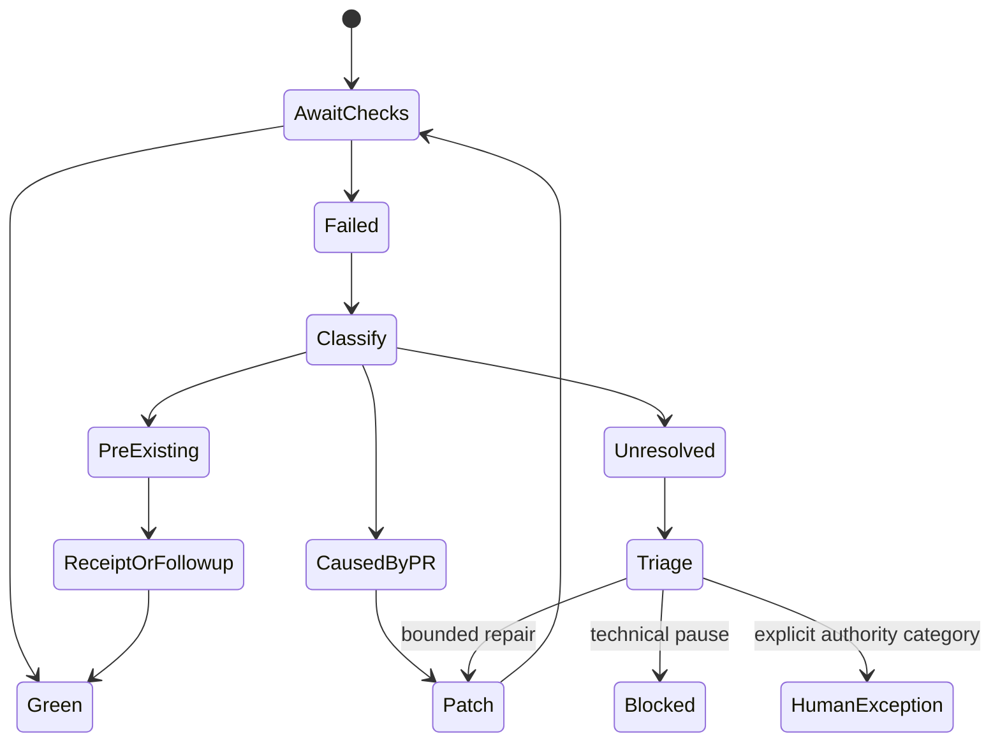
```mermaid
stateDiagram-v2
  [*] --> AwaitChecks
  AwaitChecks --> Green
  AwaitChecks --> Failed
  Failed --> Classify
  Classify --> CausedByPR
  Classify --> PreExisting
  Classify --> Unresolved
  CausedByPR --> Patch
  Patch --> AwaitChecks
  PreExisting --> ReceiptOrFollowup
  ReceiptOrFollowup --> Green
  Unresolved --> Triage
  Triage --> Blocked: technical pause
  Triage --> Patch: bounded repair
  Triage --> HumanException: explicit authority category
```

### Docs/Spec Feedback Lifecycle

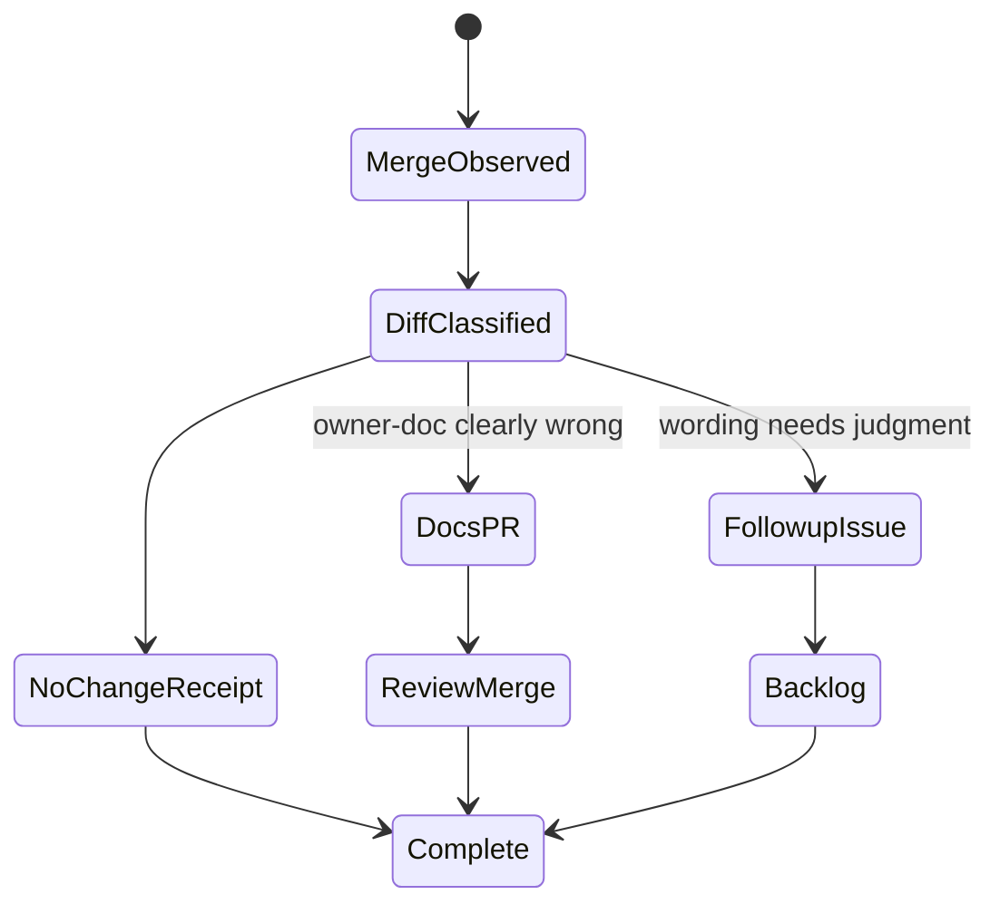
```mermaid
stateDiagram-v2
  [*] --> MergeObserved
  MergeObserved --> DiffClassified
  DiffClassified --> DocsPR: owner-doc clearly wrong
  DiffClassified --> FollowupIssue: wording needs judgment
  DiffClassified --> NoChangeReceipt
  DocsPR --> ReviewMerge
  FollowupIssue --> Backlog
  NoChangeReceipt --> Complete
  ReviewMerge --> Complete
  Backlog --> Complete
```

### Human Exception Lifecycle

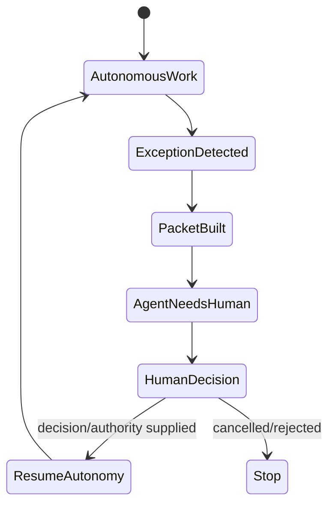
```mermaid
stateDiagram-v2
  [*] --> AutonomousWork
  AutonomousWork --> ExceptionDetected
  ExceptionDetected --> PacketBuilt
  PacketBuilt --> AgentNeedsHuman
  AgentNeedsHuman --> HumanDecision
  HumanDecision --> ResumeAutonomy: decision/authority supplied
  HumanDecision --> Stop: cancelled/rejected
  ResumeAutonomy --> AutonomousWork
```

### Verification dispatch recovery

Verification-dispatch recovery is fail-closed but normally autonomous. The host
uses this sequence: `disabled -> preflight -> observe-only -> pilot ->
limited-enable -> enabled`. Preflight and pilot are non-mutating: they validate
the installed commit, schema/profile compatibility, authentication posture, and
receipt parsing before a request is claimed or any GitHub mutation is possible.
A failed preflight or pilot returns to `disabled` as `blocked_technical`; it
creates an evidence-backed compatibility recovery path and does not create a
Human Exception merely because a retry budget is exhausted. The only route to
`agent:needs-human` is the authority classifier in
`AUTONOMOUS_REVIEW_REPAIR_GATE_CONTRACTS.md :: Escalation classifier`.

## 7. Decision Points

| Decision point | Current mechanism | Deterministic? | Agentic? | Human? | Inputs | Outputs | Failure mode | Evidence |
| --- | --- | --- | --- | --- | --- | --- | --- | --- |
| Is source truth sufficient? | `DOCS_INDEX` + operating protocol | partial | yes | if unclear | source anchors/docs | proceed/repair | target-state treated as shipped | [docs/DOCS_INDEX.md:80-90], [docs/development/AGENT_OPERATING_PROTOCOL.md:73-83] |
| Is this current-state or target-state? | doc role headers/index | partial | yes | if ambiguous | doc role | classification | false current claim | [docs/DOCS_INDEX.md:11-17], [docs/architecture/SBS_OPERATING_MODEL.md:28-34] |
| Is an issue executable? | issue contract + `Verify:` | partial | yes | no | ACs/body | ready/repair | untestable AC | [`.codex/skills/_shared/ISSUE_CONTRACT.md`:53-72] |
| Is issue agent-ready? | strict issue validation + label | yes | yes | no | body/labels | queue eligible | malformed issue labeled ready | [`.codex/skills/_shared/ISSUE_CONTRACT.md`], [`.codex/skills/_shared/LABEL_TAXONOMY.md`] |
| Product/Runtime, Builder, or boundary? | SBS classification | partial | yes | if unclear | touched surface | SBS impact | wrong authority | [docs/architecture/SBS_OPERATING_MODEL.md:95-118] |
| Risk level? | TCD + PR hot path | partial | yes | no | lane/touched surface | low/normal/high | under-modeling | [AGENTS.md :: Total Cost of Development], [docs/development/PR_HOT_PATH.md:12-25] |
| Docs-only/code/runtime/governance/release/Mimer/BuilderOps? | lane and skill routing | partial | yes | no | files/scope | lane | wrong lane | [docs/development/DEV_WORKFLOW.md:107-169], [`.codex/skills/README.md`:130-164] |
| Requires frontier planning? | feature-breakdown/deliver-issue-set | no | yes | maybe | scope size | breakdown | parent issue used as slice | [`.codex/skills/feature-breakdown/SKILL.md`:25-47] |
| Requires human exception? | escalation classifier | partial | yes | yes | explicit authority category | packet/blocker | unnecessary interrupt or unsafe continue | [AGENTS.md :: Agency default], [docs/development/AUTONOMOUS_REVIEW_REPAIR_GATE_CONTRACTS.md :: Escalation classifier] |
| Can an agent claim? | dispatcher/preflight/labels | yes | yes | no | queue/preflight | lease/claim | double claim | [docs/AGENT_ISSUE_DISPATCHER.md:152-180] |
| Can implementation proceed? | issue-to-code stop conditions | partial | yes | if unclear | issue/docs/env | proceed/block | scope drift | [`.codex/skills/issue-to-code/SKILL.md`:62-72] |
| Which tests/checks required? | `DEV_WORKFLOW`, issue `Verify:` | partial | yes | no | touched files/ACs | validation plan | missing coverage | [docs/development/DEV_WORKFLOW.md:60-83] |
| Can CI failure be auto-repaired? | PR escalation | no | yes | if unresolved | logs/checks | fix/follow-up/block | blind retry | [docs/development/PR_ESCALATION_PATHS.md:12-20] |
| Is review finding blocking? | review gate rules | no | yes | no | findings | fix/block | unresolved finding merged | [`.codex/skills/verification-and-closure/SKILL.md`:131-163] |
| CURRENT: PR eligible for unattended governed explicit merge? | `verification-and-closure` exact-head prerequisites; GitHub auto-merge is disabled and is not the mechanism | partial | yes | only when the canonical authority classifier requires it | CI/review/ACs and current head | explicit merge/block | a skill gate is bypassed or current-head evidence is stale | [`.codex/skills/verification-and-closure/SKILL.md`:103-115], live `main` protection and `allow_auto_merge=false` readback dated 2026-08-11 |
| Can issue be closed? | verification/closure | partial | yes | if partial/ambiguous | merge/ACs | close/follow-up | false done | [`.codex/skills/verification-and-closure/SKILL.md`:209-217] |
| Owner doc/spec update needed? | PR template + post-merge skill | partial | yes | if wording judgment | diff | docs PR/follow-up/no-change | drift | [`.github/pull_request_template.md`:34-39], [`.codex/skills/post-merge-owner-doc/SKILL.md`:76-85] |
| CURRENT main-tracking deployment needs operator authority? | current release-channel owner doc and deployment/operator runbooks | yes | yes | as reserved by the current channel contract | authorized `main` candidate and deployment plan | deploy/stop | production mutation outside current operator authority | [`docs/RELEASE_CHANNELS/README.md :: Promotion model`] |
| TARGET/DEFERRED gated-`stable` promotion needs operator authority? | target `promote-*` skills, executable for production only after owner-doc activation | yes | yes | yes where the target contract reserves it | target test receipt and promotion plan | target execute/stop | dormant `stable` mutated as though it were current production | [`.codex/skills/promote-test-to-prod/SKILL.md`:109-113] |
| Learning signal promotion? | capture-learning/retro | partial | yes | default retro review | divergence | record/proposal/issue | learning lost or product memory contamination | [`.codex/skills/capture-learning/SKILL.md`:19-90], [docs/architecture/SBS_OPERATING_MODEL.md:235-261] |

## 8. Feedback Loops

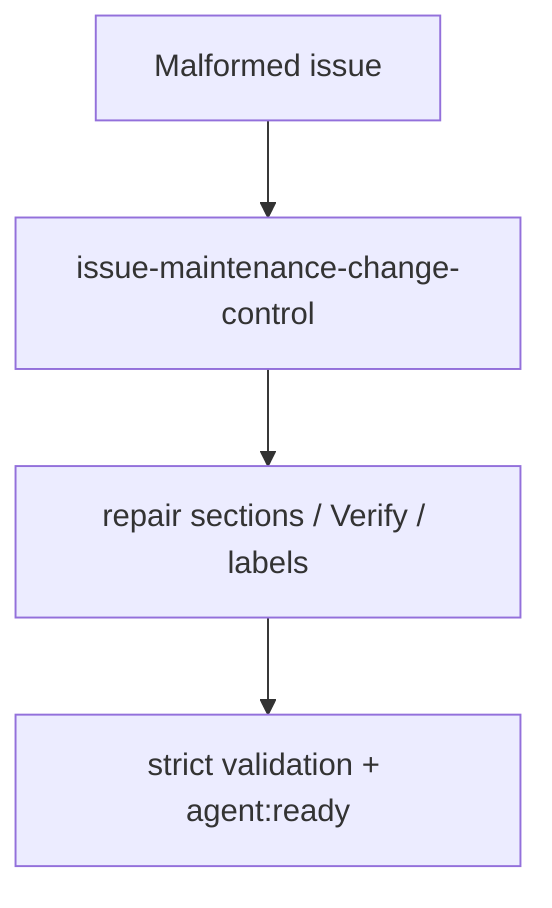
```mermaid
flowchart TD
  MalformedIssue["Malformed issue"] --> Maintenance["issue-maintenance-change-control"]
  Maintenance --> RepairContract["repair sections / Verify / labels"]
  RepairContract --> Ready["strict validation + agent:ready"]
```

Issue readiness repair loop: triggered by malformed issue, stale anchors, missing `Verify:`, or
drift; actor is agent/maintenance skill; no max retry is defined; authoritative state is GitHub
Issue body/labels, with Project included only for explicit projection repair; escalates to
`agent:needs-human` when authority or input is missing [docs/development/AGENT_OPERATING_PROTOCOL.md:73-83], [`.codex/skills/README.md`:168-178].

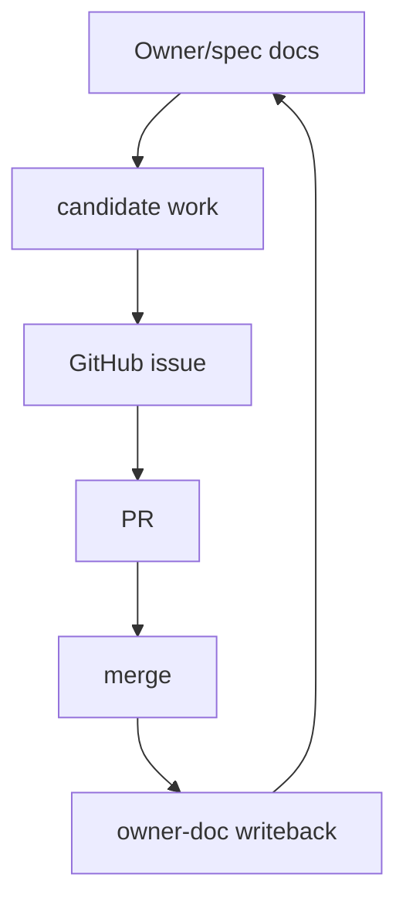
```mermaid
flowchart TD
  Docs["Owner/spec docs"] --> Candidate["candidate work"]
  Candidate --> Issue["GitHub issue"]
  Issue --> PR["PR"]
  PR --> Merge["merge"]
  Merge --> OwnerDoc["owner-doc writeback"]
  OwnerDoc --> Docs
```

Docs/spec-to-issue loop: triggered when active docs become bounded executable work; no max retry; state is source docs plus issue source anchors; returns to normal flow when issue is `agent:ready`; escalates when work is vague or needs owner judgment [`.codex/skills/docs-to-issue/SKILL.md`:69-119].

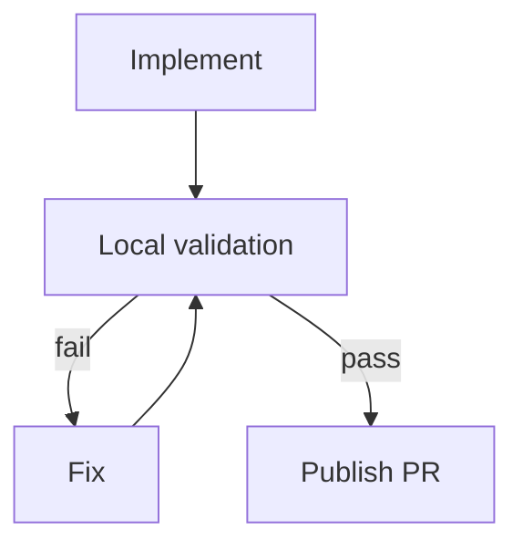
```mermaid
flowchart TD
  Implement["Implement"] --> Validate["Local validation"]
  Validate -->|fail| Fix["Fix"]
  Fix --> Validate
  Validate -->|pass| Publish["Publish PR"]
```

Implementation/local validation repair loop: triggered by local failing check; no max retry in scripts; evidence is terminal output/PR body; escalates under TCD triggers such as two failed attempts or hard-to-assess risk [AGENTS.md :: Total Cost of Development].

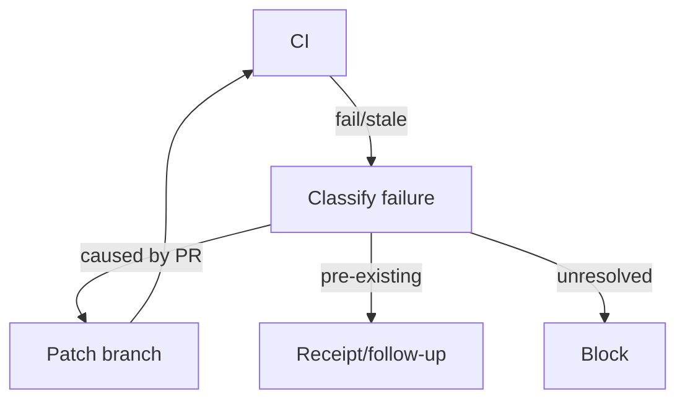
```mermaid
flowchart TD
  CI["CI"] -->|fail/stale| Classify["Classify failure"]
  Classify -->|caused by PR| Patch["Patch branch"]
  Patch --> CI
  Classify -->|pre-existing| Receipt["Receipt/follow-up"]
  Classify -->|unresolved| Block["Block"]
```

CI repair loop: triggered by failing/missing/stale check; actor is pr-integration/verification; stop condition is caused-by-PR fixed, pre-existing receipted, or unresolved block; evidence is CI checks/logs; returns by re-running checks [docs/development/PR_ESCALATION_PATHS.md:12-20].

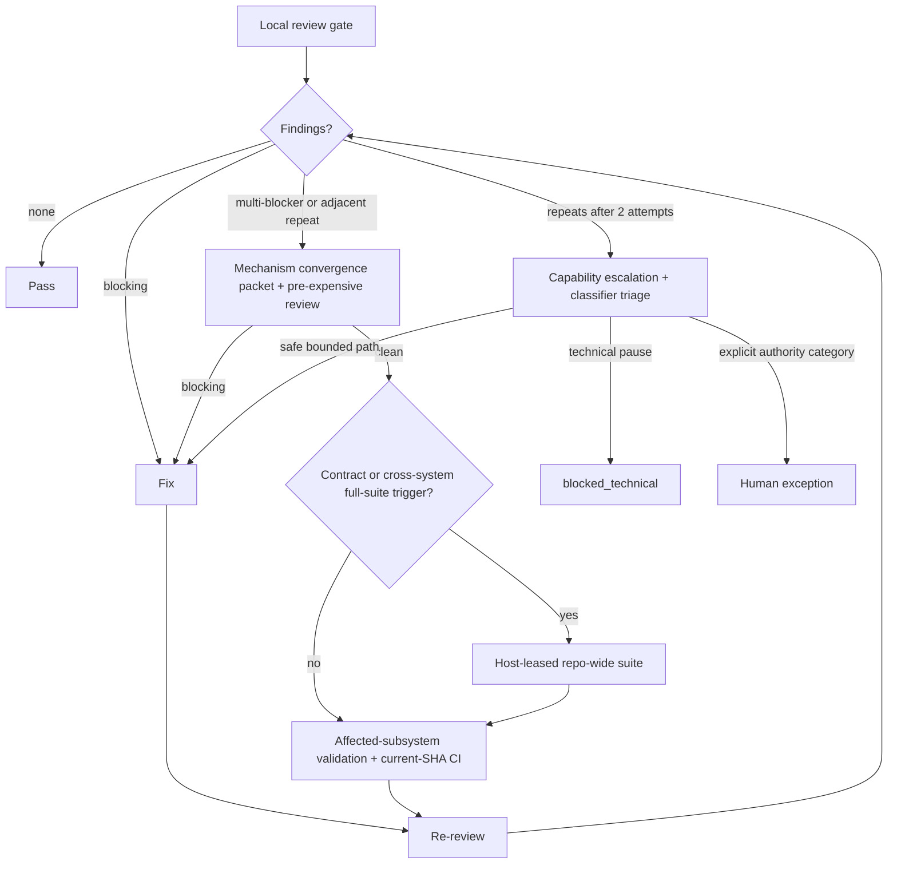
```mermaid
flowchart TD
  Review["Local review gate"] --> Findings{"Findings?"}
  Findings -->|none| Pass["Pass"]
  Findings -->|blocking| Fix["Fix"]
  Fix --> ReReview["Re-review"]
  ReReview --> Findings
  Findings -->|multi-blocker or adjacent repeat| Converge["Mechanism convergence packet + pre-expensive review"]
  Converge -->|clean| Scope{"Contract or cross-system full-suite trigger?"}
  Scope -->|no| Proof["Affected-subsystem validation + current-SHA CI"]
  Scope -->|yes| Full["Host-leased repo-wide suite"]
  Full --> Proof
  Proof --> ReReview
  Converge -->|blocking| Fix
  Findings -->|repeats after 2 attempts| Triage["Capability escalation + classifier triage"]
  Triage -->|safe bounded path| Fix
  Triage -->|technical pause| Block["blocked_technical"]
  Triage -->|explicit authority category| Human["Human exception"]
```

Full-path review repair loop: re-run after every substantive P0/P1 fix and stop after one clean
independent round on the repaired current head SHA. This single-clean-round rule also governs
declared high-risk runtime work and low-convergence circuit-breaker cases. A multi-blocker or
adjacent repeat finding in one stateful mechanism triggers a convergence packet and independent
review before another full-suite/CI cycle. Light-path PRs do not enter this loop. A repeated
mechanism after two attempts enters capability escalation plus classifier triage, not an automatic
owner interrupt [`.codex/skills/verification-and-closure/SKILL.md`:145-225].

Frontier rescue loop: triggered by repeated failure, feature-level issue, hidden invariants, or route
ambiguity; actor is agent; state moves to issue maintenance, feature-breakdown, capability
escalation, or technical block. It reaches `agent:needs-human` only after the canonical classifier
names an explicit authority category; evidence is a blocker receipt or follow-up issue
[`.codex/skills/issue-to-code/SKILL.md`:121-124], [AGENTS.md :: Total Cost of Development].

Closure loop: triggered after merge/verification; actor is verification-and-closure; authoritative
state is Issue/PR/dispatcher, with Project optional. A crash in the open neutralized window resumes
only from exact receipt/body/budget truth plus a continuous `prepared` phase; a crash after merge
resumes from the same trusted authority plus the continuous durable phase ledger. It returns to done
only after the restored phase, exact live authorized closure attribution with no unauthorized
closure, labels removed, owner-doc receipt, and dispatcher complete/release when applicable.
Optional Project `Done` repair does not gate closure. Explicit authenticated issue closes require a
null closer plus the delivery actor/time fence, while automatic attribution requires the exact
target PR/repository/merge SHA; a foreign PR closer is unrelated even when the expected issue is
closed [`.codex/skills/verification-and-closure/SKILL.md`].

The neutralized-body `pr-contract` window is receipt-authenticated: `Refs` plus
`Verified-Closing-Issues` pass only when one trusted, non-conflicting exact-head authority receipt
matches the live body digest and its exact governing, closing, and cumulative supporting sets. The
verification-dispatch producer reads at most `closingIssuesReferences(first: 11)` in one GraphQL call
and fails before pagination when the ten-closing-issue contract is exceeded.

Same-head deployed-v1 recovery preserves historical attempts and repair budget only when the fresh
v2 artifact retains the exact legacy supporting set and its authenticated closing set stays within
the governing issue plus that set. A changed or unknowable legacy issue authority remains inert.

Post-merge docs/spec loop: triggered after merged PR; actor is post-merge skill plus watchdog nudge;
outputs a docs PR, follow-up issue, or no-change result, then records the same PR-specific result on
every closed child and any distinct open governing parent. Only an OWNER, MEMBER, or COLLABORATOR
receipt suppresses the watchdog nudge; issue-free lanes use the PR thread. The
classifier and watchdog trust the same unique collaborator-authored same-head authority receipt during
the temporary neutralized-body window. The watchdog requires the receipt's governing, closing, and
live supporting sets to exactly match the canonically parsed live original or neutralized body. After
an authenticated merge, mutable-body drift may instead recover the same durable authority only when
the exact merged identity and a non-conflicting continuous prepared-through-merged phase chain bind
that receipt. A present but invalid trusted receipt fails target selection closed; it never falls back
to the mutable body or `closingIssuesReferences`. Forged, stale, conflicting, generic, different-PR,
or unphased body-mismatched receipts cannot select a watchdog target
[`.codex/skills/post-merge-owner-doc/SKILL.md`], [`.github/workflows/post-merge-docs-classifier.yml`],
[`.github/workflows/post-merge-owner-doc-watchdog.yml`].

Learning/retrospective loop: triggered by divergence or approximately 10 delivery-learning records; actor is capture-learning/learning-retrospective; default mode proposes edits for human review; autonomous mode only when explicitly requested [`.codex/skills/learning-retrospective/SKILL.md`:25-32], [`.codex/skills/learning-retrospective/SKILL.md`:108-145].

Continuous improvement / reevaluation loop: triggered by a concrete divergence, repeated review or CI
failure pattern, high-TCD delivery, epic close, CKM/Kvasir projection, or approximately 10 unprocessed
delivery-learning records. Actor is `learning-retrospective` or a bounded governance/automation
worker. State is BuilderOps `LearningSignal`/receipt records, PR evidence packs, CI failure context,
review findings, TCD rationale, transition-debt/fitness-rule state, and CKM projections. Stop
condition is one terminal outcome per in-scope signal: applied governance edit, already satisfied,
bounded GitHub Issue, `PromotionIntent`, debt/fitness update, or discard/supersession receipt. CKM
output remains projection-only and never mutates Product/Runtime authority by itself
[docs/development/DELIVERY_FEEDBACK_LOOP.md:1-220], [docs/CAPABILITY_KNOWLEDGE_MODEL/README.md:51-77].

Release/rollback loop: under the current baseline, production follows the `main`-tracking channel
contract and current deployment/operations instructions; stop condition is verified live identity,
health, and required acceptance, or a verified rollback/block. The test-receipt -> protected
`stable` promotion/rollback skills describe the deferred target and become executable for prod only
after the release owner doc activates that model. Required operator authority remains as named by
the active channel contract [`docs/RELEASE_CHANNELS/README.md :: Promotion model`].

Human exception loop: triggered only by an explicit canonical authority category such as an
irreversible external action, strategic choice, or genuinely ambiguous authority. Technical
failure remains blocked/repairable and does not enter the loop. State is `agent:needs-human` plus a
packet and returns when the decision supplies authority [docs/architecture/SBS_OPERATING_MODEL.md §12].

## 9. Automation Surface Matrix

| Step | Current form | Better target form | Why | Attention reduction | Token reduction | Risk | Evidence |
| --- | --- | --- | --- | --- | --- | --- | --- |
| issue section validation | GitHub Action | deterministic script + GitHub Action | Keep malformed issues out of ready queue | medium | low | low | [`.github/workflows/issue-pr-governance.yml`:40-78] |
| `Verify:` validation | skill-enforced prose | deterministic script + GitHub Action | Detect non-executable ACs before pickup | high | medium | medium | [docs/development/DEV_WORKFLOW.md:226-255] |
| source anchor validation | script in Action | deterministic script | Already appropriate | medium | medium | low | [`.github/workflows/issue-pr-governance.yml`:68-78] |
| dispatcher pull/claim | script/CLI + skill | hybrid: script + agent | Keep queue deterministic while selection remains judgment-based | high | medium | medium | [docs/AGENT_ISSUE_DISPATCHER.md:165-180] |
| model routing | agent policy | shared contract, later deterministic hints | Avoid under-modeling; no deterministic model service yet | medium | low | medium | [AGENTS.md :: Total Cost of Development] |
| skill routing | docs/skill index | shared contract + optional checker | Prevent wrong workflow entry | medium | medium | low | [`.codex/skills/README.md`:64-128] |
| context builder | dry-run helper + agent review | hybrid: script + agent | Build compact source pack from issue anchors | high | high | medium | [docs/development/AGENT_OPERATING_PROTOCOL.md:23-37], [app/builderops/epic_dispatch.py:1] |
| worktree/branch preflight | deterministic script | Claude hook + script for local sessions | Local safety before mutation | high | medium | medium if hook blocks valid work | [scripts/agent_workspace_preflight.sh:55-61] |
| CI wait | script | deterministic script | Already avoids GraphQL drain | high | high | low | [scripts/await_pr_checks.sh:1-25] |
| CI failure classification | skill prose | hybrid: GitHub Action + agent artifact | Artifact logs first, agent patches second | high | high | medium | [docs/development/PR_ESCALATION_PATHS.md:12-20] |
| review gate | local subagent | hybrid: agent + PR comments | Requires semantic review | high | low | medium | [`.codex/skills/verification-and-closure/SKILL.md`:116-163] |
| owner-doc classifier | skill + watchdog nudge | hybrid: GitHub Action artifact + agent | Event can collect diff/context; agent judges wording | high | high | medium | [`.github/workflows/post-merge-owner-doc-watchdog.yml`:47-83] |
| learning capture | skill + BuilderOps | skill + deterministic receipt helpers | Preserve learning without product-memory contamination | medium | medium | low | [docs/development/DELIVERY_FEEDBACK_LOOP.md:173-188] |
| continuous improvement / reevaluation | skill prose + BuilderOps + emerging evidence artifacts | hybrid: retrospective runner + evidence/CKM inputs + terminal-outcome ledger | Prevent LearningSignals, review findings, TCD patterns, and CKM gaps from accumulating without process change or explicit discard | high | medium | medium | [docs/development/DELIVERY_FEEDBACK_LOOP.md:1-220], [docs/CAPABILITY_KNOWLEDGE_MODEL/README.md:51-77] |
| human exception | implicit labels | manual exception gate + packet template | Make escalation bounded and useful | high | medium | low | [docs/architecture/SBS_OPERATING_MODEL.md §12] |

## 10. Hooks And Local Automation Assessment

Claude Code hooks currently present: documentation_only. Repo-level `.claude` contains `.claude/hooks/README.md`; no repo-level `.claude/settings*.json` files were found by `find .claude -path '.claude/worktrees' -prune -o -type f -print` [`.claude/hooks/README.md`:1-50].

Local automation configs currently present: observed for Codex. `.codex/config.toml` and `.codex/agents/**` provide Codex configuration/adapters; `.claude/hooks/README.md` documents the intended Claude local hook posture but no repo-level `.claude/settings*.json` config is present [`.claude/hooks/README.md`:1-50], [`.codex/agents/verification-closer.toml`:1-21].

Candidate hooks:

| Hook class | Event type | Target form | Should become hook? | Reason | Risk | Evidence |
| --- | --- | --- | --- | --- | --- | --- |
| block dangerous Bash commands | PreToolUse | Claude hook | yes, human-gated allowlist | Prevent destructive operations before shell execution | false positives | hook posture is documented but no repo-level Claude settings file is present [`.claude/hooks/README.md`:1-50] |
| block CURRENT production/vault/secret/migration commands and TARGET/DEFERRED `stable` mutation | PreToolUse | Claude hook + manual exception | yes | Current production and protected authority are stop-condition surfaces; dormant `stable` must not be treated as the current deployment channel | blocking legitimate authorized operations | [docs/development/AGENT_OPERATING_PROTOCOL.md:31-35] |
| verify repo root and branch | SessionStart / PreToolUse | hook invoking script | yes | Redirect and branch drift are local-session risks | low | [`.codex/skills/_shared/BRANCH_TRUTH_GATE.md`:9-77] |
| run formatter/lint subset after edits | PostToolUse / Stop | script, not hook for all edits | maybe | Deterministic validation belongs in scripts; hook should only suggest or receipt | latency | [docs/development/DEV_WORKFLOW.md:60-83] |
| reduce long test logs | PostToolUse | hook or wrapper script | maybe | Saves tokens after command output | hiding evidence | [`.codex/skills/_shared/CI_WAIT_CONTRACT.md`:22-82] |
| create local validation receipt | Stop | hook + script | yes for local sessions | Reduces forgotten receipts | stale receipts | [docs/development/PR_HOT_PATH.md:50-54] |
| prevent protected branch mutation | PreToolUse | hook | yes | Local safety before Git operations | false positive for deliberate release work | [AGENTS.md :: Parallel-agent execution] |
| suppress routine notifications | Notification | hook | maybe | Reduce attention drain | missed important blockers | [AGENTS.md :: Agency default] |
| emit Human Exception packet | Stop / SubagentStop | hook/template | yes, only on stop-condition state | Ensures escalation is actionable | over-escalation | [docs/architecture/SBS_OPERATING_MODEL.md §12] |
| PreCompact context receipt | PreCompact | hook | yes | Preserve work state before compaction | stale context | [`.codex/skills/resume-work/SKILL.md` listed in AGENTS.md :: Repo-local skill routing] |

Tasks that should stay scripts: source-anchor validation, branch/worktree preflight, CI wait, skills consistency lint, project status reconcile, dispatcher operations. These are deterministic validation/mutation surfaces and already have scripts or CLI paths [scripts/agent_workspace_preflight.sh:1-61], [scripts/await_pr_checks.sh:1-25], [`.codex/skills/README.md`:189-195].

Tasks that belong in GitHub Actions: issue/PR contract validation, PR checks, project projection, post-merge watchdog, and artifact-only CI failure context collection. These are GitHub event concerns, not local editor session concerns [`.github/workflows/issue-pr-governance.yml`:3-12], [`.github/workflows/project-status-reconcile.yml`:3-23].

Forbidden or human-gated hooks: any hook that writes GitHub state, merges, pushes, executes CURRENT
production migrations, edits vault/HKA content, crosses a BuilderOps authority class through a
`PromotionIntent`, or invokes TARGET/DEFERRED `promote-*`/`stable` release mutation. Those actions
must use their explicit current or target workflow, PR, and operator authority; a target release
skill is not executable for current production until the release owner doc activates that model
[docs/builderops/BUILDEROPS_PROMOTION_GATEWAY.md:30-45], [`.codex/skills/promote-test-to-prod/SKILL.md`:109-113].

## 11. GitHub Event Automation Assessment

| Event | Current workflow | Candidate automation | Required permissions | Safe first mode | Human exception condition |
| --- | --- | --- | --- | --- | --- |
| issues opened/edited/labeled | `issue-pr-governance`, `project-status-reconcile` | Readiness artifact with missing `Verify:` and source-anchor report | issues read/write, contents read | label-only or comment-only | issue requires named human input |
| pull_request opened/synchronize/reopened/ready_for_review | CI, PR governance, project PR workflows | Evidence pack builder, PR contract artifact, CI context collector | contents read, pull-requests read/write for comments | artifact-only/comment-only | merge or patch authority needed |
| pull_request_review | none observed as trigger | Review finding classifier | pull-requests read | observe-only/comment-only | ambiguous blocking review |
| issue_comment | none observed as trigger | Command parser for `/dispatch`, `/repair`, `/evidence` in observe-only | issues read | observe-only | mutation requested |
| workflow_run completed/failure | `pr-ci-failure-context` | CI failure context collector (delivered by PR #3222) | actions read, contents read, pull-requests read | artifact-only | patch/merge decision |
| workflow_run completed/success for `CI Smoke` | `verification-dispatch-request` | Current-head `verification_dispatch_request.v3` producer with exact closing and final-review authority | contents read, pull-requests read, issues read | artifact-only | Mac mini consumption or verification/closure action remains outside GitHub Actions |
| push to agent branches | CI workflows on PR/push | Branch drift/evidence update | contents read | artifact-only | force-push/branch rewrite |
| schedule | harness-selfverify, integration-nightly, project reconcile | queue health, stale claim report | read mostly | artifact-only | stale claim override |
| workflow_dispatch | many workflows | manual diagnostics | per workflow | observe-only/artifact-only | operator action |
| repository_dispatch | missing | external dispatcher trigger | contents/actions | observe-only | external actor trust unclear |

Evidence: workflow triggers are observed in `.github/workflows/issue-pr-governance.yml` [`.github/workflows/issue-pr-governance.yml`:3-12], project reconcile [`.github/workflows/project-status-reconcile.yml`:3-23], CI smoke [`.github/workflows/ci-smoke.yaml`:4-13], harness selfverify [`.github/workflows/harness-selfverify.yml`:10-16], and release UAT [`.github/workflows/release-uat.yaml`:3-7].

## 12. Agent/Action Integration Points

| Integration point | Trigger | Agent role | Inputs | Allowed tools | Forbidden tools | Output | Risk | First safe rollout |
| --- | --- | --- | --- | --- | --- | --- | --- | --- |
| issue dispatcher | schedule/comment/ready label | queue classifier | issue body/labels; optional Project projection ignored for pickup | gh read, dispatcher pull/next | merge/push/prod writes | dispatch recommendation artifact | duplicate claims | observe-only then label-only |
| CI repair agent | workflow_run failure | failure classifier/patch proposer | logs, PR diff | gh read, checkout, tests | merge, force-push, prod | failure context + candidate patch | bad patch | artifact-only then patch-branch with guardrails |
| PR review agent | PR opened/synchronize after CI green | semantic reviewer | PR diff, issue, docs | code-review comments | merge/labels except comments | inline findings | noisy findings | auto-review/comment-only |
| verification dispatch producer | completed successful `CI Smoke` run | deterministic request builder | workflow run, current PR head, linked issue, evidence-pack identity | GitHub read APIs, artifact upload | model/agent invocation, dispatcher call, merge, branch/issue/label/comment mutation | versioned JSON/Markdown request with stable idempotency key | stale or replayed event | artifact-only producer delivered; Mac mini consumer remains #3603 and autonomous closure remains #3604 |
| post-merge docs agent | PR merged | owner-doc classifier | merge diff, issue, DOCS_INDEX | gh read/comment, docs PR only after guardrails | product/runtime mutation | docs PR/follow-up/no-change receipt | wrong owner-doc wording | artifact-only then comment-only |
| evidence pack builder | PR opened/sync/check complete | evidence collector | issue, PR, checks, files | gh read, artifact upload | state mutation | markdown/JSON evidence pack | stale evidence | artifact-only |
| continuous improvement evaluator | cadence/epic close/projection refresh | signal classifier and closure-router | LearningSignals, evidence packs, review findings, TCD signals, CKM projections | gh read/comment, BuilderOps records, docs/governance PRs, issue creation through normal contract | product/runtime mutation, silent owner-doc writes, unreviewed promotion | terminal outcome ledger and bounded follow-up issues/PRs | over-promoting noisy signals | artifact-only report, then governance-lane PR/issue creation |
| human exception packet generator | stop condition/blocker | packet compiler | failures, tried actions, evidence | gh comment/issue label with confirmation | autonomous merge/production action | Human Exception packet | over-escalation | comment-only |

Codex Action integration retains the optional verdict reader, but MAS-03 removed the ungoverned
credential-gated docs-guardian path from `architecture-ci`; deterministic `adr_index.py` and
`docs_guard.py` remain. Light-path PRs have no independent review gate; full-path PRs use the local
review gate rather than the Codex verdict path
[`.codex/skills/verification-and-closure/SKILL.md`:116-170]. Claude Action
integration is missing; Claude-specific repo evidence is a compatibility entrypoint and local hook
documentation only [CLAUDE.md:1-8], [`.claude/hooks/README.md`:1-50].

Do not widen **new** event-driven, dispatcher, GitHub Action, or other platform-native patch/merge
principal authority until its permissions, exact-head evidence gates, containment, recovery, and
branch guardrails are documented and enforced. This restriction does not suspend the current
`verification-and-closure` authority: Tier 1 and eligible Tier 2 work may complete an unattended
governed **explicit merge** when their exact-head gates pass. `main` currently requires `Unit tests
(not pg)` while other applicable checks remain skill-enforced; `allow_auto_merge=false` disables
GitHub's auto-merge feature, not the existing explicit-merge path.

## 13. Branch Protection And Merge Guardrails

Current observed state, refreshed through read-only GitHub API calls on 2026-08-11:

- `main` is the default branch and is protected by a single required status check,
  `Unit tests (not pg)`; `strict=false`, `enforce_admins=true`, and
  `required_pull_request_reviews=null`.
- `stable` is protected with strict required checks `smoke`, `smoke-docker`, and `pr-contract`;
  required approving review count is 0 and CODEOWNERS review is not required by branch protection.
  The live compare reports `stable...main` as diverged (`main` 2,402 commits ahead and 74 behind),
  consistent with the release owner doc's dormant-`stable` warning.
- Repository auto-merge is disabled: `allow_auto_merge=false`. Governed delivery uses an explicit
  merge after the applicable exact-head gates; disabled GitHub auto-merge is not evidence that
  autonomous delivery is absent.
- CODEOWNERS exists and names Rasmus for prod-critical files, promotion skills, and migrations [`.github/CODEOWNERS`:1-9].
- Docs claim required checks were added to `stable` on 2026-05-10 [docs/development/GITHUB_GOVERNANCE_SETUP.md:303-319].

Required target state before widening merge authority to a new event-driven or platform-native
principal is safe:

- ~~Protect `main` or make the autonomous target a protected branch.~~ Done: `main` is protected (verified 2026-07-29).
- Require the actual checks used by the Builder System (`pr-contract`, CI/smoke/import-linter as appropriate). Partially done: `main` requires `Unit tests (not pg)` only; `pr-contract`, `smoke`, `smoke-docker`, and import-linter still run without being required on `main`.
- Decide whether CODEOWNERS review is required for prod-critical paths; current `stable` branch protection does not require it.
- Keep GitHub auto-merge disabled until that distinct platform feature has an auditable evidence,
  review, closure, and recovery contract. This does not block the CURRENT Tier 1 and eligible Tier
  2 explicit-merge path governed by `verification-and-closure`.
- Limit any **new** event-driven/platform-native merge principal to an explicitly admitted risk
  envelope. CURRENT production follows `main`; TARGET/DEFERRED gated-`stable` mutation, migrations,
  release, vault/HKA/MEM authority, and external-facing irreversible changes retain the human or
  operator authority named by their active contracts [docs/development/AGENT_OPERATING_PROTOCOL.md:31-35], [`.codex/skills/promote-test-to-prod/SKILL.md`:109-113].

Conclusion: widening merge authority to a **new** event-driven or platform-native principal is not
yet fully platform-safe. Platform protection blocks a merge while `Unit tests (not pg)` is red, but
does not enforce `pr-contract`, smoke, import-linter, or a review requirement; those remain
skill-enforced. Separately, CURRENT Tier 1 and eligible Tier 2 unattended explicit merges remain
authorized through `verification-and-closure` after the applicable exact-head gates pass
[`.codex/skills/verification-and-closure/SKILL.md`:95-115].

## 14. Human Exception Model

The canonical escalation classifier owns the route. Rasmus may be called only when it establishes a
real owner/operator authority category, including:

- security, privacy, secrets/credentials, protected state, production/release, migrations,
  vault/HKA/MEM authority, or environment decisions whose contract reserves human authority;
- irreversible or external-facing actions and consequences;
- strategic product/portfolio, legal/ethical, or cost/risk choices;
- guardrail bypass, policy exception, expanded permission, or residual-risk acceptance outside
  agent authority;
- contradictory, absent, or genuinely ambiguous authority; or
- an explicit protected operator gate or a failed autonomous path whose next safe step requires one
  of the authority categories above.

Technical failures, repair-budget exhaustion, host/schema compatibility pauses,
or static-quality findings do not independently qualify. They route through the
escalation classifier as `auto_repair`, `auto_backoff`, or
`blocked_technical`.

Canonical packet:

```markdown
# Human Exception Required
## Authority category
irreversible / external-facing / strategic / explicitly ambiguous authority / other named canonical Human Exception
## Original intent
## Current state
## What agents/automation tried
## Evidence
## Why autonomous continuation is unsafe
## Options
## Recommended option
## Consequence of doing nothing
```

Where to store/post:

- Issue-backed work: post on the governing issue and apply `agent:needs-human`; Status should be Backlog according to the label taxonomy and lifecycle matrix [`.codex/skills/_shared/LABEL_TAXONOMY.md`:18-27], [`.codex/skills/_shared/LIFECYCLE_TRUTH_MATRIX.md`:18-20].
- PR-blocked work: post on the PR and link the governing issue; do not merge when a required review gate is unavailable, and retain a blocked-technical receipt until the gate can run [docs/architecture/SBS_OPERATING_MODEL.md §12].
- BuilderOps material: create `PromotionIntent` or `LearningSignal` only when crossing authority or learning conditions are met; BuilderOps records do not themselves authorize Product/Runtime mutation [docs/builderops/BUILDEROPS_VAULT_BOUNDARY.md:40-81].

## 15. Gaps And Missing Components

| Missing/implicit component | Why needed | Evidence searched | Current workaround | Risk of absence | Proposed first implementation |
| --- | --- | --- | --- | --- | --- |
| queue/readiness classifier | Make `agent:ready` deterministic beyond section/source checks | issue workflow, skills, scripts | agent judgment + governance check | malformed ready work | deterministic `Verify:`/DoR checker Action |
| model router | Reduce under/over-modeling | `AGENTS.md`, `.codex/agents` | TCD prose + adapter defaults | excess human steering or cost | shared routing receipt schema |
| skill router | Prevent wrong workflow | `AGENTS.md`, skills README | agent reads index | wrong lane | low-risk linter for skill entrypoint mentions |
| worktree/branch allocator | Avoid branch collision | branch gate, dispatcher docs | preflight detects, no central reservation | late collision | dispatcher branch/worktree reservation extension |
| repair orchestrator | Bounded automated CI/review repair | pr-integration | agentic loop | endless or unsafe retries | patch-branch agent with retry ledger |
| review gate runner | Make local review auditable in GitHub | verification skill | local subagent by agent | invisible review gaps | comment-only review Action or receipt artifact |
| evidence pack builder | Single source for PR closure | PR hot path, verification | PR body/manual receipt | stale/incomplete evidence | artifact-only Action |
| autonomous closure gate | Before issue close/merge | verification skill | agent checklist | false Done | deterministic closure checklist artifact |
| post-merge docs classifier | Event-driven docs loop | skill + watchdog | watchdog nudges human/agent | docs drift | artifact-only diff classifier then comment-only |
| exception router | Standard escalation | labels/fallback policy | ad hoc blocker comments | unusable escalations | Human Exception packet template + label/comment helper |
| hook layer | Local safety/token reduction | `.claude` search | no hooks | branch/root/prod mistakes | SessionStart/PreToolUse hooks that call existing scripts |
| incomplete required-check coverage on `main` | Platform guardrails do not yet enforce every Builder System gate | `gh api main protection`, governance setup, verification skill | `Unit tests (not pg)` is protected; other applicable gates remain skill-enforced | unsafe automation if skill gates are bypassed | reconcile required checks with the proportional delivery contract before widening merge automation |
| auto-merge policy | Closure automation | repo settings | disabled | unclear authority | document eligibility after branch protection |

## 16. Mermaid Diagrams Required

### System Context Diagram


```mermaid
flowchart LR
  Rasmus["Rasmus: intent / preference / authority"] --> Docs["Docs-as-code authority"]
  Docs --> Issues["GitHub Issues / Project"]
  Issues --> Dispatcher["Dispatcher queue / leases"]
  Dispatcher --> Agents["Builder agents + skills"]
  Agents --> Repo["Repo files / branches / PRs"]
  Repo --> CI["CI + governance workflows"]
  CI --> Review["Review / verification gate"]
  Review --> Merge["Merge + closure"]
  Merge --> Candidate["Authorized candidate under CURRENT channel contract"]
  Candidate --> Deploy["Deploy exact authorized SHA / image"]
  Deploy --> Live{"Live identity, environment, and health proven?"}
  Live -->|yes| Accept{"Required feature / owner acceptance satisfied?"}
  Accept -->|yes or not required| Operate["Accepted operation"]
  Live -->|no| Rollback["Authorized rollback; candidate not accepted"]
  Accept -->|no| Rollback
  Rollback --> RollbackVerify{"Rollback identity and health verified?"}
  RollbackVerify -->|yes| PreviousGood["Operate previous-good state; failed candidate remains unaccepted"]
  RollbackVerify -->|no| IncidentBlock["Protected incident / technical or authority block; no accepted operation"]
  Operate --> Observe["Observe product and delivery evidence"]
  PreviousGood --> Observe
  Observe --> Intake["Incident / defect / improvement intake"]
  Intake --> Issues
  Intake --> BuilderOps
  Merge --> Docs
  Agents --> BuilderOps["BuilderOps records"]
  BuilderOps --> Learning["Learning retrospective"]
  Learning --> Docs
  Review --> Triage["Classifier / recovery"]
  Triage --> Exception["Human exception only for authority"]
  Exception --> Rasmus
```

### Docs-As-Code Feedback Loop

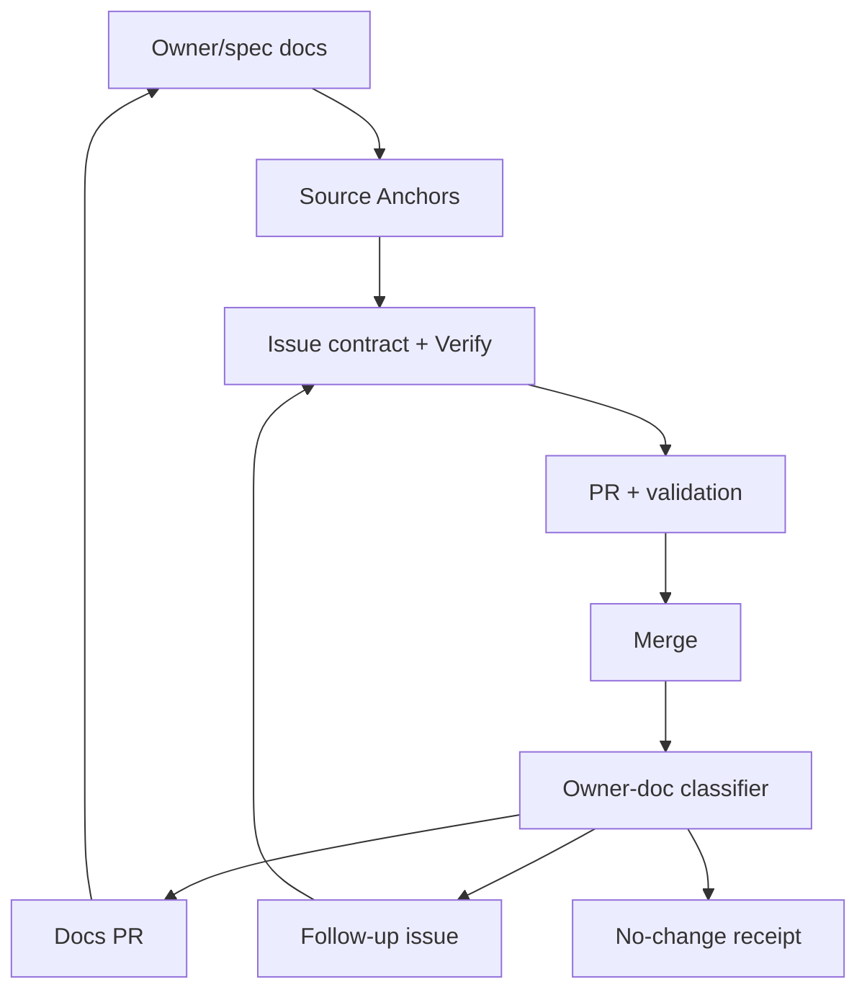
```mermaid
flowchart TD
  Docs["Owner/spec docs"] --> SourceAnchors["Source Anchors"]
  SourceAnchors --> Issue["Issue contract + Verify"]
  Issue --> PR["PR + validation"]
  PR --> Merge["Merge"]
  Merge --> OwnerDocCheck["Owner-doc classifier"]
  OwnerDocCheck --> DocsPR["Docs PR"]
  OwnerDocCheck --> Followup["Follow-up issue"]
  OwnerDocCheck --> Receipt["No-change receipt"]
  DocsPR --> Docs
  Followup --> Issue
```

### L0 End-To-End Builder System Delivery And Operations Flow

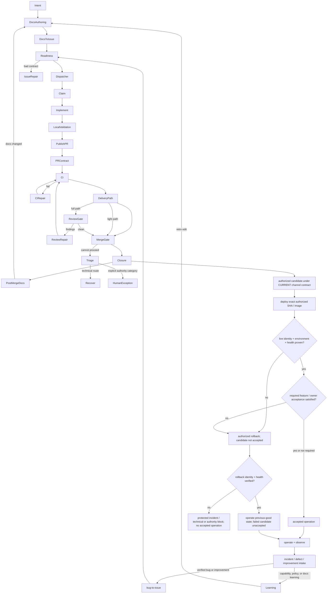
```mermaid
flowchart TD
  Intent --> DocsAuthoring --> DocsToIssue --> Readiness --> Dispatcher --> Claim --> Implement --> LocalValidation --> PublishPR --> PRContract --> CI --> DeliveryPath --> MergeGate --> Closure --> PostMergeDocs
  Readiness -->|bad contract| IssueRepair
  CI -->|fail| CIRepair --> CI
  DeliveryPath -->|full path| ReviewGate
  DeliveryPath -->|light path| MergeGate
  ReviewGate -->|findings| ReviewRepair --> CI
  ReviewGate -->|clean| MergeGate
  MergeGate -->|cannot proceed| Triage
  Triage -->|technical route| Recover
  Triage -->|explicit authority category| HumanException
  Closure --> Candidate["authorized candidate under CURRENT channel contract"]
  Candidate --> Deploy["deploy exact authorized SHA / image"]
  Deploy --> LiveReady{"live identity + environment + health proven?"}
  LiveReady -->|yes| Acceptance{"required feature / owner acceptance satisfied?"}
  Acceptance -->|yes or not required| AcceptedOperation["accepted operation"]
  LiveReady -->|no| Rollback["authorized rollback; candidate not accepted"]
  Acceptance -->|no| Rollback
  Rollback --> RollbackVerification{"rollback identity + health verified?"}
  RollbackVerification -->|yes| PreviousGoodOperation["operate previous-good state; failed candidate unaccepted"]
  RollbackVerification -->|no| IncidentBlock["protected incident / technical or authority block; no accepted operation"]
  AcceptedOperation --> Observe["operate + observe"]
  PreviousGoodOperation --> Observe
  Observe --> Intake["incident / defect / improvement intake"]
  Intake -->|verified bug or improvement| BugToIssue["bug-to-issue"]
  BugToIssue --> Readiness
  Intake -->|capability, policy, or docs learning| Learning
  PostMergeDocs -->|docs changed| DocsAuthoring
  Learning -->|retro edit| DocsAuthoring
```

### Dispatcher/Routing Flow

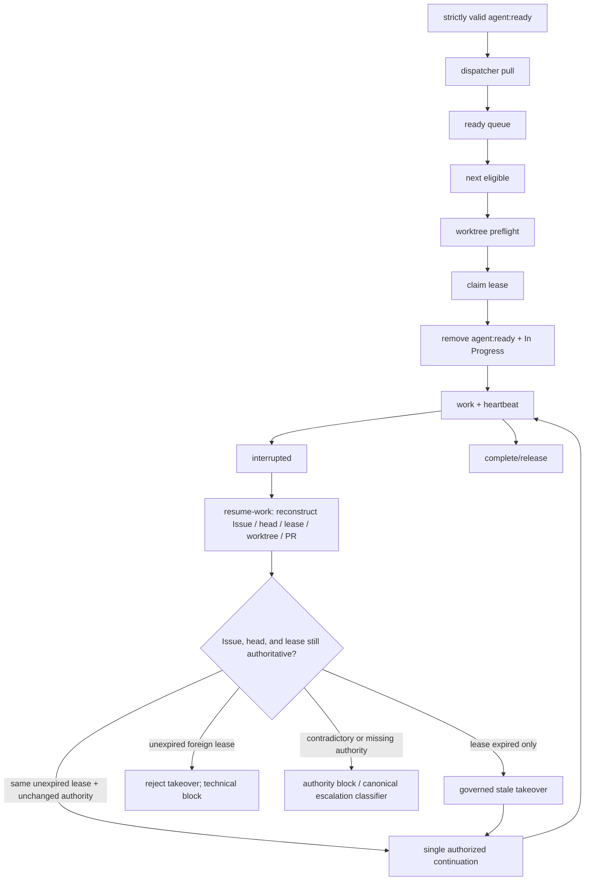
```mermaid
flowchart TD
  ReadyIssue["strictly valid agent:ready"] --> PullSync["dispatcher pull"]
  PullSync --> Queue["ready queue"]
  Queue --> Next["next eligible"]
  Next --> Preflight["worktree preflight"]
  Preflight --> Claim["claim lease"]
  Claim --> GithubClaim["remove agent:ready + In Progress"]
  GithubClaim --> Work["work + heartbeat"]
  Work --> Interrupted["interrupted"]
  Interrupted --> Reconstruct["resume-work: reconstruct Issue / head / lease / worktree / PR"]
  Reconstruct --> Revalidate{"Issue, head, and lease still authoritative?"}
  Revalidate -->|same unexpired lease + unchanged authority| Continue["single authorized continuation"]
  Continue --> Work
  Revalidate -->|lease expired only| StaleTakeover["governed stale takeover"]
  StaleTakeover --> Continue
  Revalidate -->|unexpired foreign lease| RejectTakeover["reject takeover; technical block"]
  Revalidate -->|contradictory or missing authority| AuthorityBlock["authority block / canonical escalation classifier"]
  Work --> Complete["complete/release"]
```

### Issue Lifecycle State Machine

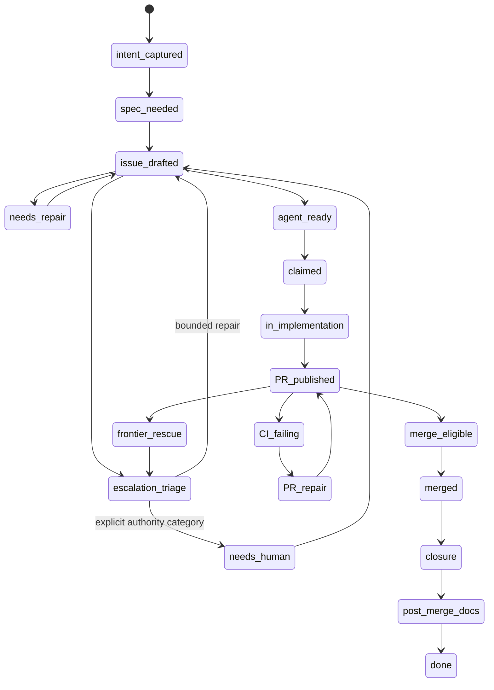
```mermaid
stateDiagram-v2
  [*] --> intent_captured
  intent_captured --> spec_needed
  spec_needed --> issue_drafted
  issue_drafted --> needs_repair
  needs_repair --> issue_drafted
  issue_drafted --> escalation_triage
  escalation_triage --> needs_human: explicit authority category
  escalation_triage --> issue_drafted: bounded repair
  needs_human --> issue_drafted
  issue_drafted --> agent_ready
  agent_ready --> claimed
  claimed --> in_implementation
  in_implementation --> PR_published
  PR_published --> CI_failing
  CI_failing --> PR_repair
  PR_repair --> PR_published
  PR_published --> frontier_rescue
  frontier_rescue --> escalation_triage
  PR_published --> merge_eligible
  merge_eligible --> merged
  merged --> closure
  closure --> post_merge_docs
  post_merge_docs --> done
```

### PR Lifecycle State Machine

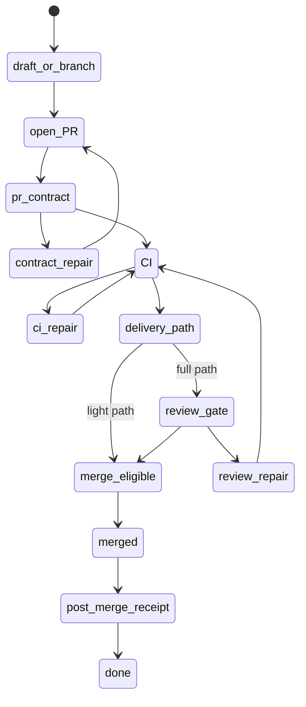
```mermaid
stateDiagram-v2
  [*] --> draft_or_branch
  draft_or_branch --> open_PR
  open_PR --> pr_contract
  pr_contract --> contract_repair
  contract_repair --> open_PR
  pr_contract --> CI
  CI --> ci_repair
  ci_repair --> CI
  CI --> delivery_path
  delivery_path --> merge_eligible: light path
  delivery_path --> review_gate: full path
  review_gate --> review_repair
  review_repair --> CI
  review_gate --> merge_eligible
  merge_eligible --> merged
  merged --> post_merge_receipt
  post_merge_receipt --> done
```

### CI Repair Loop

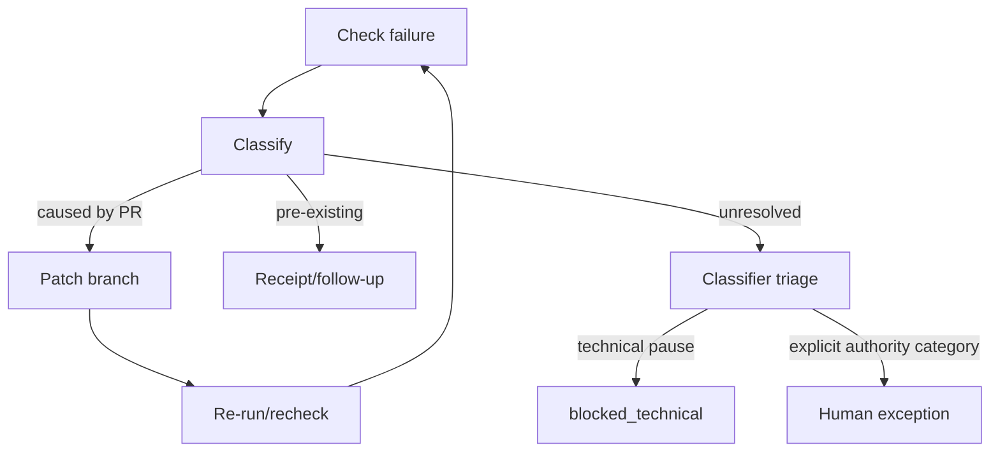
```mermaid
flowchart TD
  Check["Check failure"] --> Classify["Classify"]
  Classify -->|caused by PR| Patch["Patch branch"]
  Patch --> Recheck["Re-run/recheck"]
  Recheck --> Check
  Classify -->|pre-existing| Followup["Receipt/follow-up"]
  Classify -->|unresolved| Triage["Classifier triage"]
  Triage -->|technical pause| Block["blocked_technical"]
  Triage -->|explicit authority category| Human["Human exception"]
```

### Review/Repair Loop

```mermaid
flowchart TD
  Review["Review gate"] --> Blocking{"Blocking?"}
  Blocking -->|no| Pass["Pass"]
  Blocking -->|yes| Fix["Fix"]
  Fix --> Reverify["Re-review/reverify"]
  Reverify --> Review
  Blocking -->|repeated| Triage["Capability escalation + classifier triage"]
  Triage -->|safe bounded path| Fix
  Triage -->|technical pause| Block["blocked_technical"]
  Triage -->|explicit authority category| Exception["Human exception"]
```

### Post-Merge Docs/Spec Feedback Loop

```mermaid
flowchart TD
  Merge["Merged PR"] --> Diff["Read diff"]
  Diff --> Decision{"Owner doc impact?"}
  Decision -->|clear| DocsPR["Open docs PR"]
  Decision -->|judgment| Issue["Open follow-up issue"]
  Decision -->|none| Receipt["No-change receipt"]
  DocsPR --> Receipt
  Issue --> Receipt
```

### Human Exception Loop

```mermaid
flowchart TD
  Stop["Stop condition"] --> Triage["Escalation classifier"]
  Triage -->|technical route| Recover["auto-repair / auto-backoff / blocked_technical"]
  Triage -->|explicit authority category| Packet["Human Exception packet"]
  Packet --> Label["agent:needs-human"]
  Label --> Decision["Rasmus decision"]
  Decision -->|authorize| Resume["Resume autonomous flow"]
  Decision -->|reject| Close["Close/block/discard"]
```

## 17. Target Automation Dependency Principles

This process architecture is not a backlog or implementation sequence. Any automation proposal must
be reconciled against live Issues, current owner docs, and delivered mechanisms before work is
created. The durable dependency principles are:

- establish a bounded source contract before automating execution;
- add observe-only evidence and explicit freshness before granting mutation authority;
- make readiness deterministic enough for the scope before automating dispatch;
- collect failure context before enabling automated repair;
- bind proof to the exact change before automating closure;
- enforce the proportional delivery contract and required branch protections before widening merge
  automation;
- preserve explicit operator gates for production, irreversible, external-facing, migration, and
  other contractually protected effects;
- keep docs-as-code and source systems authoritative while representations remain rebuildable;
- add no routine human review gate where the proportional delivery path does not require one;
- treat Rasmus as exception and strategic authority, not routine dispatcher, triager, reviewer, or
  closer.
