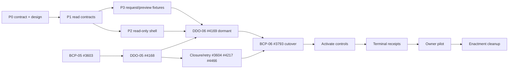

State: Target-state implementation plan (2026-08-06). No devUI implementation is authorized or claimed by this document. Existing GitHub Issues remain executable backlog truth; no Issues were created or changed by this plan.
Doc role: Builder System implementation and sequencing plan
Authority: Owns the proposed dependency order for realizing `docs/DEVUI.md`. Subordinate to accepted ADRs, DDO and BuilderOps control-plane specifications, live Issue contracts, and current-state owner docs.
Owner: Builder System governance
Temporal class: planning
Review cadence: event-driven after each phase or dependency change
Source of truth: accepted ADRs, linked capability specs, and live GitHub remain binding while `docs/DEVUI.md` awaits owner acceptance; after acceptance it owns the owner functions
Last reviewed: 2026-08-06

# devUI implementation plan

## Goal

Deliver an owner entry where the following is experienced as one flow:

```text
situation → capability → proposal → preview → approval → active delivery → terminal receipt → reassessment
```

The plan builds no new control plane. It composes existing CKM, BuilderOps, DDO, dispatcher, and GitHub boundaries, and activates writes only when their normal gates are satisfied.

## Fixed design and architecture rules

1. `devUI` is a working name only; technical identifiers must not collide with `make dev-ui`.
2. One experience means shared navigation and context, not shared authority.
3. CKM is always a non-authoritative evidence lens.
4. Static CKM Direction B gains no fetch, approval, persistence, or execution path.
5. Every authority-bearing action initiated through devUI crosses the separate authenticated BuilderOps/DDO boundary.
6. GitHub, Git/worktree, dispatcher, CI, review, merge, and closure remain delivery truth.
7. Browser, DOM, and local storage never hold durable decisions or run state.
8. `missing`, `stale`, `unread`, `unavailable`, and `zero` are distinct states.
9. Technical ambiguity is a system block, not an owner decision, unless a named authority category applies.
10. CLI and API delivery continue to work without devUI.

## Reuse before construction

| Need | Reuse | Status at plan date |
| --- | --- | --- |
| Capability/evidence snapshot | `CkmQueryService`, `CkmProjectionBatch`, Direction B owner-readable models | Delivered for local single-operator access; remote policy absent |
| Work/freshness | `build_registry`, Cockpit chain predicates, source-state model | Delivered read-only |
| Proposal/preview | `DeliveryRequest.v1`, `DeliveryPreview.v1`, pure plan compiler | DDO-06 target; compiler seam delivered |
| Lawful transitions | DDO reducer and versioned lifecycle commands | Pure reducer delivered; durable binding is DDO-05 target |
| Worker | `WorkerRuntimePort` and context/invocation/result contracts | Seam delivered; durable correlation/reattach target |
| Durable state/effects | BuilderOps PostgreSQL transaction/outbox/fencing kernel | Development baseline only; production authority inactive |
| Live status | `DeliveryRunView.v1` | Specified target, not delivered |
| Delivery truth | GitHub/dispatcher/Git/CI/review/merge/closure | Existing authority |
| Results | `DeliveryReceipt.v2` and attempt-terminal evidence | Receipt seam delivered; complete attempt terminality target |
| Visual base | Yggdrasil Design System and tested Cockpit patterns | Reusable sources; new handoff required |

## Phase plan

### Phase 0 — owner contract, name, and design handoff

Deliver owner acceptance of `docs/DEVUI.md`; decide a route/package/API name that does not alter existing `dev-ui`; and create a governed Yggdrasil design handoff for overview, capability, work, decision/run, and receipt modes. The handoff covers desktop, narrow width, 200% zoom, keyboard use, many simultaneous items, degraded state, the distinction between a link, deterministic contract call, and agent start, plus a read-only action-boundary fallback.

Gate: no visual implementation before a verified design-handoff receipt and token parity.

### Phase 1 — versioned read contracts

Deliver transport-neutral contracts for:

1. CKM owner view: capabilities, proof groups, candidates, findings, watermarks, limitations, and explicit unsupported fields.
2. Work registry view: version, thread identity, chain position, flaw predicates, per-source freshness, and unread/refused claims.
3. devUI composition envelope: binds source snapshot identities without copying or reinterpreting authority.

Access policy gate: current `ckm-local-access-v1` remains `single_operator_local`. Before exposing CKM read outside that boundary, accept effective audience, read authentication/scope, redaction, redistribution, and version-refusal policy. Until then, CKM façade access remains local-only.

Rules: build on `CkmQueryService`; do not give UI SQL access; provide explicit partial/refusal state; preserve each source snapshot ID, `captured_at`, and watermark; never claim an atomic cross-system snapshot; define state mapping across CKM, registry, and ADR-0064 degradation; block preview/approval on prohibited skew/freshness/authority mismatch; and keep the read path side-effect free.

Verify: schema refusal, stable IDs, completeness manifest, state matrix, partial-source failure, no CKM-derived ranking, no write transaction, and browser-journey fixtures.

### Phase 2 — coherent read-only devUI shell

Deliver shared navigation/context between overview, capability, and work; capability-to-work and work-to-capability navigation without identity loss; the four owner questions; progressive technical detail and source out-links; dated CKM-owned last-good snapshot only where CKM owns it; and static Direction B as export/fallback rather than active app.

This phase may precede control-plane cutover because it is read-only. The shell belongs to Builder System and creates no Product Runtime or client authority. Its physical hosting remains a later topology decision; future action always goes to BuilderOps authenticated API.

Verify: context continuity, no action endpoint/credential/local persistence, keyboard/200%/narrow/print/export/many-at-once, one source dead while the other remains healthy, both unavailable, no dependence on technical IDs, and unchanged CLI/Direction B behavior.

Before creating work, reconcile BuilderOps Cockpit parent #4447 and delivered children. New tasks may own only shared façade, contracts, and navigation absent from #4447.

### Phase 3 — request/preview contract design and fixtures

Prepare without runtime or endpoint implementation: an owner-readable `DeliveryRequest.v1` draft from selected capability, confirmed sources, and explicit objective; scope/out-of-scope/acceptance profile/risk/budget/source authority; pure `DeliveryPreview.v1` with waves or typed refusal; and explicit distinction between CKM suggestion, owner choice, and compiler result.

Do not add `CapabilityDeliveryIntent` if request contracts carry the same semantics. Changed source, scope, or acceptance profile invalidates preview. Actual request/preview implementation is Phase 5 in #4169 after its normative DDO-05 dependency. Closure/retry work is a terminal-receipt, activation, and pilot gate, not a new DDO-06 implementation prerequisite.

Verify: preview before approval, zero writes in fixtures/prototype, candidate material cannot choose scope alone, proof groups remain separate, deterministic preview hash and source binding.

### Phase 4 — durable delivery and control-plane prerequisites

Reuse existing Issue contracts; implementation may be parallel only where contracts permit it, while activation remains serial.

1. #3603 / BCP-05: complete the BuilderOps service pilot for API/outbox/review/merge executor and final receipt.
2. #4168 / DDO-05: durable attempt, generic lane fence, reconcile-first, prepare→claim→activate, unknown-effect readback, active-run projection, terminal release.
3. #3604: bind merged-but-incomplete closure and exact PR-specific owner-doc receipt to the same attempt.
4. #4217 and #4466: close fast-lane evidence defect and put CI retry in the same reducer/attempt identity.
5. #3793 / BCP-06 readiness: continue contracted dependencies, but wait for final client inventory before irreversible activation.

Convergence gate: #4168 creates no new BCP-06 dependency and does not activate cutover. #4169 begins only after declared DDO-05 completion. #3604/#4217/#4466 must complete before terminal receipt, live activation, and DDO-07 pilot. BCP-06 cutover occurs only after dormant #4169 client can be inventoried.

### Phase 5 — authenticated decision and active run

After DDO-05, implement #4169: actual `DeliveryRequest.v1`/`DeliveryPreview.v1`; a separate authenticated action region within the same devUI shell; exact request/preview/acceptance/freshness binding to `DeliveryInitiation.v2`; BuilderOps command/journal admission; reducer-driven effects through outbox/adapters; `DeliveryRunView.v1`; and version-fenced pause/resume/cancel/supersede requests.

The owner sees three states: **AI can continue**, **Your decision is needed**, and **Blocked by evidence or system**. `authority_conflict` and `authority_contract_drift` must not appear as owner decisions unless a named Human Exception category exists.

Activation sequence:

1. Deploy #4169 dormant or against an injected test adapter; do not describe it as live.
2. Execute #3793/BCP-06 final client inventory, freeze/import, PostgreSQL authority epoch, client switch, Product separation, no-fallback, restore, and reconciliation proof.
3. Activate authority-bearing controls only after #3793 cutover receipt. Read-only devUI remains usable if the action API is unavailable.

Verify: exact approval/no scope expansion; double submit; stale preview/auth; timeout/restart; owner-vs-technical classification; reattach without duplicate worker; and CLI/API path without devUI. Use the required state-machine/auth/concurrency convergence review.

### Phase 6 — terminal receipt and CKM learning loop

Deliver terminal outcomes (`accepted`, `partial`, `blocked`, `failed`, `cancelled`, `superseded`), exact source references/head/acceptance profile/CI-review-closure/limitations, attempt-terminal evidence, receipt-to-capability reassessment, immutable terminal-evidence TCD routing, and CKM-owned last-good snapshot if regeneration fails. CKM gains better evidence, not new authority.

### Phase 7 — owner pilot and attention decisions

Pilot the owner loop with deliberately degraded sources, ambiguous delivery facts, active-run recovery, and receipt reassessment. Gather only decisions that have actual owner authority. Do not add persistent `done`/`ignore`/`never_show_again` until ADR-0065 prerequisites and its receipt-backed design are accepted.

### Phase 8 — enactment cleanup

After live authority, receipts, and owner pilot prove the replacement, remove transition wording, dead routes, and obsolete owner-surface claims through their normal governed changes. Do not delete a fallback before its replacement has a verified receipt.

## Dependency graph



## Definition of done

The target is complete only when the owner can complete the stated loop in one experience; every write crosses the authenticated BuilderOps/DDO authority boundary; CKM remains non-authoritative; read states fail explicitly; run status and terminal receipts are grounded in delivery truth; no browser/Product/SQLite fallback authority exists; static CKM and CLI/API remain valid independent paths; and each activation phase has the receipts and `Verify:` evidence required by its governing Issue.
