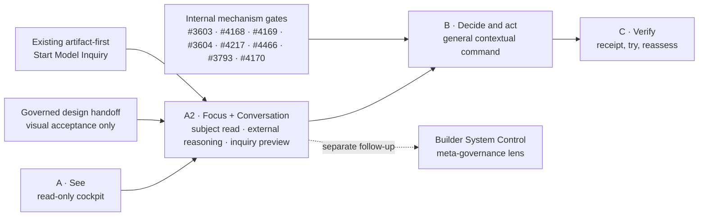

State: Target-state implementation plan (2026-08-09). The read-only `devui.composition.v1` seam is
delivered; the subject Focus, external Conversation Port, Builder System Control lens, visual shell,
and general authority-bearing stages remain targets. Existing GitHub Issues remain executable
backlog truth.
Doc role: Builder System implementation and sequencing plan
Authority: Owns the proposed dependency order for realizing `docs/DEVUI.md`. Subordinate to accepted ADRs, DDO and BuilderOps control-plane specifications, live Issue contracts, and current-state owner docs.
Owner: Builder System governance
Temporal class: planning
Review cadence: event-driven after each phase or dependency change
Source of truth: `docs/DEVUI.md` owns the accepted owner functions; accepted ADRs, linked capability specs, and live GitHub remain binding for mechanisms and delivery truth
Last reviewed: 2026-08-09

# devUI implementation plan

## Goal

Deliver an owner entry where the following is experienced as one flow:

```text
see → decide → act → verify
```

The plan builds no new control plane. It composes existing CKM, BuilderOps, DDO, dispatcher, and GitHub boundaries, and activates writes only when their normal gates are satisfied.

The minimum coherent product is one devUI home with three zones (**Now**, **Needs you**, **Ready to
try**), one contextual focus view, and one command/receipt view. Capability, work, evidence, run,
and receipt are connected lenses, not separate owner products.

devUI is the sole normal owner-facing umbrella. BuilderOps Cockpit, CKM, and Signboard contribute
data and behaviour behind the shell; they are not top-level destinations, embedded subsystem UIs,
or concepts the owner must understand to complete the flow.

## Complexity budget

1. Build one owner shell, not another authority, registry, graph store, task system, or agent UI.
2. Reuse the delivered BuilderOps Cockpit and CKM read models; do not rebuild their joins.
3. Add no top-level mode unless it eliminates a concrete owner reconstruction step.
4. Keep technical identifiers and source topology behind progressive detail.
5. Put commands only in the selected item's context; do not create a global command language.
6. Ship the read-only devUI experience before waiting for the authority-bearing command path.
7. Treat every mechanism dependency below as internal delivery detail, not owner navigation.
8. Do not ship a subsystem switcher, a menu organised by Cockpit/CKM/Signboard, or an iframe-style
   collection of their existing pages. Compose their contracts around one selected owner subject.

## Fixed design and architecture rules

1. `devUI` is a working name only; technical identifiers must not collide with `make dev-ui`.
2. One experience means shared navigation and context, not shared authority.
3. CKM is always a non-authoritative evidence lens.
4. Static CKM Direction B gains no fetch, approval, persistence, or execution path.
5. Every authority-bearing action initiated through devUI crosses the separate authenticated BuilderOps/DDO boundary.
6. GitHub, Git/worktree, dispatcher, CI, review, merge, and closure remain delivery truth.
7. Browser, DOM, and local storage never hold durable decisions or run state.
8. `missing`, `stale`, `unread`, `unavailable`, and `zero` are distinct states.
9. Technical ambiguity is a system block, not an owner decision, unless a named authority category applies.
10. CLI and API delivery continue to work without devUI.
11. Raw Cockpit, CKM, and Signboard routes may remain for diagnostics and recovery, but devUI is the
    normal owner entry and must not require a product switch.
12. Provider sessions and transcripts are provenance only. No text, timestamp, branch, repository,
    or provider similarity may infer a link to work.
13. Focus and Builder System Control use separate primary identities and contexts. The control lens
    cannot become a policy, workflow, task, or source-of-truth engine.

## Reuse before construction

| Need | Reuse | Status at plan date |
| --- | --- | --- |
| Capability/evidence snapshot | `CkmQueryService`, `CkmProjectionBatch`, Direction B owner-readable models | Delivered for local single-operator access; remote policy absent |
| Work/freshness | `build_registry`, Cockpit chain predicates, source-state model | Delivered read-only |
| Queue/claim/lease activity | Dispatcher store and Signboard API contracts | Delivered operational source; standalone Signboard is not devUI navigation |
| Unified read composition | `devui.composition.v1`, GET `/api/devui/composition` | Delivered per-request projection; no cache, mutation, or visual shell |
| Subject focus | `FocusView.v1` target over existing read sources | Specified in `docs/DEVUI_FOCUS_CONVERSATION_PORT/`; not delivered |
| External conversation | `ConversationContextPack.v1` and external adapter target | Specified; no provider/session integration delivered |
| First narrow command | Existing artifact-first `start-model-inquiry` skill and receipt | Workflow delivered; devUI preview/Start/Hold adapter not delivered |
| Builder System Control | Owner docs, process map, skill contracts, bounded capability declarations, BuilderOps/live evidence | Separate read-lens target; not delivered |
| Proposal/preview | `DeliveryRequest.v1`, `DeliveryPreview.v1`, pure plan compiler | DDO-06 target; compiler seam delivered |
| Lawful transitions | DDO reducer and versioned lifecycle commands | Pure reducer delivered; durable binding is DDO-05 target |
| Worker | `WorkerRuntimePort` and context/invocation/result contracts | Seam delivered; durable correlation/reattach target |
| Durable state/effects | BuilderOps PostgreSQL transaction/outbox/fencing kernel | Development baseline only; production authority inactive |
| Live status | `DeliveryRunView.v1` | Specified target, not delivered |
| Delivery truth | GitHub/dispatcher/Git/CI/review/merge/closure | Existing authority |
| Results | `DeliveryReceipt.v2` and attempt-terminal evidence | Receipt seam delivered; complete attempt terminality target |
| Visual base | Yggdrasil Design System and tested Cockpit patterns | Reusable sources; new handoff required |

## Three delivery stages

### Stage A — see: coherent read-only devUI

Deliver the three home zones and contextual focus view by composing CKM for capability evidence,
BuilderOps Cockpit for live work, and dispatcher/Signboard contracts for queue, claim, lease, and
activity evidence. Parent #4447 and children #4448–#4453 are already delivered inputs; this stage
owns only the missing shared contracts, composition, shell, navigation, and owner language. It does
not embed or link together the standalone subsystem UIs as the owner journey.

Use the decision-support model in `docs/DEVUI.md` as a design brief: a calm trust frame; a candidate
asymmetric cockpit with a wide **Now** situation field and compact **Needs you** / **Ready to try**
rails; then one persistent focus canvas for situation, meaning, next step, evidence, action, and
receipt. Yggdrasil must validate or revise the visual composition before implementation. The four
information depths — glance, understand, verify, inspect — reveal more of the same source-bound item
rather than creating separate overview, decision, and audit products.

Before visual implementation, complete the Yggdrasil design handoff for the three owner surfaces.
Deliver transport-neutral CKM owner-view, work-registry, and devUI composition-envelope contracts.
The envelope binds source snapshot identities without copying or reinterpreting authority.
The handoff must organize the experience by owner intent and selected subject, never by provider
name. Provider identity belongs in inspect/provenance and degraded-source explanations.

Current `ckm-local-access-v1` remains `single_operator_local`. Until its audience, read auth,
redaction, redistribution, and version-refusal policy is accepted, CKM façade access remains local.
The read path remains side-effect free, distinguishes partial/refused/stale/zero, preserves each
source's snapshot and watermark, and never claims an atomic cross-system snapshot.

Verify: the three zones answer the owner questions; context survives cockpit-to-detail navigation;
one or both sources may fail honestly; no technical ID, action endpoint, browser credential, local
persistence, or new graph store is required; and keyboard, narrow, 200%, many-at-once, print, and
export states remain usable. Verify that **Needs you** has no false-positive technical blocks; a
selected item retains its full evidence path through all four information depths; quantified claims
retain counts or denominators; and the first view directly supports perception, comprehension, and
the next legal step without exposing subsystem topology.

### Stage A2 — Focus + external Conversation Port

After the composition seam and before the general delivery-command path, deliver the bounded slice
specified in `docs/DEVUI_FOCUS_CONVERSATION_PORT/README.md`:

1. compose one stable Issue/capability Focus with owner intent, governing source, evidence,
   receipts, risks, limitations, next legal step, and only explicitly correlated execution
   observations;
2. export/open one immutable hash-bound context pack to an external Codex or Claude conversation,
   with provider transcript/session data retained as provenance only; and
3. admit one typed command, Start Model Inquiry, through exact preview and explicit Start/Hold into
   the artifact-first workflow and its existing receipt, but only after the separately
   authenticated action boundary and destination-owned operation-key/readback support exist; then
4. complete the governed Yggdrasil handoff from the stable Focus, source-state, conversation, and
   command/receipt fixtures before deriving any visual implementation slice.

This is not an early activation of the general Stage B DDO command chain. Start Model Inquiry is a
narrow pre-Issue workflow documented in the Builder System process map, but its cost-bearing Start
still crosses the authenticated action boundary owned by #4169. The current loopback-only read
route is not approval authentication, and the current single-flight launcher is not durable
idempotency. FCP-04 therefore remains blocked until the authenticated boundary and a proposal-scoped
operation key/readback in the existing inquiry artifacts are available. The slice
adds no delivery request, GitHub/repository mutation, task store, provider-session store, global
session view, or direct provider invocation. Inquiry promotion and any later Issue/repo consequence
remain separate governed workflows.

Builder System Control is a sibling system-governance lens, not a Focus task. Its detailed target
contract is `docs/DEVUI_BUILDER_SYSTEM_CONTROL/README.md`, developed separately under Issue #4698.
Parent #4693 and children #4694–#4697 own only the Focus/Conversation chain; FCP-01 and FCP-03 are
delivered while FCP-02 and FCP-04 retain their named blockers. The control lens may compose document
roles, versioned workflow adapters, bounded tool capabilities, policy/source coverage, drift,
exceptions, unknowns, and explicitly evidenced route deviations. It may not own policy, workflow
state, tasks, or source truth.

Verify: the Focus identity is stable; all required source/correlation states remain distinct;
external-provider failure degrades only the port; canonical pack/command hashes bind displayed and
submitted bytes; changed/expired evidence withdraws Start; Hold invokes nothing; Start invokes the
existing route once; valid/ambiguous receipts preserve its contract; and Builder System Control
cannot appear as a tab or evidence join inside the subject Focus.

### Stage B — decide and act: contextual command surface

Attach proposal, preview, exact approval, live progress, and lawful controls to the selected item.
The owner sees **AI can continue**, **Your decision is needed**, or **Blocked by evidence or
system**. Technical ambiguity never becomes an owner decision without a named Human Exception.

Render a genuine owner escalation as one canonical owner-decision brief in the stable focus-canvas
command region: the decision, **Why you** (why no agent can take it), two or three viable options
with the consequence of each, a recommendation, and **If you don't answer** (what stays blocked and
the safe default). Keep the exact request/preview/evidence scope that approval binds alongside the
brief. Do not present routine agent choices or technical recovery paths as owner options.

Request/preview design may proceed as read-only contracts and fixtures, but authority-bearing
activation waits for the existing mechanism chain:

1. #3603 and #4168 establish the durable BuilderOps service/effect path.
2. #4169 supplies request, preview, initiation, run view, and dormant authenticated controls.
3. #3604, #4217, and #4466 close terminality and retry-evidence gaps.
4. #3793 performs the PostgreSQL authority cutover before controls activate.
5. #4170 validates deterministic delivery, TCD, and crash recovery; #3690 later enacts the accepted
   cutover wording.

Do not add `CapabilityDeliveryIntent`; `DeliveryRequest.v1` and `DeliveryPreview.v1` carry the
proposal semantics. Changed source, scope, acceptance profile, or freshness invalidates preview.
Read-only cockpit use remains available whenever the action boundary is unavailable.

Verify: exact approval/no scope expansion, double submit, stale preview/auth, timeout/restart,
reattach without duplicate worker/effect, typed pause/resume/cancel/supersede, owner-vs-system
classification, and unchanged CLI/API delivery without devUI.

### Stage C — verify: receipt, try, and reassess

Return the terminal outcome, exact source/head/acceptance/CI-review-closure evidence, limitations,
and CKM reassessment to the same selected item. Distinguish merged, delivered, ready to try, and
tried by owner. Pilot deliberately degraded sources, ambiguous facts, active-run recovery, and
receipt reassessment before removing transition routes or wording.

Keep the receipt in the command region that previously held the decision and live run. Lead with
what changed, how to try it, and material limitations; preserve the complete verification and
source evidence through the verify/inspect depths.

Persistent `done`/`ignore`/`never_show_again` and a durable tried-by-owner receipt remain outside the
initial target until ADR-0065 and INV-DG-7 decisions are accepted. A fallback is removed only after
its replacement has a verified receipt.

## Dependency graph



## Definition of done

The target is complete only when the owner can see, decide, act, and verify in one experience without
reconstructing the underlying delivery system; every write crosses the authenticated BuilderOps/DDO
authority boundary; CKM remains non-authoritative; read states fail explicitly; run status and
terminal receipts are grounded in delivery truth; no browser/Product/SQLite/graph fallback authority
exists; static CKM and CLI/API remain valid independent paths; and every mechanism gate has the
receipts and `Verify:` evidence required by its governing Issue. Low cognitive load is accepted only
when owner-critical information remains reachable in the same selected context and the surface
reduces reconstruction work rather than reducing evidence. Cockpit, CKM, and Signboard remain
independently testable internal providers and diagnostic fallbacks, but no normal owner task requires
selecting or navigating among them.
