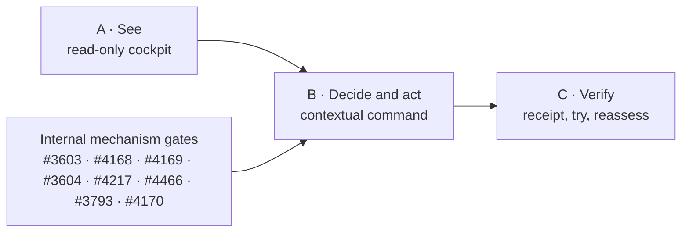

State: Target-state implementation plan (2026-08-07). No devUI implementation is authorized or claimed by this document. Existing GitHub Issues remain executable backlog truth; no Issues were created or changed by this plan.
Doc role: Builder System implementation and sequencing plan
Authority: Owns the proposed dependency order for realizing `docs/DEVUI.md`. Subordinate to accepted ADRs, DDO and BuilderOps control-plane specifications, live Issue contracts, and current-state owner docs.
Owner: Builder System governance
Temporal class: planning
Review cadence: event-driven after each phase or dependency change
Source of truth: `docs/DEVUI.md` owns the accepted owner functions; accepted ADRs, linked capability specs, and live GitHub remain binding for mechanisms and delivery truth
Last reviewed: 2026-08-07

# devUI implementation plan

## Goal

Deliver an owner entry where the following is experienced as one flow:

```text
see → decide → act → verify
```

The plan builds no new control plane. It composes existing CKM, BuilderOps, DDO, dispatcher, and GitHub boundaries, and activates writes only when their normal gates are satisfied.

The minimum coherent product is one cockpit with three zones (**Now**, **Needs you**, **Ready to
try**), one contextual detail surface, and one command/receipt surface. Capability, work, evidence,
run, and receipt are connected lenses, not separate owner products.

## Complexity budget

1. Build one owner shell, not another authority, registry, graph store, task system, or agent UI.
2. Reuse the delivered BuilderOps Cockpit and CKM read models; do not rebuild their joins.
3. Add no top-level mode unless it eliminates a concrete owner reconstruction step.
4. Keep technical identifiers and source topology behind progressive detail.
5. Put commands only in the selected item's context; do not create a global command language.
6. Ship the read-only cockpit before waiting for the authority-bearing command path.
7. Treat every mechanism dependency below as internal delivery detail, not owner navigation.

## Fixed design and architecture rules

1. `devUI` is a working name only; technical identifiers must not collide with `make dev-ui`.
2. One experience means shared navigation and context, not shared authority.
3. CKM is always a non-authoritative evidence lens.
4. Static CKM Direction B gains no fetch, approval, persistence, or execution path.
5. Every authority-bearing action initiated through devUI crosses the separate authenticated BuilderOps/DDO boundary.
6. GitHub, Git/worktree, dispatcher, CI, review, merge, and closure remain delivery truth.
7. Browser, DOM, and local storage never hold durable decisions or run state.
8. `missing`, `stale`, `unread`, `unavailable`, and `zero` are distinct states.
9. Technical ambiguity is a system block, not an owner decision, unless a named authority category applies.
10. CLI and API delivery continue to work without devUI.

## Reuse before construction

| Need | Reuse | Status at plan date |
| --- | --- | --- |
| Capability/evidence snapshot | `CkmQueryService`, `CkmProjectionBatch`, Direction B owner-readable models | Delivered for local single-operator access; remote policy absent |
| Work/freshness | `build_registry`, Cockpit chain predicates, source-state model | Delivered read-only |
| Proposal/preview | `DeliveryRequest.v1`, `DeliveryPreview.v1`, pure plan compiler | DDO-06 target; compiler seam delivered |
| Lawful transitions | DDO reducer and versioned lifecycle commands | Pure reducer delivered; durable binding is DDO-05 target |
| Worker | `WorkerRuntimePort` and context/invocation/result contracts | Seam delivered; durable correlation/reattach target |
| Durable state/effects | BuilderOps PostgreSQL transaction/outbox/fencing kernel | Development baseline only; production authority inactive |
| Live status | `DeliveryRunView.v1` | Specified target, not delivered |
| Delivery truth | GitHub/dispatcher/Git/CI/review/merge/closure | Existing authority |
| Results | `DeliveryReceipt.v2` and attempt-terminal evidence | Receipt seam delivered; complete attempt terminality target |
| Visual base | Yggdrasil Design System and tested Cockpit patterns | Reusable sources; new handoff required |

## Three delivery stages

### Stage A — see: coherent read-only cockpit

Deliver the three cockpit zones and contextual detail by composing two existing sources: CKM for
capability evidence and BuilderOps Cockpit for live work. Parent #4447 and children #4448–#4453 are
already delivered inputs; this stage owns only the missing shared contracts, composition, shell,
navigation, and owner language.

Before visual implementation, complete the Yggdrasil design handoff for the three owner surfaces.
Deliver transport-neutral CKM owner-view, work-registry, and devUI composition-envelope contracts.
The envelope binds source snapshot identities without copying or reinterpreting authority.

Current `ckm-local-access-v1` remains `single_operator_local`. Until its audience, read auth,
redaction, redistribution, and version-refusal policy is accepted, CKM façade access remains local.
The read path remains side-effect free, distinguishes partial/refused/stale/zero, preserves each
source's snapshot and watermark, and never claims an atomic cross-system snapshot.

Verify: the three zones answer the owner questions; context survives cockpit-to-detail navigation;
one or both sources may fail honestly; no technical ID, action endpoint, browser credential, local
persistence, or new graph store is required; and keyboard, narrow, 200%, many-at-once, print, and
export states remain usable.

### Stage B — decide and act: contextual command surface

Attach proposal, preview, exact approval, live progress, and lawful controls to the selected item.
The owner sees **AI can continue**, **Your decision is needed**, or **Blocked by evidence or
system**. Technical ambiguity never becomes an owner decision without a named Human Exception.

Request/preview design may proceed as read-only contracts and fixtures, but authority-bearing
activation waits for the existing mechanism chain:

1. #3603 and #4168 establish the durable BuilderOps service/effect path.
2. #4169 supplies request, preview, initiation, run view, and dormant authenticated controls.
3. #3604, #4217, and #4466 close terminality and retry-evidence gaps.
4. #3793 performs the PostgreSQL authority cutover before controls activate.
5. #4170 validates deterministic delivery, TCD, and crash recovery; #3690 later enacts the accepted
   cutover wording.

Do not add `CapabilityDeliveryIntent`; `DeliveryRequest.v1` and `DeliveryPreview.v1` carry the
proposal semantics. Changed source, scope, acceptance profile, or freshness invalidates preview.
Read-only cockpit use remains available whenever the action boundary is unavailable.

Verify: exact approval/no scope expansion, double submit, stale preview/auth, timeout/restart,
reattach without duplicate worker/effect, typed pause/resume/cancel/supersede, owner-vs-system
classification, and unchanged CLI/API delivery without devUI.

### Stage C — verify: receipt, try, and reassess

Return the terminal outcome, exact source/head/acceptance/CI-review-closure evidence, limitations,
and CKM reassessment to the same selected item. Distinguish merged, delivered, ready to try, and
tried by owner. Pilot deliberately degraded sources, ambiguous facts, active-run recovery, and
receipt reassessment before removing transition routes or wording.

Persistent `done`/`ignore`/`never_show_again` and a durable tried-by-owner receipt remain outside the
initial target until ADR-0065 and INV-DG-7 decisions are accepted. A fallback is removed only after
its replacement has a verified receipt.

## Dependency graph



## Definition of done

The target is complete only when the owner can see, decide, act, and verify in one experience without
reconstructing the underlying delivery system; every write crosses the authenticated BuilderOps/DDO
authority boundary; CKM remains non-authoritative; read states fail explicitly; run status and
terminal receipts are grounded in delivery truth; no browser/Product/SQLite/graph fallback authority
exists; static CKM and CLI/API remain valid independent paths; and every mechanism gate has the
receipts and `Verify:` evidence required by its governing Issue.
