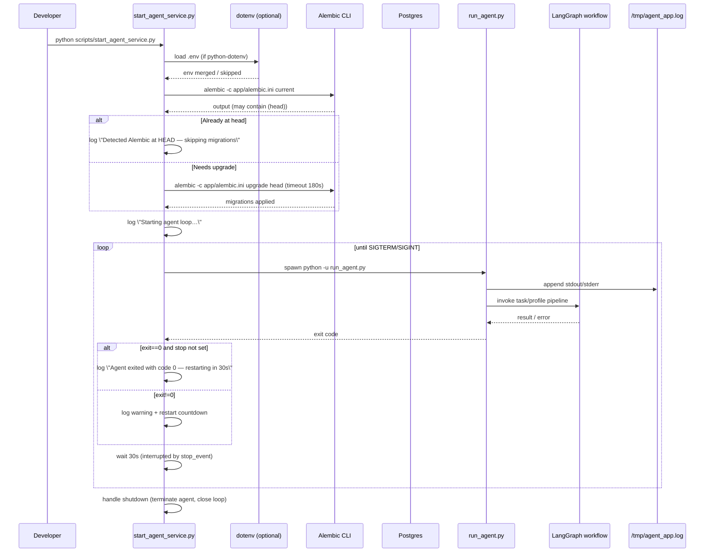

State: Legacy (archived); describes old supervisor loop. See DIAGRAMS.md for current topology.
# Agent Supervisor Sequence (historical)

## Notes
- Captures a v4.x supervisor/run_agent.py restart loop that is not part of Reality-MVP.
- Ingestion watchers/endpoints referenced here are legacy. Use `docs/INGEST.md` + CLI for current ingest, and `docs/DIAGRAMS.md` for up-to-date C4 diagrams.
