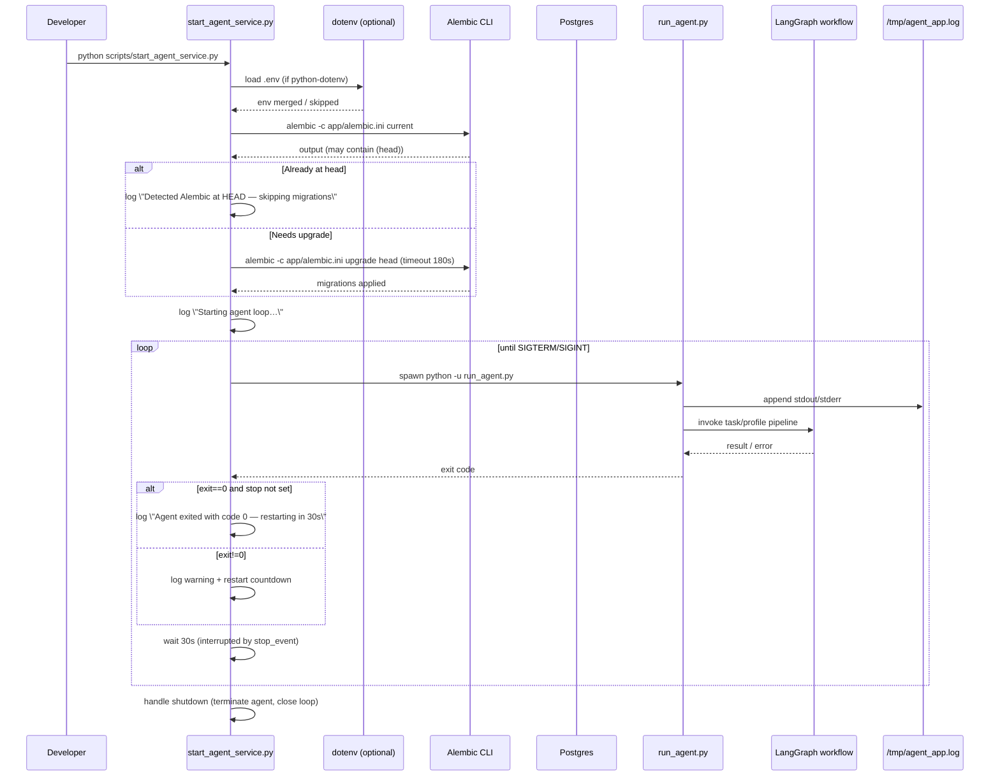

State: Legacy (archived).
# Agent Supervisor Sequence

## Updated Observations
- **Supervisor loop requires data**: utan seedade objekt i Postgres blir `run_agent.py` kortlivad och restarts loggas var 30:e sekund.
- **Loggrotation saknas**: `/tmp/agent_app.log` växer obegränsat; sätt upp `logrotate` eller container-volymer.
- **API-nyckel tom**: `.env` har `API_KEY=`; produktion måste sätta nyckel innan `/ingest` och `/search` exponeras.
- **Legacy watchfolder**: filesystem-droppar gör inget; ersätt med nytt ingest-trigger-script eller ta bort referenser.
- **Alerting**: övervaka `"Agent exited with code"` och migreringsfel för att fånga trasiga releaser.
