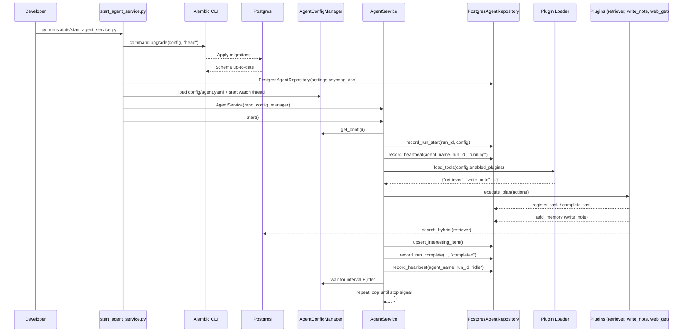

# Agent Service Sequence

## Observed/Potential Issues
- **Local runs assume repo root on `sys.path`**: the script now injects the repository root automatically, but any custom entrypoint must do the same before importing `app.*`.
- **Empty tool outputs without ingest**: the default plan queries `seed_queries`, but if `/ingest` has never populated `objects`/`embeddings`, retriever returns zero results and downstream interestingness scores nothing.
- **No watcher pipeline**: docs still reference `app/ingest/watcher.py`, but that module is no longer present, so dropping files into the legacy watch folder has no effect (tracked in `docs/TODO.md`).
- **Configuration reload**: invalid YAML now triggers a warning and defaults, but consider adding higher-level alerts if repeated.
- **Reflection queue errors**: failures are logged as warnings; add monitoring if these appear frequently.
